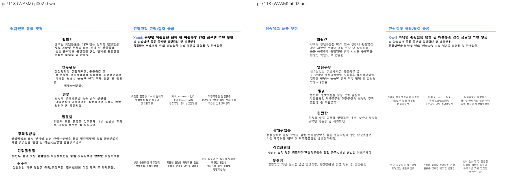

# PR #7118 검토

## 판정

**승인** (메인터너 보정 포함 변경 범위) — 저장 LineSeg 없는 Square 어울림 재조판 범위. 검증한 변경 범위에 대한 로컬 검토 판정이며 전체 이슈 해결 판정과 구분한다.
메인터너 보정 `f2e21164c029320d1e9b42a8c8ad1751c69fcb1d`에서 #7118의 실행 회귀·코드 원칙 위반과 #7184의 끝 컷/경계 증거 부족을 해소했다.
최종 판정은 **승인** — 메인터너 보정을 포함한 통합 변경 범위다. [통합 PR #7197](https://github.com/edwardkim/rhwp/pull/7197)의 제출 head `7665912859016c9d46a326e86f000c1a394e4862`에서 원격 CI도 통과했다.
[2회차 결과·제한 사항](../../working/task_m100_6970_open_pr_stage2.md)과 [최종 검증 결과](../assets/pr7118_7187_review_stage2/gate-results.json)를 기준으로 한다.
이 기록은 통합 PR code CI 성공 뒤의 trailing 문서다. 최종 문서 head의 CI·병합 조건을 재확인한 뒤 승인된 merge·후속 처리를 수행한다.

## 검토 대상

| 항목 | 확인값 |
| --- | --- |
| 원 PR | [#7118](https://github.com/edwardkim/rhwp/pull/7118) |
| 제목 | 수정(renderer): 저장 LINE_SEG 없는 문서의 Square 어울림 문단이 단을 넘지 않게 한다 (#6970) |
| 작성자 / reviewer | davindev (기존 기여자) / jangster77 사전 요청 |
| 원 head | `aff426a709c472d812b199ef41a0968f6a96b900` |
| source base / 규모 | devel / 21 files, +950/-70, 1 commits |
| 원 PR 상태 | OPEN / draft=False / CONFLICTING / DIRTY |
| source CI | [Build & Test](https://github.com/edwardkim/rhwp/actions/runs/35058808168) 및 전체 rollup 실패/대기 없음; 검토 종료 전 source head 불변 확인 |
| 통합 base | `8d45f242baa1a565357aaa38e9f459595b1e756c` |
| 통합 code head | `f2e21164c029320d1e9b42a8c8ad1751c69fcb1d` (메인터너 보정·검증 증적 포함) |
| branch | `codex/open-pr-review-20260916` |
| 충돌 해결 | 최신 FloatLane `Some(ctrl_idx)`를 유지하고 미완성 주석은 제외했다. |

원 commit은 `-x`로 누적 적용했고 작성자·메시지·co-author를 보존했다.
source/local SHA와 실행 명령은 [검증 기록](pr_7118_review_impl.md), 공통 제한은 [2회차 보고](../../working/task_m100_6970_open_pr_stage2.md)에 있다.
route: collaborator_external_pr + intake/local_validation/multi_pr_update_branch/visual_fixture_evidence.
#7118의 1,000줄 초과 변경은 별도 코드·실행·시각 검토로 취급했고 admin merge는 하지 않았다.

## 변경·증거 심사

판정 대상은 원본 `aff426a7`에 메인터너 보정 `f2e21164c`를 포함한 통합 코드다.
1회차의 실패·대조군은 [보정 전 기록](../../working/task_m100_6970_open_pr_stage1.md)과
[기존 focused 로그](../assets/pr7118_7187_review/focused.log)에 보존했다.

| 기존 보류 사유 | 메인터너 보정 | 최종 증거 |
| --- | --- | --- |
| #2004 5쪽 그림 프레임 ±2px 위반 | NO_LS 그림 frame 수용에 확인된 Square 밴드 또는 문단 소유 Square 그림을 요구해 TopAndBottom-only 경로를 분리 | #7095 6/6, 전체 회귀 통과. 하단 937.80→929.80px, PDF 931.48px(트리 반올림값) |
| 2쪽 문단 100의 두 줄 겹침 | 측정과 배치에서 동일한 Square 가용 폭과 문단 여백을 소비 | 두 줄의 분리와 뒤 문단 보존 검사, Native/fresh WASM 1–3쪽 직접 비교 |
| 폭 6% 가산 | `synth_wrap_fit_slack_px` 제거, `synthetic_wrap_column_width`로 실제 배제 구간 환산 | 기존 허용치 갱신 없음, 양 backend 본문 이미지 동일 |
| 배너 모양에 따른 순서 재배열·빈 문단 제거·높이 덮어쓰기 | 원본 ColumnDef 방향 2(맞쪽)를 파싱·저장하고 물리 단 순서에 반영, 원본 문단 순회 복구 | HWP 사양 표 139, PDF 짝수 2쪽, 방향/사각형 반복 적용 및 HWP/HWPX 재저장 테스트 |
| 저장 간격 크기로 편집 객체 점유 추정 | 해당 간격 추정 변경을 제외하고 기존 편집 경로로 복구 | derived-layout 및 전체 편집 회귀 통과 |

[RED/GREEN 명령과 결과](../assets/pr7118_7187_review_stage2/red-green-results.json): 보정 전에는 방향이 `LeftToRight`로
읽혀 의도한 assertion에서 실패하고 보정 후 통과한다([방향·저장·겹침 GREEN 로그](../assets/pr7118_7187_review_stage2/focus-stage2-issue_1440_onsamiro_picture_wrap.log)). 새 테스트의 첫 assertion만으로 두 줄의
RED까지 입증했다고 주장하지 않으며, 겹침의 보정 전후는 실제 Visual Sweep 이미지로 확인했다.
[실제 호출 경로·합성/원본 구분](../../working/task_m100_6970_open_pr_stage2.md#실제-호출-경로)을 함께 대조했다.

**해소 범위:** 기존 실행 회귀와 임의 수치·문단 재배열 가정을 제거했다. 글꼴에 따른 줄끝과
수직 위치의 PDF 차이는 남는다. 불균등 단 너비와 구역 번호 재시작의 결합, HML 재저장 실측은
추가 검증하지 않았으며 #6970 전체 해결이나 모든 문서의 완전 일치를 선언하지 않는다.

## 공통 조판 원칙

| 항목 | 판정 | 근거 |
| --- | --- | --- |
| 구현 근거·일반성 | 충족 | HWP 단 방향 사양과 실제 Square 배제 구간, 6%/배너 추정 제거 |
| 측정·배치 일관성 | 충족 | 공통 가용 폭과 명시적 Square owner, 프레임 기존 계약 통과 |
| 분할·이어받기 | 충족(검증 범위) | 문단 순회 복구, 1–3쪽 앞뒤 내용 유지, 전체 회귀 |
| 줄 소속·점유 높이 | 충족 | 두 개의 분리된 line box와 다음 문단, 실제 PNG 직접 확인 |
| 증거 독립성 | 충족 | 사양·기존 입력의 한컴 PDF·보정 전 RED·Native/WASM |
| 기준값 변경 | 비해당 | 기존 baseline·프레임 ±2px 유지 |
| 주장·검증 범위 | 충족 | 미검증 단 조합과 기존 글꼴 차이를 별도로 명시 |

## 증적

최종 공통 검증: focused 66/66, 전체 nextest 9933/9933(기존 skip 51), Clippy 3종, Native Skia 3종 통과.
새 WASM host `--no-opt` 진단 빌드와 Native의 6문서 22쪽 Visual Sweep을 완료했다.
Docker 배포 최적화 경로는 미실행이며 표준 원격 CI 통과로 대체 표기하지 않는다.
[최종 실행 결과](../assets/pr7118_7187_review_stage2/gate-results.json) · [시각 실행](../assets/pr7118_7187_review_stage2/visual-results.json) · [입력 원장](../assets/pr7118_7187_review_stage2/fixture-manifest.json).

시각 검토 정본: [Visual Sweep](../../manual/verification/visual_sweep_guide.md).
Native/WASM의 PNG 라벨과 본문을 구분해 직접 열었다. HWP3 저장 비교 이미지는 Visual Sweep의
`make_compares`로 **후보를 한컴이 출력한 PDF(왼쪽)**와 **원본 한컴 PDF(오른쪽)**를 합친 것이다.
그 이미지의 기본 `rhwp` 라벨은 Native renderer 출력을 뜻하지 않는다.
1회차(보정 전)의 [입력/PDF 해시 원장](../assets/pr7118_7187_review/fixture-manifest.json), [시각 지표](../assets/pr7118_7187_review/visual-metrics.json),
[focused 이력](../assets/pr7118_7187_review/focused.log)를 함께 보존했다. 낮은 pixel/ink proxy는 완전 일치로 해석하지 않는다.

직접 사용한 기존 HWP/HWPX는 기존 Git 경로를 재사용했다. 1회차의 한컴 PDF와 누적 저장 HWP는 `788ab292b`에 이미 포함돼 있다.
2회차는 기존 Git 입력·PDF를 재사용하고 새 비교 이미지와 로그를 보존했다. 아직 merge하지 않았으므로 source PR/issue는 닫지 않는다.

## 통합 code CI 완료

- code candidate `7665912859016c9d46a326e86f000c1a394e4862`, base `8d45f242baa1a565357aaa38e9f459595b1e756c`.
- [CI Full](https://github.com/edwardkim/rhwp/actions/runs/35071582466), [CodeQL](https://github.com/edwardkim/rhwp/actions/runs/35071582467), [Render Diff](https://github.com/edwardkim/rhwp/actions/runs/35071582672), [Adapter](https://github.com/edwardkim/rhwp/actions/runs/35071582435), [Proptest](https://github.com/edwardkim/rhwp/actions/runs/35071582468) 모두 성공.
- 원 PR head 불변·OPEN과 개별 CI 실패/대기 없음을 재확인했다. 원본 #7118의 충돌은 통합 브랜치에서 해결되어 있으며 직접 병합하지 않는다.
- 후속 문서만 single-parent commit으로 추가한다. 실제 merge SHA·trailing CI·duration 결과·종료 상태는 확인 후 GitHub 후속 comment에 확정값을 남긴다.

## Merge 후 contributor PR comment 계획

- [통합 PR #7197](https://github.com/edwardkim/rhwp/pull/7197) 반영 사실과 감사, 실제 merge SHA, code CI 및 최종 trailing CI URL을 적는다. 보정 없는 원 PR 자체를 승인했다는 표현은 쓰지 않는다.
- 맞쪽 단 방향을 HWP5 사양 값 2로 보존하고, 두 줄 겹침·문단 재배열·6% 폭 가산·그림 프레임 회귀를 메인터너 보정으로 해소했습니다. 원 PR의 충돌도 통합 브랜치에서 해결했습니다.
- 1–3쪽의 단 순서·두 줄 분리와 앞뒤 내용을 확인했습니다. #2004 5쪽 그림 프레임도 기존 ±2px 검사에 통과했습니다.
- Visual Sweep 3쪽, 후보 2/3, 평균 pixel match 91.14055%, 평균 visual_accuracy_proxy 17.90911%.
- 수치는 자동 일치율 보조값이며 사람 판정 정확도·완전 시각 일치를 뜻하지 않는다. 내용 픽셀 지표가 높으면 raster가 더 비슷하고 낮으면 위치·형태 차이의 직접 검토가 필요하다.
- 글꼴·줄끝·수직 위치 차이, 불균등 단 너비와 쪽번호 재시작의 결합 및 HML 실측은 남아 있어 전체 이슈는 유지합니다. 관련 이슈 #6970는 부분 개선을 기록하고 OPEN을 유지합니다.
- [Visual Sweep 정본](../../manual/verification/visual_sweep_guide.md#github-merge-comment)을 링크하고 아래 PNG의 merge commit 고정 raw URL을 실제 이미지로 포함한다.

- 로컬 focused 66/66·전체 nextest 9933 pass/51 skip·Native Skia 4112/2/4와 fresh WASM host 진단 경로를 구분해 적는다.
- 최종 head CI 성공 및 devel 증적 존재 확인 뒤 원 PR을 통합 반영으로 close한다. contributor fork branch는 삭제하지 않는다.
