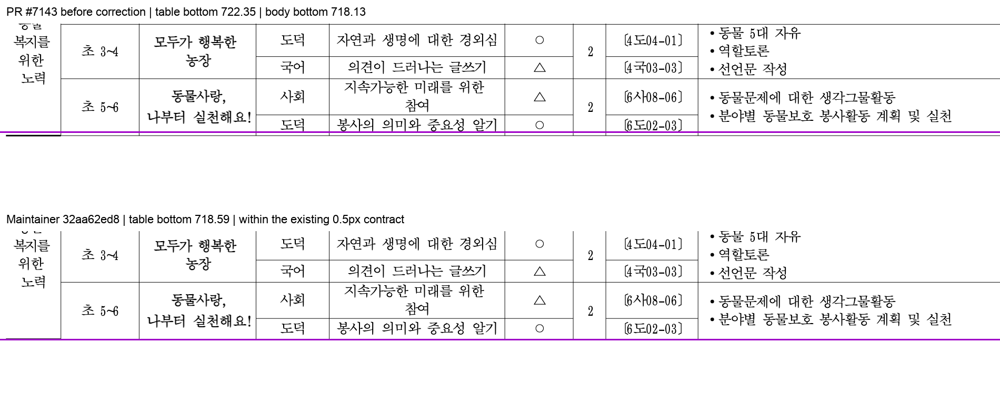
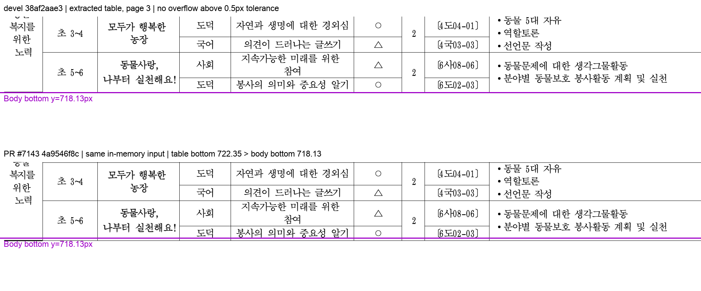

# PR #7143 — 분할 rowspan 셀 높이 검토

**메인터너 보정 검토: 두 코드 보류 사유 해소.** 로컬 코드 `32aa62ed8e7d8f9c52fe64f1e08f9af3710ef121`에서 focused·전체 회귀·필수 lint·Native Skia 및 fresh WASM Visual Sweep을 완료했다. 아래 판정은 이 보정 코드에 적용하며, 원격 PR head는 아직 수정하지 않았다. GitHub approve·comment·push·merge는 수행하지 않았다.

## 메인터너 보정 결과

- `9d1607bff`와 `ecbe4ce82`에서 시작/끝 컷의 유닛 선택을 `rowbreak_straddle_cut_units`로 공통화했다. 일반 splittable 행도 같은 잔여 높이를 예약하며, 앞 행은 원래 높이 합 대신 실제 수용한 `consumed`를 계상한다. 보정 높이가 예산을 넘는 경우 작은 원래 높이로 되돌리는 코드를 제거했다.
- 앞 조각이 소비한 빈 행 밴드는 내용 컷만으로 복원할 수 없다. `start_row_height_override`가 있으면 원 행 높이와 남은 물리 높이의 차이로 소비 구간을 복원한다. renderer도 그 물리 높이를 적용한 뒤 잔여 요구와 비교한다. 기존 함수에 이미 포함된 셀 패딩을 다시 더하던 중복 계상도 제거했다.
- 원본 표만 남긴 메모리 입력 p3의 Table bottom은 `722.34666667 → 718.58666667`, Body bottom은 `718.13333333`으로 불변이다. 초과 `4.21333334 → 0.45333334px`로 기존 0.5px 계약 안에 들어온다. 좌표 clamp나 허용치 변경은 없다. 목표 문구 1회 출현과 셀 경계도 유지한다.
- 하단 여백을 75 HU(96dpi에서 1px) 간격으로 ±1500 HU 바꾸는 41개 계약 입력을 추가했다. 전 페이지의 표/본문 경계와 문구 누락·중복·셀 경계를 검사하며, 실제 4쪽/5쪽 전환도 확인한다. 별도 HWP/PDF로 저장하거나 정상 한컴 출력으로 주장하지 않는다.
- 첫 보정안의 전체 회귀 9,882건은 통과했지만, 직접 Visual Sweep이 p83의 전남·제주 행 이월을 발견했다. 위 물리 밴드 보정과 실제 PDF p83 기반 테스트를 추가해 해결했다. 이 첫 실행은 최종 head의 검증 결과로 재사용하지 않는다.
- `32aa62ed8`은 모든 내용을 소비한 최종 컷 뒤의 빈 후속 페이지를 제거한다. 기존 다음 조각의 `advance_row_cut` 소비 완료 결과를 페이지 할당 전에 확인하며, rowspan 잔여 유닛도 없을 때 종료한다. 렌더링 end cut은 지우지 않는다. 캡션·대기 각주·블록 컷·물리 높이 tail이 있는 경우는 후속 처리를 보존한다.
- 현재 출력은 본문 있는 413쪽이며, 원 PR의 414쪽 기준값 변경을 devel의 413쪽으로 되돌렸다. 한컴 기준 415쪽은 그대로다. 페이지 수가 한컴에 더 가까워졌다고 주장하지 않으며, 본문 없는 페이지를 기준값에 넣지 않는다.
- 최종 `32aa62ed8`에서 Native와 fresh WASM 각각 p81–84,151–153,271,273,285,287,376–380의 16쪽을 Visual Sweep으로 캡처했다. p83은 전남·제주 행을 보존하며, p377의 목표 문구와 마지막 `현안분석 및 해결` 행도 남는다. 다음 구역은 rhwp p378 / PDF p380에서 이어져 빈 후속 페이지가 없다.

## 보정 head 최종 검증

| 검증 | 결과 |
| --- | --- |
| focused | 기존 4 + 신규 4 = 8 PASS |
| 전체 nextest | 9,884 PASS, 51 skip, 306.844초; failure/LEAK 없음 |
| 필수 게이트 | fmt, native Clippy, wasm32 lib Clippy, workspace build, workspace all-targets Clippy, manifest 모두 PASS |
| Native Skia | lib 및 내부 crate 4,112 PASS / 13 ignored, placeholder 2 PASS, direct PDF 4 PASS |
| fresh WASM | `wasm-pack-locked.sh --target web --no-opt` package 성공, 실제 Chrome WASM `renderPageSvg`·`getPageRenderTree` 실행 |
| Visual Sweep | Native 16/16, WASM 16/16 완료, 누락 페이지 없음. 같은 16쪽 중 10쪽의 Native/WASM raster 픽셀 동일. 나머지 6쪽은 각 9~64픽셀 차이이며 직접 비교에서 배치·본문 차이는 보이지 않았다. 16쪽 렌더 트리는 플랫폼별 문단 index sentinel을 제외하면 구조·텍스트·좌표가 동일하다. |
| 입력·기준값 | 기존 tracked HWP 3개와 한컴 PDF 재사용. 새 복제 입력 없음. oracle baseline은 devel과 동일한 rhwp 413 / PDF 415 |

전용 target은 `target/pr7143-review-20260914`다. [증적 JSON](../assets/pr7143_review_evidence.json)의 `maintainer`에 최종 코드·소스 SHA-256, 실행 요약·로그 해시, WASM 패키지·Visual Sweep provenance와 비교 수치를 보존했다. 중간 보정안의 테스트 통과는 최종 head 결과로 재사용하지 않았다. Docker daemon이 연결되지 않아 저장소의 native `--no-opt` 진단 경로를 사용했으며 최적화 배포 빌드나 원격 CI 완료를 뜻하지 않는다.

### 최종 WASM / 한컴 내용 대응 비교

| rhwp / PDF | 전체 픽셀 일치율 | 내용 픽셀 보조 일치율 | 직접 확인 |
| --- | ---: | ---: | --- |
| 83 / 83 | 89.89774% | 9.10027% | 전남·제주 행 이월 회귀 없음; 기존 행 높이 차이 잔존 |
| 271 / 273 | 85.86740% | 34.13081% | 선언문 작성하기 유지; 기존 쪽 시작 위치 차이 잔존 |
| 285 / 287 | 84.42941% | 30.02696% | 공동 선언문 작성하기 유지; 기존 행 소유 차이 잔존 |
| 377 / 378 | 85.73305% | 33.74219% | 선언문 작성 및 마지막 행 보존 |
| 378 / 380 | 92.59361% | 51.14951% | 빈 쪽 없이 노동인권 교육 구역 시작 |

[전남·제주 행 p83](../assets/pr7143_maintainer_hancom_p083.png), [목표 문구 rhwp377 / PDF378](../assets/pr7143_maintainer_hancom_rhwp377_pdf378.png), [다음 구역 rhwp378 / PDF380](../assets/pr7143_maintainer_hancom_rhwp378_pdf380.png)을 직접 열어 확인했다. 비교는 원 PDF의 실제 페이지 번호를 표기하며 새 기준 PDF를 만들지 않았다. 픽셀 지표는 보조 수치다. 한컴과 기존 행 높이·쪽 시작 위치·글꼴 차이가 남아 있어 전체 문서 fidelity 또는 #6981 전체 해결로 확대 판정하지 않는다.

## 검토 기준

| 항목 | 확인 결과 |
| --- | --- |
| 원 PR | [#7143](https://github.com/edwardkim/rhwp/pull/7143), planet6897, 기존 기여자 |
| 제목 | 수정(layout/table): 이어받는 조각의 걸친 rowspan 셀이 제 높이를 받는다 (#6981) |
| source head | `34e1186f40f9f0b2d4d72596f3d0996b363b4f88` |
| base / 통합 검토 | 최신 `upstream/devel` `38af2aae3571dc9d7f43671c1ca1a2bc8f24c815` 위에 source를 `-x`로 체리픽 |
| 로컬 검토 branch / head | `codex/pr7143-review-20260914`; 최초 체리픽 `4a9546f8c` → 최종 보정 `32aa62ed8` |
| 최초 source merge simulation tree | `b4f461a06d26f33badbdbed0aec0dcd6f6cd1bba`; 충돌 없음, 체리픽 tree와 동일 |
| 최초 source 규모 | 1 commit, 7 files, +437/-1; renderer 3개, 회귀 test 1개, oracle baseline, 보고서·PNG |
| 관련 이슈 | [#6981](https://github.com/edwardkim/rhwp/issues/6981), 본문 `Fixes #6981` |
| 접수·원격 상태 | reviewer jangster77 지정. 최종 조회에서 source head 불변, OPEN / MERGEABLE / CLEAN. 작성 시점 참고값 |

외부 PR 검토 경로에 intake/local validation/visual evidence 절차를 적용한 뒤, 사용자 요청에 따라 위 메인터너 보정을 추가했다. 전체 renderer 영향과 기준값 변경이 있어 직접 시각 검토 대상이다.

## 최초 발견 1 — [P1] pagination이 예약하지 않은 높이를 renderer가 추가한다

**실행으로 재현된 회귀.** 원 head의 `table_partial.rs:4018–4041`은 모든 per-row continuation에 보정을 적용한다. 반면 `typeset.rs:22964`의 보정은 `rowspan_touched[r] && !rowbreak_rowspan_row_splittable` 분기에서만 적용한다. splittable 행은 일반 `row_total` 경로로 가므로 renderer의 증가분을 예약하지 않는다. 함수 이름과 일부 계산 출처를 공유하지만 최종 행 높이는 공통 결과가 아니다.

원본 `samples/task2287/1342000_edu_curriculum_map.hwp`를 읽고 section 28 / paragraph 2(0-based)의 표 문단만 같은 문서 IR에 남겼다. 글자·셀·여백·용지 정의는 바꾸지 않았다. 이 입력은 메모리에서만 생성되며, 한컴이 저장한 독립 축소 문서/PDF라고 주장하지 않는다. 재현기는 [pr7143_repro_probe.rs](../assets/pr7143_repro_probe.rs), 입력·실행 수치와 진단은 [증적 JSON](../assets/pr7143_review_evidence.json)에 보존했다.

| 같은 입력의 p3 | devel `38af2aae3` | PR 통합 `4a9546f8c` |
| --- | --- | --- |
| 문서 쪽수 | 4 | 4 |
| 0.5px 허용 범위를 넘는 Table/Body bbox | 없음 | Table bottom 722.34666667 / Body bottom 718.13333333 |
| 본문 경계 초과 | 허용 범위 내 | 4.21333334px |
| 엔진의 별도 layout 진단 | 해당 overflow 없음 | `LAYOUT_OVERFLOW ... overflow=3.5px` |

Table bbox와 엔진 소비 높이 진단은 서로 다른 계상값이므로 4.21px와 3.5px를 동일 지표로 섞지 않는다. PR 진단에서 `D6981R r=44 start_row=44 end_row=66 need=20.9 have=17.1`이 나타나지만 해당 r44의 `D6981S` 보정은 없다. 따라서 현재 테스트의 “셀 안에 줄이 들어간다”만으로 조각 전체의 본문 점유가 안전함을 보장하지 못한다.

이 PNG는 한컴 비교가 아닌 devel/PR의 같은 IR 대조다. 원본 p377 SVG의 `@font-face` 별칭만 보충하고 좌표·텍스트·그리기는 바꾸지 않은 뒤, Visual Sweep과 같은 Chrome webfont rasterizer로 캡처했다. 보라색은 Body bbox의 하단이다. 실제로 열어 한글과 라벨을 확인했다.

**해제 조건:** 실제 continuation의 시작/끝 컷·유닛 범위와 적용 가능 여부를 반영한 높이를 pagination과 renderer가 함께 소비하도록 보정한다. helper의 `prior_h`는 renderer의 기존 straddle 경로와 달리 `start_cut` 소비량을 받지 않는 점도 함께 해결해야 한다. 샘플 식별자나 임의 여유값으로 예외를 추가하지 않는다. 위 메모리 입력에서 본문 초과가 사라지고, 기존 focused 4건 및 관련 컷 경계가 유지되어야 한다.

## 최초 발견 2 — [P2] 보정 높이가 예산을 넘으면 원래 높이로 행을 수용한다

**코드 경로 검토로 확인한 별도 경계 결함.** `typeset.rs:22990–23003`에서 `r > cursor_row`이고 `grown`만 예산을 넘으면 원래 `h`로 되돌린다. 이어지는 fit 판정은 이 작은 `h`로 통과할 수 있고, `end_row = r + 1`로 행을 완전히 수용한다. 이후 renderer는 셀 끝이 조각 안에 있으므로 end-cut 제외 조건에 걸리지 않고 높이를 다시 늘린다. “예산 밖이면 컷 소관”이라는 주석과 달리 그 분기에서 실제 컷이나 이월은 만들지 않는다.

예를 들어 spacing=0, consumed=60, h=20, have=80, need=100, available=90이면 grown=40은 거부되지만 원래 h=20은 통과한다. 최종 renderer는 부족한 20을 다시 더해 소비 80과 배치 100이 갈라진다. 이 숫자는 분기 산술을 설명하는 예이며 별도 실물 문서 실행 결과가 아니다.

**해제 조건:** 부족분이 들어가지 않으면 같은 높이로 행을 이월하거나, 실제 컷과 그 소유 범위를 만들어 renderer에 전달한다. `원래 높이는 fit / 보정 높이는 overflow` 경계와, 같은 조각 안에서 여러 rowspan이 끝나는 경우의 누적 높이를 검증한다. 첫 재현 사례의 회귀와 이 정적 경계 결함을 서로 같은 실행 증거라고 쓰지 않는다.

## 최초 source head에서 실행한 검증과 범위

- source head의 [CI 34839089236](https://github.com/edwardkim/rhwp/actions/runs/34839089236): SUCCESS. 원 로그의 Archive A/B/C/D 합계 9,668 pass, 51 skip이며 신규 4개 테스트의 PASS도 확인했다. Lint·Native Skia·Frontend package, 별도 CodeQL·Render Diff·Adapter·Proptest도 최신 source head에서 완료됐다.
- 최신 devel과 merge simulation, `git diff --check`를 통과했다. local source/test 보정 없이 동일 변경을 적용했다.
- 검토 전용 `target/pr7143-review-20260914`에서 `node scripts/rust-test-suite-manifest.mjs --prepare` 후 `node scripts/run-rust-test.mjs issue_6981_split_straddle_row_height -- --cargo-profile release-test --target-dir target/pr7143-review-20260914`를 실행했다. 종료 코드 0, 4 pass. 함께 묶인 다른 201건은 필터로 실행하지 않았다.
- 전체 Rust·Native Skia 회귀는 이미 통과한 exact head CI를 근거로 중복 실행하지 않았다. 비교용 CLI는 base/PR 각각 `cargo build --locked --profile release-test --target-dir target/pr7143-review-20260914 --bin rhwp`로 생성했다.
- 전체 415쪽 PDF 범위에 `fidelity_compare.py --text-only --export-all-svg --layout-ledger`를 실행하고 SVG 414쪽과 text/table/clip 원장을 조사했다. 이는 전체 페이지의 사람 시각 승인과 다르다.
- Visual Sweep을 PR에서 p81–83,151–153,271,273,285,287,376–379의 14쪽, base에서 p81–83,151–153,376–378의 9쪽 실행했다. PR 구조 후보는 0/14였으나 페이지 소유·표 높이 일치나 본문 초과 반례의 안전을 뜻하지 않는다.
- 실제 연 화면은 p82·152 및 아래 3개 내용 대응 비교다. 새 WASM package 실행은 하지 않았고 Native SVG의 실제 Chrome webfont 캡처를 수행했다. WASM 실행 완료로 표현하지 않는다.

## 최초 source head의 한컴 PDF와 내용 대응 Visual Sweep

원본 `lastSavedWith.version=9.1.1.3933`, product는 null이다. 확장자로 저장 제품을 추정하지 않았다. 기존 커밋의 Hancom `Hwp 2022 12.0.0.4547` PDF 415쪽을 재사용했으며, 재변환하거나 이름을 바꿔 중복 추가하지 않았다. 이슈의 별도 engine 2024 / 416쪽 기록과 현재 사용한 2022 / 415쪽 기준은 구분한다.

| 내용 대응 페이지 (rhwp / PDF) | 전체 픽셀 일치율 | 내용 픽셀 보조 일치율 | 직접 판정 |
| --- | ---: | ---: | --- |
| 271 / 273 | 85.86897% | 34.13262% | 선언문 작성하기 표시. 표의 페이지 시작·행 위치 차이 잔존 |
| 285 / 287 | 84.42941% | 30.02696% | 공동 선언문 작성하기 표시. 표 행 소유·높이 차이 잔존 |
| 377 / 378 | 85.68662% | 33.61819% | 목표 `선언문 작성` 복원. 한컴과 전체 표 배치는 아직 다름 |

[대표 비교 PNG](../assets/pr7143_hancom_rhwp377_pdf378.png)는 실제 다른 PDF 쪽 번호를 라벨에 표시했다. 원 PDF를 잘라 새 기준 파일을 만들지 않고, Visual Sweep의 overlay·review 함수에 각 원본 raster를 전달했다. 수치는 사람의 정답률이 아니며 글꼴·페이지 시작 위치 영향을 포함한다.

최초 source 출력은 baseline 413 → PR 414쪽이었다. 최종 보정에서는 빈 후속 페이지를 없애 413쪽으로 복구했으며, 이 숫자를 한컴 415쪽과의 fidelity 개선 근거로 쓰지 않는다. 다만 p82·152 raster는 devel과 byte-equivalent 픽셀이었고, 이슈 본문이 언급한 그 셀 사례까지 해결됐다고 단정하지 않는다. `Fixes #6981`을 유지하려면 잔여 두 사례도 개별 확인하거나 후속 범위를 명시해야 한다. 목표 한 줄 복원이 전체 이슈 해소·전체 문서 fidelity를 증명하지 않는다.

## 공통 조판 원칙 및 검증 입력 커밋 확인

| 항목 | 판정 | 근거 |
| --- | --- | --- |
| 구현 근거와 일반성 | 보정 완료 | 저장 줄·행·패딩과 PDF의 목표 문구가 근거이며 문서 ID 분기는 없음. 실제 컷과 물리 빈 밴드 계약을 공통화 |
| 측정·배치 일관성 | 보정 완료 | 공통 유닛 범위와 일반 행 예약, 누적 consumed 계상. 예산 실패 시 작은 h 수용 제거 |
| 줄 소속과 점유 높이 | 보정 완료 | start/end cut, native 문단 owner, 물리 빈 밴드 소비를 공유하고 패딩은 한 번 계상 |
| 사례와 독립 증거 | 충족 | 커밋된 실물 HWP 3개 focused, 한컴 PDF 직접 비교, 별도 메모리 축소 계약 대조를 구분 |
| 기준값 변경 | 충족 | oracle의 한컴 415 유지, 최종 rhwp 413으로 devel과 동일. 원 PR의 414 변경을 되돌림 |
| 주장과 검증 범위 | 충족 | exact source/보정 SHA, 원격 source CI와 최종 로컬·Native·WASM 검증 및 기존 PDF 차이를 구분 |
| 검증 입력 커밋 | 충족 | [증적 JSON의 inputs](../assets/pr7143_review_evidence.json)에 HWP 3개·PDF 1개의 기존 경로·SHA-256·source commit 내용 일치 기록 |

## 보정 순서와 merge 전 조건

[메인터너 보정 기록](pr_7143_review_impl.md)에 코드와 검증 순서를 정리했다. 보정된 exact head의 로컬 검증은 완료했다. 사용자 승인 범위에 따라 push한 뒤 새 원격 CI를 확인한다. 원 source CI를 보정 head CI로 대체하지 않는다.

## Merge 후 contributor PR comment 계획

현재 원격 수정·merge 전이므로 게시하지 않는다. 보정 뒤 검토 기록을 갱신하고 최신 head가 merge된 경우에만 [Visual Sweep 정본](https://github.com/edwardkim/rhwp/blob/devel/mydocs/manual/verification/visual_sweep_guide.md#github-merge-comment), 실제 페이지·후보 수·최종 보조 지표·사람 판정 및 새 증적을 포함한다. 없는 WASM/PDF 결과를 추가하지 않는다.

기존 대표 경로는 `mydocs/pr/assets/pr7143_hancom_rhwp377_pdf378.png`와 `pr7143_repro_body_overflow.png`다. 최종 증적이 devel에 반영된 후 `<merge-commit-sha>` 고정 raw image URL로 표시하고 `--body-file` 게시 뒤 API로 본문을 확인한다. 현재의 실패 PNG를 보정 후 통과 증거로 재사용하지 않는다. 이슈 close 범위와 contributor credit도 실제 해결 결과 기준으로 기록한다.
