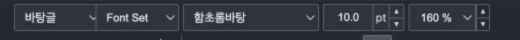
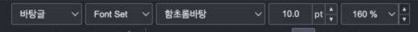
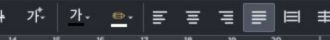
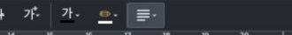
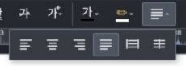

# PR #7152 — 기여자 코멘트 초안

> 게시 준비 본문. 보정 code의 원격 push·새 CI를 완료했다. 문서 head 검사 뒤 Approve 리뷰로 게시한다. 게시 시 아래 이미지 경로를 실제 원격 asset commit SHA에 고정한 절대 raw URL로 교체한다.

---

메뉴·툴바 영어 표시 작업 감사합니다. 기존 DOM 구조와 명령 ID를 유지하면서 문자열을 분리한 방향에 동의합니다. 마크업의 i18n 속성을 제외하면 이전 HTML과 동일하고, 참조 키 385개가 ko/en catalog에 모두 있는 것을 확인했습니다.

영어 서식 도구 모음에서 두 가지 배치 결함을 재현했습니다. 기존 기여 커밋을 보존하면서 해결할 수 있는 범위여서, 별도 **메인터너 보정 커밋 `e917cffb9`**을 PR 브랜치에 반영했습니다.

## 1. 600px: 스타일 선택 상자와 Font Set 겹침

영어 격자는 496px로 넓어졌지만 부모 폭은 476px로 남아 있었습니다. 첫 격자 칸이 줄어든 상태에서 스타일 선택 상자는 고정 88px를 유지해, `Font Set`과 **6.5px 겹쳤습니다**.

**수정 전** — 두 선택 상자의 경계가 겹칩니다.

**수정 후** — 영어 부모 폭도 함께 늘리고, 선택 상자가 격자 칸 안에 들어가도록 보정했습니다. 두 상자 사이에 **4px 간격**이 생깁니다.

## 2. 962px: 마지막 정렬 버튼의 오른쪽 잘림

영어 필드에 추가한 20px가 반응형 전환 기준에 반영되지 않았습니다. 실제 viewport가 962px일 때 마지막 정렬 버튼이 x=941~973px에 배치되어, **오른쪽 11px가 화면 밖으로 나갔습니다**.

**수정 전** — 아래는 화면 오른쪽 330px입니다. 마지막 버튼의 오른쪽이 잘립니다.

**수정 후** — 같은 너비에서는 기존 더보기 버튼으로 정렬 명령을 접습니다.

**더보기를 연 상태** — 정렬 명령 6개를 모두 사용할 수 있습니다.

영어에서 필요한 20px를 전환 기준에도 반영했습니다.

| 전환 | 영어 수정 전 | 영어 수정 후 | 한국어 |
| --- | --- | --- | --- |
| 한 줄 compact 배치 시작 | 808px | **828px** | 808px 유지 |
| 정렬 버튼 6개 전체 표시 | 962px | **982px** | 962px 유지 |

이 보정으로 영어 808px에서 더보기 버튼 오른쪽 10px가 잘리던 문제도 해소됩니다. CSS와 overflow controller에 같은 경계를 적용해 패널 표시와 키보드 포커스 동작도 일치시켰습니다.

## 검증 결과

보정 head `e917cffb9`의 [CI](https://github.com/edwardkim/rhwp/actions/runs/34946180534) · [CodeQL](https://github.com/edwardkim/rhwp/actions/runs/34946180544) · [Render Diff](https://github.com/edwardkim/rhwp/actions/runs/34946180054) · [Adapter inter-diff](https://github.com/edwardkim/rhwp/actions/runs/34946180483) · [Proptest roundtrip](https://github.com/edwardkim/rhwp/actions/runs/34946180539)가 통과했습니다.

- 타입 검사·Studio production build 통과.
- 단위 테스트: **1734 pass / 0 fail / 2 skip**.
- 기존 검사를 포함한 반응형 E2E: **2666 pass / 0 fail**.
- 영어·한국어 × 스킨 3종 × 밝은/어두운 테마에서 경계 직전·직후의 필드 간격, 화면 밖 넘침, 패널 상태를 확인했습니다.
- ArrowDown으로 패널 열기·첫 명령 포커스, Escape로 닫기·버튼 포커스 복귀를 확인했습니다.
- 새 회귀 검사가 원본 PR의 겹침과 잘림을 실제로 검출하는 것도 확인했습니다.

`Format Painter`의 가로 중앙 정렬은 정상입니다. 한 줄/두 줄 라벨 사이의 아이콘 세로 차이는 기존 한국어 UI에도 있는 방식이므로 이번 보정에서는 제외했습니다.

**로컬 검토 판정은 “메인터너 보정 후 수용 가능”입니다.** 보정 code의 CI가 통과했으며, 후행 리뷰 문서 head 검사까지 확인한 뒤 Approve합니다. #5852의 나머지 번역 단계는 별도 범위로 남깁니다.
