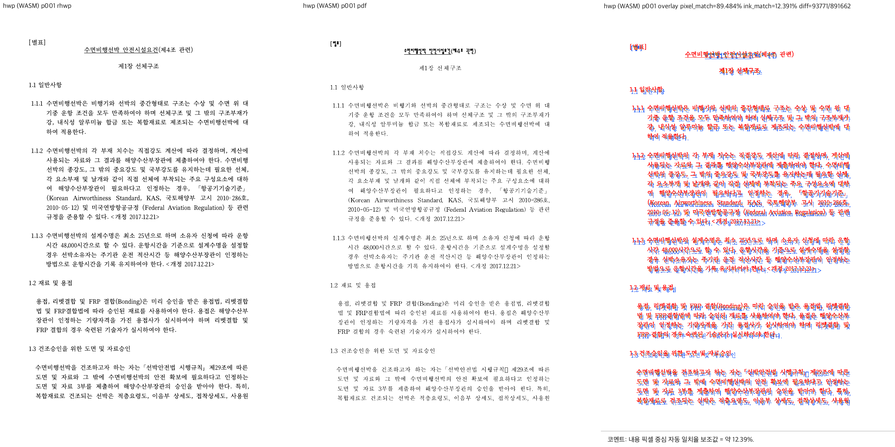
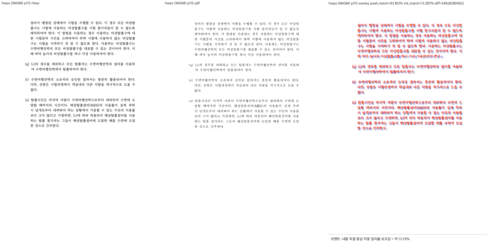

# PR #7156 — 거대 분할 셀의 보이는 문단 조합 검토

최종 판정: **승인**. 검증 코드 `93cc4b351816ac21e51551609263e5a101347700`의 입력 스택 비용 감소와 출력 보존을 확인했다. 사용자에게 통합·병합·#3743 종료 및 별도 후속 실험을 지시받았다. 최신 trailing head의 required checks와 MERGEABLE/CLEAN 확인 후 병합한다. 최초 이슈의 대형 자료구조와 DisplaySnapshot 전체 구현 완료를 뜻하지 않는다.

| 항목 | 값 |
| --- | --- |
| PR / 작성자 | [#7156](https://github.com/edwardkim/rhwp/pull/7156), postmelee / collaborator self-merge |
| 제목 | perf(layout): 거대 분할 셀의 보이는 문단만 조합해 입력 지연 감소 |
| base | devel `a2cc0d236f0b348e00d6ee14af1ff86323a93c67` |
| 코드·하네스 head | `93cc4b351816ac21e51551609263e5a101347700` |
| source 규모 | 5개 파일: Rust 2, 기존 측정 하네스 보존·보강 3 |
| 원격 상태 | 생성 시 OPEN / MERGEABLE, CI 진행 중인 참고값. 병합 직전 재확인 |
| 관련 | [#3743](https://github.com/edwardkim/rhwp/issues/3743), 별도 저장 결함 [#7114](https://github.com/edwardkim/rhwp/issues/7114) |

## 변경과 조판 원칙

`table_partial.rs`는 기존 `partial_table_cell_probe_plan`의 split_proven 컷에서 문단 범위를 얻어 같은 composer에 전달한다. 가로쓰기·실제 분할·다중 LineSeg 조건을 만족할 때만 적용한다. rowspan > 1, 세로쓰기, 미분할·미확인 경로는 기존 전체 조합을 사용한다. 문서 ID나 특정 임계 숫자에 따른 분기가 없다.

| 검토 항목 | 직접 확인한 근거 | 판정 |
| --- | --- | --- |
| 구현 근거와 일반성 | 페이지 밖 문단 재조합을 제거하는 최적화이며 줄 나눔 규칙 변경이 아니다. 기존 컷의 문단 소유를 따르고 비지원 경로는 eager fallback. clamp나 출력 은폐 없음 | 충족 |
| 측정·배치 일관성 | 동일 paragraph composer와 CellUnit 컷을 소비한다. 공통 `cell_inner_text_width`가 최소 너비 floor를 적용하므로 padding 보정 조기 종료와 무관하게 실제 가용 너비가 일치 | 충족 |
| 분할·이어받기 계약 | 컷 생성·행 요구/예약 높이·예산 실패·이어받기 종료 코드는 변경하지 않는다. empty_spacer도 컷의 문단 소유를 유지. #7143 rowspan 경로는 eager이며 요구 높이를 작은 값으로 바꾸는 새 fallback 없음. 전체 회귀와 460쪽 출력 동일성 확인 | 충족 |
| 줄 소속과 점유 높이 | 저장 LineSeg 및 재조판 결과 소비 경로 유지. window에서 생략하는 전체 높이는 이미 분할 행의 Top 정렬에 사용되지 않으며 Center/Bottom 미분할 경로는 유지 | 충족 |
| 사례와 증거의 독립성 | 실제 giant HWP/HWPX와 한컴 2020 PDF를 재사용. 편집 전후 SVG 460개 동일. 대표 8쪽의 본문·줄 끝·다음 문단·쪽 경계를 직접 확인. 합성/내부 계약 테스트는 한컴 정답으로 승격하지 않음 | 충족 |
| 기준값 변경 | baseline/golden/시각 허용치 수정 없음. 시간 비율 테스트를 정확한 cursor JSON과 실제 page-tree build counter로 대체했으며 기존 실패를 허용치로 숨기지 않음 | 비해당 |
| 주장과 검증 범위 | 아래 SHA·명령·결과 및 증적 JSON 참조. 최신 기준에도 있는 #2214·#7114 실패와 전체 DisplaySnapshot 미검증을 구분 | 충족 |

동작 기반 회귀 검증: 실제 WASM 입력 API·Chrome 키 입력으로 cold/warm, 연속 입력, pending job, Enter/merge/delete/IME를 실행했다. #4149의 exact cursor parity와 thread-local page-tree build counter에서 fast=0, legacy>=10을 확인한다. legacy 경로가 음성 대조이며 상대 시간 비율을 correctness gate로 삼지 않는다. 기존 #2214 초기 x 실패는 기준과 후보에서 그대로 실패하여 하네스가 이를 잡는 것도 확인했다. 새 컷 생성·조판 규칙 도입이 아니므로 별도 합성 줄 구성 정답을 추가하지 않았다.

## 로컬 검증

고정 target: `target/pr-review`. 12 logical CPU / 24GB 환경에서 전체 회귀 동시성 6을 사용했다. source 변경 뒤 아래 검증을 순차 실행했으며 이후에는 기록만 추가한다.

| 실행 | 결과 |
| --- | --- |
| manifest --prepare → fmt → fmt --check → unit tiers --check | PASS |
| locked native Clippy → wasm32 lib Clippy → workspace build → workspace all-targets Clippy → manifest --check | PASS, warnings deny |
| `cargo nextest run --locked --cargo-profile release-test --target-dir … --tests --test-threads 6 --no-fail-fast` | 9,884 PASS / 51 skip, 테스트 219.765초, 준비 포함 425.46초 |
| Native Skia `cargo test --locked --profile release-test --target-dir … --features native-skia --lib -- --test-threads 6` | 4,112 PASS / 13 ignored |
| `node scripts/run-rust-test.mjs issue_2225_missing_picture_placeholder` / `render_p37_direct_pdf_export`, 같은 profile/target/native-skia | 2 + 4 PASS |
| focused `cargo test … --lib issue4149_ -- --nocapture` | 11 PASS / 3 ignored |
| 최신 lockfile `npm ci`, TypeScript, Studio unit | PASS, 1,734 PASS / 2 skip |
| 최적화 WASM 기준·후보 | locked native `scripts/wasm-pack-locked.sh --target web --out-dir pkg`, 모두 성공. Docker daemon 부재에 따른 대체 경로이며 Docker 검증 아님 |
| HWP/HWPX 전 115쪽, 편집 전과 56/61회 입력 후 | 기준/후보 SVG 460개 exact hash 일치 |
| HWP print / HWPX save | PASS: flush 후 115쪽 출력 / 재열기 115쪽 |

입력 및 binary SHA-256, 명령·실행 시간, A/B 요약은 [증적 JSON](../assets/pr7156_evidence.json)에 보존한다. 입력 커밋 확인 **충족**: 기존 `samples/issue1949_giant_cell_nested_tables_perf.hwp`, `.hwpx`, `pdf/issue1949_giant_cell_nested_tables_perf-2020.pdf`, `…-hwpx-2020.pdf`의 실제 바이트가 검증 head의 committed blob과 동일하다. 저장 재현 산출물은 실행 결과이며 신규 입력 fixture로 세지 않는다.

## 최신 통합 후보 재측정 — 2026-09-15

기준 source `a2cc0d236f0b348e00d6ee14af1ff86323a93c67`, 후보 source `93cc4b351816ac21e51551609263e5a101347700`. 두 source의 최적화 WASM을 같은 최신 Studio lockfile 환경에서 바꿔 끼워 측정했다. Node 24.15.0 / Vite 8.3.0 / Puppeteer Core 25.10.0 / Chrome 152.0.7977.83 / macOS 26.5.2 / 1280×900 DPR1. 형식별 10사례 × 3회, 총 120개 실행이다. 각 칸은 3회 중앙값이며 연속 입력은 회차별 p95의 중앙값이다. raw harness의 gitRevision은 하네스 head이고 실제 WASM source·해시는 증적에서 별도로 고정한다.

| 시나리오 | HWP sync ms | HWP 2-rAF ms | HWPX sync ms | HWPX 2-rAF ms |
| --- | ---: | ---: | ---: | ---: |
| 줄바꿈 | 98.6 → 47.3 | 374.0 → 272.4 | 98.3 → 47.8 | 372.8 → 268.3 |
| 연속 입력 | 97.4 → 48.1 | 435.3 → 297.7 | 99.0 → 48.2 | 735.4 → 355.8 |
| Enter cold | 210.1 → 168.8 | 379.6 → 293.3 | 201.6 → 150.5 | 369.3 → 270.1 |
| Enter pending | 211.9 → 167.5 | 382.2 → 292.5 | 200.4 → 151.7 | 371.2 → 274.9 |
| IME Enter cold | 113.7 → 115.3 | 115.0 → 116.6 | 102.8 → 103.0 | 104.0 → 104.3 |
| IME Enter pending | 114.4 → 114.6 | 116.2 → 116.2 | 105.6 → 104.7 | 107.3 → 106.5 |
| Backspace merge cold | 213.4 → 166.0 | 482.1 → 338.8 | 201.3 → 151.2 | 375.6 → 273.8 |
| Backspace merge pending | 429.6 → 229.8 | 595.6 → 395.6 | 202.5 → 150.6 | 475.7 → 320.7 |
| Delete merge cold | 215.1 → 165.7 | 489.5 → 336.7 | 202.0 → 149.6 | 375.1 → 271.0 |
| Delete merge pending | 428.7 → 230.5 | 594.7 → 396.6 | 201.0 → 151.0 | 473.9 → 320.8 |

동기 지연과 2-rAF를 분리한다. 2-rAF는 실제 글자·커서가 같은 revision으로 표시됐다는 증거가 아니다. IME 예약 Enter는 거의 그대로이며 2-rAF는 실행별 분산이 있다. 이전 공통 Vite 8.2.2/Puppeteer Core 25.8.0의 3회 A/B에서 HWP 단일 줄바꿈 2-rAF는 262.9→272.8ms로 개선되지 않았으므로, 모든 표시 경로가 일관되게 빨라졌다고 일반화하지 않는다. 최신 잠금 의존성 측정은 위 표를 정본으로 사용한다.

## 시각 검증

fresh candidate WASM으로 `scripts/visual_sweep.py --wasm-pkg … --pages 1,2,38,115 --dpi 96`를 HWP/HWPX 각각 실행했다. 원본은 모두 115쪽이며 8개 review PNG를 직접 열었다. 내용 순서·줄 끝·다음 문단·쪽 경계에서 새 누락이나 넘침을 발견하지 못했다. 기존 글꼴 굵기·크기·세로 위치 차이는 남아 있어 한컴 완전 일치 판정은 아니다.

| 형식 / 실제 비교 쪽 | flagged | 전체 pixel 평균 | 내용 pixel 보조 평균 |
| --- | ---: | ---: | ---: |
| HWP / 1,2,38,115 | 0/4 | 90.52399% | 12.22858% |
| HWPX / 1,2,38,115 | 0/4 | 90.99956% | 13.22739% |

낮은 내용 픽셀 일치율은 글꼴·위치 차이를 반영한다. 자동 flagged=0과 수정 전후 SVG 동일성만으로 원본 fidelity를 승인하지 않는다. 이번 승인 범위는 기존 출력을 보존하는 계산량 감소다.

## 남는 위험과 종료 범위

- #2214 브라우저 게이트는 기준과 후보 모두 initial-warm cursor x: expected 231.013±0.2, actual 231.3에서 실패했다. 뒤쪽 assertion은 실행되지 않았으므로 전체 matrix 통과가 아니다. 허용치 변경 없음.
- HWP cold Enter의 116쪽 기록은 기준과 후보 양쪽에 남는다. 전체 구조 편집의 조판 정합성이 해결됐다고 주장하지 않는다.
- HWP save는 live 115 → reopen 116으로 #7114 재현. 기준과 후보 direct WASM control도 같고 저장 텍스트는 보존된다. 후보가 새로 만든 회귀로 보지 않는다.
- 2-rAF는 실제 보이는 글자·caret revision의 완전한 증거가 아니다. IME 예약 Enter는 거의 개선되지 않았다. Safari, background/focus, 전체 Studio의 원자 DisplaySnapshot은 미검증이다.
- 사용자가 기존 후보를 로컬에서 직접 조작하고 수용 가능하다고 확인했다. 최신 통합 후보의 재측정·출력 보존과 함께 #3743을 입력 지연 개선 범위로 종료한다. 최초 대형 구조 계획은 미구현/유예로 명시한다.
- 공통 geometry 재사용, revision 검증 후 화면·커서 동시 반영은 후속 로컬 실험이다. 이번 제품 diff와 섞지 않으며 실험 통과가 곧 전체 제품 도입 승인은 아니다.

## 처리와 CI

`488716112`(보이는 문단 조합), `02ed2b5c9`(작업량 검사), `93cc4b351`(측정 하네스)를 최신 devel 위에 통합했다. 충돌 없이 merge simulation을 확인했고 기존 사용자 작업은 보존했다. 소형 단일 후보이므로 실행 순서를 여기에 기록하고 별도 review_impl은 생략한다.

코드 head `93cc4b351`의 [Render Diff](https://github.com/edwardkim/rhwp/actions/runs/34930982364), [Adapter inter-diff](https://github.com/edwardkim/rhwp/actions/runs/34930982597), [Proptest roundtrip](https://github.com/edwardkim/rhwp/actions/runs/34930982584), [CI](https://github.com/edwardkim/rhwp/actions/runs/34930982735), [CodeQL](https://github.com/edwardkim/rhwp/actions/runs/34930982612)가 모두 completed/success다. 같은 head의 check 목록은 증적 JSON에 보존한다. 코드 CI 성공 뒤 review·asset·오늘할일만 single-parent trailing commit으로 추가한다. 병합 직전 exact head, required checks, mergeability를 재확인하며 일반 squash merge를 사용한다. 병합 뒤 devel fast-forward, issue 상태/코멘트, PR 코멘트, 전용 clean worktree·branch 정리 순서로 진행한다. 공유 target/pr-review와 사용자 서버/worktree는 보존한다. merge SHA와 운영 결과는 GitHub 후속 코멘트에서 확정하며 별도 검증 CI를 재시작하지 않는다.

## Merge 후 contributor PR comment 계획

[Visual Sweep 정본](https://github.com/edwardkim/rhwp/blob/devel/mydocs/manual/verification/visual_sweep_guide.md#github-merge-comment)을 direct link로 남긴다. 위 실제 8쪽, flagged=0/8, 두 형식의 평균 pixel·내용 pixel 값과 글꼴/위치 차이 잔존 판정을 그대로 사용한다. 대표 PNG는 `mydocs/pr/assets/pr7156_hwp_p001.png`, `mydocs/pr/assets/pr7156_hwpx_p115.png`다.

병합 SHA에 두 파일이 실제 존재함을 확인한 뒤 `https://raw.githubusercontent.com/edwardkim/rhwp/<merge-commit-sha>/mydocs/pr/assets/<filename>` 형식의 inline image를 포함한다. 정확한 merge SHA·CI·로컬 결과·#3743 종료와 #7114 OPEN을 UTF-8 `--body-file`로 게시하고 API로 본문·한글·링크를 재조회한다. 내용 픽셀 값은 높을수록 기준 raster와 비슷하다는 보조 수치이며 사람 판정 정확도가 아님을 명시한다.
