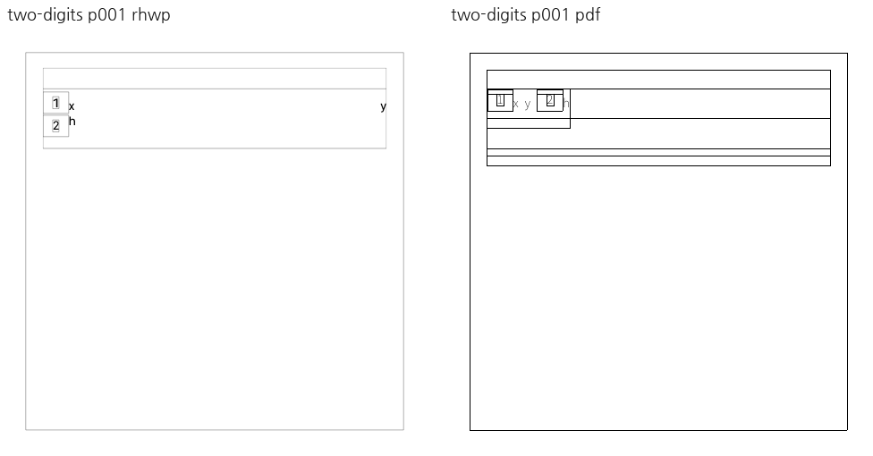
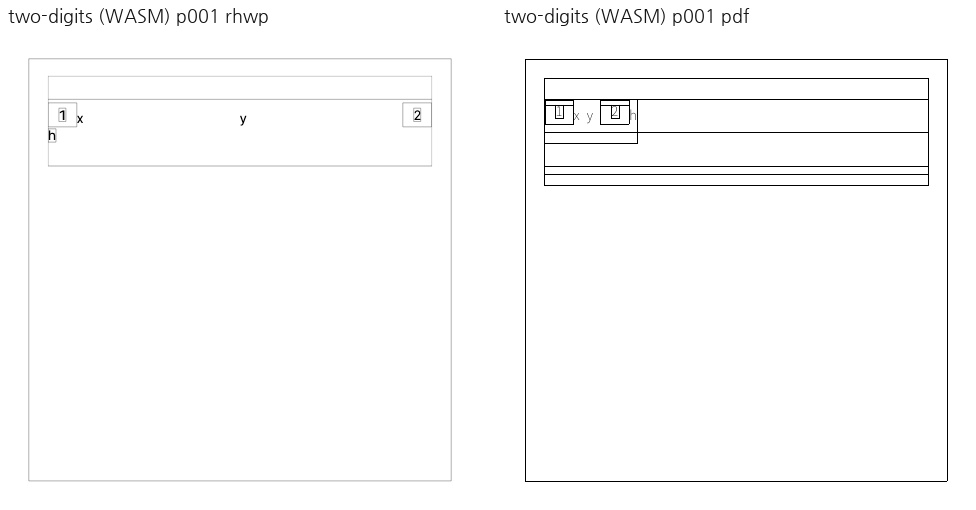
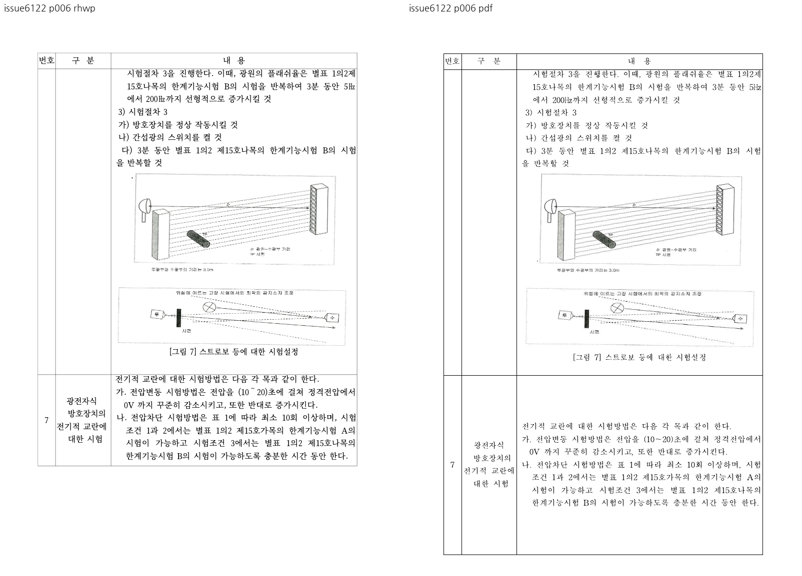
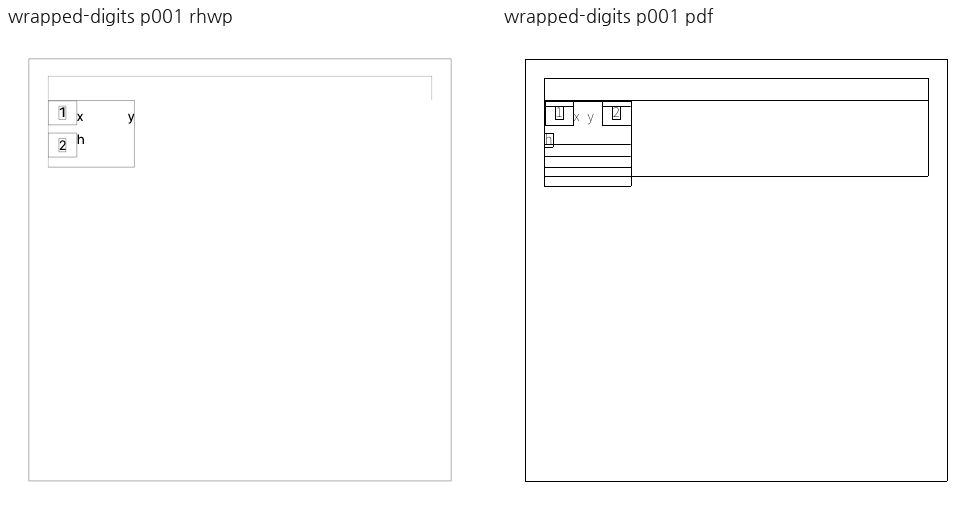
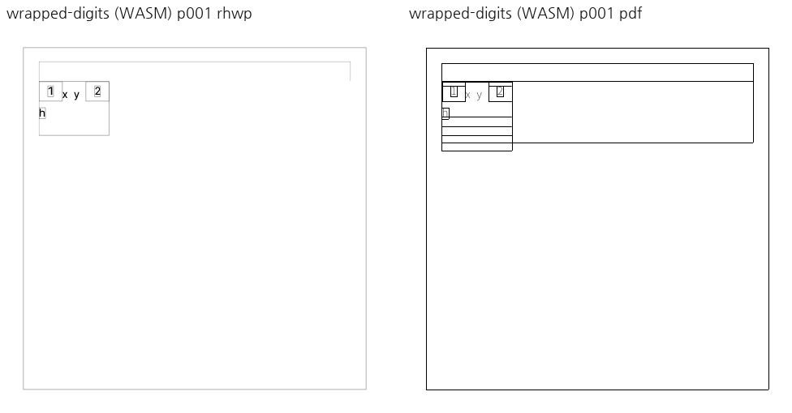
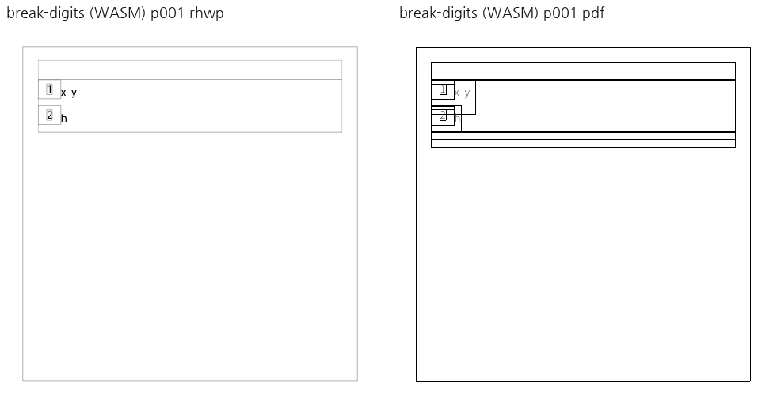
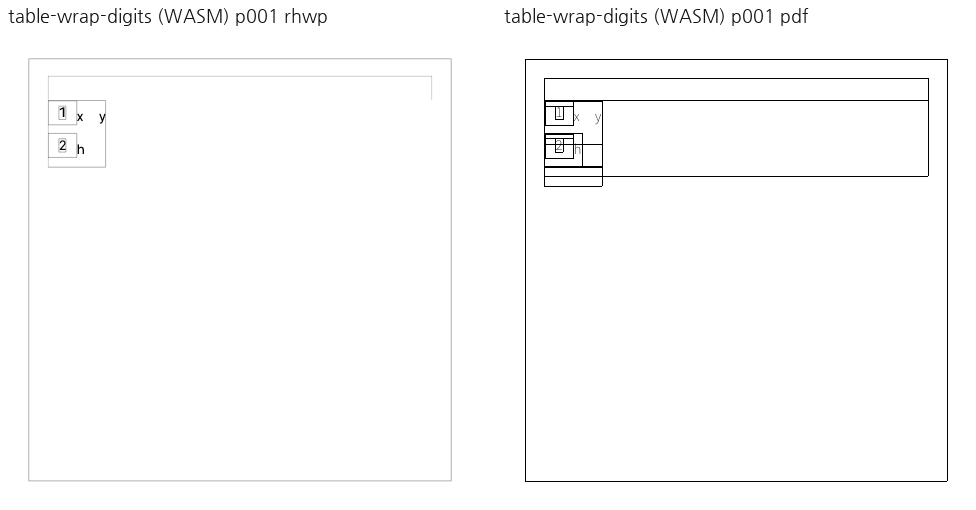
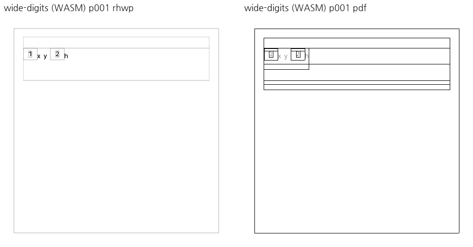
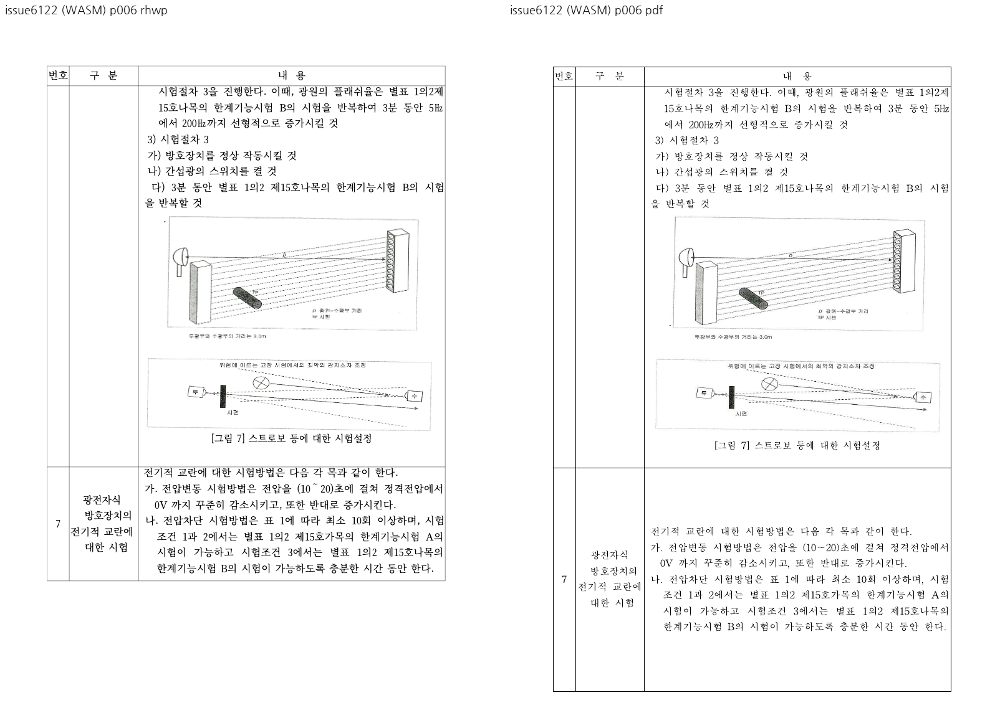

# PR #7165 검토

## 최종 판정

**승인 — 메인터너 보정으로 코드·증거 보류 사유 해소**. 독립 한컴 저장본, 집중 검증,
필수 lint와 fresh WASM visual sweep을 완료했다. 원격 통합 CI 성공은 이후 merge의 별도 조건이다.

이 판정은 로컬 검토이며 GitHub approve·원격 push·통합 CI·merge 완료가 아니다.

## 대상과 출처

| 항목 | 검토값 |
| --- | --- |
| 원 PR | [#7165](https://github.com/edwardkim/rhwp/pull/7165) |
| 제목 | fix(renderer): 저장 줄 경계의 인라인 표 배치와 공백 분배 보존 |
| 작성자 | LJYeon12, 기존 기여자 |
| 원 head | `215a0cb07c6c9bfde38cf8e11205367cd0b4457a` |
| PR base / 규모 | devel / 6 files, +178/-37 |
| 통합 base | `da7ec5c0906b38b7a1cfa15cf70ca5534b7d7ebb` |
| 검토 branch | `codex/pr7155-7167-review-20260915` |
| 적용 commit | `8004fdde6 → e899a3b1a → cfb5aedf0 → 2faa8b38d` |
| reviewer | jangster77 요청·API 재확인 완료 |
| 상태 | 작성 시점 OPEN/non-draft/MERGEABLE/CLEAN; 확인 시점 pending/failed 없음 |
| 최초 보류 검증 소스 / PDF 증거 commit | `b5d7956f6` / `925cd7434`(실행 코드 변화 없음) |

순서는 #7155 → #7157 → #7165 → #7166 → #7167 → #7168이며 각 고유 commit을 `-x`로 적용했다.
#7141/#7118 draft는 제외했다. [공통 실행 계획](pr_7155_7168_review_impl.md)에 전체 SHA와 순서를 기록했다.
base route는 `collaborator_external_pr.md`, modifier는 `multi_pr_update_branch.md`다.
`intake_and_review.md`, `maintainer_general.md`, `local_validation.md`, `visual_fixture_evidence.md`의 정본을 적용했다.

## 변경·검토 결과

원 PR의 `stored_tac_line_assignment`는 raw UTF-16 표 제어 위치를 저장 줄에 귀속한다.
저장 경계 12/20이 같은 visible 위치 4로 투영돼도 소유 줄을 구분하며, 측정과 배치가 같은
개체 목록을 소비한다. `trailing_space_limit`은 마지막 인라인 개체 앞 공백을 내부 공백으로
취급하고, 그림 fallback은 실제 paint 소유 기록으로 중복을 막는다.

**기존 보류의 원인:** `two_digits.hwpx`는 부모 폭 28800 HU인데도 두 줄을 수동 기록한
합성 입력이다. 한컴은 두 표와 `h`를 한 줄로 다시 저장한다. 기존 합성 테스트는 raw 경계의
투영 계약으로 보존하되, 그 기대를 정상 한컴 문서의 시각 기준으로 사용하지 않는다.
사용자가 가진 입력은 이 합성 파일뿐이므로 비공개 실제 날짜 양식 검증으로 주장하지 않는다.

**독립 증거와 메인터너 보정:** 원 입력을 바탕으로 한컴 12.0.0.4605가 저장한 HWP 4개와
대응 PDF를 확보했다. rhwp로 저장 줄을 다시 써서 기대값을 맞추지 않았다.

| 독립 입력 | 한컴 저장 경계 | 기대와 확인 결과 |
| --- | --- | --- |
| wide, 부모 28800 HU | 0 | 두 표와 `h` 모두 같은 줄 |
| wrap, 부모 6480 HU | 0/20 | 두 표는 첫 줄, `h`만 둘째 줄 |
| explicit break, 부모 28800 HU | 0/13 | 두 번째 표와 `h`가 둘째 줄 |
| table wrap, 부모 4320 HU | 0/12 | 폭 부족으로 두 번째 표와 `h`가 둘째 줄 |

이 중 명시적 개행 입력은 첫 저장 줄 뒤에 빈 줄을 중복 생성하는 기존 composer 문제를
드러냈다. 다음 인라인 표 줄이 이미 저장돼 있으면 첫 줄에도 #6300의 경계 보호를 적용하여
`h`가 불필요한 셋째 줄로 내려가는 문제를 수정했다. 기존 #6300 테스트 4개도 통과했다.

6480 HU 입력에서 baseline의 두 번째 표 (x=48.0,y=103.1)가 후보에서는
(x=105.8,y=70.8)로 이동해 한컴과 같은 첫 줄에 놓인다. `h`는 (48.0,103.1)에 남는다.
바깥 셀 높이 66.7px는 유지되고 폭은 86.6→86.9px로 경계 stroke 포함분만 달라진다.
넓은 입력·명시적 개행·폭 부족 입력의 바깥 표 bbox는 baseline과 동일하다.

**남은 차이의 범위:** PDF와 Native의 표 테두리 농도·일부 높이는 완전히 일치하지 않는다.
기존 baseline에도 있던 차이를 이번 수정의 개선으로 주장하지 않는다. #6122 p6의 두 그림과
캡션도 보존되지만 표 하단 높이 차이는 별개다. 검토 대상은 raw 줄 소속·중복 개체·추가 빈 줄이다.
관련 #6122나 비공개 양식 이슈 전체를 닫는 근거로 사용하지 않는다.

## 검증

`stored_inline_table_suffix` 2 passed(합성 12/20 + 독립 HWP 4경우), #6122 1 passed, #6706 1 passed, #6300 4 passed.

메인터너 최종 검증은 전용 `target/pr7155-7167-review-20260915`에서 순차 실행한다.
관련 focused 10개, 줄 나눔/frame 단위 21개가 통과했다. fmt check, Native/WASM/workspace
all-targets Clippy(`-D warnings`), workspace build, suite manifest/unit-tier 검사가 통과했다.
최종 Native/fresh WASM 빌드 및 6페이지 visual sweep을 완료했고 두 경로의 raster는 모두
바이트 동일하다. 세부 실행 결과는 아래 메인터너 증적에 기록한다. 사용자의 지시에 따라 전체 Rust/Native Skia 회귀를 로컬에서
중복 실행하지 않았다. **통합 code head `5a04e1722`의 GitHub CI가 성공했다(아래 최종 CI 기록).**
아래 링크는 원 PR head의 CI이며 메인터너 보정 후 통합 CI 통과를 뜻하지 않는다.

- [Adapter inter-diff](https://github.com/edwardkim/rhwp/actions/runs/34961144475/job/104354832669)
- [CI](https://github.com/edwardkim/rhwp/actions/runs/34961144483/job/104358821784)
- [CI Impact Policy Controller](https://github.com/edwardkim/rhwp/actions/runs/34961143513/job/104354762742)
- [CodeQL](https://github.com/edwardkim/rhwp/actions/runs/34961144575/job/104354853034)
- [Proptest roundtrip](https://github.com/edwardkim/rhwp/actions/runs/34961144439/job/104354848829)
- [Render Diff](https://github.com/edwardkim/rhwp/actions/runs/34961143669/job/104354814528)

## 공통 조판 원칙

| 항목 | 판정 | 근거 |
| --- | --- | --- |
| 구현 근거와 일반성 | 충족 | raw 제어 위치와 한컴 저장 줄 경계, 첫 줄에도 동일한 경계 보호 적용. |
| 측정·배치 일관성 | 충족 | 같은 stored TAC 소유 목록을 소비한다. |
| 분할·이어받기 계약 | 충족 | #6122/#6706의 그림·표 소유 보호. 분할 예산·rowspan 컷을 바꾸지 않았다. |
| 줄 소속과 점유 높이 | 충족 | 독립 한컴 4경우, 개행 중복 줄 제거, 바깥 표 높이 비교. |
| 사례와 증거의 독립성 | 충족 | 기존 합성 계약과 한컴이 새로 저장한 HWP/PDF를 구분한다. |
| 기준값 변경 | 비해당 | 기존 golden/baseline/허용치 변경 없음. 신규 독립 입력만 추가. |
| 주장과 검증 범위 | 충족 | 비공개 양식 미검증·기존 테두리/높이 차이·통합 CI 결과를 분리한다. |

## 최초 검토 입력과 보류 당시 증적

기존 입력은 이름을 바꿔 재추가하지 않았다. 새 PDF 2개는 `925cd7434`에 커밋했다.

| 저장소 파일 | SHA-256 | 마지막 입력 commit |
| --- | --- | --- |
| [tests/fixtures/stored_inline_table_suffix/two_digits.hwpx](../../../tests/fixtures/stored_inline_table_suffix/two_digits.hwpx) | `8ad7133baab557ba00845a5733b6bd4a042833b426c8cb457d58c8794e57052d` | `2faa8b38dd1af3bfa7cb7e8e65945ae9defc3494` |
| [pdf/two_digits-2020.pdf](../../../pdf/two_digits-2020.pdf) | `d3d540a608d3b6dd381d933ed72b1067a0a6c77dc3d3bfcd35d93b2de3d5a2ef` | `925cd7434564657f1c78cf5568bcc05b0f19e9d3` |
| [samples/issue6122/2181727_press_guard_test_method.hwp](../../../samples/issue6122/2181727_press_guard_test_method.hwp) | `feb7fd1860b5b1b74e1bd75ec28a6d9ed506db41cfb2c789f06955521d183dc6` | `9c9ad3485dd1ec0295e3c9669efdc0e476005a94` |
| [pdf/issue6122-2020.pdf](../../../pdf/issue6122-2020.pdf) | `d0c9f90023207192ac57772b572a5ee3f1c7902d0e14e34798a66127ce53a17e` | `9c9ad3485dd1ec0295e3c9669efdc0e476005a94` |

[검증 manifest](../assets/pr7155_7168_review_evidence.json)에 원 head의 CI 스냅샷, 바이너리·입력·PNG 해시와 sweep 수치를 보존한다. macOS Chrome webfont rasterizer, 96dpi를 사용했다.

보류 당시의 합성 입력 비교(현재 보정 승인 증거와 구분):

## 메인터너 보류 해소 근거

1. 기존 합성 저장 줄과 한컴 재조판 불일치의 원인을 규명했다.
2. 정상 한컴 저장 HWP와 대응 PDF를 확보했고 사용한 입력을 저장소에 포함한다.
3. 필요한 공통 코드 보정과 긍정·경계 반례 집중 테스트를 완료했다.
4. 최종 lint·Native/fresh WASM visual sweep을 통과했다. 통합 CI는 아래 최종 code head에서 별도 확인했다.

새 파일의 변환 job·SHA-256은 fixture README와 `hancom-evidence.json`에 기록한다.
기존 파일을 이름만 바꿔 중복 추가하지 않았다. 한컴 재저장 wide/header PDF는 기존 PDF와
96dpi RGB raster가 같아 기존 PDF를 재사용했다.

## Merge 후 contributor PR comment 계획

[Visual Sweep 정본](https://github.com/edwardkim/rhwp/blob/devel/mydocs/manual/verification/visual_sweep_guide.md)을 연결한다. 위 실제 페이지·수치·직접 관찰과 미검증 범위를 요약하고, 대표 PNG는 다음처럼 merge SHA로 고정한다.

`https://raw.githubusercontent.com/edwardkim/rhwp/<merge-commit-sha>/mydocs/pr/assets/pr7165_maintainer_wrap_wasm_p001.png`

asset이 devel에 포함되고 merge SHA가 확정된 뒤, 허용된 게시 단계에서 `--body-file`로 작성하고 API로 본문을 재조회한다. 현재는 로컬 계획이며 게시하지 않았다. 최초 보류 PNG와 보정 후 PNG를 구분해 게시한다.

#6706 집중 검증의 추가 기존 입력:

| 파일 | SHA-256 | 입력 commit |
| --- | --- | --- |
| [samples/hwp3-sample16-hwp5.hwpx](../../../samples/hwp3-sample16-hwp5.hwpx) | `49e3e809eb41e22b2c059383db32b0cf038787269b5c523d1ff59d1a52b4340c` | `dcf64b4da051ea7b0bf164cf20e1935faa0250ae` |

## 메인터너 보정 후 증적

메인터너 코드: #7165 `b5f8bf9553976a9aedacda54030df5f7ce0d0045`, #7168 `0c80b8f1c74ff2f9510db335efb018db427af45c`. Visual sweep 단일 페이지 식별 보정: `42ef2240d`.
최종 검증 소스와 `b5f8bf955`의 소스 파일 SHA-256 일치를 확인했다.

입력·한컴 변환 출처: [fixture README](../../../tests/fixtures/stored_inline_table_suffix/README.md), [변환 manifest](../../../tests/fixtures/stored_inline_table_suffix/hancom-evidence.json).

[최종 실행 증적](../assets/pr7165_7168_maintainer_evidence.json)에 소스·바이너리·WASM·입력·PNG 해시와 검증 결과를 기록한다.

캡처 임시 경로: `/private/tmp/rhwp-pr7155-7167-review-20260915/maintainer/wasm-corrected` 및 `wasm-6122`.

리뷰·대표 PNG와 오늘할일을 통합 최종 code CI 성공 뒤 같은 PR의 trailing commit에 포함한다.

## 승인된 통합 경로

[PR #7171](https://github.com/edwardkim/rhwp/pull/7171), code candidate `5a04e172247d1b168d350faf514beeef46cf0964`.
base route: `collaborator_external_pr.md`; modifiers: `multi_pr_update_branch.md`,
`review_only_fast_pass.md`, `post_merge.md`. 개별 review·오늘할일·증적은 code CI 성공 뒤
같은 PR의 문서-only trailing commit으로 반영한다. 최종 head CI·mergeability를 확인한 뒤
merge하고 duration refresh·원 PR comment/close·devel 동기화·전용 산출물 정리를 수행한다.

## CI 정책 보정 후 최신 후보

최초 `95d631f0a`의 CI는 source-side 테스트 총량의 PR base 비교에서 실패했다.
Rust archive·Native Skia·Frontend package 검증은 성공했다. `5a04e172247d1b168d350faf514beeef46cf0964`에서
개체 동반 공백 반례를 기존 cursor 계약 안에서 동일하게 실행하도록 묶고 정책 총량 4205를
유지했다. 생산 코드·시각 출력은 바뀌지 않았다. base 비교·cursor 테스트·필수 lint 묶음을
재검증했고 최신 후보 Full CI 성공을 확인해 trailing 문서를 반영한다.

## 최종 code CI 확인 (2026-09-15)

최종 code head `5a04e172247d1b168d350faf514beeef46cf0964`의 [CI](https://github.com/edwardkim/rhwp/actions/runs/34978539946),
[CodeQL](https://github.com/edwardkim/rhwp/actions/runs/34978540233),
[Render Diff](https://github.com/edwardkim/rhwp/actions/runs/34978539840),
[Adapter](https://github.com/edwardkim/rhwp/actions/runs/34978539982),
[Proptest](https://github.com/edwardkim/rhwp/actions/runs/34978540234)가 성공했다.
확인 시 check 31개 성공·4개 조건부 생략, policy status 성공이며 실패·진행 중 항목은 없다.
Rust archive 4개·전체 shard, Native Skia, 필수 lint, frontend package 검증을 포함한다.
초기 `95d631f0a`의 source-side test 정책 실패는 `5a04e1722`에서 동일 assertion을 기존
테스트 계약으로 묶어 해결했다. 허용치·baseline·생산 코드는 변경하지 않았다.
이 문서·오늘할일·대표 증적을 single-parent trailing commit으로 반영하고, 문서 추가 후
최종 head의 fast-pass와 required checks·MERGEABLE/CLEAN을 별도로 확인한 뒤 병합한다.
최종 head 및 실제 merge SHA·후속 처리 결과는 PR #7171과 원 PR의 GitHub comment에 기록한다.
