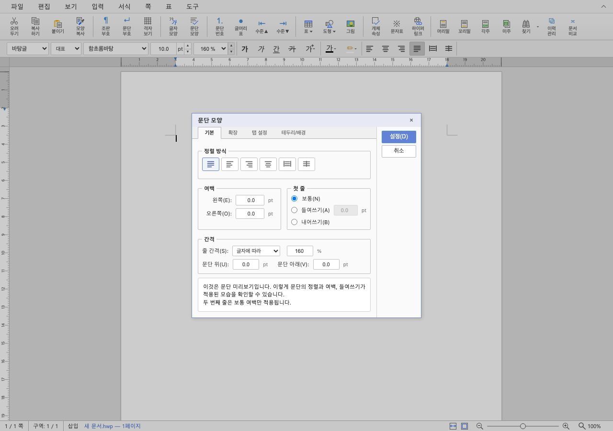
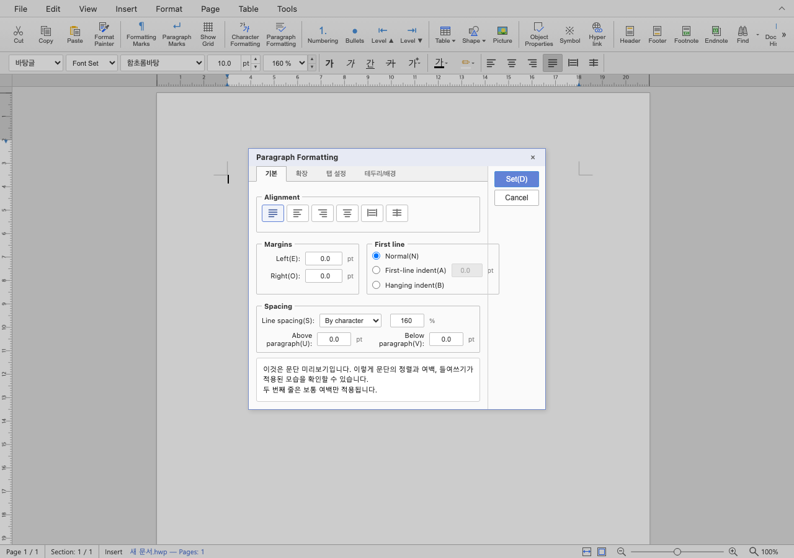
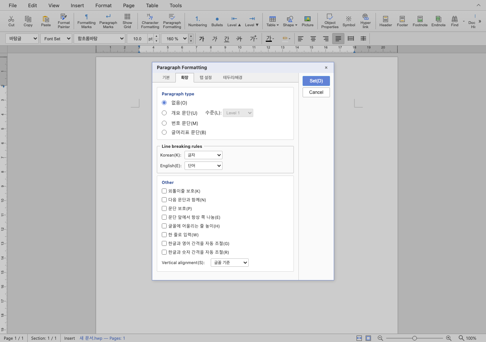

# PR #7166 검토

## 최종 판정

**승인**. 대화상자의 정적 문자열을 번역 카탈로그에 연결하는 3/4 단계로 수용한다. 통합된 탭 검사 보정 후 Studio unit 1,740개와 두 TypeScript 검사가 통과했고, 한글/영문 실제 대화상자 4종의 표시와 탭 이동을 확인했다.

이 판정은 로컬 코드 검토이며 GitHub approve 제출이나 merge 완료가 아니다. 통합 batch의 #7165/#7168 코드·증거 보류도 메인터너 보정으로 해소했다.
통합 PR #7171의 최종 code head `5a04e1722` 원격 CI가 성공했다. 아래 최종 CI 기록을 참조한다.

## 대상과 출처

| 항목 | 검토값 |
| --- | --- |
| 원 PR | [#7166](https://github.com/edwardkim/rhwp/pull/7166) |
| 제목 | feat(i18n): 대화상자 영어 표시 (3/4) |
| 작성자 | rubidus-api, 기존 기여자 |
| 원 head | `60a3626c10f3796c65750e5a8115e0a0815f0dd6` |
| PR base / 규모 | devel / 62 files, +3163/-1062 |
| 통합 base | `da7ec5c0906b38b7a1cfa15cf70ca5534b7d7ebb` |
| 검토 branch | `codex/pr7155-7167-review-20260915` |
| 적용 commit | `585d6b69d` |
| reviewer | jangster77 요청·API 재확인 완료 |
| 상태 | 작성 시점 OPEN/non-draft/MERGEABLE/CLEAN; 확인 시점 pending/failed 없음 |
| 검증 소스 / PDF 증거 commit | `b5d7956f6` / `925cd7434`(실행 코드 변화 없음) |

순서는 #7155 → #7157 → #7165 → #7166 → #7167 → #7168이며 각 고유 commit을 `-x`로 적용했다.
#7141/#7118 draft는 제외했다. [공통 실행 계획](pr_7155_7168_review_impl.md)에 전체 SHA와 순서를 기록했다.
base route는 `collaborator_external_pr.md`, modifier는 `multi_pr_update_branch.md`다.
`intake_and_review.md`, `maintainer_general.md`, `local_validation.md`, `visual_fixture_evidence.md`의 정본을 적용했다.

## 변경·검토 결과

62개 파일(+3163/-1062)의 큰 변경이어서 Rust PR과 분리해 검토했다. 핵심은 정적 문자열을 t/i18nText 호출로 옮기는 작업이며 기존 적용 값·명령·취소 경로를 유지한다. ko/en 카탈로그의 추가 1022개 키는 같은 호출에 대응한다. 탭·동적 문자열·문서 데이터·글꼴 이름 일부는 원 PR에서 후속 범위로 명시했으므로 전체 영문화를 완료했다고 주장하지 않는다.

4개 실제 대화상자(글자 모양·문단 모양·쪽 테두리·환경 설정)를 fresh WASM Studio에서 `?lang=ko`/`?lang=en`으로 각각 열었다. 내용이 언어에 따라 바뀌고 ID 목록은 같으며, 버튼 표시 문구를 임의 변경한 뒤에도 대응 패널이 열린다. 문단 모양의 First line 영역은 영어에서 더 넓어지고 일부 한글 미리보기/탭이 남는다. 확인 화면에서 설정·취소와 입력은 접근 가능했으며, 전체 번역·전체 화면 폭을 검증한 것은 아니다.

#7167 체리픽 시 쪽 테두리의 번역 label과 ID를 모두 유지했다. 기존 source-literal guard가 번역 호출을 인식하지 못한 1건은 `a86e96bb8`에서 기존 `assertShowsText` 도우미로 보정했다. 테스트를 삭제하거나 단순히 통과하도록 assertion을 비우지 않았다. 실제 런타임 검증은 별도로 수행했다.

관련 범위: #5852의 대화상자 번역 단계다. 명령 처리부 등 후속 범위가 있으므로 이슈를 닫지 않는다.

## 검증

Studio `npm test`: 처음 1739 pass / 1 fail / 2 skip → 보정 후 1740 pass / 0 fail / 2 skip. `npx tsc --noEmit`, `npx tsc --project tsconfig.ci-unit.json --noEmit`: 성공. `dialog-tab-ids.test.ts`: 4 passed. 실제 Chrome 대화상자 4종×2언어: 성공.

전용 target은 `target/pr7155-7167-review-20260915`다. 기존 공용 산출물은 삭제하지 않았다.
Native와 WASM은 #7168까지 포함한 소스에서 새로 빌드했다. `git diff da7ec5c0906b38b7a1cfa15cf70ca5534b7d7ebb...HEAD --check` 성공.
사용자 지시에 따라 광범위 전체 회귀를 중복 실행하지 않았으며 아래 source CI와 로컬 집중 검증을 구분한다.
통합 PR #7171의 code head `5a04e1722` Full CI가 성공했으며, source CI를 통합 완료로 대체하지 않는다.

- [Adapter inter-diff](https://github.com/edwardkim/rhwp/actions/runs/34966758117/job/104373048079)
- [CI](https://github.com/edwardkim/rhwp/actions/runs/34966758157/job/104375663312)
- [CI Impact Policy Controller](https://github.com/edwardkim/rhwp/actions/runs/34966753149/job/104372924615)
- [CodeQL](https://github.com/edwardkim/rhwp/actions/runs/34966758023/job/104373035177)
- [Proptest roundtrip](https://github.com/edwardkim/rhwp/actions/runs/34966758010/job/104373024127)
- [Render Diff](https://github.com/edwardkim/rhwp/actions/runs/34966757763/job/104373008275)

## 공통 조판 원칙

| 항목 | 판정 | 근거 |
| --- | --- | --- |
| 구현 근거와 일반성 | 비해당 | UI 표시·탭 식별 변경이며 문서 조판·저장 줄·예산을 바꾸지 않는다. |
| 측정·배치 일관성 | 비해당 | UI 표시·탭 식별 변경이며 문서 조판·저장 줄·예산을 바꾸지 않는다. |
| 분할·이어받기 계약 | 비해당 | UI 표시·탭 식별 변경이며 문서 조판·저장 줄·예산을 바꾸지 않는다. |
| 줄 소속과 점유 높이 | 비해당 | UI 표시·탭 식별 변경이며 문서 조판·저장 줄·예산을 바꾸지 않는다. |
| 사례와 증거의 독립성 | 비해당 | UI 표시·탭 식별 변경이며 문서 조판·저장 줄·예산을 바꾸지 않는다. |
| 기준값 변경 | 비해당 | UI 표시·탭 식별 변경이며 문서 조판·저장 줄·예산을 바꾸지 않는다. |
| 주장과 검증 범위 | 충족 | source/통합 SHA, unit·실제 UI 범위와 남은 번역 범위를 구분했다. |

## 검증 입력과 증적

빈 문서를 생성하는 실제 Studio 실행을 사용했다. 새 HWP/HWPX/PDF 입력은 없다. OLE E2E가 참조한 기존 샘플은 실행 계획의 입력 목록에 기록하며 중복 추가하지 않는다.

[검증 manifest](../assets/pr7155_7168_review_evidence.json)에 원 head의 CI 스냅샷, 바이너리·입력·PNG 해시와 sweep 수치를 보존한다. macOS Chrome webfont rasterizer, 96dpi를 사용했다.

## Merge 전 조건

통합 보류 사유는 메인터너 보정으로 해소됐고, 사용자로부터 PR 생성·CI 모니터링·merge·후속처리 승인을 받았다. 통합 최종 head의 CI 및 mergeability를 확인한 뒤 병합하며 원 PR은 직접 merge하지 않고 통합 후 supersede close한다.

## Merge 후 contributor PR comment 계획

[Visual Sweep 정본](https://github.com/edwardkim/rhwp/blob/devel/mydocs/manual/verification/visual_sweep_guide.md)을 연결한다. 위 실제 페이지·수치·직접 관찰과 미검증 범위를 요약하고, 대표 PNG는 다음처럼 merge SHA로 고정한다.

`https://raw.githubusercontent.com/edwardkim/rhwp/<merge-commit-sha>/mydocs/pr/assets/pr7166_line_breaking_en.png`

asset이 devel에 포함되고 merge SHA가 확정된 뒤, 허용된 게시 단계에서 `--body-file`로 작성하고 API로 본문을 재조회한다. 현재는 로컬 계획이며 게시하지 않았다. 보류 상태의 불일치 PNG를 개선 완료 증거로 게시하지 않는다.

OLE E2E 입력은 아래 두 기존 파일이며 직접 이름을 바꾸거나 추가하지 않았다.

| 파일 | SHA-256 | 입력 commit |
| --- | --- | --- |
| [samples/SO-SUEOP.hwpx](../../../samples/SO-SUEOP.hwpx) | `ebbd6f5c86d6eda195bb9c4ba1fc35b329432dcc5ef1dc0fffbfb4542fce74b8` | `7393203034a92fdbb241812458b539753eb01985` |
| [samples/한셀OLE.hwp](../../../samples/한셀OLE.hwp) | `fdc595a2f5f99f97653b91e57b4c74090391495ce5f84ef2e60308ea4b8e9da3` | `1dc5a5706bfaf31115f2455829e9b135607d050a` |

## 제출 직전 source 갱신

원 최초 head `e8833a5ba` 뒤 `60a3626c1`의 영어 카탈로그 1행 변경을 추가 확인했다.
`Line break basis` → `Line breaking rules`이며 키·한국어·동작은 동일하다.
통합 적용 commit은 `95d631f0a`이고 i18n/core·resolve·tab ID 23개 테스트가 통과했다.
위 source CI 링크는 최초 head의 기록이며 최신 source와 통합 CI를 혼동하지 않는다.

## 승인된 통합 경로

[PR #7171](https://github.com/edwardkim/rhwp/pull/7171), code candidate `5a04e172247d1b168d350faf514beeef46cf0964`.
base route: `collaborator_external_pr.md`; modifiers: `multi_pr_update_branch.md`,
`review_only_fast_pass.md`, `post_merge.md`. 개별 review·오늘할일·증적은 code CI 성공 뒤
같은 PR의 문서-only trailing commit으로 반영한다. 최종 head CI·mergeability를 확인한 뒤
merge하고 duration refresh·원 PR comment/close·devel 동기화·전용 산출물 정리를 수행한다.

최신 카탈로그로 실제 Chrome의 확장 탭을 열어 `Line breaking rules` 표시와 ID 기반 탭
전환을 확인했다. 처음 기본 탭의 visible text만 읽은 진단은 문구를 찾지 못했으며, 대상이 있는
확장 탭을 연 후 재확인했다. 코드 변경 없이 진단 대상을 바로잡은 것이다.

## CI 정책 보정 후 최신 후보

최초 `95d631f0a`의 CI는 source-side 테스트 총량의 PR base 비교에서 실패했다.
Rust archive·Native Skia·Frontend package 검증은 성공했다. `5a04e172247d1b168d350faf514beeef46cf0964`에서
개체 동반 공백 반례를 기존 cursor 계약 안에서 동일하게 실행하도록 묶고 정책 총량 4205를
유지했다. 생산 코드·시각 출력은 바뀌지 않았다. base 비교·cursor 테스트·필수 lint 묶음을
재검증했고 최신 후보 Full CI 성공을 확인해 trailing 문서를 반영한다.

## 최종 code CI 확인 (2026-09-15)

최종 code head `5a04e172247d1b168d350faf514beeef46cf0964`의 [CI](https://github.com/edwardkim/rhwp/actions/runs/34978539946),
[CodeQL](https://github.com/edwardkim/rhwp/actions/runs/34978540233),
[Render Diff](https://github.com/edwardkim/rhwp/actions/runs/34978539840),
[Adapter](https://github.com/edwardkim/rhwp/actions/runs/34978539982),
[Proptest](https://github.com/edwardkim/rhwp/actions/runs/34978540234)가 성공했다.
확인 시 check 31개 성공·4개 조건부 생략, policy status 성공이며 실패·진행 중 항목은 없다.
Rust archive 4개·전체 shard, Native Skia, 필수 lint, frontend package 검증을 포함한다.
초기 `95d631f0a`의 source-side test 정책 실패는 `5a04e1722`에서 동일 assertion을 기존
테스트 계약으로 묶어 해결했다. 허용치·baseline·생산 코드는 변경하지 않았다.
이 문서·오늘할일·대표 증적을 single-parent trailing commit으로 반영하고, 문서 추가 후
최종 head의 fast-pass와 required checks·MERGEABLE/CLEAN을 별도로 확인한 뒤 병합한다.
최종 head 및 실제 merge SHA·후속 처리 결과는 PR #7171과 원 PR의 GitHub comment에 기록한다.
