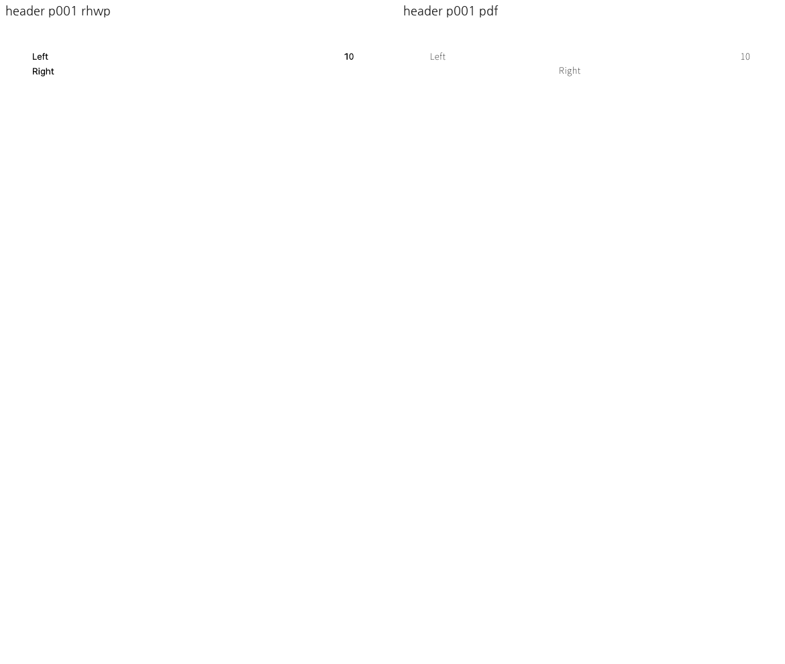
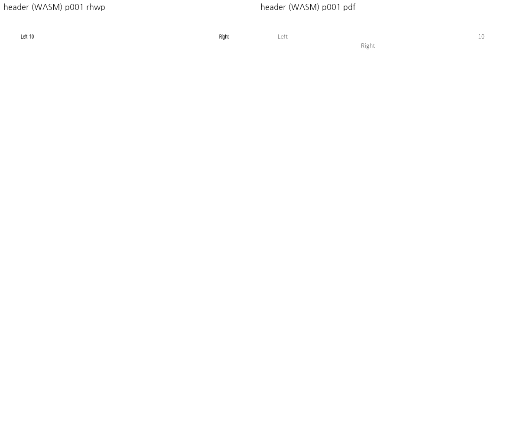
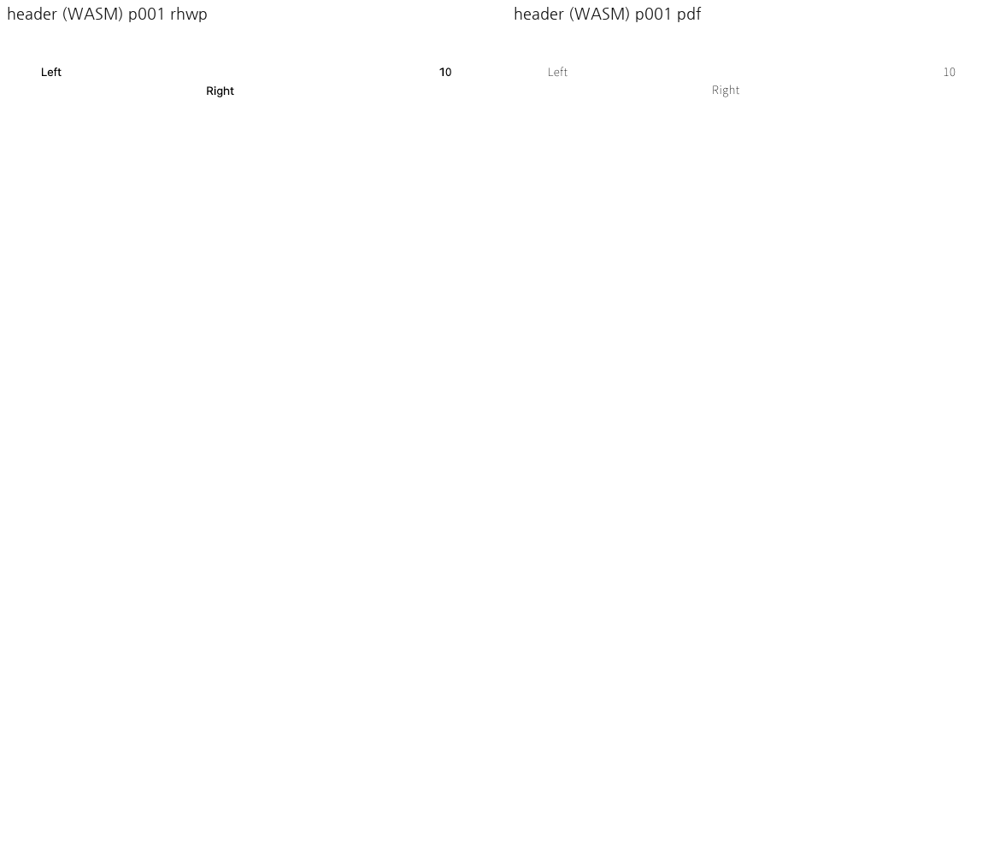

# PR #7168 검토

## 최종 판정

**승인 — 메인터너 보정으로 코드·증거 보류 사유 해소**. 독립 한컴 저장본, 집중 검증,
필수 lint와 fresh WASM visual sweep을 완료했다. 원격 통합 CI 성공은 이후 merge의 별도 조건이다.

이 판정은 로컬 검토이며 GitHub approve·원격 push·통합 CI·merge 완료가 아니다.

## 대상과 출처

| 항목 | 검토값 |
| --- | --- |
| 원 PR | [#7168](https://github.com/edwardkim/rhwp/pull/7168) |
| 제목 | fix(renderer): 단 너비 정수화로 머리글 저장 줄이 깨지는 문제 수정 |
| 작성자 | LJYeon12, 기존 기여자 |
| 원 head | `2b681d12572cb54fa54c290064f1d7966ebf034f` |
| PR base / 규모 | devel / 4 files, +126/-7 |
| 통합 base | `da7ec5c0906b38b7a1cfa15cf70ca5534b7d7ebb` |
| 검토 branch | `codex/pr7155-7167-review-20260915` |
| 적용 commit | `36e41e3da → e373698ac → 4b19c3d28 → b5d7956f6` |
| reviewer | jangster77 요청·API 재확인 완료 |
| 상태 | 작성 시점 OPEN/non-draft/MERGEABLE/CLEAN; 최종 재조회에서 pending/failed 없음 |
| 최초 보류 검증 소스 / PDF 증거 commit | `b5d7956f6` / `925cd7434`(실행 코드 변화 없음) |

순서는 #7155 → #7157 → #7165 → #7166 → #7167 → #7168이며 각 고유 commit을 `-x`로 적용했다.
#7141/#7118 draft는 제외했다. [공통 실행 계획](pr_7155_7168_review_impl.md)에 전체 SHA와 순서를 기록했다.
base route는 `collaborator_external_pr.md`, modifier는 `multi_pr_update_branch.md`다.
`intake_and_review.md`, `maintainer_general.md`, `local_validation.md`, `visual_fixture_evidence.md`의 정본을 적용했다.

## 변경·검토 결과

**기존 보류의 원인:** `header.hwpx`는 실제 단 폭과 다른 36002 HU 저장 줄에
`Left 10` + 공백 95개 + `Right`를 한 줄로 수동 기록한 합성 입력이다. 한컴은 페이지 폭
43202 HU에서 단 폭을 36000 HU로 정수화하고 두 줄(원시 시작 0/89)에 저장한다.
원 PR의 비정수화 폭 재시도는 이 잘못된 한 줄 캐시를 수용해 `Right`를 첫 줄에 놓았다.

**메인터너 보정:** `ParagraphBox`/`LayoutFrame`의 잔여 폭 전달과 재수용 경로를 제거했다.
단 폭 양자화는 frame의 계약으로 유지한다. 재조판 과정에서도 공백 토큰은 폭 초과를 검사하지
않던 기존 문제가 있었다. 공통 `fill_one_interval`에서 연속 공백의 폭 초과를 처리해
첫 초과 공백을 앞 줄에 흡수하고 남은 공백은 다음 줄로 넘긴다. 같은 offset에 가시 인라인
개체가 있으면 공백처럼 줄 밖에 남기지 않고 개체와 함께 이월한다.

독립 한컴 HWP 3개로 원시 경계 0/89, 공백만 남은 둘째 줄, 명시적 개행 시 0/89/119를
확인했다. 이 경계를 renderer 결과에서 역산해 fixture에 주입하지 않았다. frozen scalar
테스트 도우미는 옛 동작으로 보존하고, 의도적으로 달라진 공백 경계는 별도 assertion으로 검사한다.

원 `header.hwpx`의 `Right`가 이제 한컴 저장본과 같은 둘째 줄 x≈240.16px에 놓인다.
독립 PDF bbox는 x=180.121552pt, yMin=51.7152pt(첫 줄 Left/10 yMin=35.7552pt)다.
단 잔여값 0~3 × 저장/편집 무효화 × HWP 3종, 총 24조건도 통과했다.

**범위:** 원 PR의 비공개 실제 문서는 제공되지 않았다. 공개 재현 입력에서 확인한 잘못된
캐시 수용과 공백 재조판을 수정한 것으로 판정한다. 비공개 문서의 개선이나 PDF 글꼴 획의
완전한 일치까지 주장하지 않는다. 공개 연결 issue는 없다.

## 검증

`stored_column_width_quantization` 2 passed(원 HWPX 위치 대조 + 독립 HWP 3종의 24조건). 가시 개체를 동반한 공백 이월도 단위 테스트로 확인했다.

메인터너 최종 검증은 전용 `target/pr7155-7167-review-20260915`에서 순차 실행한다.
관련 focused 10개, 줄 나눔/frame 단위 21개가 통과했다. fmt check, Native/WASM/workspace
all-targets Clippy(`-D warnings`), workspace build, suite manifest/unit-tier 검사가 통과했다.
최종 Native/fresh WASM 빌드 및 6페이지 visual sweep을 완료했고 두 경로의 raster는 모두
바이트 동일하다. 세부 실행 결과는 아래 메인터너 증적에 기록한다. 사용자의 지시에 따라 전체 Rust/Native Skia 회귀를 로컬에서
중복 실행하지 않았다. **통합 code head `5a04e1722`의 GitHub CI가 성공했다(아래 최종 CI 기록).**
아래 링크는 원 PR head의 CI이며 메인터너 보정 후 통합 CI 통과를 뜻하지 않는다.

- [Adapter inter-diff](https://github.com/edwardkim/rhwp/actions/runs/34969206780/job/104381175980)
- [CI](https://github.com/edwardkim/rhwp/actions/runs/34969206698/job/104385189911)
- [CI Impact Policy Controller](https://github.com/edwardkim/rhwp/actions/runs/34969205899/job/104381040332)
- [CodeQL](https://github.com/edwardkim/rhwp/actions/runs/34969206368/job/104381146757)
- [Proptest roundtrip](https://github.com/edwardkim/rhwp/actions/runs/34969206541/job/104381155782)
- [Render Diff](https://github.com/edwardkim/rhwp/actions/runs/34969206065/job/104381117582)

## 공통 조판 원칙

| 항목 | 판정 | 근거 |
| --- | --- | --- |
| 구현 근거와 일반성 | 충족 | 한컴 단 폭 36000·원시 공백 경계 실측. 잘못된 폭 재수용 제거. |
| 측정·배치 일관성 | 충족 | scalar/frame 생산 경로가 공통 interval filler의 컷을 소비한다. |
| 분할·이어받기 계약 | 충족 | 첫 초과 공백 흡수·나머지 이월. 가시 개체는 줄 밖 흡수 금지. |
| 줄 소속과 점유 높이 | 충족 | 한컴 저장/재조판 24조건, 개행·공백만 남은 줄 포함. |
| 사례와 증거의 독립성 | 충족 | 원 합성 HWPX와 독립 한컴 HWP/PDF를 구분해 검증. |
| 기준값 변경 | 비해당 | 기존 PDF·baseline·허용치 변경 없음. 잘못된 합성 기대만 독립 계약으로 교체. |
| 주장과 검증 범위 | 충족 | 비공개 원본 미검증과 통합 CI 결과를 분리한다. |

## 최초 검토 입력과 보류 당시 증적

기존 입력은 이름을 바꿔 재추가하지 않았다. 새 PDF 2개는 `925cd7434`에 커밋했다.

| 저장소 파일 | SHA-256 | 마지막 입력 commit |
| --- | --- | --- |
| [tests/fixtures/stored_column_width_quantization/header.hwpx](../../../tests/fixtures/stored_column_width_quantization/header.hwpx) | `b0ac06d1333b9c8ea263ec184e782d58d043916b7e6b9a6f39dfdeb31102437b` | `e373698acdcd87d6cadb5eaf965d4a76a87482ae` |
| [pdf/stored-column-header-2020.pdf](../../../pdf/stored-column-header-2020.pdf) | `bb8d858c102d2ffd858c182ea721b36e3225fbc9d3a2ea289fdb411679a88368` | `925cd7434564657f1c78cf5568bcc05b0f19e9d3` |

[검증 manifest](../assets/pr7155_7168_review_evidence.json)에 원 head의 CI 스냅샷, 바이너리·입력·PNG 해시와 sweep 수치를 보존한다. macOS Chrome webfont rasterizer, 96dpi를 사용했다.

보류 당시의 비교(현재 보정 승인 증거와 구분):

## 메인터너 보류 해소 근거

1. 기존 합성 저장 줄과 한컴 재조판 불일치의 원인을 규명했다.
2. 정상 한컴 저장 HWP와 대응 PDF를 확보했고 사용한 입력을 저장소에 포함한다.
3. 필요한 공통 코드 보정과 긍정·경계 반례 집중 테스트를 완료했다.
4. 최종 lint·Native/fresh WASM visual sweep을 통과했다. 통합 CI는 아래 최종 code head에서 별도 확인했다.

새 파일의 변환 job·SHA-256은 fixture README와 `hancom-evidence.json`에 기록한다.
기존 파일을 이름만 바꿔 중복 추가하지 않았다. 한컴 재저장 wide/header PDF는 기존 PDF와
96dpi RGB raster가 같아 기존 PDF를 재사용했다.

## Merge 후 contributor PR comment 계획

[Visual Sweep 정본](https://github.com/edwardkim/rhwp/blob/devel/mydocs/manual/verification/visual_sweep_guide.md)을 연결한다. 위 실제 페이지·수치·직접 관찰과 미검증 범위를 요약하고, 대표 PNG는 다음처럼 merge SHA로 고정한다.

`https://raw.githubusercontent.com/edwardkim/rhwp/<merge-commit-sha>/mydocs/pr/assets/pr7168_maintainer_header_wasm_p001.png`

asset이 devel에 포함되고 merge SHA가 확정된 뒤, 허용된 게시 단계에서 `--body-file`로 작성하고 API로 본문을 재조회한다. 현재는 로컬 계획이며 게시하지 않았다. 최초 보류 PNG와 보정 후 PNG를 구분해 게시한다.

## 메인터너 보정 후 증적

메인터너 코드: #7165 `b5f8bf9553976a9aedacda54030df5f7ce0d0045`, #7168 `0c80b8f1c74ff2f9510db335efb018db427af45c`. Visual sweep 단일 페이지 식별 보정: `42ef2240d`.
최종 검증 소스와 `b5f8bf955`의 소스 파일 SHA-256 일치를 확인했다.

입력·한컴 변환 출처: [fixture README](../../../tests/fixtures/stored_column_width_quantization/README.md), [변환 manifest](../../../tests/fixtures/stored_column_width_quantization/hancom-evidence.json).

[최종 실행 증적](../assets/pr7165_7168_maintainer_evidence.json)에 소스·바이너리·WASM·입력·PNG 해시와 검증 결과를 기록한다.

캡처 임시 경로: `/private/tmp/rhwp-pr7155-7167-review-20260915/maintainer/wasm-corrected` 및 `wasm-6122`.

리뷰·대표 PNG와 오늘할일을 통합 최종 code CI 성공 뒤 같은 PR의 trailing commit에 포함한다.

## 승인된 통합 경로

[PR #7171](https://github.com/edwardkim/rhwp/pull/7171), code candidate `5a04e172247d1b168d350faf514beeef46cf0964`.
base route: `collaborator_external_pr.md`; modifiers: `multi_pr_update_branch.md`,
`review_only_fast_pass.md`, `post_merge.md`. 개별 review·오늘할일·증적은 code CI 성공 뒤
같은 PR의 문서-only trailing commit으로 반영한다. 최종 head CI·mergeability를 확인한 뒤
merge하고 duration refresh·원 PR comment/close·devel 동기화·전용 산출물 정리를 수행한다.

## CI 정책 보정 후 최신 후보

최초 `95d631f0a`의 CI는 source-side 테스트 총량의 PR base 비교에서 실패했다.
Rust archive·Native Skia·Frontend package 검증은 성공했다. `5a04e172247d1b168d350faf514beeef46cf0964`에서
개체 동반 공백 반례를 기존 cursor 계약 안에서 동일하게 실행하도록 묶고 정책 총량 4205를
유지했다. 생산 코드·시각 출력은 바뀌지 않았다. base 비교·cursor 테스트·필수 lint 묶음을
재검증했고 최신 후보 Full CI 성공을 확인해 trailing 문서를 반영한다.

## 최종 code CI 확인 (2026-09-15)

최종 code head `5a04e172247d1b168d350faf514beeef46cf0964`의 [CI](https://github.com/edwardkim/rhwp/actions/runs/34978539946),
[CodeQL](https://github.com/edwardkim/rhwp/actions/runs/34978540233),
[Render Diff](https://github.com/edwardkim/rhwp/actions/runs/34978539840),
[Adapter](https://github.com/edwardkim/rhwp/actions/runs/34978539982),
[Proptest](https://github.com/edwardkim/rhwp/actions/runs/34978540234)가 성공했다.
확인 시 check 31개 성공·4개 조건부 생략, policy status 성공이며 실패·진행 중 항목은 없다.
Rust archive 4개·전체 shard, Native Skia, 필수 lint, frontend package 검증을 포함한다.
초기 `95d631f0a`의 source-side test 정책 실패는 `5a04e1722`에서 동일 assertion을 기존
테스트 계약으로 묶어 해결했다. 허용치·baseline·생산 코드는 변경하지 않았다.
이 문서·오늘할일·대표 증적을 single-parent trailing commit으로 반영하고, 문서 추가 후
최종 head의 fast-pass와 required checks·MERGEABLE/CLEAN을 별도로 확인한 뒤 병합한다.
최종 head 및 실제 merge SHA·후속 처리 결과는 PR #7171과 원 PR의 GitHub comment에 기록한다.
