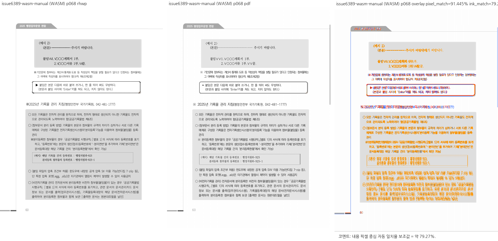
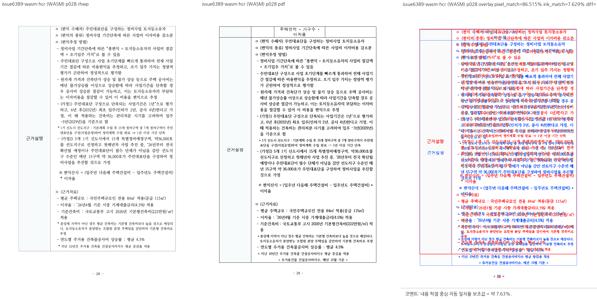

# PR #7179 — 명시적 폰트 환경 self-review

## 접수와 범위

| 항목 | 작성 시점 참고값 |
| --- | --- |
| PR | [#7179](https://github.com/edwardkim/rhwp/pull/7179) |
| 작성자 / 검토 | jangster77 / 작성자 self-review, reviewer 미지정 |
| base | devel, `5720d3f1646d6c25e51c8d7cbb0b4cc6bc5feb4f` |
| 검증 code head | `4406687d8c38124fd73e32245f896152c0992526` |
| PR 최초 제출 head | `60a3ad32ed63bb596c7135b9b69667cdb6d89338` |
| 관련 이슈 | Refs #6389, 전체 종료 없음 |
| 규모 / 상태 | 68 files, +2536/−56; MERGEABLE/BLOCKED, Open (CI 진행 중) |

base route: `collaborator_self_merge`
modifiers: `intake_and_review`, `local_validation`, `visual_fixture_evidence`, `rework_and_exceptions`, `review_only_fast_pass`
loaded documents: 위 자식 문서와 `pr_review_workflow.md`, `pr_review/README.md`, `docs_and_git_workflow.md`.

1,000줄을 넘는 diff의 대부분은 단계별 보고·실행 로그·JSON 증적이다. 별도 무관한 이슈를 통합하지
않았고, 자동/admin merge를 요청하지 않는다. review_impl은 외부 코드 보정·다수 PR 통합·충돌 해소가
없어 작성하지 않았다.

## 코드 검토와 동작 검증

`FontEnvironment`가 선택한 최종 face를 core의 공통 스타일 해소에 연결했다. CLI SVG/render-tree/PDF,
WASM, 진단 `fontsUsed`/font trace, Visual Sweep Native/WASM이 같은 선언을 소비한다.

- setter → `rebuild_derived_state` → `resolve_render_styles` → `resolve_styles_with_environment`
  경로에서 스타일을 재생성한 뒤 구성·측정·paint가 이를 사용한다. formatting/text-edit의 스타일
  재생성과 picture-band shadow도 동일한 환경을 유지하도록 연결했다.
- 원본 face와 LineSeg를 수정하지 않고 세션 설정에만 저장한다. 기존 Canvas metrics/pending pagination
  상태를 버리고 다시 구성한다. 내장 폰트 보호, 세션 분리, 반복·해제·잘못된 설정·batch 거부를 확인했다.
- 새 API는 저장 mutation이 아니므로 passthrough 가드에 SessionState로 등록했다. 적용/해제 전후
  저장 bytes 보존을 실제 테스트했다. 가드 로직이나 Pending 상한을 완화하지 않았다.
- 기존 저장 셀은 실제 PDF에서 추출한 16줄과 셀 경계를 확인했다. 0.872를 잘못된 1.0으로 돌린
  통제 실험에서는 새 검사가 16→17줄, ※ 3→4줄을 검출했다. 독립 줄 경계 검사가 기존 bbox만의
  사각지대를 보완한다.
- 저장 LineSeg 없는 합성 입력은 18,000HU / 872HU와 / 1000HU로 기대치를 정했다.
  60글자가 각각 20/20/20, 18/18/18/6으로 구성된다. 합성 산술 계약을 한컴 시각 일치로 표현하지 않는다.

## 공통 조판 원칙

| 항목 | 판정 | 근거 |
| --- | --- | --- |
| 구현 근거와 일반성 | 충족 | 설치/치환 환경을 문서 ID·페이지 수로 추측하지 않고 정확한 face 선언으로 선택. 기존 face 상수·clamp 변경 없음 |
| 측정·배치 일관성 | 충족 | 공통 resolved styles와 font decision. 실제 CLI 3종 및 fresh WASM 실행, #6389 API 검사 |
| 분할·이어받기 계약 | 비해당 | 기존 pagination 컷·rowspan·예약 높이 알고리즘을 바꾸지 않음. 환경에 따른 재조판 결과는 별도 증적으로 제한 |
| 줄 소속과 점유 높이 | 충족 | 저장 줄 16개 유지와 저장 캐시 없는 재조판 계약을 각각 검증. 기존 줄 높이 알고리즘 유지 |
| 사례와 독립 증거 | 충족 | 기존 비교 PDF의 줄 경계, 독립 폭 산술, 잘못된 1.0em 음성 대조. PDF 생성 계보 제한은 아래 별도 기재 |
| 기준값 변경 | 비해당 | 렌더 baseline·golden·래칫 허용치 변경 없음. 새 세션 API 가드 분류에 원본 보존 테스트 근거 연결 |
| 주장과 검증 범위 | 충족 | 명시적 환경 전달 기능 범위. 86712 전체 시각 일치와 자동 폰트 가용성 판정은 미해결/미검증으로 유지 |

## 로컬 검증 결과

- **최종 전체 nextest: 9,905 passed / 0 failed / 51 skipped (274.309초, exit 0)**, code head와 검토 worktree source 24개가 바이트 일치한다.
- #6389 focused 6, passthrough 가드 5, Sweep Python 51 통과.
- fmt, native/WASM32/workspace all-targets Clippy, workspace build, 고정 base suite 정책 통과.
- Native Skia lib 4,112 pass / 13 ignored, 그림 2, 직접 PDF 4 통과. fresh WASM 빌드·Chrome export 완료.
- 변경 문서 metadata/링크/diff 검사 통과. source-side unit test·Studio/npm package 변경 없음.
- 편집 checklist: 새 document mutation/Undo operation이 아닌 렌더 세션이다. 원본 bytes 보존과 캐시
  재구성을 확인했다. Studio UI 미추가이므로 별도 UI E2E는 미실행이며 실제 WASM Chrome export로 검증했다.
- 소스 생성 suite/manifest는 제출하지 않았다. 기존 2단계 전체 실행의 1건 실패는 남겨 두고,
  보정 포함 최종 전체 성공 로그를 [3단계](../../working/task_m100_6389_stage3.md)에 별도 기록했다.
- GitHub Actions는 생성 후 진행 상태다. 과거 로컬 결과로 최신 required checks를 대체하지 않는다.

## 검증 입력 커밋 확인

판정: **충족**. 아래 기존 파일 5개를 `4406687d8` Git blob과 직접 대조했다. 새 사본을 만들지 않았다.
SHA-256/SHA-1·PDF Creator/Producer/버전/쪽수는
[입력 원장](../../working/assets/issue6389-stage3-20260916/inputs.json)에 있다.

- `samples/2025 행정업무운영 편람(최종).hwp`
- `pdf/2025 행정업무운영 편람(최종)-hwp-kopub-2020.pdf`
- `pdf/2025 행정업무운영 편람(최종)-2010-no-ttf.pdf`
- `samples/86712_regulatory_analysis.hwp`
- `pdf/issue1921/86712_regulatory_analysis-2024.pdf`

출처는 #6389의 기존 비교 자료 및 저장소 fixture다. KoPub PDF는 cairo 1.18.0 / PDF 1.7 / 383쪽으로,
현재 메타데이터만으로 한컴 직접 출력 계보는 미확인이다. 기존 줄 경계 참고 자료로 한정한다.
no-ttf는 Hancom PDF 1.3.0.404 / PDF 1.4 / 389쪽, 86712는 Hwp 2024 13.0.0.3622,
Hancom PDF 1.3.0.550 / PDF 1.6 / 65쪽이다. 버전만으로 재산출을 요구하지 않았고 기존 파일을 재사용했다.

## Visual Sweep과 잔여 문제

[Visual Sweep 정본](../../manual/verification/visual_sweep_guide.md#github-merge-comment)을 적용했다.
CLI `--font-environment tests/fixtures/issue_6389/kopub-unavailable.json`과 새 `--wasm-pkg`를 사용한
명령·binary/source/input/profile 해시는 [2단계 보고](../../working/task_m100_6389_stage2.md)와 증적에 있다.

| 직접 검토 | 자동 지표 | 사람의 판정 |
| --- | --- | --- |
| 편람 p68, 기본 KoPub | Native pixel 91.43950%, ink 79.25197%; WASM 91.44526%, 79.26593%; flagged 0 | 대상 셀 16줄·※ 3줄과 셀 내부 표시 유지. 장식·예시 상자 차이는 전체 동일성 주장에 포함하지 않음 |
| 86712 p28, KoPub돋움체→함초롬바탕 | Native/WASM pixel 86.51529%, ink 7.62931%; flagged 0 | 이전 행 조각·일부 줄 경계·표 하단·굵기가 달라 **전체 PDF 일치 미해결** |

Native/WASM은 86712의 65/65쪽 tree가 동일하다. 편람 384쪽도 좌표·텍스트가 같고 71쪽의 차이
231건은 모두 음수 문단 sentinel의 32/64bit 표현이다. 이는 backend 적용 일관성 증거이며 PDF 일치가 아니다.
편람 no-ttf 대응 내용은 p69이고, 최종 환경과의 no-ttf 전체 시각 재현은 입증하지 않았다.

대표 PNG는 기존 단계 asset에서 이동했다. 재생성·수치 변경이나 원본 HWP/PDF 복제는 없다.
원 임시 산출물은 `/private/tmp/issue6389-stage2-wasm-manual/` 및
`/private/tmp/issue6389-stage2-wasm-hcr/`이다. 설정은 빠진 폰트 파일을 제공하지 않고 실제 설치를
인증하지 않는다. 환경 전환의 성능 전후 benchmark는 미측정이다.

## Merge 후 contributor PR comment 계획

외부 contributor 원 PR은 없다. 추후 merge·후속처리가 승인되면 이 PR에 실제 범위와 잔여 차이를 기록한다.
[Visual Sweep 정본](https://github.com/edwardkim/rhwp/blob/devel/mydocs/manual/verification/visual_sweep_guide.md#github-merge-comment),
위 p68/p28 수치와 사람의 판정을 포함한다. 대표 raw URL은 다음 형식이다.

- `https://raw.githubusercontent.com/edwardkim/rhwp/<merge-commit-sha>/mydocs/pr/assets/pr_7179_manual_wasm_p068.png`
- `https://raw.githubusercontent.com/edwardkim/rhwp/<merge-commit-sha>/mydocs/pr/assets/pr_7179_reflow_wasm_p028.png`

asset의 devel 포함과 merge SHA를 확인한 뒤 승인된 comment만 `--body-file`로 게시하고 API로 재조회한다.
현재 PR 생성 요청은 merge·issue close·comment 게시 승인이 아니다. #6389는 잔여 범위 때문에 OPEN 유지한다.

## 최종 판정

**승인** — 명시적 폰트 환경 선택 기능과 기존 줄 경계 회귀 검증이라는 PR 범위에 한정한다.
전체 PDF fidelity 해결 승인이 아니다. 실행 검출 실패는 수정 후 최종 전체 재검증으로 해소했고,
기존 시각 잔차와 미검증 영역은 위에 구분했다. 최신 문서 포함 head의 required CI 성공,
mergeability 재확인과 작업지시자의 merge 승인은 별도 조건이다.
