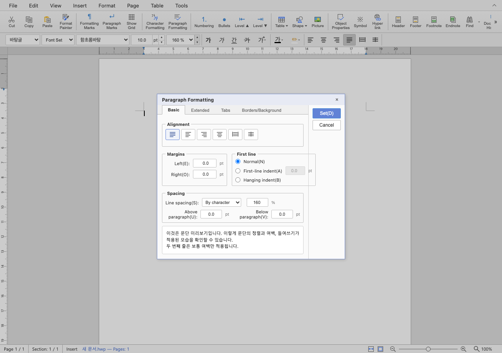

# PR #7186 검토

## 판정

**승인** — 영문 명령 레지스트리와 대화상자 탭 범위. 검증한 변경 범위에 대한 로컬 검토 판정이며 전체 이슈 해결 판정과 구분한다.
메인터너 보정 `f2e21164c029320d1e9b42a8c8ad1751c69fcb1d`에서 #7118의 실행 회귀·코드 원칙 위반과 #7184의 끝 컷/경계 증거 부족을 해소했다.
최종 판정은 **승인** — 메인터너 보정을 포함한 통합 변경 범위다. [통합 PR #7197](https://github.com/edwardkim/rhwp/pull/7197)의 제출 head `7665912859016c9d46a326e86f000c1a394e4862`에서 원격 CI도 통과했다.
[2회차 결과·제한 사항](../../working/task_m100_6970_open_pr_stage2.md)과 [최종 검증 결과](../assets/pr7118_7187_review_stage2/gate-results.json)를 기준으로 한다.
이 기록은 통합 PR code CI 성공 뒤의 trailing 문서다. 최종 문서 head의 CI·병합 조건을 재확인한 뒤 승인된 merge·후속 처리를 수행한다.

## 검토 대상

| 항목 | 확인값 |
| --- | --- |
| 원 PR | [#7186](https://github.com/edwardkim/rhwp/pull/7186) |
| 제목 | feat(i18n): 명령 레지스트리·대화상자 탭 영어 표시 — UI 문자열 로케일 분리 4/4 (#5852) |
| 작성자 / reviewer | rubidus-api (기존 기여자) / jangster77 사전 요청 |
| 원 head | `9d65b36843aece32a1c9b456cf3833f3d2daa43b` |
| source base / 규모 | devel / 19 files, +496/-232, 2 commits |
| 원 PR 상태 | OPEN / draft=False / MERGEABLE / CLEAN |
| source CI | [Build & Test](https://github.com/edwardkim/rhwp/actions/runs/35048795385) 및 전체 rollup 실패/대기 없음; 검토 종료 전 source head 불변 확인 |
| 통합 base | `8d45f242baa1a565357aaa38e9f459595b1e756c` |
| 통합 code head | `f2e21164c029320d1e9b42a8c8ad1751c69fcb1d` (메인터너 보정·검증 증적 포함) |
| branch | `codex/open-pr-review-20260916` |
| 충돌 해결 | 텍스트 충돌 없음. |

원 commit은 `-x`로 누적 적용했고 작성자·메시지·co-author를 보존했다.
source/local SHA와 실행 명령은 [검증 기록](pr_7186_review_impl.md), 공통 제한은 [2회차 보고](../../working/task_m100_6970_open_pr_stage2.md)에 있다.
route: collaborator_external_pr + intake/local_validation/multi_pr_update_branch/visual_fixture_evidence.
#7118의 1,000줄 초과 변경은 별도 코드·실행·시각 검토로 취급했고 admin merge는 하지 않았다.

## 변경·증거 심사

명령의 execute/canExecute/undo 동작과 내부 tab ID는 그대로 두고 표시 라벨을 번역 키로 연결한다.
현재 locale은 모듈 import 전에 결정되며 언어 변경은 다음 실행부터 적용하는 기존 계약이므로,
명령 상수의 초기 번역과 열린 대화상자의 표시 언어가 충돌하지 않는다.

TypeScript 일반/CI unit 검사, unit 1,740 pass/2 skipped, production build,
실제 Chrome command-palette E2E가 통과했다. 추가 브라우저 실측에서 영어와 한국어 각각 팔레트
191개를 열었다. 영어 라벨의 한글 0개이며 문단 탭은 Basic/Extended/Tabs/Borders/Background,
한국어는 기본/확장/탭 설정/테두리/배경이다. 실제 스크린샷을 열어 확인했다.

미리보기 견본 문장·일부 상태/오류 문구, 접근키 Set(D), 영문 단위 `pt` 폭 차이는 source 본문이
명시한 후속 범위다. “전체 영어화 완료”로 해석하지 않으며 #5852 종료는 하지 않는다.
브라우저 진단 초기 시도는 잘못된 로컬 base 경로/초기 포커스로 timeout 났고,
실제 앱 경로와 문서 준비·캔버스 포커스를 적용한 재실행에서 두 locale 확인을 마쳤다.

## 공통 조판 원칙

| 항목 | 판정 | 근거 |
| --- | --- | --- |
| 구현 근거·일반성 | 비해당 | 표시 라벨만 변경하며 조판/분할/baseline을 변경하지 않음 |
| 측정·배치 일관성 | 비해당 | 표시 라벨만 변경하며 조판/분할/baseline을 변경하지 않음 |
| 분할·이어받기 | 비해당 | 표시 라벨만 변경하며 조판/분할/baseline을 변경하지 않음 |
| 줄 소속·점유 높이 | 비해당 | 표시 라벨만 변경하며 조판/분할/baseline을 변경하지 않음 |
| 기준값 변경 | 비해당 | 표시 라벨만 변경하며 조판/분할/baseline을 변경하지 않음 |
| 증거 독립성 | 충족 | 실제 두 locale 브라우저·unit/E2E |
| 주장·검증 범위 | 충족 | 팔레트와 탭에 한정, 전체 영어화/issue 종료 아님 |

## 증적

최종 공통 검증: focused 66/66, 전체 nextest 9933/9933(기존 skip 51), Clippy 3종, Native Skia 3종 통과.
새 WASM host `--no-opt` 진단 빌드와 Native의 6문서 22쪽 Visual Sweep을 완료했다.
Docker 배포 최적화 경로는 미실행이며 표준 원격 CI 통과로 대체 표기하지 않는다.
[최종 실행 결과](../assets/pr7118_7187_review_stage2/gate-results.json) · [시각 실행](../assets/pr7118_7187_review_stage2/visual-results.json) · [입력 원장](../assets/pr7118_7187_review_stage2/fixture-manifest.json).

시각 검토 정본: [Visual Sweep](../../manual/verification/visual_sweep_guide.md).
Native/WASM의 PNG 라벨과 본문을 구분해 직접 열었다. HWP3 저장 비교 이미지는 Visual Sweep의
`make_compares`로 **후보를 한컴이 출력한 PDF(왼쪽)**와 **원본 한컴 PDF(오른쪽)**를 합친 것이다.
그 이미지의 기본 `rhwp` 라벨은 Native renderer 출력을 뜻하지 않는다.
1회차(보정 전)의 [입력/PDF 해시 원장](../assets/pr7118_7187_review/fixture-manifest.json), [시각 지표](../assets/pr7118_7187_review/visual-metrics.json),
[focused 이력](../assets/pr7118_7187_review/focused.log)를 함께 보존했다. 낮은 pixel/ink proxy는 완전 일치로 해석하지 않는다.

직접 사용한 기존 HWP/HWPX는 기존 Git 경로를 재사용했다. 1회차의 한컴 PDF와 누적 저장 HWP는 `788ab292b`에 이미 포함돼 있다.
2회차는 기존 Git 입력·PDF를 재사용하고 새 비교 이미지와 로그를 보존했다. 아직 merge하지 않았으므로 source PR/issue는 닫지 않는다.

## 통합 code CI 완료

- code candidate `7665912859016c9d46a326e86f000c1a394e4862`, base `8d45f242baa1a565357aaa38e9f459595b1e756c`.
- [CI Full](https://github.com/edwardkim/rhwp/actions/runs/35071582466), [CodeQL](https://github.com/edwardkim/rhwp/actions/runs/35071582467), [Render Diff](https://github.com/edwardkim/rhwp/actions/runs/35071582672), [Adapter](https://github.com/edwardkim/rhwp/actions/runs/35071582435), [Proptest](https://github.com/edwardkim/rhwp/actions/runs/35071582468) 모두 성공.
- 원 PR head 불변·OPEN과 개별 CI 실패/대기 없음을 재확인했다. 원본 #7118의 충돌은 통합 브랜치에서 해결되어 있으며 직접 병합하지 않는다.
- 후속 문서만 single-parent commit으로 추가한다. 실제 merge SHA·trailing CI·duration 결과·종료 상태는 확인 후 GitHub 후속 comment에 확정값을 남긴다.

## Merge 후 contributor PR comment 계획

- [통합 PR #7197](https://github.com/edwardkim/rhwp/pull/7197) 반영 사실과 감사, 실제 merge SHA, code CI 및 최종 trailing CI URL을 적는다. 보정 없는 원 PR 자체를 승인했다는 표현은 쓰지 않는다.
- 명령 레지스트리와 대화상자 탭 라벨을 번역 키에 연결하고 내부 ID·명령 동작을 보존했습니다.
- TypeScript·unit 1,740 pass/2 skip·production build·실제 Chrome E2E가 통과했습니다. 두 언어의 팔레트 191개와 문단 탭 표시를 확인했습니다.
- UI 표시 검증으로 PDF Visual Sweep의 후보 수·픽셀 지표는 비해당입니다.
- 수치는 자동 일치율 보조값이며 사람 판정 정확도·완전 시각 일치를 뜻하지 않는다. 내용 픽셀 지표가 높으면 raster가 더 비슷하고 낮으면 위치·형태 차이의 직접 검토가 필요하다.
- 일부 미리보기 견본·상태·오류 문구 등은 후속 범위이므로 전체 영어화 이슈는 유지합니다. 관련 이슈 #5852는 부분 개선을 기록하고 OPEN을 유지합니다.
- [Visual Sweep 정본](../../manual/verification/visual_sweep_guide.md#github-merge-comment)을 링크하고 아래 PNG의 merge commit 고정 raw URL을 실제 이미지로 포함한다.

- 로컬 focused 66/66·전체 nextest 9933 pass/51 skip·Native Skia 4112/2/4와 fresh WASM host 진단 경로를 구분해 적는다.
- 최종 head CI 성공 및 devel 증적 존재 확인 뒤 원 PR을 통합 반영으로 close한다. contributor fork branch는 삭제하지 않는다.
