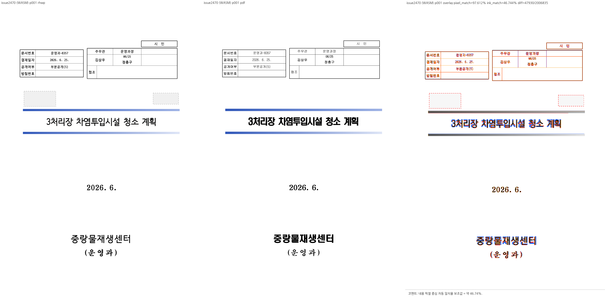
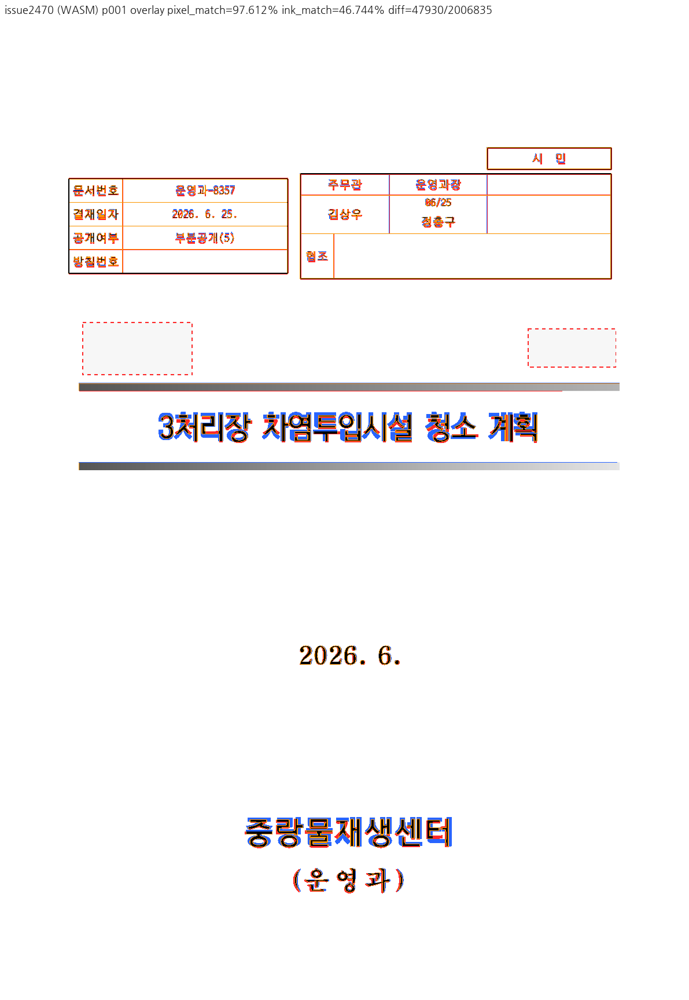
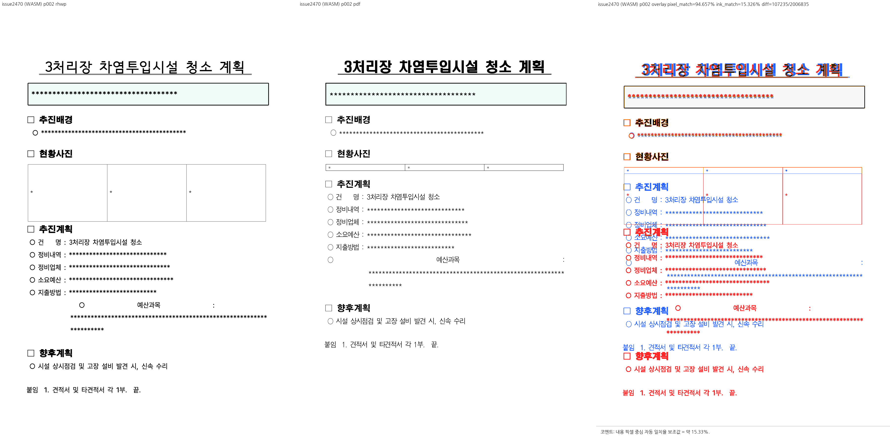
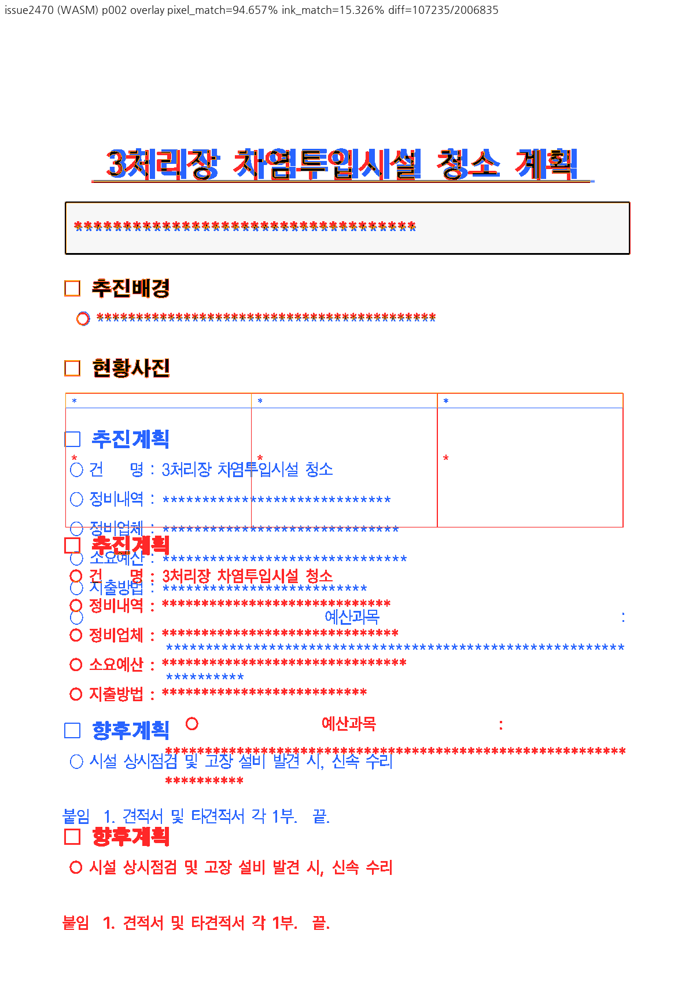
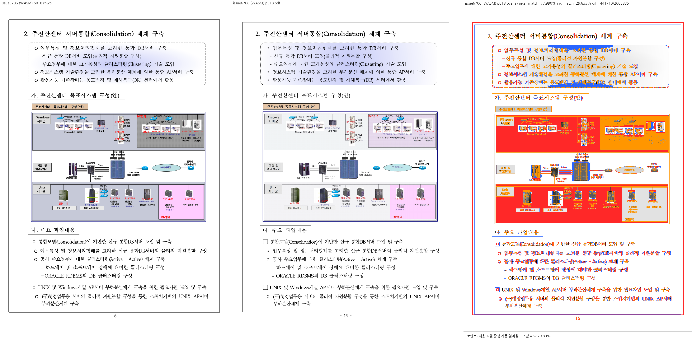
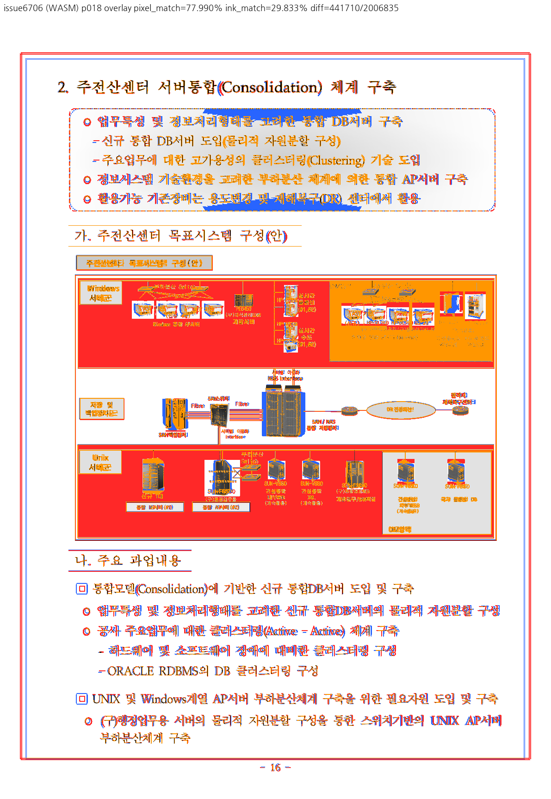

# PR #7199 검토

## 최종 판정

**메인터너 보정 후 수용 가능** — 이전 줄 표의 여백이 다음 줄 표에 유입되던 P2를 해결했다.
실제 배치와 같은 저장 줄별 TAC 집합을 재사용하며, 정식 경계 테스트의 수정 전 FAIL / 보정 후 PASS를 확인했다.
보정 code commit은 `58b970bf0a60e3577ff19a6b508e2a24c0d1e000`다. 아래 판정은 이 로컬 코드와 명시한 범위에 해당한다.
원 PR의 원격 head에는 아직 보정을 push하지 않았으며, 원 head CI를 보정 코드의 CI로 대체하지 않는다.
원격 최종 head CI 확인과 실제 merge는 후속 단계다.

[분석·구현·검증 결과보고](pr_7199_review_impl.md)에 명령, 실행 산출물의 소스/바이너리 식별과 한계를 기록했다.
issue2470 **1·2쪽 모두 Native/fresh WASM compare·standalone overlay·review를 재생성하고 직접 판독했다.**
2쪽 사진칸과 후속 본문의 기존 PDF 차이는 남아 있으므로 문서 전체의 시각 일치를 승인하지 않는다.

## 검토 대상과 경로

| 항목 | 확인값 |
| --- | --- |
| 원 PR / 이슈 | [#7199](https://github.com/edwardkim/rhwp/pull/7199) / [#7150](https://github.com/edwardkim/rhwp/issues/7150) |
| 제목 | Task #7150: 줄을 소유한 TAC 표를 제 바깥여백에 앉힌다 |
| 작성자 / reviewer | lpaiu-cs, 기존 기여자 / jangster77 사전 할당 완료 |
| 원 head | `5356d0c0a3f1c6e687993defc5831c3e28f3cf6d` |
| 원 CI base | `8d45f242baa1a565357aaa38e9f459595b1e756c` |
| 최신 통합 base | `6cd3c0692a3ed9def7f7e7af1ea03cad0c1a0aaa` |
| 최초 체리픽 code head | `ca0db01b2f8d9e6fc73e290d32f9d1f7fc9a3282` |
| 메인터너 보정 code head | `58b970bf0a60e3577ff19a6b508e2a24c0d1e000` |
| 로컬 branch | `codex/pr7199-review-20260916` |
| 적용 | `cherry-pick -x`, 충돌 없음, 원본 작성자/메시지 보존 |
| 원 PR 변경 | renderer 1파일 + 실물 focused test 1파일, +174/-11 |
| 원격 상태 재확인 | OPEN, non-draft, MERGEABLE/CLEAN, source head 불변 |

route: collaborator_external_pr + intake_and_review + local_validation + visual_fixture_evidence.
원격 push·리뷰 게시·merge는 하지 않았다. source CI를 최신 통합 head의 CI라고 표기하지 않는다.

## 해결된 P2 — 보정 전 실제 줄 배정을 재사용하지 않는 소유자 탐색

위치: `src/renderer/layout/paragraph_layout.rs:7924–7928` (최초 체리픽 `ca0db01b2` 기준).

보정 전 원 PR 코드는 전체 `composed.tac_controls`를 가시 문자 구간으로 다시 필터링한다.
그러나 같은 함수는 이미 `stored_tac_line_assignment`로 원시 UTF-16 줄 소속을 복원하고,
그 결과로 `tac_offsets_px`를 줄별 필터링해 실제 `run_tacs`를 배치한다
(`paragraph_layout.rs:4566–4583`, `:7139–7153`; `composer.rs:1551`의 #6706 계약).
줄 끝 표와 다음 줄 첫 개체가 같은 가시 위치에 투영되는 경우 새 탐색은 이전 줄 표를
다음 줄의 소유자로 받아들인다. 실제 배치에는 없는 표의 여백에서 기준선을 유도하는 오류다.

[합성 입력과 생성 내역](../../../tests/fixtures/issue7150_cross_line_owner/README.md)은
기존 issue2470 문단에 둘째 줄 표를 추가한 경계 진단이다. 두 파일은 첫 줄 큰 표의
상하 여백만 140/140 → 240/40 HU로 바꾸며 여백 합과 모든 줄 높이는 유지한다.
둘째 줄 자체를 바꾸지 않았으므로 둘째 줄 표의 y는 불변이어야 한다.
한컴 재저장본이나 합성 입력의 한컴 PDF 일치 판정으로 제시하지 않는다.

| 실행 | 다음 줄 표 y: 140/140 | 다음 줄 표 y: 240/40 | 판정 |
| --- | ---: | ---: | --- |
| 최신 devel `6cd3c0692` | 320.0px | 320.0px | PASS, 차이 0.0px |
| PR 적용 `ca0db01b2` | 318.7px | 320.0px | FAIL, 차이 1.3px |
| 메인터너 보정 | 320.0px | 320.0px | PASS, 차이 0.0px |

실행 trace의 첫 줄 `run_tacs=[0,1]`, 둘째 줄 `run_tacs=[2]`와 대조했다.
이전 줄 큰 표는 둘째 줄에 그려지지 않지만 새 `line_owner` 후보에 들어간다.
[재현 검사](../assets/pr7199_review/check_cross_line_owner.py)는 성공 시 0, 이 오류 재현 시 1을 반환한다.

보정: 실제 배치가 사용하는 `line_tac_offsets_for_width`를 `emit_line_runs`에 전달하고,
저장 줄 귀속과 마지막 run 끝 TAC를 보존한 집합에서 `line_table_owner`를 줄당 한 번 선택한다.
`previous_line_table_margin_does_not_move_the_next_line_table`로 경계를 정식 테스트에 고정했다.
원본 결재표 개선과 #7049 동반 표 하단차, #6754 혼합 객체, #6706 저장 줄 귀속을 함께 확인했다.
로컬 해제 조건은 충족했으며 원격 보정 head CI는 아직 실행하지 않았다.

## 1차 원 PR 검토 이력 — 메인터너 보정 전

| 검증 | 결과 |
| --- | --- |
| 원 head CI | [CI](https://github.com/edwardkim/rhwp/actions/runs/35075772850) Build & Test, archive A/B/C/D, Lint, Native Skia 성공; Render Diff·CodeQL·Adapter·Proptest도 실패/대기 없음 |
| 통합 head 빌드 | `cargo build --locked --bin rhwp` 성공 |
| focused | #7150 4건 + #7049 4건 + #6754 2건 = **10/10 PASS**; 필터 제외 588건 |
| 줄 경계 불변성 | 위 P2, **devel PASS / PR FAIL** |
| fresh WASM | locked wrapper `--target web --no-opt --dev` 빌드 성공; 새 JS/WASM을 Chrome/153.0.8010.47에서 실제 실행 |
| Visual Sweep | Native와 fresh WASM 각각 1–2쪽 compare·overlay·review 생성/직접 확인, 페이지 누락 없음 |
| 독립 PDF 보조 검사 | fidelity_compare text-only + export-all-svg + layout-ledger, 2쪽 완료 |
| whitespace / 입력 | `git diff --check` 통과; 기존 입력 Git blob 일치, HWPX ZIP CRC 통과 |

환경: macOS, `DEVELOPER_DIR=/Library/Developer/CommandLineTools`, 전용
`CARGO_TARGET_DIR=/Users/tsjang/rhwp/target/pr7199-review-20260916`.
Docker CLI는 있으나 daemon 연결 실패였다. host dev/no-opt WASM 결과를 최적화된 Docker 배포 빌드 통과로 쓰지 않는다.
전체 회귀·lint·Native Skia는 원 head의 성공한 CI 근거를 사용했고 로컬에서 중복 실행하지 않았다.
이 1차 검토 당시 통합 head에는 위 focused/경계/시각 검증만 수행했다.
이후 새 메인터너 코드에는 다음 전체 검증을 별도로 수행했다.

## 메인터너 보정 검증

| 검증 | 실제 결과 |
| --- | --- |
| 경계 RED → GREEN | 수정 전 #7150 4 PASS / 새 경계 1 FAIL → 보정 후 전부 PASS |
| focused | #7150 5 + #7049 4 + #6754 2 + #6706 1 = **12/12 PASS** |
| 전체 release-test 회귀 | **9,938/9,938 PASS**, 51 skipped, 4 slow; exit 0 |
| lint/build | fmt, native/WASM/workspace all-targets Clippy `-D warnings`, workspace build, test manifest 모두 PASS |
| Native Skia | lib **4,112 PASS**(13 ignored), 그림 **2 PASS**, 직접 PDF **4 PASS**, 모두 exit 0 |
| Native/fresh WASM Visual Sweep | issue2470 1·2쪽과 hwp3-sample16-hwp5 18쪽 compare·overlay·review 생성/직접 확인 |
| 독립 진단 | CLI 경계 y=320.0/320.0px, delta 0.0, exit 0; 대상 페이지 fidelity_compare 완료 |

전체 회귀는 빌드 포함 892.87초, 테스트 375.329초였다. 51 skipped는 실행 도구의 실제 집계이며
실행하지 않은 테스트를 성공 건수에 포함하지 않았다. Docker 최적화 배포 WASM은 미실행이다.

## 직접 Visual Sweep 판정 — overlay 포함

기준: 기존 Git `pdf/issue2470/36382471_masked-2022.pdf`, Creator `Hwp 2022 12.0.0.4547`,
Producer `Hancom PDF 1.3.0.550`, 2쪽. 원본 HWPX의 lastSavedWith는 Hancom Office 2020
`11.0.0.8227`이다. 이번에 새로 PDF 변환하지 않았으며 기존 독립 한컴 PDF를 그대로 사용했다.

144 DPI, Chrome webfont 경로, 기본 diff threshold 32. 글꼴 대체 차이는 좌표 개선과 구분했다.
Native/WASM의 아래 지표는 같았다. 두 backend 모두 review와 overlay를 직접 열어 판독했다.
라벨·한글 설명은 판독 가능했다. 대표 저장 이미지는 fresh WASM 실행본이다.

| 페이지 | devel pixel / ink match | PR 및 보정 Native·WASM pixel / ink match | 직접 판정 |
| --- | --- | --- | --- |
| 1 | 97.08770% / 39.97946% | 97.61166% / 46.74444% | 결재표 위치 개선. 제목/기관명 두께 등 기존 차이는 남음 |
| 2 | 94.65651% / 15.32564% | 94.65651% / 15.32564% | 사진칸 높이 및 후속 본문 위치 차이. devel과 PR의 SVG/render tree가 byte-identical하여 이번 변경의 회귀는 아님 |

자동 후보 **0/2쪽**은 시각 일치 판정이 아니다. 큰 여백을 포함한 pixel match와 내용 잉크 중심
일치율(visual_accuracy_proxy=ink match)을 구분한다. 특히 2쪽은 직접 판독에서 큰 차이가 보인다.
완전 일치나 문서 전체 해결로 승인하지 않는다. 1쪽 제목 두께는 PR 본문도 #7151 범위로 분리했다.
보정 후 두 쪽 SVG/render tree와 아래 PNG 4개는 보정 전 PR 결과와 byte-identical했다.
2쪽 사진칸은 rhwp y=424.7, h=154.2px이며 PDF vector 괘선의 96DPI 환산 높이는
17.101px(y=424.336–441.437px)이다. 약 137.1px의 높이 차이와 후속 본문 하향을
standalone overlay에서 직접 확인했다. 이 차이는 devel부터 동일하며 보정으로 해결했다고 주장하지 않는다.
Overlay에서 빨강은 rhwp에만 있는 잉크, 파랑은 PDF에만 있는 잉크, 주황은 양쪽 잉크 차이,
회색은 임계값 내 일치를 나타낸다.









### 저장 줄 귀속 실물 대조 — hwp3-sample16-hwp5 18쪽

기존 `samples/hwp3-sample16-hwp5.hwpx`와 `pdf/hwp3-sample16-hwp5-2022.pdf`를 재사용했다.
파일명과 달리 PDF Creator는 **Hwp 2024 13.0.0.3457**이다. 전체 64쪽 중 물리 18쪽을 검증했다.
Native/fresh WASM 모두 pixel 77.98972%, ink 29.83262%, 자동 후보 0건이다.
제목→그림→다음 제목의 순서·위치가 유지됐고 Native SVG/tree는 devel과 byte-identical했다.
글꼴·그림 색상·테두리 차이는 남아 있다. 전체 64쪽 시각 일치를 검증한 것은 아니다.





시각 절차 정본: [Visual Sweep](../../manual/verification/visual_sweep_guide.md#github-merge-comment).
임시 산출 루트는 `/private/tmp/rhwp-pr7199-evidence-20260916`이며 Native `sweep/issue2470`,
fresh WASM `wasm-sweep/issue2470`, devel `base-sweep/issue2470` 아래에 각각
`compare/`, `overlay/`, `review/`를 생성했다. devel 비교 실행의 checkout 표시는 로컬 review head이지만
실제 exporter는 devel에서 따로 빌드한 `rhwp-base`다. 코드/바이너리 복원 후 fresh WASM sweep을 수행했다.
위 경로는 보정 전 1차 검토 이력이다. 보정 후 재실행은 같은 임시 루트의
`maintainer-native/{issue2470,issue6706}`, `maintainer-wasm-2470/issue2470`,
`maintainer-wasm-6706/issue6706`에 보존했다. 실행 당시 dirty 소스와 exporter 해시는 구현 보고서에 있다.
원시 log/TSV/JSON은 로컬 임시 산출물로만 두고 커밋 대상에서 제외했다.

## 재현 명령

저장소 루트에서 실행했다. 아래 `$EVIDENCE`는 임시 디렉터리로 설정한다.

```bash
export CARGO_TARGET_DIR=/Users/tsjang/rhwp/target/pr7199-review-20260916
export DEVELOPER_DIR=/Library/Developer/CommandLineTools
EVIDENCE=/private/tmp/rhwp-pr7199-evidence-20260916
node scripts/rust-test-suite-manifest.mjs --prepare
cargo build --locked --bin rhwp
node scripts/run-rust-test.mjs issue_7150_tac_line_owner_anchor
node scripts/run-rust-test.mjs issue_7049_inline_tac_table_baseline
node scripts/run-rust-test.mjs issue_6754_tac_picture_and_table_share_a_line
node scripts/run-rust-test.mjs issue_6706_stored_inline_control_rows
venv/bin/python mydocs/pr/assets/pr7199_review/check_cross_line_owner.py "$CARGO_TARGET_DIR/debug/rhwp"
scripts/wasm-pack-locked.sh --target web --out-dir "$EVIDENCE/maintainer-wasm-pkg" --no-opt --dev
venv/bin/python scripts/visual_sweep.py \
  --file-target issue2470 samples/issue2470/36382471_masked.hwpx pdf/issue2470/36382471_masked-2022.pdf \
  --rhwp-bin "$CARGO_TARGET_DIR/debug/rhwp" --wasm-pkg "$EVIDENCE/maintainer-wasm-pkg" \
  --pages 1-2 --dpi 144 --out "$EVIDENCE/maintainer-wasm-2470"
```

Native는 위 sweep에서 `--wasm-pkg`를 빼고 `--out "$EVIDENCE/maintainer-native"`으로 실행했다.
`RHWP_BIN="$CARGO_TARGET_DIR/debug/rhwp" venv/bin/python tools/fidelity_compare/fidelity_compare.py 0 1`
에 `--source`, `--reference-pdf`, `--text-only --export-all-svg --layout-ledger --out-dir`을 지정해
동일 입력의 1·2쪽 후보를 수집했다. 18쪽 sweep은 추가 file-target과 `--pages 18`, fidelity는 page index 17을 썼다.
보정 전 실패 경계와 보정 후 통과 결과를 구분한다. 위 명령은 현재 case 이름으로 재현하기 위한 표기이며
실제 focused 12건은 네 case를 함께 지정한 nextest 필터 실행 결과다.

## 공통 조판 원칙 심사

| 원칙 | 판정 | 근거 |
| --- | --- | --- |
| 독립 근거 | 충족(원본 범위) | 기존 한컴 PDF의 결재표와 직접 Native/WASM overlay |
| 측정·배치의 공통 결과 / 저장 줄 소속 | 보정 후 충족 | 기존 저장 줄별 TAC 배정 결과 재사용; 정식 경계 RED→GREEN |
| 일반성 / 경계 증거 | 보정 후 충족(검증 범위) | 원본 + 저장 줄 경계 + 동반 표·혼합 객체 대조; 12 focused PASS |
| 분할·이어받기 | 비해당 | 이 PR은 분할 컷·소비량·예약 높이를 수정하지 않음 |
| 기준값 완화 | 비해당 | 테스트 오차·baseline 변경 없음 |
| 입력 Git 포함 | 충족 | 아래 기존 경로 재사용 및 새 합성 경계 입력 2개를 리뷰 증적에 포함 |
| 증거 주장 범위 | 제한 명시 | 합성 입력은 불변성 진단. 한컴 생성/시각 오라클로 주장하지 않음 |

`같은 lh를 만족하면 높이도 여백도 같다`는 잘못된 코드 주석과 독점 줄에 관한 모순된 설명은 제거했다.
복수 후보 선택 정책은 확대 변경하지 않았다. 이번 보정 판정은 재현된 저장 줄 귀속 P2와 검증 범위에 한정한다.
텍스트·그림·수식이 섞인 모든 조합의 공유 기준선은 이번 검토에서 완전 검증하지 않았다.

## 검증 입력 Git 확인

기존 7파일은 `ca0db01b2f8d9e6fc73e290d32f9d1f7fc9a3282`의 Git blob과 실행 파일 내용이 일치했다.
기존 파일은 복제·이름 변경하지 않았다. 새 경계 입력의 생성 방식/해시는 fixture README에 있다.

| 실제 사용한 저장소 경로 | SHA-256 |
| --- | --- |
| `samples/issue2470/36382471_masked.hwpx` | `43572dad5e17395aa02d1b0000b736b8467278931086604776ef30393dd0f54b` |
| `pdf/issue2470/36382471_masked-2022.pdf` | `814492b502a46e56e3a3be253e7beb386d752d2f5d47bfe2bfb9c646d41747cb` |
| `samples/hwpx/opengov/36384689_결재문서본문_화재발생종합보고서(제2026-298호).hwpx` | `9de5b2b17aba9c51bfbab27f5e571780aa8e49f39f059e2d1ba8665da11df4cd` |
| `samples/issue2083_hide_fill_page.hwpx` | `7758c15c57b1ef14fda6e6d29409ae3425f344931f2901641af84a40ef413d2e` |
| `samples/21_언어_기출_편집가능본.hwp` | `905454045ca2e236839a7cab59750678116d08af3db31dbf846819af355b8d15` |
| `samples/issue6542/156678235_mid_para_vpos_rewind.hwp` | `bd2a04f4f969bdad693b21cb26fe61c16f36a14bc5b442c79a2c862777d2419c` |
| `samples/issue6754/156585314-ssagirang-barley.hwp` | `18350ed16867552fbaef12b0677531c0b37fcc8e585cf7d4ec0a953f812644cf` |

메인터너 보정에서 추가로 사용한 아래 기존 파일도 Git HEAD blob과 일치했다.

| 실제 사용한 저장소 경로 | SHA-256 |
| --- | --- |
| `samples/hwp3-sample16-hwp5.hwpx` | `49e3e809eb41e22b2c059383db32b0cf038787269b5c523d1ff59d1a52b4340c` |
| `pdf/hwp3-sample16-hwp5-2022.pdf` | `b246ed9ac7050afd099f297f4ed489ea7fdd6fa38eb4340ece9676cf0fe75e3a` |

## Merge 후 contributor PR comment 계획

현재는 로컬 보정 완료 상태이며 원격 게시·merge는 하지 않았다. 최종 head CI와 merge 후 실제 merge SHA와 CI URL,
수정된 줄 소속 계약, 실제 검증 범위와 남은 차이를 한국어로 설명하고 감사한다.
[Visual Sweep 정본](https://github.com/edwardkim/rhwp/blob/devel/mydocs/manual/verification/visual_sweep_guide.md#github-merge-comment)을
연결하고 대표 PNG를 `https://raw.githubusercontent.com/edwardkim/rhwp/<merge-commit-sha>/mydocs/pr/assets/pr7199_review/wasm_review_001.png`
형식으로 넣는다. 이번 보정 후 재실행한 지표와 남은 기존 차이를 함께 기록한다. 본문은 UTF-8 파일과
`--body-file`로 게시한 뒤 이미지 URL·한국어·실제 head를 다시 확인한다.
