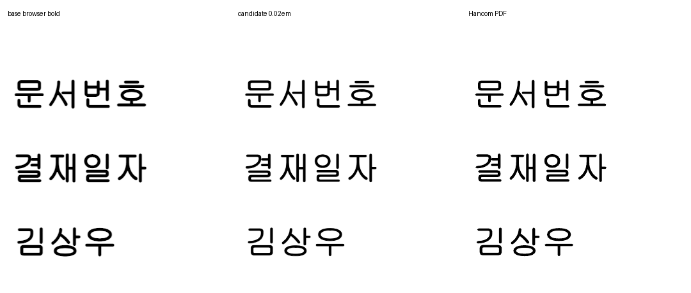
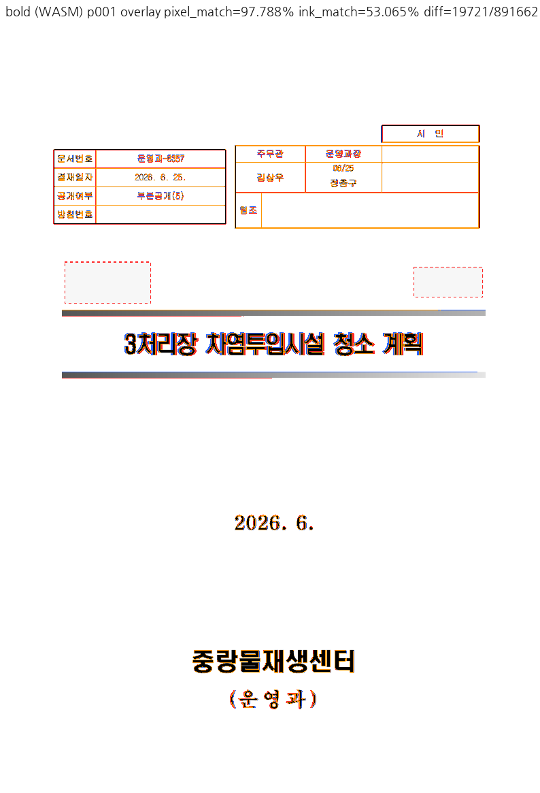
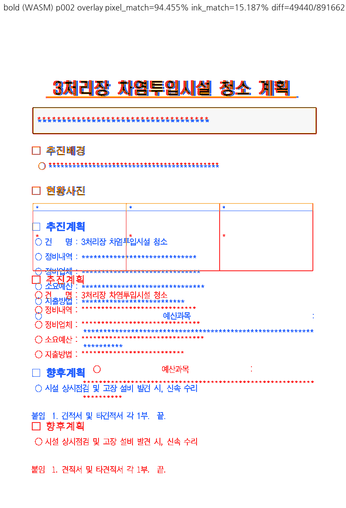

# PR #7212 검토

## 최종 판정

**승인 — 메인터너 보정으로 보류 사유 해소.** 원 face를 실제 선택한 Native/fresh WASM과 384 DPI 직접 비교로 필수 증거 부족을 해소했다. 승인 범위는 0.02em 명시 획이며 문서 전체 PDF 일치는 아니다. 최종 검증은 아래 공통 실행 기록을 따른다.

로컬 통합 검토이며 GitHub APPROVE·remote push·통합 PR 생성·merge·issue close는 수행하지 않았다.

## Metadata·계보·CI

| 항목 | 확인값 |
| --- | --- |
| PR | [#7212: Task #7151: 합성 볼드 굵기를 한/글과 같은 0.02 em 획으로 명시한다](https://github.com/edwardkim/rhwp/pull/7212) |
| 작성자 / reviewer | lpaiu-cs / jangster77 |
| base / state | devel / OPEN, non-draft |
| 규모 | 7 files, +981/-823, 1 commit |
| source head | `de7f0193668ea57e42bbf5eb09690edb37fcadc1` |
| 적용 commit / 통합 code head | `1c2bec6ec` / `4d38c9a7b29dd87edf9228d668f4cb83928f6e87` |
| 조회 상태 | MERGEABLE / CLEAN; merge 직전 재조회 필요 |

- [Build & Test](https://github.com/edwardkim/rhwp/actions/runs/35161046927/job/105014782708): **SUCCESS**.
- [Native Skia tests](https://github.com/edwardkim/rhwp/actions/runs/35161046927/job/105011704049): **SUCCESS**.
- [CodeQL](https://github.com/edwardkim/rhwp/runs/105012556370): **SUCCESS**.

SKIPPED/NEUTRAL은 해당 검사가 실행되어 통과했다는 의미로 세지 않는다. source CI는 통합 head의 CI가 아니다.

## 코드·독립 증거 심사

원래 보류는 실제 Chrome에서 굴림체→D2Coding, HY헤드라인M→HCR Dotum으로 대체되어 원 face의 굵기를 검증하지 못한 것이었다. 메인터너는 [Visual Sweep 폰트 공급 보정](../pr_7212_review_impl.md)을 추가하고 원본 face로 재캡처했다. renderer의 0.02em을 픽셀 점수에 맞춰 다시 조정하지 않았다.

기준 PDF p1의 Tr=2 draw 15개는 모두 w/Tf=0.02다. golden 5개의 815요소 변경은 font-weight/stroke 속성뿐이고 text·geometry·순서 변경은 없었다. normal/rotated/CharOverlap 경로의 공통 획 helper와 실제 Bold face 유지 조건을 확인했다. 대형 diff의 대부분이 이 paint-only 치환이며 baseline 허용치를 넓히지 않았다.

Windows 원본 `gulim.ttc`와 `H2HDRM.TTF`에서 검증 문자만 fontTools로 추출했다. 각 105개 cmap 문자의 decomposed outline·advance(hmtx)가 원본과 같음을 대조했고, 브라우저 필수 테이블을 보존한 결과를 `--embed-fonts=full --font-path`로 공급했다. Native와 WASM에는 같은 font-face CSS만 공급하며 WASM의 text/좌표/render tree는 독립적으로 내보낸다. Chrome 153.0.8010.47 CDP의 실제 선택은 **GulimChe / HYHeadLine-Medium(H2hdrM) / HYmjrE**였다. 원본/추출 폰트는 설치하거나 커밋하지 않는다.

| 원 face 검증 자료 | SHA-256 |
| --- | --- |
| Windows gulim.ttc | `4b9ac63e8920ed1bae29c068025ed30493464c18ee18617887daa18e59189226` |
| Windows H2HDRM.TTF | `e50c7200521c3ea59840e5dd42e79708905a74a607f2300ed862fe2491caf831` |
| 검증 GulimChe.ttf | `5e9c384a24c9365e02dde6ef9bb542e83288c5929ebdde4d7385400662caaf60` |
| 검증 H2HDRM.ttf | `de347c735b94b596caeb8a80a79edfbf45a981a79c491a9ff9bc48b16034e90b` |

384 DPI 같은 PDF bbox의 먹색 면적(sum((255-gray)/255))을 직접 비교했다. 문서번호·결재일자·김상우는 base/PDF **1.1837/1.1667/1.1671**, 후보/PDF **0.9987/0.9859/0.9938**이다. 같은 crop을 직접 보면 브라우저 합성 볼드의 과도한 굵기가 줄어 PDF의 획에 가까워진다. 96 DPI는 힌팅·래스터 영향으로 반대 방향의 면적값도 나타나므로 원 작성자의 다른 환경 수치를 그대로 재현했다고 쓰지 않는다.

제목·하단 기관명도 직접 비교했다. 384 DPI 국소 면적의 base→후보/PDF는 제목 `1.0191→0.9335`, 날짜 `1.0067→0.8784`, 기관명 `1.0578→0.9687`이다. 작은 굴림체의 개선을 모든 영역의 지표 개선으로 확대하지 않는다. 제목의 stretch·glyph 잔여 차이까지 완전히 일치한 것은 아니다. 회전/CharOverlap의 0.02em 계약은 코드/테스트로 확인했지만 별도 실물 PDF 픽셀 일치는 주장하지 않는다. **#7150의 p2 사진 표 높이·본문 흐름 차이는 남는다.** 같은 입력의 base 대비 text/geometry가 불변임을 확인했으며, #7151의 명시적 합성 획과 문서 전체 fidelity를 구분한다. 전체 문서 일치를 근거로 #7150을 닫으면 안 된다.

초기 fallback 캡처와 보류 기록은 `da99c8757`에 보존되어 있다. 아래 PNG는 최종 코드로 다시 캡처한 증적이다.

## 공통 조판 원칙 준수

렌더 영향 있음. Visual Sweep을 실행했고 합성 계약·독립 PDF·실제 제품 경계를 구분한다.

| 항목 | 판정 | 근거 |
| --- | --- | --- |
| 구현 근거와 일반성 | 충족 | 독립 PDF/COM 및 저장 사양, 문서별 숫자 조건 없음 |
| 측정·배치 일관성 | 충족 | paint geometry 보존 또는 setter reflow/vpos 공통 갱신 |
| 분할·이어받기 계약 | 충족 | 명시적 속성과 기존 사용자 분할 의미 구분; 표 조각 규칙 비해당 |
| 증거의 독립성과 범위 | 충족 | 원 face/한컴 PDF와 제품 테스트, 미실행 COM 경계 별도 표시 |
| 기준값 변경 | 충족 | 허용치 완화 없음, 실제 저장 fixture와 같은 독립 PDF 재확인 |
| 남은 문서 차이 | 별도 범위 | 표 높이/본문, 개요 번호 및 HwpCtrl 기존 경로를 해결로 주장하지 않음 |

[공통 최종 실행과 해시](pr_7212_review.md#통합-검토-공통-실행)를 따른다.

## 통합 검토 공통 실행

- branch `codex/open-pr-review-20260917`; base `67af7443fddb09dcdc9913e944e8a134b8b95a3b`; 최종 코드/fixture `4d38c9a7b29dd87edf9228d668f4cb83928f6e87`. #7229와 draft는 제외했다. 추가 원 PR을 자동 편입하지 않았다.
- 적용: #7212 `de7f0193668ea57e42bbf5eb09690edb37fcadc1`→`1c2bec6ec`; #7230 `09fc9296080ed7eefc39791e06d6c2e207954201`→`368d6e4f8`; #7233 `4041972c2576e7d53494dc1fa27339a08f9de95a`→`e78d3a6cd`; #7238 `103ab177ab3c536a6d74d05ed59c10c67f37c605`→`3127bcce9`. `-x` 계보 보존. 원 PR reviewer는 jangster77이며 통합 PR owner review를 자동 요청하지 않는다.
- 메인터너 commit: `5b4c0db6d`(원 폰트 공급/해시/53개 Python 검사), `44397622a`(저장 속성·편집 명령 보정/회귀), `4d38c9a7b`(실제 after fixture).
- 별도 검증 worktree `/Users/tsjang/rhwp-open-pr-review-20260917-verify`, 전용 target `/Users/tsjang/rhwp/target/open-pr-review-20260917`. `DEVELOPER_DIR=/Library/Developer/CommandLineTools`; 시스템 Xcode license/공유 target 변경 없음.
- Native SHA-256 `cfcf280b83be3115cc90949c2285f164742983d4c360663caa3fc5a64044870b`, base `cdfd3af119e3880753368d6dc360db76d083aa99fe3a800172d59d09b8f16601`. Native와 WASM은 source `44397622a`의 별도 worktree에서 빌드했고 최종 `4d38c9a7b`는 동일 source에 실제 저장 fixture/기록만 추가한 commit이다.
- fresh WASM SHA-256 `3ac9121193f55216d0c9fe7b6fbe02f90b564b6541cb07cb223a85c29de6d187`, JS `a7353a7603b7e07db2d33ff93fff6b213ea79e01da91c190cbb607e752c6b5a7`. Docker daemon 부재로 `scripts/wasm-pack-locked.sh --target web --out-dir <scratch>/wasm-maintainer --no-opt` 사용. 표준 Docker/wasm-opt 검증 PASS라고 쓰지 않는다.
- focused 31/31 PASS(새 핵심 4개 보정 전 FAIL), Python 53/53 PASS, suite manifest `--check --base-ref <base>` PASS. 최종 전체 nextest **9,990 PASS / 51 skipped**, 361.017초(별도 build 6m27s), exit 0. 초기 focused의 LEAK 표시는 전체 실행에서 재현되지 않았다. fmt·Native/WASM/workspace all-target Clippy(-D warnings)·workspace build PASS. 입력 7개 명시 보안 sweep 1/1 PASS, suite/base 정책·unit-tier 정책 PASS. Native Skia와 doctest도 아래 결과로 완료했다.
- 최종 Native/fresh WASM 각각 12입력·17선택쪽 compare/standalone overlay/review. 후보는 **각 1/17(복학원서 p1)**이다. 초기 보고의 0/17은 표의 1/1 후보와 불일치했으므로 정정한다. 자동 후보 수가 시각 승인 수는 아니다.
- Native/WASM 16/17 화소 동일. aift p4 한자 `必` glyph 차이는 기존과 같고 geometry는 같다. 초기 Native 대비 14/17 화소 동일, 변경 3쪽은 원 face 공급 bold p1·p2와 실제 저장 after p2다. 원래 대체 폰트 결과는 commit `da99c8757`에 남긴다.
- 전수 fidelity의 aift owner/cell/overlap 후보, tall table 바닥 초과, 개요 번호·문서 전체 기존 차이는 각각 아래/관련 PR에서 원인과 승인 범위를 구분했다. 17쪽 직접 판독을 모든 문서 전체 쪽의 감사로 확대하지 않는다.

재현: `venv/bin/python scripts/visual_sweep.py --file-target <key> <HWP> <PDF> --rhwp-bin <검증 binary> --pages <쪽> --dpi 96 --out <scratch>`. WASM에는 `--wasm-pkg <fresh package>`, bold에는 `--embed-fonts=full --font-path <원 face 검증 폰트 폴더>`를 추가한다. bold p1은 384 DPI로도 비교한다. font file SHA-256과 모드를 resume 지문에 포함한다. 로그·TSV·JSON·폰트 자체는 커밋하지 않고 입력/기준·대표 PNG·해시·실행 결과를 남긴다.

### 최종 필수 검사 결과

- skia-lib: **4112 PASS / 13 ignored**, 모든 대상 실패 0.
- skia-picture: `Summary [   0.978s] 2 tests run: 2 passed, 197 skipped`
- skia-pdf: `Summary [   0.731s] 4 tests run: 4 passed, 211 skipped`
- doctest: **8 PASS / 3 ignored**, 모든 대상 실패 0.

모든 명령 exit 0. Rust 명령은 같은 검증 worktree/전용 target에서 순차 실행했다. 전체 nextest는 `cargo nextest run --locked --cargo-profile release-test --tests --no-fail-fast`; Native Skia는 `cargo test --locked --profile release-test --features native-skia --lib` 및 `run-rust-test.mjs`의 그림/PDF 두 scope다. Clippy는 Native root, WASM32 lib, workspace all-target 세 경로를 각각 실행했다. 최종 source/fixture는 `4d38c9a7b`; 이 뒤 review/PNG/오늘할일만 갱신하며 Rust 코드 변경은 없다.

## Visual Sweep 직접 검토

DPI 96, Chrome webfont 경로. 모든 아래 선택쪽의 compare·standalone overlay·review를 직접 확인했다. 자동 후보는 reviewer 판정이 아니다. pixel/ink는 선택쪽 평균이며 백지 비율이 큰 문서의 높은 pixel 값은 정합성 근거가 아니다.

| key / 선택쪽 | rhwp/PDF 전체쪽 | 자동 후보 Native/WASM | base ink% | Native pixel% / ink% | WASM ink% |
| --- | --- | --- | --- | --- | --- |
| bold / 1,2 | 2/2 | 0/0 | 34.10292 | 96.12179 / 34.12621 | 34.12621 |
| real_bold / 1 | 10/10 | 0/0 | 30.48794 | 80.13137 / 30.52755 | 30.52755 |
| golden_bokhak / 1 | 1/1 | 1/1 | 46.26671 | 92.76194 / 46.33065 | 46.33065 |
| golden_157 / 2 | 2/2 | 0/0 | 31.30117 | 94.17537 / 31.30704 | 31.30704 |
| golden_ktx / 2 | 27/27 | 0/0 | 25.06871 | 93.83219 / 25.08071 | 25.08071 |
| golden_aift / 4 | 74/74 | 0/0 | 16.82484 | 90.26380 / 17.11555 | 17.11872 |

전수 fidelity의 aift p10→11 owner 후보 1개, p2 cell boundary 4개, table overlap 후보 1개는 변경 golden p4와 다른 위치다. 전체 SVG의 geometry/text는 base와 같고 paint만 달라졌으므로 새 페이지 회귀로 분류하지 않는다. form-002 등의 기존 표/텍스트 어긋남도 남는다. 17쪽 시각 검토를 전 문서 모든 쪽의 직접 감사로 부풀리지 않는다.

### 입력 커밋 확인 — 충족

아래 실제 실행 파일 모두 최종 fixture head Git blob과 byte hash를 대조했다. 기존 원본/기준을 재사용했으며 별도 이름의 중복 입력은 추가하지 않았다. 신규 PR PDF는 한컴 변환 산출물을 그대로 사용했다. PDF format/Creator 버전 때문에 제외하거나 재변환하지 않았다.

| 경로 / 역할 | SHA-256 | 확인 commit |
| --- | --- | --- |
| [samples/issue2470/36382471_masked.hwpx](../../../samples/issue2470/36382471_masked.hwpx) / 입력 | `43572dad5e17395aa02d1b0000b736b8467278931086604776ef30393dd0f54b` | `4d38c9a7b` |
| [pdf/issue2470/36382471_masked-2022.pdf](../../../pdf/issue2470/36382471_masked-2022.pdf) / 한컴 기준 | `814492b502a46e56e3a3be253e7beb386d752d2f5d47bfe2bfb9c646d41747cb` | `4d38c9a7b` |
| [samples/hwpx/form-002.hwpx](../../../samples/hwpx/form-002.hwpx) / 입력 | `5ab8f7c368e02538f75f1cd2bd82bbd8de2f925a54ba7b38ec9395b2cdb804d4` | `4d38c9a7b` |
| [pdf/hwpx/form-002-2022.pdf](../../../pdf/hwpx/form-002-2022.pdf) / 한컴 기준 | `629f1d93be234e4c4c551d319e247c1158d225cfe8a86bb179754a1b6cf2e077` | `4d38c9a7b` |
| [samples/복학원서.hwp](../../../samples/복학원서.hwp) / 입력 | `da81b4010331bcac290f900c7cf224c97ee8355399614725ce46c197ff1a22a4` | `4d38c9a7b` |
| [pdf/복학원서-hwp-2020.pdf](../../../pdf/복학원서-hwp-2020.pdf) / 한컴 기준 | `ed28f2655a27d22acdbf214520115522ad3124a3643d18fba58beebba1935068` | `4d38c9a7b` |
| [samples/hwpx/issue_157.hwpx](../../../samples/hwpx/issue_157.hwpx) / 입력 | `120be7f6b5d09d1a87c1598ebbb11d66015ad982b471c84efbd80be1dc0ffdc1` | `4d38c9a7b` |
| [pdf/hwpx/issue_157-2022.pdf](../../../pdf/hwpx/issue_157-2022.pdf) / 한컴 기준 | `fe5bcf697e5343d36cef8e6c4ee3532a55deb95b54e1fd139e8a927d1a080e37` | `4d38c9a7b` |
| [samples/KTX.hwp](../../../samples/KTX.hwp) / 입력 | `b6c1492152f53e8dd7d4bbbb4faca88866bb8458e9018c70c936cd469ea6fab3` | `4d38c9a7b` |
| [pdf/KTX-2022.pdf](../../../pdf/KTX-2022.pdf) / 한컴 기준 | `f6fad0448109ee477f7b259e947408314f2c6e12a0defde21d25e01dfb1e9d78` | `4d38c9a7b` |
| [samples/aift.hwp](../../../samples/aift.hwp) / 입력 | `a3e94e613a7d3dad0ee11e2df8f9572a5b7c2d704602960c2075b5fd22df995c` | `4d38c9a7b` |
| [pdf/aift-2022.pdf](../../../pdf/aift-2022.pdf) / 한컴 기준 | `9ece17addbb2ac73aa0b98798fd6d92c30ed8dd535b6dd70196e83f3c1109453` | `4d38c9a7b` |

### 직접 확인한 PNG 증적

대표 그림을 접힌 영역 없이 아래에 표시한다. 나머지 standalone overlay·compare·review 경로와 SHA-256은 이어지는 표에 있다.

| PNG | SHA-256 |
| --- | --- |
| [bold_wasm_compare_001.png](../assets/pr7212_review/bold_wasm_compare_001.png) | `3487970baff580331fa59dd5b37699ad8c4e9f61f44f3738415aead5dc4f2346` |
| [bold_wasm_overlay_001.png](../assets/pr7212_review/bold_wasm_overlay_001.png) | `e3b4e90cd1ec6ce82ae5726770181b9c05c3387a2bcc3bbb61be0b2cda4b763b` |
| [bold_wasm_review_001.png](../assets/pr7212_review/bold_wasm_review_001.png) | `e0cc22747931752fbaf173eabbc6008c148d642e894ec686ebc286399ec4a67b` |
| [bold_native_overlay_001.png](../assets/pr7212_review/bold_native_overlay_001.png) | `3048df113eff4cf581d3fd6a915ce92ce25217447c1a93e6ef2534f37c03c90c` |
| [bold_base_overlay_001.png](../assets/pr7212_review/bold_base_overlay_001.png) | `29c23a47119af2ffebf922ebaf3db4075899657676473050b3b557c8c2f9bdf3` |
| [bold_wasm_compare_002.png](../assets/pr7212_review/bold_wasm_compare_002.png) | `8743008e5b1d6b40e6c004e6e82d66b7645e8686887c601b70dd37321142dab2` |
| [bold_wasm_overlay_002.png](../assets/pr7212_review/bold_wasm_overlay_002.png) | `6a3e157435df7fbedff3dc2007a6bb3b83541e75061d44bd134c813640ede85d` |
| [bold_wasm_review_002.png](../assets/pr7212_review/bold_wasm_review_002.png) | `9f7b2fc3d7d598862fd1303834f9ab541333ce636b3deb4a6b5984d77348ceca` |
| [bold_native_overlay_002.png](../assets/pr7212_review/bold_native_overlay_002.png) | `f1316596daf57ece1a35fcded0f8f043ce25aa93c64daa169c6491f93bc109f3` |
| [bold_base_overlay_002.png](../assets/pr7212_review/bold_base_overlay_002.png) | `6a4b041e70e045a357eeb6566ce7735bca7621c8cc328c50eb80a278d944b9c2` |
| [real_bold_wasm_compare_001.png](../assets/pr7212_review/real_bold_wasm_compare_001.png) | `98afa322f91faad33488158b1efa427bfd7a45774ecc30fb8f5eb26d079a6446` |
| [real_bold_wasm_overlay_001.png](../assets/pr7212_review/real_bold_wasm_overlay_001.png) | `32187e3f640ca559af2c6245ecff6f62ae37d9596f9fc644fa4d4d2265e59309` |
| [real_bold_wasm_review_001.png](../assets/pr7212_review/real_bold_wasm_review_001.png) | `218d614369c5128e7fe9b47765a95058c068d39bcf1f94ce249a93f8ee7a33a6` |
| [real_bold_native_overlay_001.png](../assets/pr7212_review/real_bold_native_overlay_001.png) | `61e64e18783e707fe36077bc11e2f7d003371dae7585b31f1d71b53dbea7f8bf` |
| [real_bold_base_overlay_001.png](../assets/pr7212_review/real_bold_base_overlay_001.png) | `fd0bf725405dbd8f92f7e7a3da74246d3004816d3c28d9c02a33c17547ab583b` |
| [golden_bokhak_wasm_compare_001.png](../assets/pr7212_review/golden_bokhak_wasm_compare_001.png) | `5b94688106308093c8bd5f36cbe2b8650dcd93d47f15da78a65649adbbbb65bf` |
| [golden_bokhak_wasm_overlay_001.png](../assets/pr7212_review/golden_bokhak_wasm_overlay_001.png) | `cf2285ca0d12314a89e3a5fe86375beec818cbcf7f2206335f1e886769b66819` |
| [golden_bokhak_wasm_review_001.png](../assets/pr7212_review/golden_bokhak_wasm_review_001.png) | `d29fdcf74f17a1bf962cf48a964d0b5c622cdba00680aa2b89cd9f96079fe138` |
| [golden_bokhak_native_overlay_001.png](../assets/pr7212_review/golden_bokhak_native_overlay_001.png) | `1687c32fda7c8bb55450ba415b7d0be504ec9035d9cc5115ed91c9000bc14252` |
| [golden_bokhak_base_overlay_001.png](../assets/pr7212_review/golden_bokhak_base_overlay_001.png) | `f71ffede939ecc122b74e8db42f78b6b91302ec9241a583cee17481f16bb06cb` |
| [golden_157_wasm_compare_002.png](../assets/pr7212_review/golden_157_wasm_compare_002.png) | `c053199cc221999eefc5cd4bf179944409562e20b9d4e4b8c3b489dbc972946b` |
| [golden_157_wasm_overlay_002.png](../assets/pr7212_review/golden_157_wasm_overlay_002.png) | `1a7f12343d73df61c557ba17f850c796779eb7e6d11e21c489849e8985ef0209` |
| [golden_157_wasm_review_002.png](../assets/pr7212_review/golden_157_wasm_review_002.png) | `2f9721f91bf62244a801e214e7073f480a2767b785bbf619c4ecbcd43848504b` |
| [golden_157_native_overlay_002.png](../assets/pr7212_review/golden_157_native_overlay_002.png) | `4ab0c5099e8a56b8376863ee5fb2e457f8325e2e3085491c747d6826300edd48` |
| [golden_157_base_overlay_002.png](../assets/pr7212_review/golden_157_base_overlay_002.png) | `cb51b8c07fddb5cdd6a5e3e530e560948b7d86379a0e3f13778829e5dc934e42` |
| [golden_ktx_wasm_compare_002.png](../assets/pr7212_review/golden_ktx_wasm_compare_002.png) | `b2c947e5d32f37b751f2af509efbfcc9b497b5f88d03d0ce9e6421c0b87a4bd1` |
| [golden_ktx_wasm_overlay_002.png](../assets/pr7212_review/golden_ktx_wasm_overlay_002.png) | `fcc69a52ffbcdb63026ebea642e671b7ab03648cd5dd193e52302bee3840ed34` |
| [golden_ktx_wasm_review_002.png](../assets/pr7212_review/golden_ktx_wasm_review_002.png) | `2865391205f168c3edae3efe56c1e44593639ee95dcb75588b551a56fa907d3b` |
| [golden_ktx_native_overlay_002.png](../assets/pr7212_review/golden_ktx_native_overlay_002.png) | `8835b69ef46aad656cf749b2cbbeb9779ffaa242e6f2dc97b187fe3cec6ea8fa` |
| [golden_ktx_base_overlay_002.png](../assets/pr7212_review/golden_ktx_base_overlay_002.png) | `6e78c2ad93337c0eec111923fdf7298130954bf0f52dd43182ebc4c83287415f` |
| [golden_aift_wasm_compare_004.png](../assets/pr7212_review/golden_aift_wasm_compare_004.png) | `38ff5e51627605bdc973c3095dea0f071c05568dd4022efddfabd1ce81f80325` |
| [golden_aift_wasm_overlay_004.png](../assets/pr7212_review/golden_aift_wasm_overlay_004.png) | `0db701d8c1a23eea9846e1cf9eb51dce8a17847fbc64938bd4e5e28c72d06a6b` |
| [golden_aift_wasm_review_004.png](../assets/pr7212_review/golden_aift_wasm_review_004.png) | `5822b4099612ed6c9c2f062b352c5989eb029cf3dab207ba707a1bf440e291ae` |
| [golden_aift_native_overlay_004.png](../assets/pr7212_review/golden_aift_native_overlay_004.png) | `3a688127f66d3643e699c142e81f5d7c58d1801f8b0595ccfb3d438052937520` |
| [golden_aift_base_overlay_004.png](../assets/pr7212_review/golden_aift_base_overlay_004.png) | `d636ec4e062342962bb709c96466631524fb2a546babb3b3cac176939141fcdf` |

### 원 face 확대 증적

- [bold_native_384_overlay_001.png](../assets/pr7212_review/bold_native_384_overlay_001.png) — SHA-256 `a912154ef76bef9539652817361185129a86e12aed2a448f64ae34c6da3f2430`
- [bold_native_384_review_001.png](../assets/pr7212_review/bold_native_384_review_001.png) — SHA-256 `dee6fa79641d49ae1cfa626bbe59c406bbc83161c3f3f1b0ce075cbe109d0477`
- [bold_original_faces_384_crops.png](../assets/pr7212_review/bold_original_faces_384_crops.png) — SHA-256 `510213930913cf4a374e963d7ab48418a51a3a8372b0b94215a8d89657739b1c`

## Merge 후 contributor PR comment 계획

최종 승인·CI·실제 merge가 완료된 뒤에만 게시한다. 한국어로 기여에 감사하고 실제 merge SHA·최종 head CI URL·수정 범위·실제 검증 범위·남은 차이를 설명한다. [Visual Sweep 정본](https://github.com/edwardkim/rhwp/blob/devel/mydocs/manual/verification/visual_sweep_guide.md#github-merge-comment)을 직접 연결한다.

- `https://raw.githubusercontent.com/edwardkim/rhwp/<merge-commit-sha>/mydocs/pr/assets/pr7212_review/bold_wasm_review_001.png`
- `https://raw.githubusercontent.com/edwardkim/rhwp/<merge-commit-sha>/mydocs/pr/assets/pr7212_review/bold_wasm_overlay_001.png`
- `https://raw.githubusercontent.com/edwardkim/rhwp/<merge-commit-sha>/mydocs/pr/assets/pr7212_review/bold_wasm_review_002.png`
- `https://raw.githubusercontent.com/edwardkim/rhwp/<merge-commit-sha>/mydocs/pr/assets/pr7212_review/bold_wasm_overlay_002.png`

원 face의 GulimChe/HYHeadLine 선택과 384 DPI 라벨 면적 비교도 설명한다. 확대 증적 `https://raw.githubusercontent.com/edwardkim/rhwp/<merge-commit-sha>/mydocs/pr/assets/pr7212_review/bold_original_faces_384_crops.png`를 실제 이미지로 표시한다. #7150의 p2 표/본문 잔차는 해결로 쓰지 않는다.

페이지·후보 수·pixel/ink 지표와 사람의 판정을 함께 적는다. review 패널만으로 standalone overlay를 대체하지 않으며 모든 위 대표 쪽을 댓글 본문에 실제 이미지로 표시하고 `
` 밖에 둔다. PR과 관련 issue 댓글 모두 같은 해시 고정 경로를 사용한다. UTF-8 파일+`gh ... --body-file`로 게시한 뒤 API/렌더된 본문에서 한국어·실제 head·이미지 URL과 표시를 재확인한다. 해결하지 않은 issue를 일괄 close하지 않는다.
