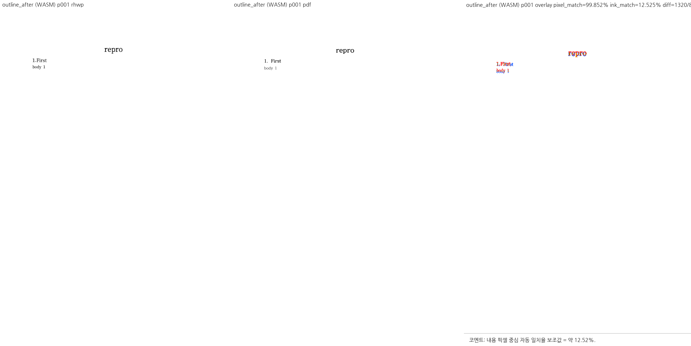
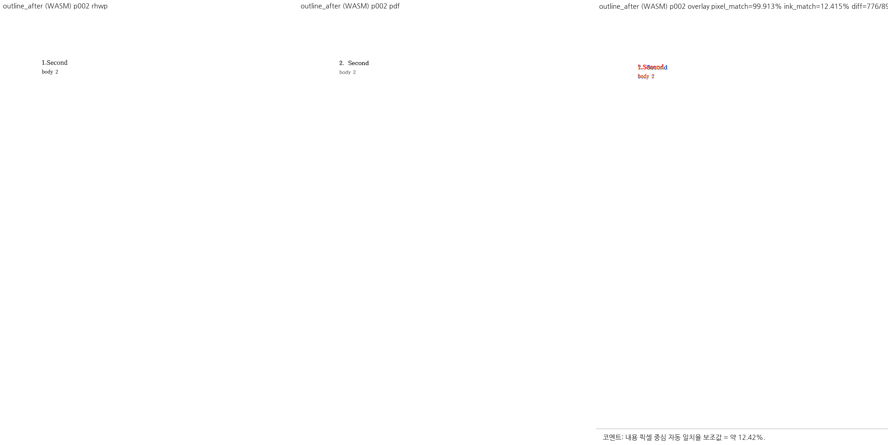
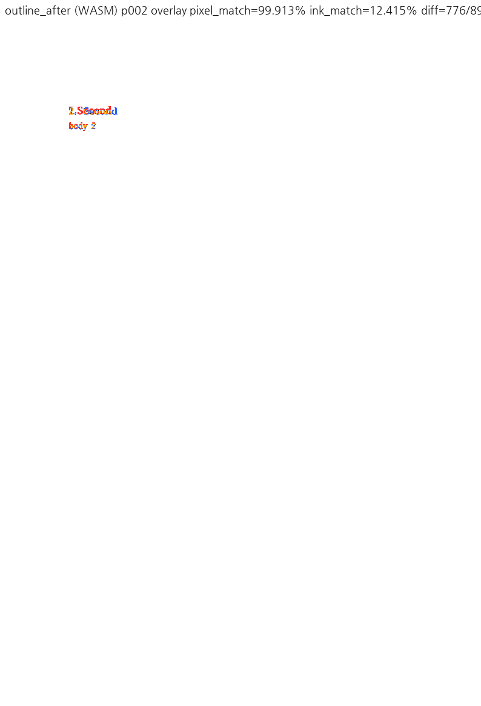

# PR #7230 검토

## 최종 판정

**승인 — 메인터너 보정으로 보류 사유 해소.** CLI/MCP의 문단 앞 명시적 쪽 나눔, 다른 비트·저장·재배치 계약을 보정하고 실제 CLI 및 한컴 PDF로 검증했다. 최종 검증은 아래 공통 실행 기록을 따른다.

로컬 통합 검토이며 GitHub APPROVE·remote push·통합 PR 생성·merge·issue close는 수행하지 않았다.

## Metadata·계보·CI

| 항목 | 확인값 |
| --- | --- |
| PR | [#7230: 수정: 문단 시작 쪽 나눔은 문단을 가르지 않는다 (#7218)](https://github.com/edwardkim/rhwp/pull/7230) |
| 작성자 / reviewer | planet6897 / jangster77 |
| base / state | devel / OPEN, non-draft |
| 규모 | 13 files, +295/-8, 1 commit |
| source head | `09fc9296080ed7eefc39791e06d6c2e207954201` |
| 적용 commit / 통합 code head | `368d6e4f8` / `4d38c9a7b29dd87edf9228d668f4cb83928f6e87` |
| 조회 상태 | MERGEABLE / CLEAN; merge 직전 재조회 필요 |

- [Build & Test](https://github.com/edwardkim/rhwp/actions/runs/35195797233/job/105122194167): **SUCCESS**.
- [Native Skia tests](https://github.com/edwardkim/rhwp/actions/runs/35195797233/job/105118711901): **SUCCESS**.
- [CodeQL](https://github.com/edwardkim/rhwp/runs/105119438148): **SUCCESS**.

SKIPPED/NEUTRAL은 해당 검사가 실행되어 통과했다는 의미로 세지 않는다. source CI는 통합 head의 CI가 아니다.

## 코드·독립 실행 심사

원 보류는 #7230의 CLI setter와 #7238의 편집 명령이 서로 다른 저장 계약을 적용한 문제였다. 실제 CLI 첫 문단은 성공 봉투를 반환하지만 저장 pageBreak=0이었고, 기존 helper는 다른 break 비트를 덮으며 synthesized를 해제하지 않았다.

메인터너 보정 `44397622a`는 CLI/MCP offset 0 → `mark_page_break_at_paragraph_start_native`에 **Page + raw OR 0x04 + synthesized=false + reflow/vpos/recompose**를 적용한다. 이미 같은 명시적 속성이 있을 때만 멱등 반환한다. Section/다단/단 비트를 유지하며 문단 수·텍스트·개요 모양은 보존한다. offset >0은 기존 `insert_page_break_native` 분할 명령을 쓴다. Studio Ctrl+Enter 및 별도 npm HwpCtrl 명령을 이 setter와 같은 것으로 취급하지 않는다.

실제 CLI 첫 문단 XML의 pageBreak=1/secPr 보존, HWPX/HWP5 저장·재열기, synthesized와 raw 축 1/2/8/3 보존, 반복 호출 및 중간 분할을 검사했다. 새 핵심 테스트 4개는 보정 전 4/4 FAIL, 보정 후 PASS. #7218 11개와 기존 관련 20개 focused가 통과했다.

```bash
rhwp edit insert-page-break samples/issue7218/outline_headings.hwpx \
  --section 0 --para 0 --offset 0 -o /tmp/section-start.hwpx --json
rhwp edit insert-page-break samples/issue7218/outline_headings.hwpx \
  --section 0 --para 3 --offset 0 -o /tmp/after.hwpx --json
```

두 번째 명령은 paragraphDelta=0, pageBreakParagraph=3이다. 실제 출력으로 기존 after HWPX를 갱신했다(`4d38c9a7b`). 변경은 section0.xml의 제목/뒤 문단 LineSeg이며 다른 ZIP member·문단 수·텍스트는 같다. 이 입력을 MCP engine 2020으로 재변환한 PDF는 기존 커밋 기준과 **2쪽 모두 144 DPI 래스터 byte 동일**했다. 기존 PDF를 그대로 재사용하고 다른 이름의 복제 입력을 추가하지 않았다. [실제 저장본 검증 기록](../pr_7238_review_impl.md#실제-저장본-재검증).

최종 Native/fresh WASM의 before/after 4쪽을 직접 비교했다. 빈 개요 항목이 사라지고 Second와 body 2가 보존된다. after p2의 rhwp `1.Second` 대 PDF `2. Second`와 번호 간격은 기존 renderer 차이다. 최종 갱신 입력을 같은 base binary로도 재캡처해 두 쪽의 화소가 최종 Native와 동일함을 확인했다. 저장 계약 보정을 rhwp 개요 번호 렌더링 해결로 확대하지 않는다. 원 보류 당시의 출력과 주장은 `da99c8757`에 남아 있다.

## 공통 조판 원칙 준수

렌더 영향 있음. Visual Sweep을 실행했고 합성 계약·독립 PDF·실제 제품 경계를 구분한다.

| 항목 | 판정 | 근거 |
| --- | --- | --- |
| 구현 근거와 일반성 | 충족 | 독립 PDF/COM 및 저장 사양, 문서별 숫자 조건 없음 |
| 측정·배치 일관성 | 충족 | paint geometry 보존 또는 setter reflow/vpos 공통 갱신 |
| 분할·이어받기 계약 | 충족 | 명시적 속성과 기존 사용자 분할 의미 구분; 표 조각 규칙 비해당 |
| 증거의 독립성과 범위 | 충족 | 원 face/한컴 PDF와 제품 테스트, 미실행 COM 경계 별도 표시 |
| 기준값 변경 | 충족 | 허용치 완화 없음, 실제 저장 fixture와 같은 독립 PDF 재확인 |
| 남은 문서 차이 | 별도 범위 | 표 높이/본문, 개요 번호 및 HwpCtrl 기존 경로를 해결로 주장하지 않음 |

[공통 최종 실행과 해시](pr_7212_review.md#통합-검토-공통-실행)를 따른다.

## Visual Sweep 직접 검토

DPI 96, Chrome webfont 경로. 모든 아래 선택쪽의 compare·standalone overlay·review를 직접 확인했다. 자동 후보는 reviewer 판정이 아니다. pixel/ink는 선택쪽 평균이며 백지 비율이 큰 문서의 높은 pixel 값은 정합성 근거가 아니다.

| key / 선택쪽 | rhwp/PDF 전체쪽 | 자동 후보 Native/WASM | base ink% | Native pixel% / ink% | WASM ink% |
| --- | --- | --- | --- | --- | --- |
| outline_before / 1,2 | 2/2 | 0/0 | 12.35890 | 99.87663 / 12.35890 | 12.35890 |
| outline_after / 1,2 | 2/2 | 0/0 | 12.47010 | 99.88246 / 12.47010 | 12.47010 |

fidelity의 outline before/after는 page-count 2/2다. 후보가 없더라도 PDF의 개요 번호와 실제 SVG 번호의 차이는 사람이 확인해 별도 기록했다.

### 입력 커밋 확인 — 충족

아래 실제 실행 파일 모두 최종 fixture head Git blob과 byte hash를 대조했다. 기존 원본/기준을 재사용했으며 별도 이름의 중복 입력은 추가하지 않았다. 신규 PR PDF는 한컴 변환 산출물을 그대로 사용했다. PDF format/Creator 버전 때문에 제외하거나 재변환하지 않았다.

| 경로 / 역할 | SHA-256 | 확인 commit |
| --- | --- | --- |
| [samples/issue7218/outline_headings_pagebreak_before_fix.hwpx](../../../samples/issue7218/outline_headings_pagebreak_before_fix.hwpx) / 입력 | `81b9aee85f6fb29bb1adc6597e7b4a305348adc340a79b6bf50eff544da30b94` | `4d38c9a7b` |
| [samples/issue7218/outline_headings_pagebreak_before_fix-2020.pdf](../../../samples/issue7218/outline_headings_pagebreak_before_fix-2020.pdf) / 한컴 기준 | `9f0ee8c5f43173e26c75cfa9980cdbcf1a3a5afa6b1bb25925d35b86da878f1f` | `4d38c9a7b` |
| [samples/issue7218/outline_headings_pagebreak_after_fix.hwpx](../../../samples/issue7218/outline_headings_pagebreak_after_fix.hwpx) / 입력 | `d846732082ca2fd5bc0472d4d5de966be6613e5f37eeec7d3c28ea88f4f752b6` | `4d38c9a7b` |
| [samples/issue7218/outline_headings_pagebreak_after_fix-2020.pdf](../../../samples/issue7218/outline_headings_pagebreak_after_fix-2020.pdf) / 한컴 기준 | `1c9e5b58b6000d50f48a6e90b406fcf0001f24d292065d34eeb7e1aa7f5da1f1` | `4d38c9a7b` |
| [samples/issue7218/outline_headings.hwpx](../../../samples/issue7218/outline_headings.hwpx) / CLI 원본 | `0e65077c16ae889497d03b77178bb8f1039358a7a609badbf99966b6b694e98a` | `4d38c9a7b` |

### 직접 확인한 PNG 증적

대표 그림을 접힌 영역 없이 아래에 표시한다. 나머지 standalone overlay·compare·review 경로와 SHA-256은 이어지는 표에 있다.








| PNG | SHA-256 |
| --- | --- |
| [outline_before_wasm_compare_001.png](../assets/pr7230_review/outline_before_wasm_compare_001.png) | `d6f7466d25252a744f752bc70f1a92df6808915fb71d46527677a3e04ca60285` |
| [outline_before_wasm_overlay_001.png](../assets/pr7230_review/outline_before_wasm_overlay_001.png) | `fe029e8709cbff315d08e50decf4ae5ccfd5f4352bd7676adcb53845e65916ea` |
| [outline_before_wasm_review_001.png](../assets/pr7230_review/outline_before_wasm_review_001.png) | `f10c5ce04dc12b492ac8435bbf2811c7b37ddd35ae076d7e95550dc2f83baebc` |
| [outline_before_native_overlay_001.png](../assets/pr7230_review/outline_before_native_overlay_001.png) | `eaf9ef65a02595f6f58dd390b9fc2bbc4782bc93c97b20b7e723a66e83ccc3fe` |
| [outline_before_base_overlay_001.png](../assets/pr7230_review/outline_before_base_overlay_001.png) | `eaf9ef65a02595f6f58dd390b9fc2bbc4782bc93c97b20b7e723a66e83ccc3fe` |
| [outline_before_wasm_compare_002.png](../assets/pr7230_review/outline_before_wasm_compare_002.png) | `af88b17b8a708bb9be7dca1738008b7d3c6ddd2a62b92f76c27542377e1e0f77` |
| [outline_before_wasm_overlay_002.png](../assets/pr7230_review/outline_before_wasm_overlay_002.png) | `8d18f74a76d5f15cac2ae1d278128eb46a10838a7971504054987d615b662d26` |
| [outline_before_wasm_review_002.png](../assets/pr7230_review/outline_before_wasm_review_002.png) | `3cdad296eec57bcb017c6313f5d13353517e75ddb3c1477755113a941f5b73a9` |
| [outline_before_native_overlay_002.png](../assets/pr7230_review/outline_before_native_overlay_002.png) | `58e7708ec499595f686b9a66845e7471f2f51987f02b397953c7c95d6e5bf889` |
| [outline_before_base_overlay_002.png](../assets/pr7230_review/outline_before_base_overlay_002.png) | `58e7708ec499595f686b9a66845e7471f2f51987f02b397953c7c95d6e5bf889` |
| [outline_after_wasm_compare_001.png](../assets/pr7230_review/outline_after_wasm_compare_001.png) | `1397f37f2b71d3089861a4029ceb9341039a75fb2105eb4ae9607b169894fcce` |
| [outline_after_wasm_overlay_001.png](../assets/pr7230_review/outline_after_wasm_overlay_001.png) | `703b142912cd22c31de83d15070a8b67a5a6e695fd9cb35f4305fa4377c79af1` |
| [outline_after_wasm_review_001.png](../assets/pr7230_review/outline_after_wasm_review_001.png) | `6fd50d97e11641af5799c3990f24c6107496c1a2e6590b75a7abe46380ffdc78` |
| [outline_after_native_overlay_001.png](../assets/pr7230_review/outline_after_native_overlay_001.png) | `34279ef53998bc925399be40f59c38aac84a24927e81f593757247034783d16f` |
| [outline_after_base_overlay_001.png](../assets/pr7230_review/outline_after_base_overlay_001.png) | `34279ef53998bc925399be40f59c38aac84a24927e81f593757247034783d16f` |
| [outline_after_wasm_compare_002.png](../assets/pr7230_review/outline_after_wasm_compare_002.png) | `8168d4903e547230eae4646715bd56a8a988d288407abcd3e8e73d992604e12d` |
| [outline_after_wasm_overlay_002.png](../assets/pr7230_review/outline_after_wasm_overlay_002.png) | `c59fde7f9bd2682d1994a11096f9e91389b96becd78fcf4bb119e857da2d402e` |
| [outline_after_wasm_review_002.png](../assets/pr7230_review/outline_after_wasm_review_002.png) | `8867a30c3a305edd97c56d936e93aef90ac412a912ed4ccb16292b8c8b6af6c5` |
| [outline_after_native_overlay_002.png](../assets/pr7230_review/outline_after_native_overlay_002.png) | `f0adf723a078e29a9f1820c1c36edd129625eea1207a0063d7953c6dd3474d52` |
| [outline_after_base_overlay_002.png](../assets/pr7230_review/outline_after_base_overlay_002.png) | `f0adf723a078e29a9f1820c1c36edd129625eea1207a0063d7953c6dd3474d52` |

## Merge 후 contributor PR comment 계획

최종 승인·CI·실제 merge가 완료된 뒤에만 게시한다. 한국어로 기여에 감사하고 실제 merge SHA·최종 head CI URL·수정 범위·실제 검증 범위·남은 차이를 설명한다. [Visual Sweep 정본](https://github.com/edwardkim/rhwp/blob/devel/mydocs/manual/verification/visual_sweep_guide.md#github-merge-comment)을 직접 연결한다.

- `https://raw.githubusercontent.com/edwardkim/rhwp/<merge-commit-sha>/mydocs/pr/assets/pr7230_review/outline_after_wasm_review_001.png`
- `https://raw.githubusercontent.com/edwardkim/rhwp/<merge-commit-sha>/mydocs/pr/assets/pr7230_review/outline_after_wasm_overlay_001.png`
- `https://raw.githubusercontent.com/edwardkim/rhwp/<merge-commit-sha>/mydocs/pr/assets/pr7230_review/outline_after_wasm_review_002.png`
- `https://raw.githubusercontent.com/edwardkim/rhwp/<merge-commit-sha>/mydocs/pr/assets/pr7230_review/outline_after_wasm_overlay_002.png`

CLI/MCP의 명시적 저장 속성 보정과 Studio 분할 동작 보존, COM 첫 문단 1건의 실제 검증 범위를 설명한다. 개요 번호 renderer 및 별도 HwpCtrl 경로의 기존 차이는 해결 완료로 쓰지 않는다.

페이지·후보 수·pixel/ink 지표와 사람의 판정을 함께 적는다. review 패널만으로 standalone overlay를 대체하지 않으며 모든 위 대표 쪽을 댓글 본문에 실제 이미지로 표시하고 `<details>` 밖에 둔다. PR과 관련 issue 댓글 모두 같은 해시 고정 경로를 사용한다. UTF-8 파일+`gh ... --body-file`로 게시한 뒤 API/렌더된 본문에서 한국어·실제 head·이미지 URL과 표시를 재확인한다. 해결하지 않은 issue를 일괄 close하지 않는다.
