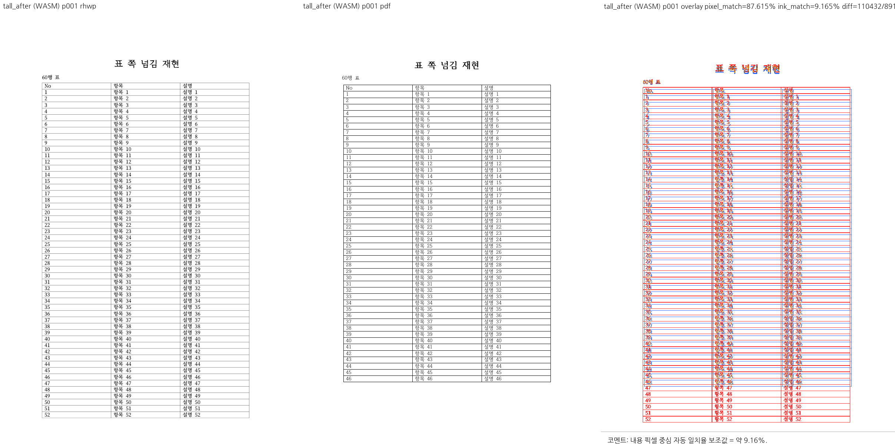
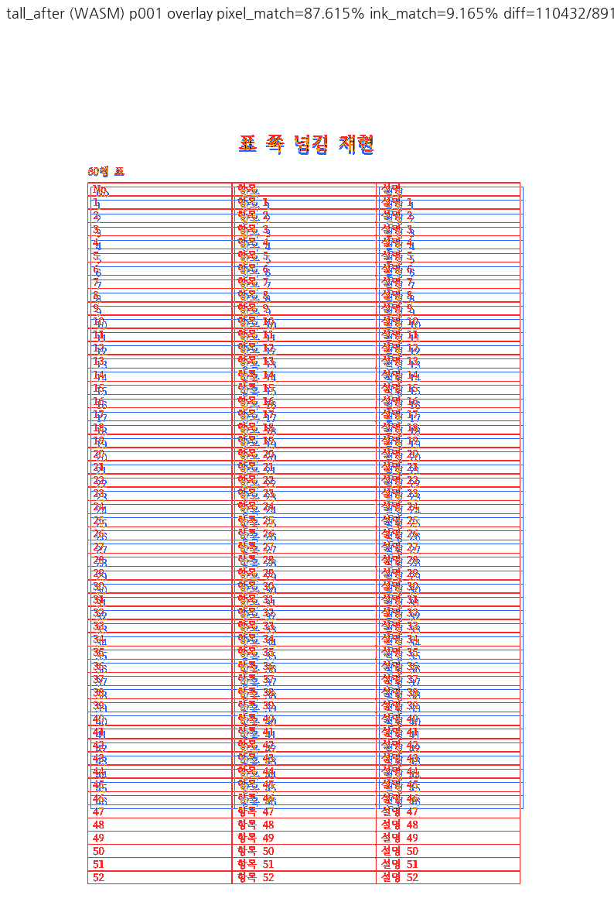
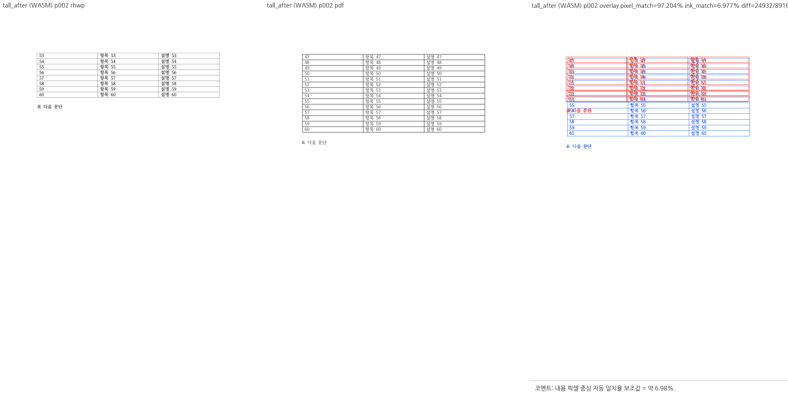
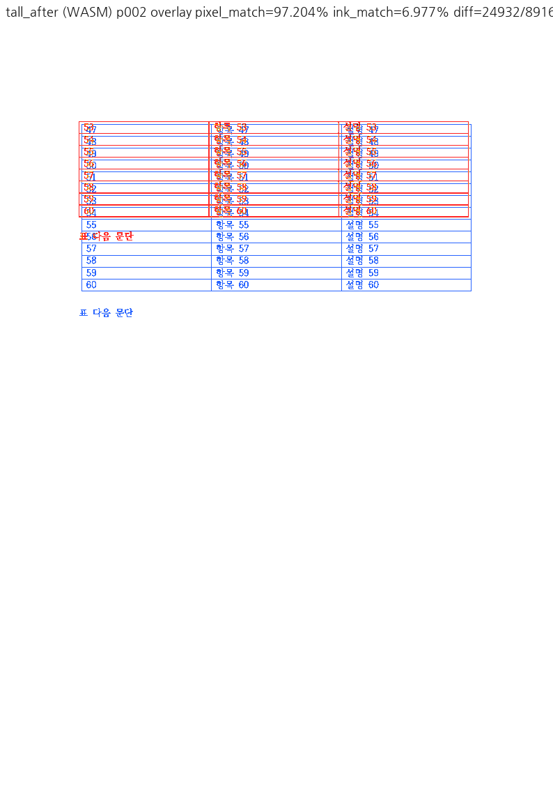
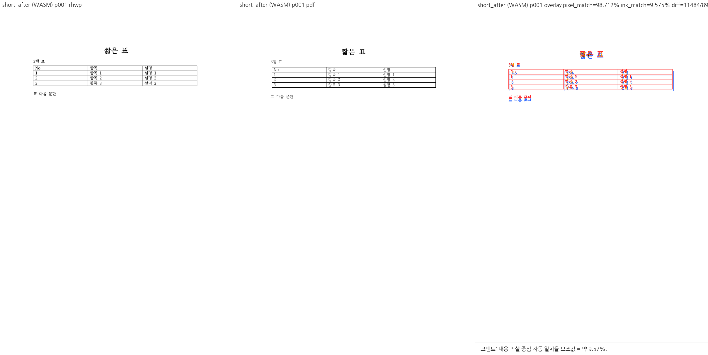
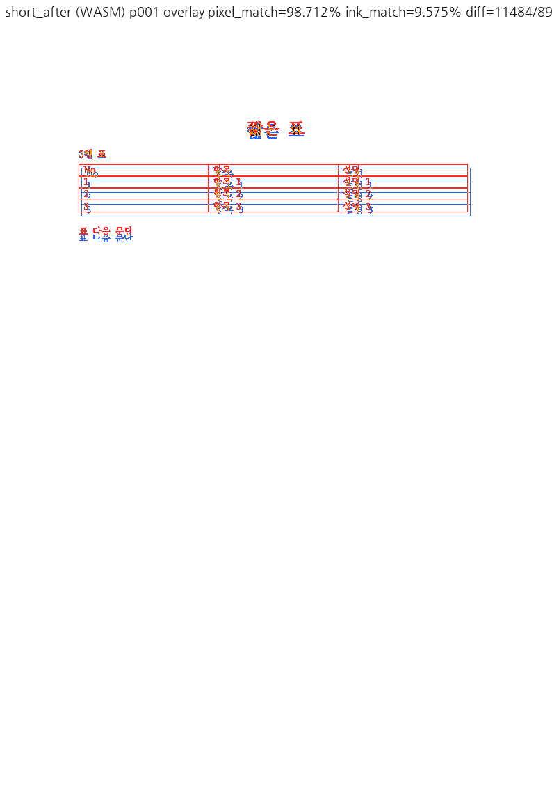

# PR #7233 검토

## 최종 판정

**승인** — scaffold 생성물의 CELL/1·IR/raw 일치, 한컴 PDF의 60행 보존, 짧은 표 무변화를 확인했다. 승인 범위는 생성·저장 계약이며 rhwp 전체 PDF 일치를 뜻하지 않는다. 다른 PR의 보류도 메인터너 보정과 공통 최종 검사로 해소했으며, 이 PR의 생성·저장 범위 승인을 유지한다.

이 판정은 로컬 cherry-pick 통합 검토이며 GitHub APPROVE 제출·remote push·PR 생성·merge·issue close는 수행하지 않았다.

## Metadata·계보·CI

| 항목 | 확인값 |
| --- | --- |
| PR | [#7233: 수정: scaffold 표를 쪽 경계에서 나누고 쪽나눔 표기를 한 값으로 맞춘다 (#7216)](https://github.com/edwardkim/rhwp/pull/7233) |
| 작성자 / reviewer | planet6897 / jangster77 |
| base / state | devel / OPEN, non-draft |
| 규모 | 13 files, +149/-3, 1 commit |
| source head | `4041972c2576e7d53494dc1fa27339a08f9de95a` |
| 적용 commit / 통합 code head | `e78d3a6cd` / `4d38c9a7b29dd87edf9228d668f4cb83928f6e87` |
| 조회 상태 | MERGEABLE / CLEAN; merge 직전 재조회 필요 |

- [Build & Test](https://github.com/edwardkim/rhwp/actions/runs/35198532771/job/105131317956): **SUCCESS**.
- [Native Skia tests](https://github.com/edwardkim/rhwp/actions/runs/35198532771/job/105127527160): **SUCCESS**.
- [CodeQL](https://github.com/edwardkim/rhwp/runs/105128314753): **SUCCESS**.

SKIPPED/NEUTRAL은 해당 검사가 실행되어 통과했다는 의미로 세지 않는다. source CI는 통합 head의 CI가 아니다.

## 코드·독립 실행 심사

`src/scaffold/builder.rs`의 표 생성 기본값을 `None/false`에서 `RowBreak/true`로 바꿔 기존 raw TABLE attr `0x06`과 맞춘다. 저장 표준의 비트/파서 매핑과 커밋된 한컴 출력이 독립 근거이며 새 엔진 높이 추측은 없다. 표 삽입·HTML import 경로는 이번 변경에 포함되지 않는다.

reviewer가 실제 CLI로 `samples/issue7216/{short,tall}_table.json`을 각각 scaffold했다. 결과는 `pageBreak=CELL`, `repeatHeader=1`, rowCnt=4/61이며 커밋된 after HWPX와 ZIP 내부 모든 member가 byte 동일했다. 따라서 sweep에는 기존 커밋 파일을 사용했다. IR/raw 일치·HWPX/HWP5 roundtrip·짧은 표 1쪽 focused 3개도 통과했다.

한컴 PDF를 직접 확인했다. tall before는 1쪽에 53행까지 있고 2쪽에는 후속 문단만 남아 54–60행이 없다. after는 1쪽 46행, 2쪽 47–60행과 후속 문단이 보존된다. short before/after의 96dpi PDF raster 차이는 `bbox=None`으로 화소 단위 동일하다.

**기준값 심사:** `body_overflow_baseline.tsv` 새 2행의 +91.1px는 base에서도 재현된다. 실제 render tree에서 본문 바닥=132.3+876.8=1009.1px, 첫 Table 조각 바닥=194.0+906.2=1100.2px다. before/after HWPX 각각의 base/통합본 SVG는 byte 동일하다. 기존 상한을 올린 것이 아니라 새 fixture에 원래 존재하던 rhwp 결함을 기록했다. 한컴처럼 정상이라고 인정하는 값이 아니며, overlay에 그대로 보존했다.

**남은 범위:** rhwp에서는 긴 표의 첫 조각과 이어받는 행 소속이 PDF와 다르고 글꼴·줄간격 차이도 있다. 이는 이번 scaffold 저장 속성 수정으로 해결되지 않는다. repeatHeader=1만으로 제목 셀을 지정하는 것은 아니므로 p2 제목 반복까지 구현했다고 하지 않는다. #7216의 세 수용 기준(한컴에서 모든 행 표시·형식 간 일치·짧은 표 유지)은 충족한다. 향후 merge 전에는 통합본 최신 CI를 확인하고, 별도 renderer 넘침을 해결한 것으로 close/comment하지 않는다.

## 공통 조판 원칙 준수

렌더 영향: **있음, Visual Sweep 필수**. 편집/생성 경로도 페이지 가시 출력과 fixture/PDF 주장을 포함하므로 적용한다.

| 항목 | 판정 | 근거 |
| --- | --- | --- |
| 구현 근거와 일반성 | 충족 | raw/IR/포맷 매핑 및 한컴 PDF, 샘플 조건 없음 |
| 측정·배치 일관성 | 비해당 | scaffold 속성만 변경, 엔진 측정·배치 분기 변경 없음 |
| 분할·이어받기 계약 | 충족 | 저장 속성으로 한컴 60행과 후속 문단 보존; rhwp 기존 넘침은 제외 |
| 줄 소속과 점유 높이 | 비해당 | 새로운 LineSeg 소속/높이 추측 없음 |
| 사례와 증거의 독립성 | 충족 | tall/short·HWPX/HWP5·한컴 PDF·CLI 교차 검증 |
| 기준값 변경 | 충족 | 새 2행 +91.1px를 base 동일 입력/geometry로 재실증 |
| 주장과 검증 범위 | 충족 | scaffold 수용 기준과 별도 renderer 결함 분리 |

[통합 검토 공통 실행·binary/WASM hash·명령·정확한 검증 범위](pr_7212_review.md#통합-검토-공통-실행)를 따른다.

## Visual Sweep 직접 검토

DPI 96, Chrome webfont 경로. 모든 아래 선택쪽의 compare·standalone overlay·review를 직접 확인했다. 자동 후보는 reviewer 판정이 아니다. pixel/ink는 선택쪽 평균이며 백지 비율이 큰 문서의 높은 pixel 값은 정합성 근거가 아니다.

| key / 선택쪽 | rhwp/PDF 전체쪽 | 자동 후보 Native/WASM | base ink% | Native pixel% / ink% | WASM ink% |
| --- | --- | --- | --- | --- | --- |
| tall_before / 1,2 | 2/2 | 0/0 | 8.63623 | 92.82390 / 8.63623 | 8.63623 |
| tall_after / 1,2 | 2/2 | 0/0 | 8.07094 | 92.40945 / 8.07094 | 8.07094 |
| short_before / 1 | 1/1 | 0/0 | 9.57480 | 98.71207 / 9.57480 | 9.57480 |
| short_after / 1 | 1/1 | 0/0 | 9.57480 | 98.71207 / 9.57480 | 9.57480 |

fidelity tall after p1→2 owner/sequence 후보 각 1개, visible excess 후보 1개, p1 table-footer 충돌을 확인했다. 실제 p1 표 바닥 +91.1px와 같은 기존 차이다. short PDF raster 전후 동일과 rhwp base/통합 동일은 각각 다른 비교다.

### 입력 커밋 확인 — 충족

아래 실제 실행 파일 모두 최종 fixture head Git blob과 byte hash를 대조했다. 기존 원본/기준을 재사용했으며 별도 이름의 중복 입력은 추가하지 않았다. 신규 PR PDF는 한컴 변환 산출물을 그대로 사용했다. PDF format/Creator 버전 때문에 제외하거나 재변환하지 않았다.

| 경로 / 역할 | SHA-256 | 확인 commit |
| --- | --- | --- |
| [samples/issue7216/tall_table_before.hwpx](../../../samples/issue7216/tall_table_before.hwpx) / 입력 | `82386dde2f8bc8b47a212fda9c623cf7094a6a1fb385be426e334f6990aa9df4` | `4d38c9a7b` |
| [samples/issue7216/tall_table_before-2020.pdf](../../../samples/issue7216/tall_table_before-2020.pdf) / 한컴 기준 | `cccae1ac14b0c61a302b273cd9ba1ecac53675ead2ec6dfa49b79c62bb86d8f6` | `4d38c9a7b` |
| [samples/issue7216/tall_table_after.hwpx](../../../samples/issue7216/tall_table_after.hwpx) / 입력 | `ba2ec290b1406476431c9be2421147d7c500f614138f94b5cde78a4158409f9f` | `4d38c9a7b` |
| [samples/issue7216/tall_table_after-2020.pdf](../../../samples/issue7216/tall_table_after-2020.pdf) / 한컴 기준 | `9610f80615236c298575c34db74819a4407e330be4322aef0c504fb8d1913ca7` | `4d38c9a7b` |
| [samples/issue7216/short_table_before.hwpx](../../../samples/issue7216/short_table_before.hwpx) / 입력 | `8a3f935463e5095ff28e8e939865ba1e505e492fe485fb8c67684a7613beb12b` | `4d38c9a7b` |
| [samples/issue7216/short_table_before-2020.pdf](../../../samples/issue7216/short_table_before-2020.pdf) / 한컴 기준 | `f179ddb745dc08589d6b16f3c54931477e96dfc2af00f217b1d19c412538edd1` | `4d38c9a7b` |
| [samples/issue7216/short_table_after.hwpx](../../../samples/issue7216/short_table_after.hwpx) / 입력 | `876bbe995ce2ee557fae43c873e1a3aa78208d966cda8ce69245826ff7e0864e` | `4d38c9a7b` |
| [samples/issue7216/short_table_after-2020.pdf](../../../samples/issue7216/short_table_after-2020.pdf) / 한컴 기준 | `b541fa0aafc2bd402ea68b2fcb78066219363dcb018f0f17d877fe314e03f29c` | `4d38c9a7b` |

### 직접 확인한 PNG 증적

대표 그림을 접힌 영역 없이 아래에 표시한다. 나머지 standalone overlay·compare·review 경로와 SHA-256은 이어지는 표에 있다.

| PNG | SHA-256 |
| --- | --- |
| [tall_before_wasm_compare_001.png](../assets/pr7233_review/tall_before_wasm_compare_001.png) | `3336b80fce837251b633c8de7e0ecbe15d0b17e571abaac287764298a4d3b87d` |
| [tall_before_wasm_overlay_001.png](../assets/pr7233_review/tall_before_wasm_overlay_001.png) | `5c49f745c7dbaef1fc6bd3ca7deb7f0b99c09b58ec4eb9bc863ebbb4bdc30fc8` |
| [tall_before_wasm_review_001.png](../assets/pr7233_review/tall_before_wasm_review_001.png) | `e7771172216c370a8e8c5c5d5ae755fb918b89bd805a2738f72109f36246a600` |
| [tall_before_native_overlay_001.png](../assets/pr7233_review/tall_before_native_overlay_001.png) | `168d79ce7bdf390e53f34d14c29d95b3645984c5698ae54f60f153cc057e14e3` |
| [tall_before_base_overlay_001.png](../assets/pr7233_review/tall_before_base_overlay_001.png) | `168d79ce7bdf390e53f34d14c29d95b3645984c5698ae54f60f153cc057e14e3` |
| [tall_before_wasm_compare_002.png](../assets/pr7233_review/tall_before_wasm_compare_002.png) | `59d0b8a171b8480e673a5dd9aae79bb30fbf828463d5819f553b4cb24b61bf1f` |
| [tall_before_wasm_overlay_002.png](../assets/pr7233_review/tall_before_wasm_overlay_002.png) | `026bdf8630b7c2be8c422f79bc4f06aa8957e7464d139601738cf62363a65337` |
| [tall_before_wasm_review_002.png](../assets/pr7233_review/tall_before_wasm_review_002.png) | `fce9693d651221fcebfc3f6766a4c725641c95ae2626d9fb4d2bb1e30facb614` |
| [tall_before_native_overlay_002.png](../assets/pr7233_review/tall_before_native_overlay_002.png) | `a57767c9d818cc7f6adffbd91fe1c22bf67cac007131b25073c4ddc08be1a533` |
| [tall_before_base_overlay_002.png](../assets/pr7233_review/tall_before_base_overlay_002.png) | `a57767c9d818cc7f6adffbd91fe1c22bf67cac007131b25073c4ddc08be1a533` |
| [tall_after_wasm_compare_001.png](../assets/pr7233_review/tall_after_wasm_compare_001.png) | `198e92dd7ee833f37d4778d2d810936f92b9e73983e116c3c2bb7131b997dc1b` |
| [tall_after_wasm_overlay_001.png](../assets/pr7233_review/tall_after_wasm_overlay_001.png) | `ea1a026117869c5ed4b124fae97c8c9b6f1397bc46ca5998499aa029d47922ef` |
| [tall_after_wasm_review_001.png](../assets/pr7233_review/tall_after_wasm_review_001.png) | `a4b67491cc0d33f6efdef22555b7616d1e60ccefe7f0987311b5e31dc9423252` |
| [tall_after_native_overlay_001.png](../assets/pr7233_review/tall_after_native_overlay_001.png) | `6bc5bc360a158a8e5283120eba2fd3685a5c33423fa4fd6e5774a34ce51bb05e` |
| [tall_after_base_overlay_001.png](../assets/pr7233_review/tall_after_base_overlay_001.png) | `6bc5bc360a158a8e5283120eba2fd3685a5c33423fa4fd6e5774a34ce51bb05e` |
| [tall_after_wasm_compare_002.png](../assets/pr7233_review/tall_after_wasm_compare_002.png) | `bf03a208f1b27b5061bcdfa25452c8c05f65e9d7a0d449edad515a19991a3958` |
| [tall_after_wasm_overlay_002.png](../assets/pr7233_review/tall_after_wasm_overlay_002.png) | `be95f41b33ef2bea44d7a1fc5a56c28ed92c401856a918d4ce4d7939a03e7892` |
| [tall_after_wasm_review_002.png](../assets/pr7233_review/tall_after_wasm_review_002.png) | `f2afd95c7ba1642cd170cef9d06347a7e2bd72883d9aadb81ec9c259cae7b062` |
| [tall_after_native_overlay_002.png](../assets/pr7233_review/tall_after_native_overlay_002.png) | `65d0fbd048094daa2af213251e59a606429333c99ef4f77105038fa95a0d2a3a` |
| [tall_after_base_overlay_002.png](../assets/pr7233_review/tall_after_base_overlay_002.png) | `65d0fbd048094daa2af213251e59a606429333c99ef4f77105038fa95a0d2a3a` |
| [short_before_wasm_compare_001.png](../assets/pr7233_review/short_before_wasm_compare_001.png) | `589df1b1c53aa7fe2f8140d690ddb288d0365ed096991dede6cd60caa28c58d4` |
| [short_before_wasm_overlay_001.png](../assets/pr7233_review/short_before_wasm_overlay_001.png) | `106760fe38583162bdd1dddf0dca352cd84728690114380216dffffbf52b5813` |
| [short_before_wasm_review_001.png](../assets/pr7233_review/short_before_wasm_review_001.png) | `b3eb2cf1cdc6568b83900fb932d1095049a804ac22b82c140870b63554c2246d` |
| [short_before_native_overlay_001.png](../assets/pr7233_review/short_before_native_overlay_001.png) | `d2deefcb9ce79f5dc378de9a4893042f4ac23dbdc7262a6959abeaecbd1cb46f` |
| [short_before_base_overlay_001.png](../assets/pr7233_review/short_before_base_overlay_001.png) | `d2deefcb9ce79f5dc378de9a4893042f4ac23dbdc7262a6959abeaecbd1cb46f` |
| [short_after_wasm_compare_001.png](../assets/pr7233_review/short_after_wasm_compare_001.png) | `073482743651c9c376ec441f5b7c4b2e5a858bb5f2a3deabad3baa917a0574ba` |
| [short_after_wasm_overlay_001.png](../assets/pr7233_review/short_after_wasm_overlay_001.png) | `6952d68a67e88736fc4aafcdea7cef50a2d587563aca17de7f49a91bdf869aee` |
| [short_after_wasm_review_001.png](../assets/pr7233_review/short_after_wasm_review_001.png) | `45beac94c1eeb63781170deb2f0229641fce08ef273fef13ccae97d858e7fc48` |
| [short_after_native_overlay_001.png](../assets/pr7233_review/short_after_native_overlay_001.png) | `f07d30cef3af15918bcc2c15cbb88032fc81a5afca0b36eefdf76c27ed4fa028` |
| [short_after_base_overlay_001.png](../assets/pr7233_review/short_after_base_overlay_001.png) | `f07d30cef3af15918bcc2c15cbb88032fc81a5afca0b36eefdf76c27ed4fa028` |

## Merge 후 contributor PR comment 계획

최종 승인·CI·실제 merge가 완료된 뒤에만 게시한다. 한국어로 기여에 감사하고 실제 merge SHA·최종 head CI URL·수정 범위·실제 검증 범위·남은 차이를 설명한다. [Visual Sweep 정본](https://github.com/edwardkim/rhwp/blob/devel/mydocs/manual/verification/visual_sweep_guide.md#github-merge-comment)을 직접 연결한다.

- `https://raw.githubusercontent.com/edwardkim/rhwp/<merge-commit-sha>/mydocs/pr/assets/pr7233_review/tall_after_wasm_review_001.png`
- `https://raw.githubusercontent.com/edwardkim/rhwp/<merge-commit-sha>/mydocs/pr/assets/pr7233_review/tall_after_wasm_overlay_001.png`
- `https://raw.githubusercontent.com/edwardkim/rhwp/<merge-commit-sha>/mydocs/pr/assets/pr7233_review/tall_after_wasm_review_002.png`
- `https://raw.githubusercontent.com/edwardkim/rhwp/<merge-commit-sha>/mydocs/pr/assets/pr7233_review/tall_after_wasm_overlay_002.png`
- `https://raw.githubusercontent.com/edwardkim/rhwp/<merge-commit-sha>/mydocs/pr/assets/pr7233_review/short_after_wasm_review_001.png`
- `https://raw.githubusercontent.com/edwardkim/rhwp/<merge-commit-sha>/mydocs/pr/assets/pr7233_review/short_after_wasm_overlay_001.png`

페이지·후보 수·pixel/ink 지표와 사람의 판정을 함께 적는다. review 패널만으로 standalone overlay를 대체하지 않으며 모든 위 대표 쪽을 댓글 본문에 실제 이미지로 표시하고 `
` 밖에 둔다. PR과 관련 issue 댓글 모두 같은 해시 고정 경로를 사용한다. UTF-8 파일+`gh ... --body-file`로 게시한 뒤 API/렌더된 본문에서 한국어·실제 head·이미지 URL과 표시를 재확인한다. 해결하지 않은 issue를 일괄 close하지 않는다.
