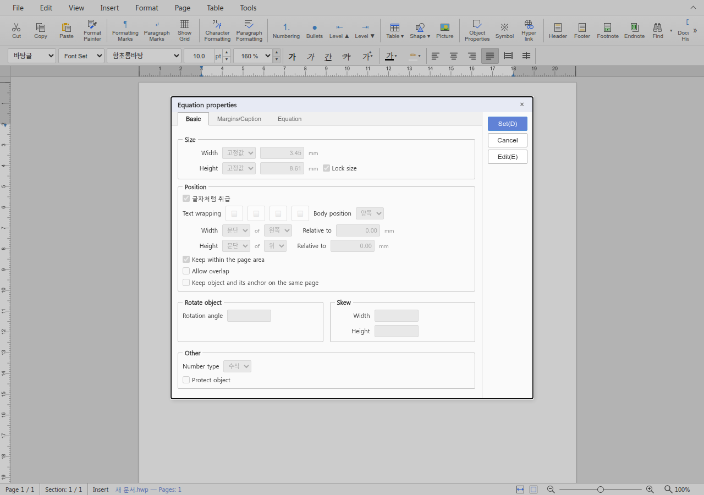
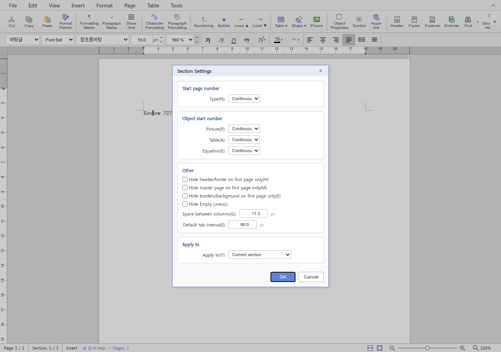

# PR #7278 검토: 대화상자 영어 표시 5단계

## 최종 판정

**승인**. 아래 P3 두 건은 비차단 표시 개선 의견이다. 문서에 저장되는 값이나 대화상자
동작을 바꾸는 회귀는 발견하지 않았다. 이는 로컬 review 판정이며 GitHub approve, push,
merge 결과를 뜻하지 않는다. 검토 후 작업지시자가 원 PR에 증적·review·오늘할일 push,
CI 확인 후 merge와 후속처리를 승인했다. 아래 결과는 검증 완료 시점 기준이며 merge는 아직 미완료다.

## 대상과 경로

| 항목 | 확인 내용 |
| --- | --- |
| PR | [#7278](https://github.com/edwardkim/rhwp/pull/7278) |
| 작성자 | rubidus-api. #7142, #7152, #7171, #7186/#7197에 이어지는 기존 기여자 |
| 관련 이슈 | [#5852](https://github.com/edwardkim/rhwp/issues/5852), UI 언어 분리의 부분 개선. 전체 close 대상 아님 |
| 원 PR head | `27f94eda440ac17f56e4524c827fdea5f58af77d` |
| 기준 devel | `18f029ffac83afde3289041de2c31651a62ae21c` |
| 로컬 검토 branch | `review/rubidus-pr7278-20260919` |
| 적용/검증 code SHA | `7ea7da22273ebe0ef4a0b4b62eccdd10f58a4950` |
| merge simulation tree | `5b4cbabcf66a326872e7d86d68e99a0b761becbf`, 충돌 없음, 로컬 code tree와 동일 |
| 변경량 | 1 commit, 23 files, +400/-112. UI 21개, 카탈로그 2개 |
| 접수 상태 | 2026-09-19 확인: OPEN, non-draft, base devel, MERGEABLE/CLEAN. merge 직전 재확인 필요 |
| reviewer | jangster77 지정 확인. `gh pr edit`의 구형 Projects API 오류 후 REST API로 지정 |
| 코멘트 | 접수 시 PR 일반 댓글, review, inline review 댓글 모두 없음 |

- base route: `collaborator_external_pr.md`의 기본 작업공간 체리픽 검토.
- modifiers: `intake_and_review.md`, `local_validation.md`.
- loaded documents: `pr_review_workflow.md`, `pr_review/README.md`, 위 세 문서,
  `dev_environment_guide.md`, `codex/docs_and_git_workflow.md`.
- 기본 작업공간 devel 동기화 뒤 원 PR commit 하나만 충돌 없이 적용했다. 제품 코드 보정은 없다.
  contributor history는 변경하지 않았다. 이후 사용자 승인에 따라 원 contributor head 위에 기록만
  이어 붙인다. 별도 통합 PR을 만들지 않는다.

### 승인 후 원 PR 반영 준비

- 로컬 검토 기록만 원 head `27f94eda` 위로 replay하여 `3fefd0b61`을 만들었다.
  contributor commit은 다시 쓰지 않았다.
- 원 head에는 `mydocs/orders/20260919.md`가 없어 실제 merge simulation에서 add/add 충돌이
  발생했다. `bdb57f836`에서 current base `18f029ffa`를 한 번 병합하고 오늘할일만 충돌 해소했다.
  기존 devel 기록을 삭제·수정하지 않고 이번 PR 항목을 앞에 추가했다.
- 이는 `review_only_fast_pass.md`의 mydocs 한정 current-base bridge 예외다. 제품 경로는
  검증 code SHA `7ea7da222`와 `git diff --quiet ... -- . ':(exclude)mydocs'`로 동일함을 확인했다.
  fast-pass 성공은 push 후 preflight에서 별도로 확인하며 미리 단정하지 않는다.

## 발견 사항

### P3: 수식 속성의 방향 라벨이 크기로 번역됨

- `rhwp-studio/src/i18n/locales/en.ts:708,720`의 `가로/세로`가 `Width/Height`다.
- `equation-props-dialog.ts:228,229,242,243`에서는 실제 크기가 아니라 Position의
  수평/수직 위치 및 Skew의 방향을 설명한다. 별도 Size의 너비/높이와 의미가 섞인다.
- fresh WASM으로 새 문서에 `a over b`를 삽입하고 실제 EquationPropertiesDialog를 열어 확인했다.
  `Horizontal/Vertical`로 번역하는 것을 권고한다. 현재 해당 컨트롤은 비활성이며 저장 값은
  변경되지 않으므로 이번 부분 번역 PR의 merge blocker로 분류하지 않았다.

### P3: 구역 설정 번호 옵션의 선택 표시가 잘림

- `rhwp-studio/src/ui/section-settings-dialog.ts:332,364`에 추가된 `Continuous`는
  기존 80px select에 들어가 1280x900 Chromium 화면에서 끝 글자가 잘렸다.
- 한국어 `이어서`는 같은 컨트롤에서 정상 표시됐다. 옵션의 내부 값 `continue`와 나머지
  `odd/even/custom`은 한·영에서 동일했다. 컨트롤 너비 또는 표시 문구 길이를 조정하면 된다.
- 선택 기능 상실은 없으므로 비차단으로 분류했다.

## 코드 및 범위 판단

- 카탈로그는 한·영 각각 1,549→1,693키(+144)이고, 기존 모든 키의 값은 그대로였다.
  두 언어의 키 집합과 placeholder 집합도 일치했다.
- Babel TypeScript AST로 UI 21개 파일의 `t/i18nText` 호출을 한국어 원문으로 복원하고
  위치/주석을 제외한 AST를 변경 전과 비교했다. 21개 모두 같았다. 스타일 정보의 `{p1}`
  템플릿도 기존 표현식과 비교했다. 내부 ID, 값, 비교식, 이벤트 처리의 변경은 없었다.
- 한글 번호 견본 `가,나,다`, `일,이,삼`과 위/아래첨자 견본 `가`는 영어에서도 보존됐다.
- 격자의 세부 옵션, 문단 종류/수직 정렬, 수식의 비활성 옵션 등 한국어 잔존은 기존 상태다.
  이 PR은 전체 영어화를 완료하는 변경이 아니다. 이 잔존을 새 회귀로 보고하지 않았다.
- 미주 `Thickness`의 작은 overflow, 글자 모양 확장 패널의 9px overflow 후보는 기존 번역/폭
  경로이며 이번 변경에서 생긴 blocker로 판단하지 않았다. 실제 캡처도 확인했다.

## 검증 결과

아래 로컬 검증은 모두 code SHA `7ea7da22273ebe0ef4a0b4b62eccdd10f58a4950`에서 수행했다.
뒤에 추가한 review/오늘할일/PNG는 제품 소스를 변경하지 않는다.

| 명령/검사 | 결과 |
| --- | --- |
| `git merge-tree --write-tree upstream/devel upstream/pr7278-head` | exit 0, 위 tree 생성; 로컬 tree와 동일 |
| `git diff --check upstream/devel...HEAD` | 통과 |
| `cd rhwp-studio && npx tsc --noEmit` | exit 0 |
| `cd rhwp-studio && npx tsc --project tsconfig.ci-unit.json --noEmit` | exit 0 |
| `npm --prefix rhwp-studio test` | 1,760 PASS, 2 skipped, 0 fail, 약 17.6초 |
| `CARGO_TARGET_DIR=target/pr-review scripts/wasm-pack-locked.sh --target web --out-dir pkg --dev` | fresh dev WASM 성공, 약 2분 3초. 최적화 release build는 아님 |
| `npm --prefix rhwp-studio run build` | exit 0, PWA/plugin timing 경고는 실패 아님 |
| `cd rhwp-studio && VITE_URL=http://127.0.0.1:7728 node e2e/dialog-theme.test.mjs --mode=headless` | 43 PASS, exit 0 |
| `cd rhwp-studio && VITE_URL=http://127.0.0.1:7728 node e2e/undo-contracts.test.mjs --mode=headless` | 24 PASS, exit 0. 수식/그림/표 속성 undo, Through 보존 포함 |
| 카탈로그/AST 임시 audit | 21개 파일 및 기존 값/placeholder 무변경 확인 |
| Chromium 한·영 대화상자 확인 | 구역/격자/미주/문단 확장/글자 확장 5종 x 2언어. 표시 컨트롤 값·옵션 ID 일치 |
| 수식 속성 직접 확인 | 새 문서에 수식 삽입 성공, 영어 Position/Skew 라벨 확인 |

초기 브라우저 smoke 두 번은 빈 문서에서 글자 모양 명령에 필요한 선택 범위를 만들지 않아
timeout으로 끝났다. 텍스트 입력·선택을 준비한 마지막 run이 전 범위를 완료했다.
초기 실패를 성공 검사로 합산하지 않았다.

원 head의 [CI 35443723846](https://github.com/edwardkim/rhwp/actions/runs/35443723846)는
`headSha=27f94eda440ac17f56e4524c827fdea5f58af77d`로 성공했다. Frontend package gates,
Build & Test가 성공했고 Rust lint/회귀/Native Skia는 Studio 범위에 따라 skipped였다.
[CodeQL](https://github.com/edwardkim/rhwp/actions/runs/35443723848),
[Render Diff](https://github.com/edwardkim/rhwp/actions/runs/35443723764),
[Adapter](https://github.com/edwardkim/rhwp/actions/runs/35443723860),
[Proptest](https://github.com/edwardkim/rhwp/actions/runs/35443723888)도 성공했다.
CodeQL 집계의 NEUTRAL을 실패로 해석하지 않았다. 원 head CI를 별도 로컬 통합 SHA의 CI라고
표시하지 않으며, Rust 전체 회귀는 제품 Rust 변경이 없어 실행하지 않았다.

## 조판 원칙과 입력 보존

- 조판 원칙: **비해당**. 문서 renderer/layout/paint, 저장 조판, baseline/golden 변경이 없다.
  번호 형식 견본/내부 값이 그대로인 점은 위 AST 및 브라우저 검사로 확인했다.
- 문서 Visual Sweep: **비해당**. 문서 페이지의 한컴 fidelity 개선을 주장하지 않으며
  UI 대화상자 캡처로 표시 품질을 확인했다. pixel_match 등을 문서 일치 지표로 만들지 않았다.
- 검증 입력 커밋 확인: **비해당**. 별도 HWP/HWPX/PDF 파일을 읽지 않았다. E2E와 직접 smoke는
  런타임에 새 문서·텍스트·표·그림·수식을 만들었다. 파일로 저장한 미커밋 입력은 없다.
- WASM SHA-256: `30a9994893fe0130fd7f826893cccd70502082fadc2d744c85f8b51796cb62ba`.
- 최종 코멘트용 PNG만 보존한다. 로그, audit/browser 임시 스크립트, JSON, 나머지 캡처와
  E2E HTML은 커밋하지 않는다.

| 대표 PNG | SHA-256 |
| --- | --- |
| `mydocs/pr/assets/pr_7278_en_section.png` | `77dcc426fceb602aa30453bcccccae2d2ebf9603bad8a02ab4a4a9eba3301840` |
| `mydocs/pr/assets/pr_7278_en_equation.png` | `43d9c5b69729e62c8f9287d613167575d675712f406b5794b925ba3aa3c5900c` |

## Merge 후 contributor PR comment 계획

아직 게시하지 않았다. 후속처리 승인을 받았으며 최종 merge/asset 반영을 확인한 뒤 다음 내용을 한국어로
`--body-file`로 게시하고 API에서 본문·이미지 표시를 재확인한다.

- 단계적 영어 표시 기여에 감사하고, 표시/기계 값 분리와 실제 로컬 검증 결과를 설명한다.
- 위 P3 두 건은 비차단 후속 개선임을 구분한다. #5852 전체가 해결됐다고 쓰거나 close하지 않는다.
- 위 두 PNG를 다음 고정 raw URL의 Markdown 이미지로 포함한다.
  `https://raw.githubusercontent.com/edwardkim/rhwp/<merge-commit-sha>/mydocs/pr/assets/pr_7278_en_section.png`
  및 `pr_7278_en_equation.png`(같은 경로 prefix).
- [시각 증적 코멘트 정본](../../manual/verification/visual_sweep_guide.md#github-merge-comment)을 참고하되,
  이 자료는 문서 Visual Sweep이 아닌 UI 캡처임을 명시한다. 없는 flagged/pixel 지표를 인용하지 않는다.
- merge 전에는 원 head 변경 여부, 최신 required checks, mergeability와 작업지시자 승인을 다시 확인한다.
