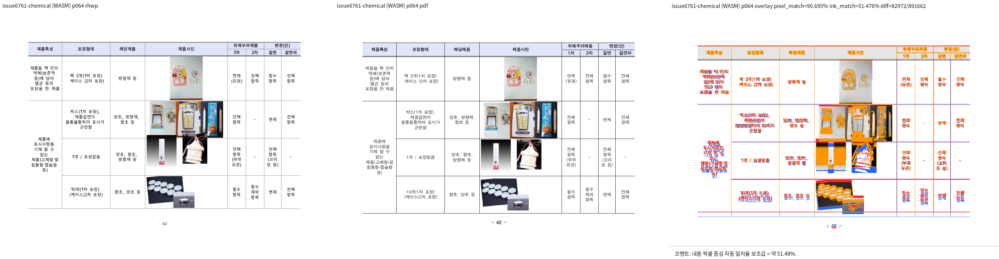

# PR #7339 검토: 같은 문단의 가로 비중첩 개체 높이 측정

## 최종 판정

**메인터너 보정 후 수용 가능**. 원 head `ed3799fe`의 의도는 타당하지만, 가로 좌표만으로
밴드를 판정하면 서로 다른 정렬값이 같은 실제 위치를 가리키는 셀을 비중첩으로 오판할 수 있다.
통합 head `a3f61dc`의 제한된 보정은 유효 안쪽 폭, 패딩, 수평 정렬과 margin까지 반영한다.
이는 GitHub approve나 merge 승인이 아니다.

## 대상과 적용 범위

| 항목 | 내용 |
| --- | --- |
| PR / 작성자 | [#7339](https://github.com/edwardkim/rhwp/pull/7339), planet6897 |
| 원 PR head | `ed3799fe2b00b9cb751e43f597c3e4f9fccbddf1` |
| 기준 devel | `7a95e46e025470a4d7a7b59ad68ec02958bda738` |
| 통합 검토 head | `a3f61dc5fe2a0b13b74239505f7d753164490c25` |
| 보정 | `a3f61dc`의 `height_measurer.rs`: 실제 가로 배치를 비교하고 동일 위치 정렬 계약을 회귀 테스트로 고정 |
| 원격 상태 확인 | 2026-09-23: non-draft, `devel` 대상, `MERGEABLE`; 원 head의 필수 CI는 녹색이며 CodeQL `NEUTRAL`은 실패가 아님 |

## 검증과 시각 증적

- 통합 head에서 focused `regression_suite_008/016/017` 653건, 전체 nextest 10,156건,
  fmt, `git diff --check`, native/wasm Clippy, workspace build, workspace all-target Clippy와
  Native Skia 필수 3개 경로를 통과했다. Docker 표준 WASM은 Docker와 `.env.docker` 부재로
  실행하지 못했고, `wasm-pack-locked.sh --no-opt` fresh WASM은 성공했다.
- 저장소 입력 `samples/issue6782/1480000-201900042-chemical-product-labeling-study.hwp`
  (`398d03a5d5e4d6e857086be532d6d9ed0cec9c8ad06f95c17bbb7f83056ae860`)와 Hancom 2020
  기준 `pdf/1480000-201900042-chemical-product-labeling-study-2020.pdf`
  (`f8e5c0408e221080ede9a9a67b153d02d792d22961c738e46749641f32a32e79`)를 사용했다.
- fresh WASM Visual Sweep 페이지 39, 40, 64, 65, 83은 모두 완료되고 구조 후보는 0건이었다.
  전체 pixel match 평균 88.31921%, 대표 64쪽은 90.69468%, visual accuracy proxy는
  raster/글꼴 차이를 포함하는 비교 지표이므로 단독 통과 기준으로 쓰지 않았다. 표 구조와 개체 배치에는
  새 겹침·프레임 넘침·line-order 후보가 없음을 사람이 확인했다.

## Merge 후 contributor PR comment 계획

아직 원격 코멘트는 게시하지 않았다. 통합 PR이 merge되어 asset이 `devel`에 존재한 뒤에만
[Visual Sweep merge comment 정본](../../manual/verification/visual_sweep_guide.md#github-merge-comment)에 따라
`--body-file`로 게시하고 API 재조회한다. 64쪽, 후보 0건, 위 수치와 글꼴/ink 지표의 한계를 적고 아래처럼
merge SHA 고정 이미지를 표시한다.

`https://raw.githubusercontent.com/edwardkim/rhwp/<merge-commit-sha>/mydocs/pr/assets/pr_7339_issue6761_p64_review.png`
