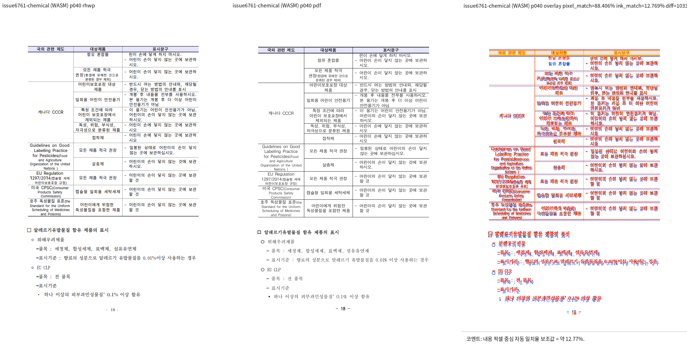

# PR #7340 검토: 저장 사다리 첫 줄 뒤 분할의 rewind 확정

## 최종 판정

**메인터너 보정 후 수용 가능**. 원 head `6e6a0b48`은 later candidate가 확정한 rewind를
앞선 candidate에도 허용할 수 있었다. 통합 head `a3f61dc`은 rewind 길이와 확정 길이를 함께 반환해
현재 cut과 일치할 때만 허용한다. 이 판정은 원 PR 직접 merge 승인이 아니다.

## 대상과 적용 범위

| 항목 | 내용 |
| --- | --- |
| PR / 작성자 | [#7340](https://github.com/edwardkim/rhwp/pull/7340), planet6897 |
| 원 PR head | `6e6a0b48ca0ad2c5b50263e7aef653ed7423fd4f` |
| 기준 devel / 통합 head | `7a95e46e025470a4d7a7b59ad68ec02958bda738` / `a3f61dc5fe2a0b13b74239505f7d753164490c25` |
| 보정 | `a3f61dc`의 `row_step.rs`: later confirmation이 earlier cut을 허가하지 않는 회귀 계약 추가 |
| 원격 상태 확인 | 2026-09-23: non-draft, `devel` 대상, `MERGEABLE`; 원 head 필수 CI 녹색, CodeQL `NEUTRAL`은 실패가 아님 |

## 검증과 시각 증적

- 통합 검증은 #7339 검토에 기록한 focused 653건, 전체 nextest 10,156건, fmt, Clippy, build,
  Native Skia 및 fresh no-opt WASM을 같은 통합 head에서 통과했다.
- `samples/issue6782/1480000-201900042-chemical-product-labeling-study.hwp`와 Hancom 2020 기준 PDF를
  사용해 fresh WASM으로 39·40쪽을 직접 대조했다. 전체 5쪽(39, 40, 64, 65, 83) 구조 후보는 0건,
  40쪽 pixel match는 88.40648%, visual accuracy proxy는 12.76887%였다. 후자는 글꼴/ink 차이까지
  포함하므로 결론은 표 분할 경계와 뒤 내용의 순서가 보존됐다는 사람의 검토에 둔다.

## Merge 후 contributor PR comment 계획

merge 완료와 asset의 `devel` 반영 뒤에만 Visual Sweep 정본 링크, 39·40쪽, 구조 후보 0건,
수치 한계와 다음 merge-SHA 고정 이미지를 포함해 게시하고 API 재조회한다.

`https://raw.githubusercontent.com/edwardkim/rhwp/<merge-commit-sha>/mydocs/pr/assets/pr_7340_issue6761_p40_review.png`
