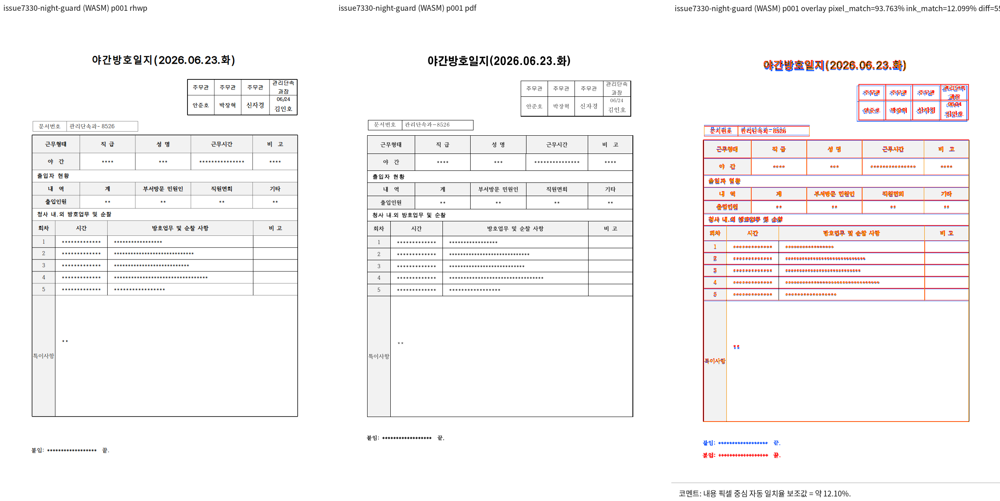

# PR #7341 검토: 공백 단일 host 줄의 표 뒤 본문 처리

## 최종 판정

**승인**. 최신 원 head `c933e145`의 좁힌 조건은 첫 표가 아닌 경우와 이미 배치된 줄에만 적용되어
기존 TAC 분기와 #6925 경계를 넓히지 않는다. 통합 보정은 이 PR의 source 경로를 변경하지 않았다.

## 대상과 검증

| 항목 | 내용 |
| --- | --- |
| PR / 작성자 | [#7341](https://github.com/edwardkim/rhwp/pull/7341), planet6897 |
| 원 PR head / 통합 head | `c933e14507b9a28e961d7ae1e246e3d47160753e` / `a3f61dc5fe2a0b13b74239505f7d753164490c25` |
| 원격 상태 확인 | 2026-09-23: non-draft, `devel` 대상, `MERGEABLE`; review-only 성격의 skip은 정책 결과이고 실패가 아님 |
| 통합 로컬 검증 | focused 653건, 전체 nextest 10,156건, fmt, Clippy, build, Native Skia와 fresh WASM 성공 |

- `samples/issue4599/36374873_night_guard_log.hwpx`
  (`932152d5f97ef07dcf5f5a4890b123cf31b7073ac80dafadacfa4edb1e01dc86`)와 기존 Hancom 2020 기준
  `pdf/36374873_night_guard_log-2020.pdf`
  (`3af3cb24be68b9058b64156eb7ae52b88bc1553fc258b557a1b6c2273b5f1c5d`)를 사용했다.
- fresh WASM으로 1쪽을 완주했고 구조 후보는 0건, pixel match 93.76344%, visual accuracy proxy
  12.09870%였다. 사람 검토에서 표 뒤 본문, 표 외곽, 페이지 하단에 새 겹침·넘침은 없었다.

## Merge 후 contributor PR comment 계획

merge 후 asset 반영을 확인한 다음 Visual Sweep 정본 링크, 1쪽·후보 0건·수치 한계를 적고 아래 raw URL을
표시한다. 게시 전에는 원격 코멘트를 만들지 않는다.

`https://raw.githubusercontent.com/edwardkim/rhwp/<merge-commit-sha>/mydocs/pr/assets/pr_7341_issue7330_p1_review.png`
