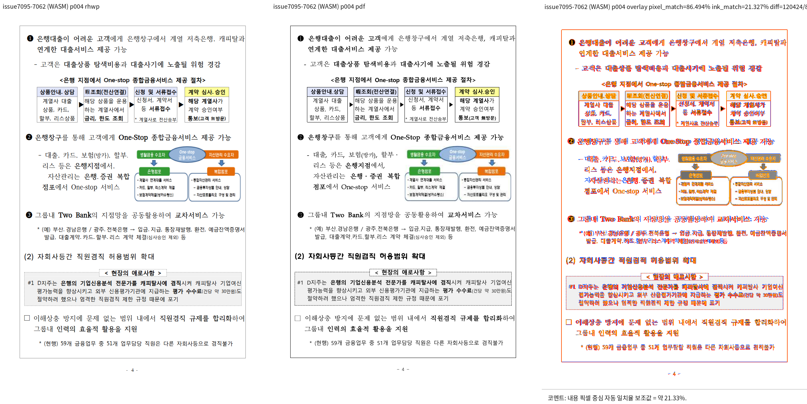
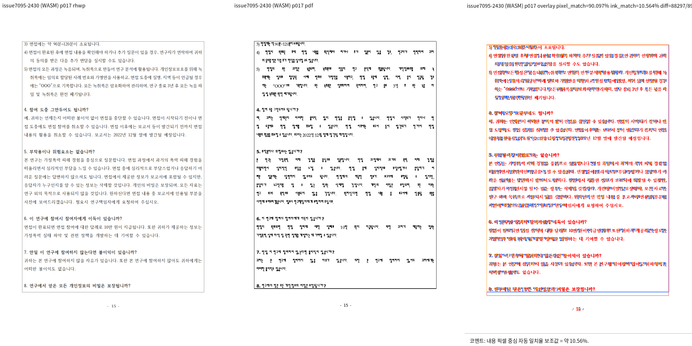

# PR #7342 검토: 쪽 고정 표 조각의 셀 vertical alignment

## 최종 판정

**승인**. 통합 head에서 두 실제 HWP와 기준 PDF를 직접 대조했다. 7062 표본 4쪽의
`endnote_separator_gap_drift`는 기준 `upstream/devel`에서도 `-154.6px`, 통합 head에서 `-154.5px`로
동일하여 이 PR의 valign 변경이 도입한 회귀가 아니다.

## 대상과 검증

| 항목 | 내용 |
| --- | --- |
| PR / 작성자 | [#7342](https://github.com/edwardkim/rhwp/pull/7342), planet6897 |
| 원 PR head / 통합 head | `cd0fbd0d384091cc9b74c4b6aff5770bfa51d400` / `a3f61dc5fe2a0b13b74239505f7d753164490c25` |
| 원격 상태 확인 | 2026-09-23: non-draft, `devel` 대상, `MERGEABLE`; 필수 CI 녹색, CodeQL `NEUTRAL`은 실패가 아님 |
| 통합 로컬 검증 | focused 653건, 전체 nextest 10,156건, fmt, Clippy, build, Native Skia와 fresh WASM 성공 |

- `samples/issue7062/tac_object_host_line_height.hwp`
  (`2cf764c89943a23eff17fb8ac5ccaa1958711216b15d5eb29a9a469b97d23abb`)와
  `pdf/tac_object_host_line_height-2020.pdf`
  (`f90ea6915a842ac2266f4dd737b2829bbb3b72b927b1658577f6ca8c8b9b6051`)의 2, 3, 4, 7, 10쪽을 확인했다.
  평균 pixel match 85.10323%, 구조 경고는 위 기존 미주 gap 1건뿐이고 frame overflow, line-order,
  text overlap 후보는 0건이었다.
- `samples/task2430/1382000_domestic_violence_survey.hwp`
  (`a3c6a227d26c41c7de9aa258f470001a629da90fa606cdddcbd385add43b7381`)와
  `pdf/issue2430/1382000_domestic_violence_survey-2020-print.pdf`
  (`5f92d3282c0772cd8fbe72e0fadfa49e2cde8ee7d788b6fbafe51bbd4e59e024`)의 17·27쪽도 완료했고,
  후보 0건, 평균 pixel match 90.51720%였다. 낮은 ink proxy는 글꼴/ink raster 차이를 포함하므로
  표 조각 위치, 다음 내용 및 프레임을 사람이 함께 확인했다.

## Merge 후 contributor PR comment 계획

merge 후 두 asset이 `devel`에 있음을 확인한 뒤 Visual Sweep 정본 링크, 각 표본의 페이지·후보·수치와
기존 4쪽 gap 비교를 포함해 게시한다. 아래 URL의 `<merge-commit-sha>`를 실제 merge SHA로 치환하고
`--body-file` 게시 뒤 API 재조회한다.

- `https://raw.githubusercontent.com/edwardkim/rhwp/<merge-commit-sha>/mydocs/pr/assets/pr_7342_issue7095_7062_p4_review.png`
- `https://raw.githubusercontent.com/edwardkim/rhwp/<merge-commit-sha>/mydocs/pr/assets/pr_7342_issue7095_2430_p17_review.png`
