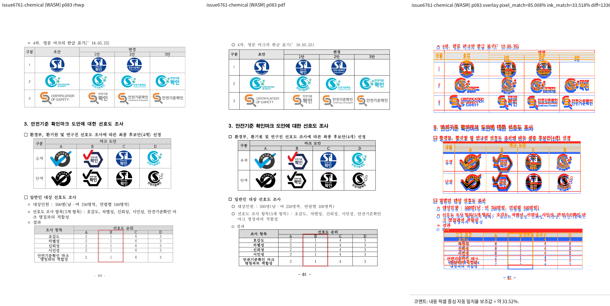

# PR #7343 검토: 자리차지 표 band 뒤 문단 앞 간격

## 최종 판정

**승인**. 자리차지 표 band 안에서 앞 간격을 소비하는 변경은 뒤 문단을 이중으로 밀지 않으며,
통합 head의 실제 HWP visual sweep에서 표, 개체, 뒤 문단의 순서에 새 구조 후보가 없었다.

## 대상과 검증

| 항목 | 내용 |
| --- | --- |
| PR / 작성자 | [#7343](https://github.com/edwardkim/rhwp/pull/7343), planet6897 |
| 원 PR head / 통합 head | `230477deb9a1113612be82684f04b8ba9ef3950e` / `a3f61dc5fe2a0b13b74239505f7d753164490c25` |
| 원격 상태 확인 | 2026-09-23: non-draft, `devel` 대상, `MERGEABLE`; 원 head 필수 CI 녹색, CodeQL `NEUTRAL`은 실패가 아님 |
| 통합 로컬 검증 | focused 653건, 전체 nextest 10,156건, fmt, Clippy, build, Native Skia와 fresh WASM 성공 |

- #7339/#7340과 동일한 저장소 HWP·Hancom 2020 PDF를 fresh WASM으로 39, 40, 64, 65, 83쪽 대조했다.
  구조 후보 0건, 전체 pixel match 평균 88.31921%, 83쪽은 85.00833%, visual accuracy proxy
  33.51752%였다. 이 proxy는 글꼴/ink raster 차이까지 포함하므로 수치만으로 전체 fidelity를 주장하지
  않았으며, 83쪽의 표 band, 개체 격자 및 뒤 문단 위치를 직접 확인했다.

## Merge 후 contributor PR comment 계획

merge SHA와 asset의 `devel` 반영 뒤에만 Visual Sweep 정본 링크, 83쪽·후보 0건·지표 한계와 다음
고정 raw URL을 포함해 게시하고 API 재조회한다.

`https://raw.githubusercontent.com/edwardkim/rhwp/<merge-commit-sha>/mydocs/pr/assets/pr_7343_issue6761_p83_review.png`
