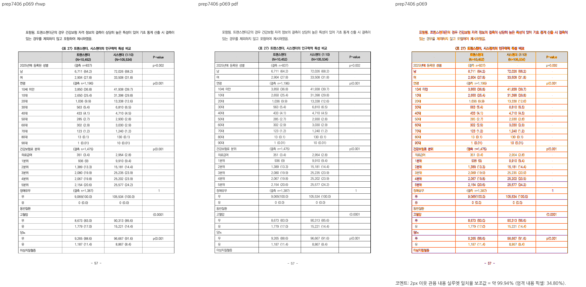
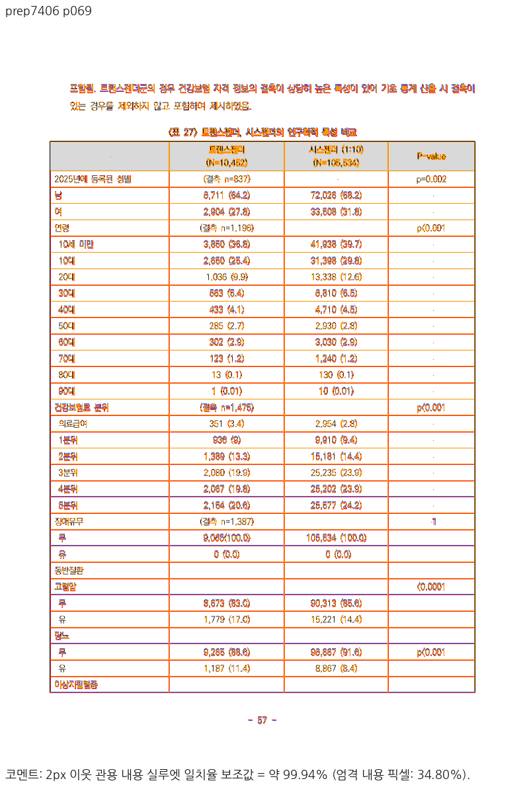
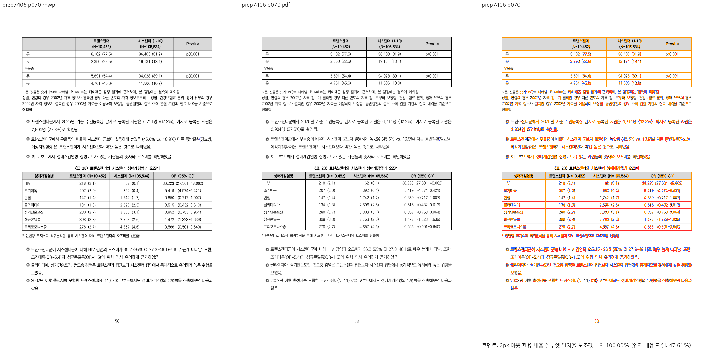
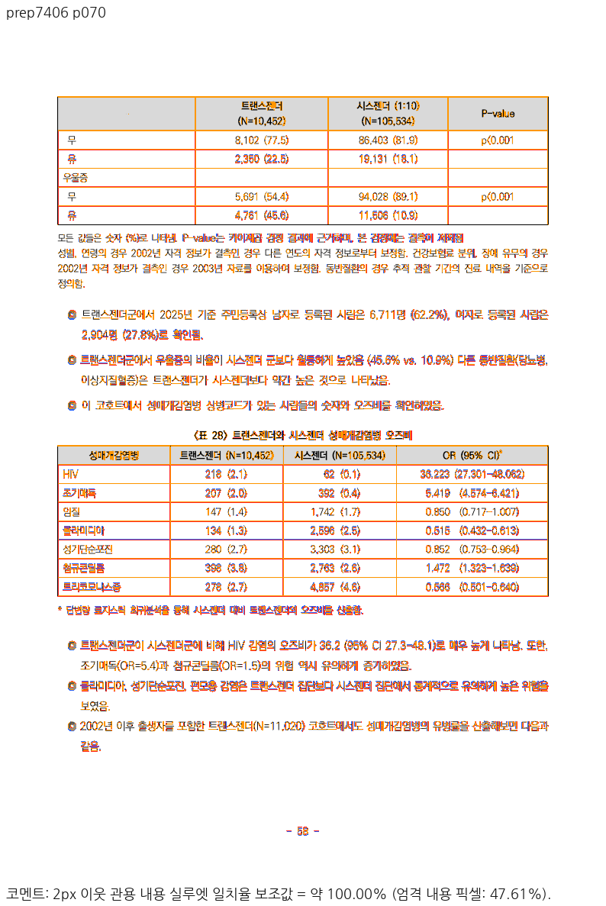

# PR #7366 리뷰 — 자리차지 표의 좌표 가드와 기존 해결 재확인

## 최종 판정

**메인터너 보정 후 수용 가능.** 제품 정책을 최신 devel과 동일하게 복원하고 원 좌표 검사 2개를 가드로 유지한 `67574d64b9e26b9f72fb9a60505c6fc694c78cf7`에서 집중 9/9 및 행 소유 1/1 PASS, fmt·Native/WASM32/workspace all-target Clippy·workspace build·base 비교 manifest를 완료했다. 140쪽 배치 JSON의 반복 해시 동일성과 제품 소스의 base 동일성도 확인했다. 원 head는 직접 병합하지 않으며 같은 branch의 통합 PR 최신 head CI·MERGEABLE/CLEAN 확인이 병합 전 조건이다.

## 접수 정보

| 항목 | 값 |
| --- | --- |
| 원 PR·작성자 | [#7366](https://github.com/edwardkim/rhwp/pull/7366) / planet6897 |
| base·검토 branch | devel `8baae33464bce7e92cbbd07e715397dca141f836` / `review/planet6897-7366-20260926` |
| 원 head | `ddb5cd2a2b123d1fbb08d5d6f806fc59670a30d5` |
| 고유 commit과 -x 체리픽 | 코드 `2dac81a878a8822d0a2e6e084c53b37a8dd7fdf0` → `7f0abc02e`; 문서 `7d6f2358d7052344506c2fe52edfe60d6492f03b` → `428ccddfc` |
| 메인터너 보정 | `67574d64b9e26b9f72fb9a60505c6fc694c78cf7` |
| 관련 이슈 | [#7362](https://github.com/edwardkim/rhwp/issues/7362), 현재 OPEN. 해당 69쪽 신고 범위만 종료 대상으로 재확인 |
| reviewer·경로 | 기존 reviewer jangster77 확인. collaborator_external_pr 및 intake/local_validation/visual_fixture_evidence/post_merge 경로. 통합 PR owner reviewer 자동 지정 없음 |

## 보류 원인과 보정 범위

과거 보류는 PrEP 69–70쪽의 낮은 시각 일치와 행/본문 경계였다. 현재 base는 [#7437](https://github.com/edwardkim/rhwp/pull/7437)의 KoPub·저장 어절·행 소유·분할 예약 보정을 포함한다. 원 PR의 `max(선언, 실측)`을 적용하지 않아도 원 좌표 검사 2개가 통과한다. 현재 코드에 원 변경을 적용한 뒤에도 정상 대조군 포함 9개가 통과했으나 신고 입력에서 추가 효과는 확인되지 않았다.

따라서 전역 `max` 정책을 추가하지 않고 `whole_fit.rs`를 base 내용으로 복원했다. 실행으로 확인한 정책 회귀가 있다는 뜻은 아니다. 저장 프레임과 rhwp 측정 팽창을 모두 같은 높이 계약으로 간주하는 넓은 일반성은 이 입력으로 입증되지 않았고, 신고된 문제 해결에 그 변경이 필요하지 않다. 원 기여자의 최종 좌표 검사 두 개를 회귀 가드로 보존하며, 수정 전 FAIL/후 PASS를 새로 검출했다고 주장하지 않는다. 원 README·4PNG는 과거 source 증적으로 명시했다.

실제 호출 경로는 `whole_fit.rs`의 declared_fit_height → declared_table_whole_fits → `entry.rs`의 legacy whole-fit OR → 별도 resolved_host_placement의 occupied_bottom 판정 → painted_rowbreak_exceeds_paper 최종 차단 → whole 배치 또는 row scanner다. helper의 높이 선택만으로 모든 분기의 측정·배치 공유를 입증할 수 없다. 현재 base의 정식 `prep_table_starts_after_caption_and_continues_next_page`는 비헤더 1..37행이 두 쪽에서 정확히 한 번 소유됨도 검사한다.

최종 diff는 Rust 테스트·기록만이다. `src/`, `crates/`, Cargo.toml/lock은 base와 바이트 동일하며 baseline·golden·fixture 허용치를 바꾸지 않는다. 저장 프레임 수용 조건·분할 예약·paint 원점은 이번 PR에서 변경하지 않는다.

## 검증 입력과 결과

- 원본: [1790387 PrEP HWPX](../../../samples/issue2006/1790387_prep_final_report.hwpx), SHA-256 `c68baed24096386f9041930d24d39409b61ac99463bf04dfd242440dfdeb739f`.
- 독립 기준: 같은 원본에서 한컴 2024로 출력한 [140쪽 PDF](../../../pdf/issue2006/1790387_prep_final_report-2024.pdf), SHA-256 `04b95a6e41420fb45934ce2ee5abd8cf6dac4ce12fd47977dacbe7fca28018a8`.
- 정상 선언-fit 대조군의 실제 한컴 기준: [1730000 HWP](../../../samples/task2097/1730000_selection_report.hwp)와 [2022 PDF](../../../pdf/task2097/1730000_selection_report-2022.pdf). 합성 #2097/#2105 계약과 실제 한컴 출력 증거를 구분한다.
- 모든 입력/기준은 base와 검토 commit에 이미 포함된 동일 파일이다. 외부 자료를 acceptance 근거로 대신하지 않는다.
- 수정 전 source 2검사 2/2 PASS(0.138s), 정상 대조군 7/7 PASS(0.166s), 원 정책 적용 뒤 9/9 PASS(0.177s), 최종 제품 정책 복원 후보 9/9 PASS(0.184s), 모두 exit 0.
- 정확한 실행 및 역할 구분은 [보정 결과보고](../../report/issue7362/README.md#2026-09-26-메인터너-보정-결과)에 연결한다. 로그는 ignored `output/pr-review/planet6897-7366-20260926/logs/`에만 보관하며 커밋하지 않는다.
- [최종 검증 provenance](../assets/pr7366_20260926/validation_results.json): code head `67574d64b`, 모든 lint/policy exit 0. 추가 행 소유 1/1 PASS(0.135s), 140쪽 dump-pages JSON 두 번 SHA-256 `6990ec40a19ab128aa49180b624753c37ce325321c572047572974b94e9fa449` 동일. 이 해시는 결정성 근거이며 한컴 시각 일치의 대용이 아니다.
- Rust test-only 범위에 따라 모든 Rust lint 묶음, focused·관련 결정성·최신 head CI를 적용한다. 새 제품 렌더링 변경이 없으므로 renderer 전체 회귀·Native Skia 3종·fresh WASM 재빌드를 이번 head에서 실행했다고 주장하지 않는다. 그 완료 결과는 #7437의 별도 증거다.

## 시각 증적과 판독

제품 코드가 동일한 base의 [#7406 개별 review](pr_7406_review.md), [Native manifest](../assets/pr7406_20260925/native_run_manifest.json), [fresh WASM manifest](../assets/pr7406_20260925/wasm_run_manifest.json)와 metric을 재사용한다. 생산 code SHA `9e7518243` → #7437 merge `8baae3346` → 이번 후보의 제품 소스가 동일하다. 새 head에서 실행한 fresh WASM으로 표시하지 않는다.

| 물리 쪽 | 기존 Native 2px 실루엣 | 기존 fresh WASM 2px 실루엣 | 직접 판독 |
| --- | ---: | ---: | --- |
| 69 | 99.94299% | 99.94299% | 본문·캡션 아래 표 시작, 첫 조각의 말미 이상지질혈증 보존 |
| 70 | 100% | 100% | 반복 헤더·무/유·우울증 마지막 행, 뒤 본문과 표28 보존 |

2026-09-26에 아래 Native review와 standalone overlay 네 개를 직접 재확인했다. 두 쪽에 글꼴 예외는 없다. 엄격 내용 픽셀은 34.7976/47.60607%로 획 차이가 남으며 2px 지표를 픽셀 완전 일치로 해석하지 않는다. 140쪽 전체 fidelity나 다른 자리차지 갈래의 해결은 주장하지 않는다.

## 조판 원칙 판정

| 항목 | 판정과 근거 |
| --- | --- |
| 원 좌표/독립 입력 계약 | 충족: 원 두 최종 bbox 검사와 실제 한컴 기준/정상 대조군을 대조 |
| 새 결함 검출·정책 일반성 | 미검증: source 검사가 current base에서도 PASS. max 필요성과 일반성을 증명하지 못함 |
| 제품 측정·배치 수정 | 비해당: 최종 diff에 제품 소스 변경이 없음. 기존 호출 분기를 검토했고 새 정책을 제외 |
| 저장/편집 후 재조판 범위 확대 | 비해당: 기존 계약과 허용치 유지 |
| 시각 hold 재판정 | 기존 실패를 글꼴로 면제하지 않음. 실제 source 제품 보정은 #7437, 동일 base의 69/70 경계·행/뒤 본문을 직접 확인 |

## 통합 PR과 code candidate CI

[통합 PR #7438](https://github.com/edwardkim/rhwp/pull/7438)을 생성했고 code candidate `d3568f2a49a8d2da179d528b9e2d0b2eb75dce3a`의 [Full CI](https://github.com/edwardkim/rhwp/actions/runs/36223427120) attempt 1이 성공했다. `fast_pass=false reason=no-green-build-candidate`였으며 lint와 네 archive builder/worker를 실행했다. test-only 분류에 따라 Native Skia·WASM·frontend gate는 skip된 것이므로 이 run에서 통과한 것으로 쓰지 않는다.

| CI archive | PASS | skip | 실행 초 |
| --- | ---: | ---: | ---: |
| A | 3873 | 13 | 95.633 |
| B | 1666 | 3 | 287.099 |
| C | 2416 | 25 | 329.361 |
| D | 2114 | 9 | 225.784 |
| 합계 | **10069** | **50** | 각 worker 결과 |

기본 회귀 10,069 PASS는 이번 GitHub Linux 결과이며, 로컬 focused 9+1 및 선행 #7437 Mac 전체 10,260과 구분한다. [CI provenance](../assets/pr7366_20260926/code_candidate_ci.json)에 source/head/run/attempt·worker·artifact IDs·tested merge를 고정했다. tested merge는 `40fae4327d54c4d79564eeb1b0135682699214f2`, tree `bb13010168db43ee0ffcc00a86d49dc4fd9a9818`이며 local merge-tree와 동일하다.

code candidate 최종 체크는 26 success·5 skip·1 neutral, 실패·대기 없음, MERGEABLE/CLEAN이었다. Rust CodeQL 분석은 성공했다. 별도 code-scanning neutral은 test-only 경로에서 JS/TS·Python 구성이 실행되지 않아 devel의 두 구성이 비교 결과에 없다는 사유이며, 해당 소스는 이번 diff에 없다. 완료하지 않은 구성을 완료로 표시하지 않는다. 이 뒤 mydocs-only trailing head의 CI/fast-pass와 mergeability를 다시 확인한다.

## Merge 후 contributor PR comment 계획

통합 PR의 최신 CI/merge SHA와 devel asset 존재를 확인한 후 원 #7366에 한국어 존댓말로 안내한다. 원 기여의 최종 좌표 회귀를 유지하고, 신고 자체는 #7437에서 이미 해결됐으며 이번 통합은 추가 가드/기록임을 구분한다. 전역 max를 제외한 이유는 새 회귀가 검출됐기 때문이 아니라 현재 해결에 불필요하고 일반성 증거가 부족하기 때문이라고 설명한다.

[Visual Sweep 정본](../../manual/verification/visual_sweep_guide.md#github-merge-comment)과 실제 통합 merge SHA 고정 `native_review_069/070.png`, `native_overlay_069/070.png`를 실제 Markdown 이미지 4개로 포함한다. #7437에서 생산한 base 증적을 재사용한 사실과 99.94299/100%, 엄격 픽셀 차이를 명시한다. exact head CI 링크·실제 focused/lint/결정성 결과를 포함하고 `--body-file` 게시 뒤 API로 UTF-8 본문을 대조한다.

원 #7366은 통합 후 supersede로 닫는다. 신고 69쪽 경계/이어받기만을 대상으로 #7362에 같은 근거의 issue comment를 남기고 닫는다. 다른 자리차지 갈래와 #7390의 잔여 31/66쪽·OLE 스타일은 닫지 않는다. 이후 devel fast-forward, 이번 branch·owned output cleanup을 완료하고 공유 target/pr-review는 보존한다.
