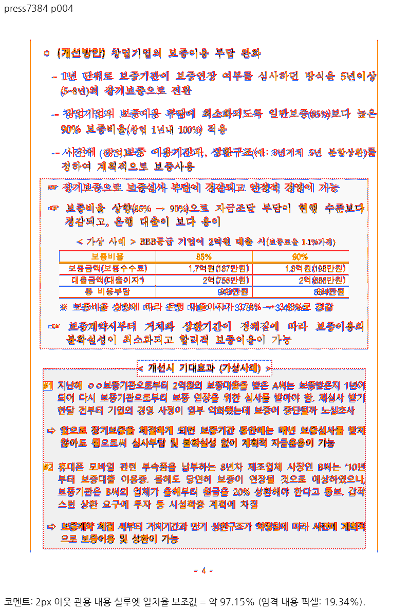
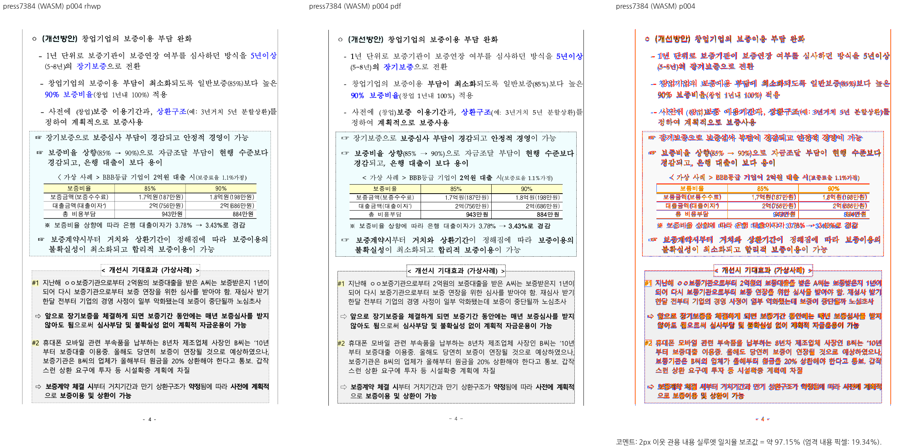
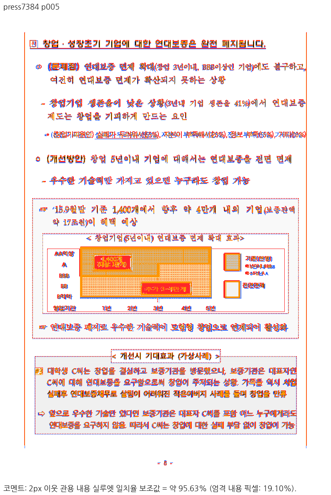
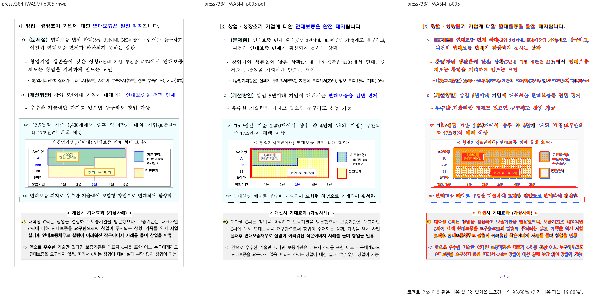
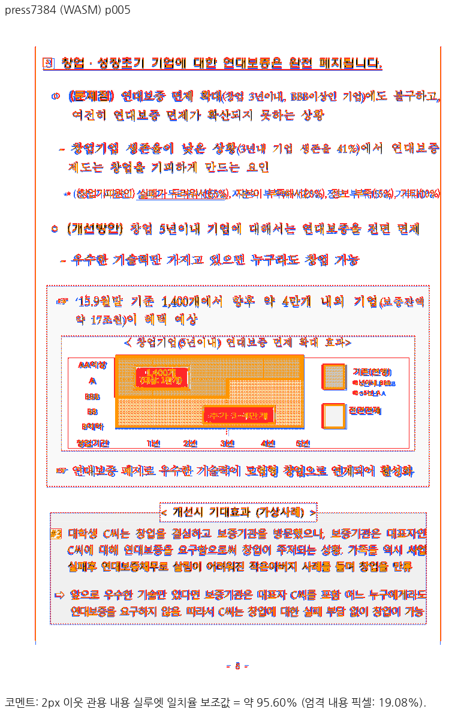

# PR #7384 검토 — 이어받은 컷 행의 쪽 면적 초과 가드

## 최종 판정

**메인터너 별도 통합 후보는 목표 4쪽 경계와 후속 5쪽의 로컬 검증을 충족했다. 원 PR은 직접 병합하지 않는다.** [원 기여 PR #7384](https://github.com/edwardkim/rhwp/pull/7384)의 정확한 head `f18c56f66043dc9a50e6ded67b4750208fae0573`를 최신 `upstream/devel` `aeb9f489e1d5e297c1e98cf1ca8ff84532270aca` 위에 `-x` 체리픽한 code head는 `ae6b96567c324f558e9d2cf08812865209f784d1`다. 메인터너는 제품 코드를 더 고치지 않았고, 원 PR 본문에 없던 head 고정 review·overlay 증거를 별도 통합 PR에 보완한다. 원 기여자 head의 제출 요건이 완료됐다는 판정이 아니다. 원격 통합 PR의 CI와 병합 가능 상태는 생성 후 확인한다.

이 수정은 [#7206](https://github.com/edwardkim/rhwp/issues/7206)의 **물리 4쪽 표 조각이 본문보다 7.0px 커지는 경계**에 한정한다. 물리 8쪽의 +4.57px, 전체 13쪽 대 한컴 12쪽, 글자 +58은 남는다. 따라서 #7206은 닫지 않는다.

## 조판 규칙과 실제 소비 경로

원 기여 변경은 `src/renderer/typeset/table/scan/runner/row_step.rs`에서 이어받은 조각이 `r == cursor_row && is_continuation && !row_start_cut.is_empty()`일 때도 row-area 초과 가드에 진입시키고, 기존 재시도가 더 작은 컷을 찾도록 한다. 특정 문서 ID로 분기하지 않는다.

적용 경로는 `advance_row_cut`의 시작/끝 컷 → `row_cut_content_height`의 칠할 높이 `split_total` → 앞선 행·간격과 합한 `split_candidate_rows_height` → `avail_for_rows` 비교 → 초과 시 재시도 예산과 새 끝 컷 → `consumed`/`split_end_limit` 누적 → 표 조각의 실제 배치다. 성공한 재시도는 `cand2 <= avail_for_rows + tolerance`를 검사한다. 재시도가 실패하면 기존 `continuation_row_must_advance`가 원래 컷을 수용할 수 있다. 이 후퇴 경로 때문에 새 조건만으로 모든 초과가 없어졌다고 주장하지 않는다.

독립 기대값은 한컴 PDF와 별도로, 쪽 본문에 배치한 조각의 실제 하단이 본문 하단을 넘지 않아야 한다는 기하 불변식이다. 원 기여자의 회귀 `issue_7206_page4_fragment_does_not_exceed_the_body`는 수정 전 `1053.90 > 1046.90px`를 검출했고, 이전 기준에서 수정 후 `1039.00px`를 보고했다. 이번 최신 base에서는 보정 전 실패를 다시 실행하지 않았으며, 정확한 통합 head의 render tree에서 Native/WASM 모두 본문 하단 **1046.9px**, pi=5 표 하단 **1039.0px**를 직접 확인했다. 후속 5쪽의 그림·본문과 조각 외곽도 아래 이미지에서 확인했다. 8쪽의 독립 경계와 전체 문서의 쪽 소유는 미해결이다.

## 입력·기준과 최신 head 검증

| 항목 | 위치·SHA-256 |
| --- | --- |
| 원본 HWPX | [press release](../../../samples/issue3637/press_release_split_cell_nested_table.hwpx) · `e2cb077d51293ae081a83e49c3bf2bca701087fddb4068d29295607b326be410` |
| 한컴 기준 PDF | [한컴 PDF](../../../pdf/issue3637/press_release_split_cell_nested_table-hwpx-2020.pdf) · Creator `Hwp 2022 0.0.0.0`, Producer `Hancom PDF 1.3.0.550`, 12쪽 · `731ff37070a7a5fedbd239920323244aecd10d8913a1a49351956263e45bc2cc` |
| 코드·도구·패키지 | [실행 증적](../assets/pr7384_20260925/evidence.json)에 code head, Native 바이너리, fresh WASM, sweep script SHA-256 기록 |

- 집중 회귀 1/1 PASS. 전체 `cargo nextest run --locked --cargo-profile release-test --target-dir target/pr-review --tests --no-fail-fast`는 **10,236/10,236 PASS·50 skip**, 종료 코드 0이다.
- Native Skia 공식 3종은 rhwp 본체 3,930 PASS·13 ignored, 그림 누락 2/2 PASS, 직접 PDF 출력 4/4 PASS다.
- `cargo fmt --all -- --check`, Native root·WASM lib·workspace all-targets Clippy `-D warnings`, workspace build, `aeb9f489e` 고정 manifest base 비교가 통과했다. `#[cfg(test)]` source-side 테스트는 변경하지 않았다.
- Mac fresh WASM은 저장소 루트에서 `CARGO_TARGET_DIR=target/pr-review scripts/wasm-pack-locked.sh --target web --out-dir pkg --no-opt`로 빌드했다. Docker 최적화 빌드 결과로 보고하지 않는다.
- code commit `ae6b96567c324f558e9d2cf08812865209f784d1`과 제품·테스트 tree가 같은 문서 head `5d958362ee740805ea857f6120156ac2c5091757`에서 `scripts/visual_sweep.py --file-target press7384 ... --pages 4,5 --dpi 96`을 Native와 fresh WASM으로 각각 다시 실행했다. 두 쪽 모두 `pr_review_gate=passed`, flagged=0/2. 2px 내용 실루엣은 Native p4 **97.149%**, p5 **95.62958%**; WASM p4 **97.14679%**, p5 **95.60362%**다. pixel match는 약 85–86%, visual accuracy proxy는 약 19%로 낮아 문서 전체 fidelity 통과로 확대하지 않는다. 대표 review와 standalone overlay를 직접 열어 한글 표시, 4쪽 표 외곽, 5쪽 그림 및 후속 문단을 대조했다. [Native manifest](../assets/pr7384_20260925/native_run_manifest.json)와 [WASM manifest](../assets/pr7384_20260925/wasm_run_manifest.json)에 입력·PDF·head·패키지 출처를 남겼다.

## 남은 범위와 후속 처리

목표 4쪽의 실제 조각 높이는 **충족**이다. 원 PR의 head 고정 대표 이미지 부재는 원 PR 기준 **미충족**이며, 이 별도 메인터너 통합 head에서 새 증거를 제출한다. 물리 8쪽의 재시도 실패·+4.57px 초과와 전체 쪽수·글자 중복 문제는 **미충족/미해결**로 #7206에 남긴다. 그 범위의 원인 수정·독립 재검증 없이 이 PR을 전체 이슈 해결로 표현하지 않는다. 초기 여러 PR을 합친 검토의 3·8·9쪽 시각 차이를 이 원 PR의 새 회귀로 단정하지 않는다.

통합 PR이 실제 merge되면 기여자에게 4쪽 범위 기여를 먼저 인정하고, 메인터너가 별도 통합 head에 추가한 시각 제출 증거와 독립 PDF 대조를 한국어 존댓말로 설명한다. 실제 merge SHA·최신 CI·4·5쪽 Native/WASM 수치·merge SHA에 고정한 review/overlay 이미지를 원 PR comment에 넣고 중복 원 PR을 닫는다. 기여자 branch는 보존한다. #7206에는 부분 해결과 남은 8쪽·쪽수·글자 범위를 기록하고 OPEN으로 유지한다. 병합 후 duration 갱신, `devel` 동기화, 전용 branch/output 정리는 [후속 절차](../../manual/pr_review/post_merge.md)에 따른다.
