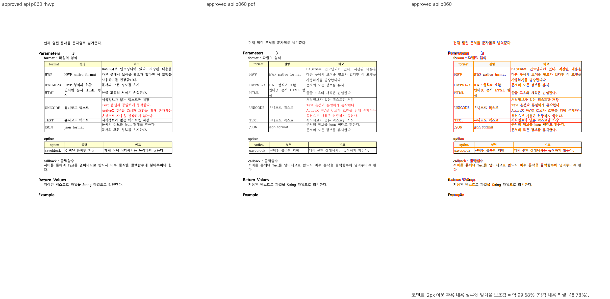

# PR #7392 검토 — 글자 없는 자리차지 표의 저장 원점

## 최종 판정

**승인.** 원 contributor head `f3772351f24ef87426f8000224419c260702719d`의 49·60쪽 빈 표 host 배치가 한컴 기준 PDF와 현재 통합 code head `459d5e581eac979e8a3c69a72e71fb7cc3c9ea88`의 Native/fresh WASM에서 맞는다. 메인터너 `7e3f0363c8987b5663ba411c5a0c7d0affc0549b`는 표 하단·뒤 문단·다음 쪽 소속을 확인하는 회귀만 추가했다. 원 PR의 렌더 코드를 바꾸지 않았다. 통합 PR 자체의 최신 GitHub CI·mergeability와 작업지시자 원격 승인은 별도 조건이다.

## 접수 정보와 체리픽

| 항목 | 값 |
| --- | --- |
| 원 PR | [#7392](https://github.com/edwardkim/rhwp/pull/7392), `planet6897`, `devel` 대상 |
| 원 head / 통합 적용 | `f3772351f24ef87426f8000224419c260702719d` / `106869f56acc611283b7b2c5131c0da60a74d1ef` (`-x`) |
| 메인터너 추가 검사 | `7e3f0363c8987b5663ba411c5a0c7d0affc0549b` |
| 통합 순서 | 8건 중 두 번째; #7388 뒤 적용, 체리픽 충돌 없음 |
| 규모·작성 시점 원격 참고값 | 8파일, +215/−0; OPEN, MERGEABLE/CLEAN, Draft 아님 (2026-09-25) |
| 검토 base / code head | `b3e3d4e2170a43ca449e3d832440a9274e4e8ee4` / `459d5e581eac979e8a3c69a72e71fb7cc3c9ea88` |

[추가 검사·통합 순서](pr_7392_review_impl.md)는 원 기여 코드와 메인터너 검사만을 구분한다. 원 head CI는 이 누적 head 검증의 대체물이 아니다.

## 변경·조판 원칙과 입력

빈 floating-table host가 저장 앵커를 찾지 못할 때 일반 표 경로로 내려가고, `item_flow_snap_context → empty_float_vpos_snap_flow_top → table_y_start`가 흐름 커서와 바깥 위 여백을 같은 측정·배치 원점으로 사용한다. 표가 차지한 공간과 글자가 보이는 상태를 분리한다. 60쪽 표 하단·뒤 빈 줄·`option`/`callback` 문단과 61쪽 첫 표 소속을 회귀로 고정했다. 이 입력의 공통 원점·후속 배치는 **충족**, 다른 저장 앵커 형식의 일반화는 **미검증**이다.

검증 입력 `samples/hwpctl_API_v2.4.hwp`의 SHA-256은 `d11dd1331083be4e8c989dfbd587777626b3d77686d3436c35a2c20da9494603`, 한컴 기준 `pdf/hwpctl_API_v2.4-2022.pdf`는 `a0141ca188ca638b305d896e21749703a39529f7bd8cf2bc806dea4ff9aaac66`이다. 두 파일 모두 검토 통합 commit에 추적돼 있으며 실제 실행 파일 해시와 일치한다. PDF를 다시 생성하거나 중복 커밋하지 않았다.

## 검증과 시각 증적

- 같은 code head의 `issue_7063` 집중 release-test 관련 7건 PASS, 전체 release-test **10,229/10,229 PASS·50 skip**, fmt·Native/WASM/workspace Clippy·workspace build·manifest base 비교 PASS.
- `scripts/visual_sweep.py --file-target approved-api samples/hwpctl_API_v2.4.hwp pdf/hwpctl_API_v2.4-2022.pdf --rhwp-bin target/pr-review/release-test/rhwp --pages 14,15,21,49,60,88 --dpi 96 --embed-fonts=full --out output/pr-review/planet6897-20260924/approved-visual/api-native-v2`를 실행했다. fresh WASM은 같은 명령에 `--wasm-pkg pkg`를 더해 `api-wasm-v2`에 캡처했다. **6/6쪽, 자동 flagged 0쪽, 두 gate 모두 `passed`**다. 세부 해시는 [통합 시각 증적](../assets/approved_planet6897_20260925/evidence.json)에 있다.

| 영향 쪽·출력 | pixel match | visual accuracy proxy | 2px 내용 실루엣 |
| --- | ---: | ---: | ---: |
| 49 Native / fresh WASM | 95.75052% / 95.74121% | 36.18573% / 36.06102% | 98.88677% / 98.89377% |
| 60 Native / fresh WASM | 96.25318% / 96.15348% | 48.77727% / 48.04357% | 99.68109% / 99.68491% |

[Native 60쪽 overlay](../assets/approved_planet6897_20260925/api-native-overlay-060.png) · [fresh WASM 60쪽 review](../assets/approved_planet6897_20260925/api-wasm-review-060.png) · [WASM overlay](../assets/approved_planet6897_20260925/api-wasm-overlay-060.png)

49·60쪽 review를 직접 열어 표 외곽, 표 뒤 문단과 다음 내용의 위치를 비교했다. 낮은 엄격 픽셀/잉크 점수를 전체 fidelity 통과로 읽지 않으며, 승인 근거는 이 PR의 표·후속 흐름 계약과 두 쪽의 실제 대응이다. 61쪽의 별도 글꼴·셀 차이는 이번 수정 전후 귀속이 입증되지 않아 #7392 해결 범위에 넣지 않는다. [Visual Sweep 정본](../../manual/verification/visual_sweep_guide.md#github-merge-comment)을 따른다.

## Merge 후 contributor PR comment 계획

통합 PR이 실제 merge돼 asset이 `devel`에 존재할 때만 merge SHA와 CI URL, 49·60쪽 확인과 61쪽의 잔여 범위를 한국어 존댓말로 알린다. 대표 PNG는 `https://raw.githubusercontent.com/edwardkim/rhwp/<merge-commit-sha>/mydocs/pr/assets/approved_planet6897_20260925/api-native-review-060.png` 형식으로 merge SHA에 고정하고 overlay도 함께 표시한다. [Visual Sweep 정본](../../manual/verification/visual_sweep_guide.md#github-merge-comment)을 직접 연결한다. 게시 승인을 받은 단계에서 UTF-8 `--body-file`로 전송하고 API와 실제 PR 화면을 재확인한다. 현재 comment·approve·push·merge는 하지 않았다.
