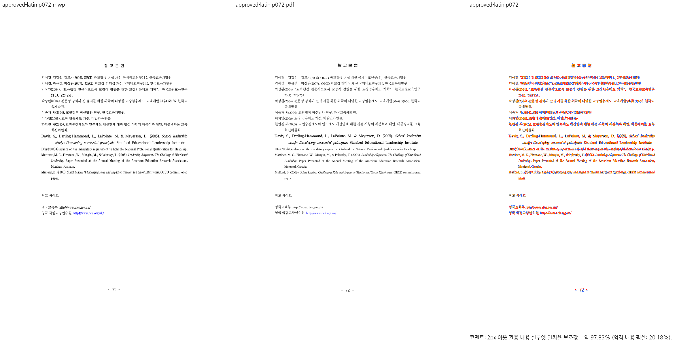

# PR #7395 검토 — legacy-latin 측정 글꼴 보존

## 최종 판정

**승인.** `AmeriGarmnd BT`가 선언된 입력의 측정 폭을 표시 fallback과 분리한 변경이다. 통합 code head `459d5e581eac979e8a3c69a72e71fb7cc3c9ea88`의 목표 72·76쪽 Native/fresh WASM Visual Sweep과 관련 회귀 2건이 통과했다. 원 PR 단독의 다른 face 일반화나 73쪽의 기존 세로 드리프트까지 승인 범위로 확장하지 않는다. 통합 PR의 원격 CI·mergeability는 생성 후 별도로 확인한다.

## 접수와 적용

| 항목 | 값 |
| --- | --- |
| 원 PR | [#7395](https://github.com/edwardkim/rhwp/pull/7395), `planet6897`, `devel` 대상 |
| 원 head / `-x` 체리픽 | `72dcc7543c5e08a79318bd9fa52b0f42d850b30a` / `590926e315f0ea11ec780958a27e109500e67543` |
| 메인터너 제품 코드 보정 | 없음. 현재 통합의 글꼴 공급·Visual Sweep 도구 수정은 별도 공통 commit |
| 검토 base / code head | `b3e3d4e2170a43ca449e3d832440a9274e4e8ee4` / `459d5e581eac979e8a3c69a72e71fb7cc3c9ea88` |
| 원격 참고값 (2026-09-25) | OPEN, MERGEABLE/CLEAN, Draft 아님; 9파일, +349/−1 |

## 조판 경로와 독립 기준

`style_resolver.rs`의 `font_families_metric_face`가 legacy-latin 표시 대체와 별개로 선언 face를 `TextStyle.metric_font_family`에 보낸다. `text_measurement.rs`의 전진폭 조회가 그 face를 사용하고, 표시용 CSS face는 유지한다. 기준은 입력 PDF에 내장된 `AmeriGarmnd BT`의 글자 폭과 같은 줄의 실제 문자 위치다. 선언 face의 폭을 소비하는 측정과 실제 줄 배치의 결과가 72·76쪽에서 유지되는 것은 **충족**이다. 23개 다른 선언 face 전체의 독립 한컴 출력 일치는 **미검증**이다.

입력 `samples/issue2559/1341000_research_report_footnotes.hwp` SHA-256은 `e9011fe125a76ed5d56ae06a1702e7f82b4ff5550f2a07ead956ca540f1231c8`, 한컴 PDF `pdf/1341000_research_report_footnotes-2020.pdf` SHA-256은 `e3093cc14d4653a679ad95df612e55d6741128dd9b74d124ca119b9bd7800498`이다. 현재 실행 파일 해시는 [시각 증적](../assets/approved_planet6897_20260925/evidence.json)에 고정돼 있다.

## 검증과 시각 증적

- `issue_7391` 집중 release-test **2/2 PASS**, 통합 전체 release-test **10,229/10,229 PASS·50 skip**; fmt, Native/WASM/workspace Clippy, workspace build, manifest base 비교 PASS.
- `scripts/visual_sweep.py --file-target approved-latin samples/issue2559/1341000_research_report_footnotes.hwp pdf/1341000_research_report_footnotes-2020.pdf --rhwp-bin target/pr-review/release-test/rhwp --pages 72,76 --dpi 96 --embed-fonts=full --out output/pr-review/planet6897-20260924/approved-visual/latin-native-v2`와 같은 입력의 `--wasm-pkg pkg` fresh WASM 실행이 모두 2/2쪽을 처리하고 `pr_review_gate=passed`였다. Mac 사용자 글꼴 690개를 실제 공급했고 한글 glyph를 review PNG에서 확인했다. 존재하지 않는 예전 font 경로·글꼴 불일치 예외는 사용하지 않았다.

| 쪽·출력 | pixel match | 2px 내용 실루엣 |
| --- | ---: | ---: |
| 72 Native / fresh WASM | 96.26327% / 96.26327% | 97.82713% / 97.82713% |
| 76 Native / fresh WASM | 92.76576% / 92.76576% | 96.19063% / 96.19063% |

[Native 72쪽 overlay](../assets/approved_planet6897_20260925/latin-native-overlay-072.png) · [fresh WASM 72쪽 review](../assets/approved_planet6897_20260925/latin-wasm-review-072.png) · [WASM overlay](../assets/approved_planet6897_20260925/latin-wasm-overlay-072.png) · [Native 76쪽 review](../assets/approved_planet6897_20260925/latin-native-review-076.png)

72쪽 영문 참고문헌 줄과 76쪽 후속 본문·각주를 직접 대조했다. 엄격한 잉크 점수는 낮으므로 이 수치를 전체 문서 fidelity로 해석하지 않는다. 73쪽 세로 드리프트는 이 변경 전후 모두 남아 별도 미충족 범위다. 이 PR의 72·76쪽 목표와 구분하고 전체 이슈 종료를 주장하지 않는다. [Visual Sweep 정본](../../manual/verification/visual_sweep_guide.md#github-merge-comment)을 따른다.

## Merge 후 contributor PR comment 계획

실제 통합 merge 뒤 merge SHA·CI URL·72·76쪽 목표 충족과 73쪽 잔여 범위를 한국어로 알린다. 대표 PNG는 `https://raw.githubusercontent.com/edwardkim/rhwp/<merge-commit-sha>/mydocs/pr/assets/approved_planet6897_20260925/latin-native-review-072.png` 및 overlay의 merge SHA 고정 URL로 표시하고 [Visual Sweep 정본](../../manual/verification/visual_sweep_guide.md#github-merge-comment)을 연결한다. 현재 comment·approve·push·merge는 수행하지 않았다.
