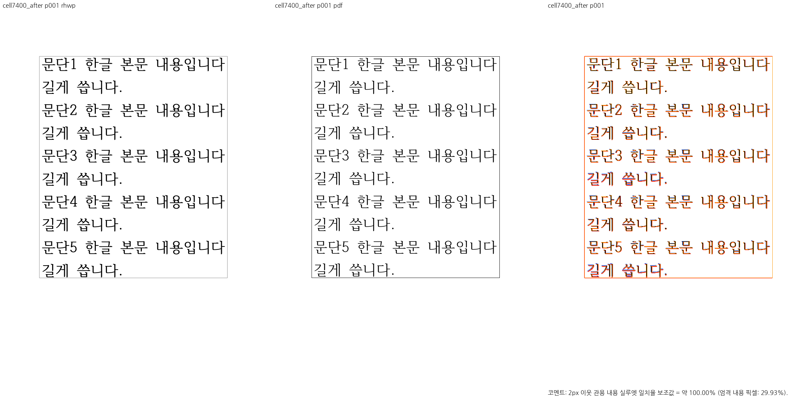
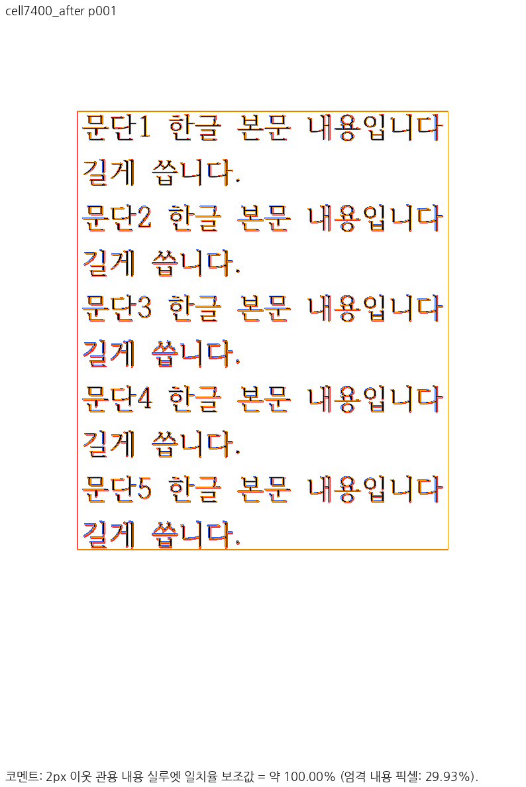
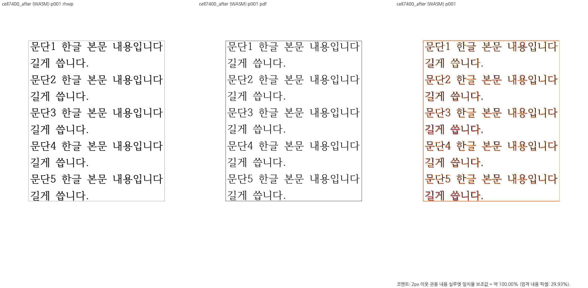
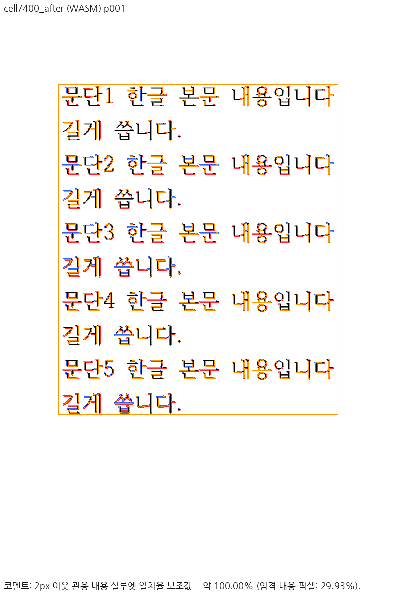

# PR #7400 검토 — 셀 글자 서식 뒤 문단 사다리와 표 위 여백

## 판정과 출처

**원 기여자 PR은 직접 병합하지 않는다. 메인터너 보정 통합 후보는 로컬 검증 통과, 원격 CI 확인 전이다.** [원 PR #7400](https://github.com/edwardkim/rhwp/pull/7400)의 head `667cf5f4ade2536d2a65b4093add3ba88b5b8d73`를 최신 `devel` `a7458aa39ca4ac8636a52e4c7a607d55973bf3a6` 위에 저자 정보를 보존해 `-x` 체리픽한 SHA는 `017a2823214eb24e16a6fe8c6e417820ada3a168`이다. 메인터너는 이전 로컬 보정 `c86d6ccec8880963280d5229fc7fb34cf4416fc8`의 diff를 새 기준에 재적용해 code head `177acf40054f2bbb4bbe65cd9f4267d3df308f8f`로 커밋했다. 이 문서는 사용자 요청에 따른 별도 메인터너 통합 head의 판정이며, 원 기여자 head의 Visual Sweep 제출이 끝났다는 판정이 아니다.

## 조판 규칙과 실제 소비 경로

원 기여 변경은 `src/document_core/commands/formatting.rs`의 평면·중첩 셀 글자 서식 변경 네 경로에서 텍스트 흐름이 바뀌면 기존 `cell_format_vpos_dirty` 표시를 세우고 `flush_cell_format_vpos`가 뒤 문단 사다리를 한 번 갱신하게 한다. 즉시 vpos를 재계산해 저장 RowBreak 원점을 덮어쓰지 않는다. 색 변경처럼 글자 흐름을 바꾸지 않는 경로는 사다리를 움직이지 않아야 한다.

시각 대조에서 별도로 드러난 표 위 여백은 `src/renderer/typeset/table/host_spacing.rs`의 측정에서 283HU를 예약했지만 `src/renderer/layout.rs`의 HWP5 계보 HWPX·비분할 빈 host 표 배치가 그 예약을 첫 표 원점에 소비하지 않은 차이였다. 해당 제한된 경로에서 측정한 `outer_top`을 실제 표 원점에 더한다. 저장 top·별도 flow snap 경로와 `outer_top=0` 대조군은 기존 조건을 따른다. `src/renderer/svg.rs`는 함초롬바탕의 HCR Batang 파일을 다른 Batang보다 먼저 찾아 한컴 PDF의 실제 subset과 같은 face를 공급한다. 특정 문서 ID로 조판을 분기하지 않는다.

## 독립 입력과 전후 근거

| 입력·기준 | SHA-256 |
| --- | --- |
| [편집 전 HWPX](../../../samples/issue7265/pr7400_cell_char_format_before.hwpx) | `fcb33c629538fc5604ff6135b7d3fd3e63564e2dc1acc032b92b0bc292aa956d` |
| [편집 전 한컴 2020 PDF](../../../pdf/issue7265/pr7400_cell_char_format_before-2020.pdf) | `1fe50323faea63b8296a55c641d8ff0047dd42628444ef25a819c6cb4ba0d342` |
| [편집 후 HWPX](../../../samples/issue7265/pr7400_cell_char_format_after.hwpx) | `526f8d3bd173bc336328e3184f8ad8ca134b2c0be773bf01e648a3c653dffc0e` |
| [편집 후 한컴 2020 PDF](../../../pdf/issue7265/pr7400_cell_char_format_after-2020.pdf) | `15cf805298b4c9214fb1b1f3b107d246761b5744468ef431e286968eba3798a0` |

HWPX 두 개는 rhwp 공개 API로 만든 합성 편집 입력이며 한컴 원본이라고 주장하지 않는다. 두 PDF는 해당 파일을 한컴 2020으로 각각 출력한 독립 비교 자료다. 편집 후 PDF는 `HCRBatang` subset을 임베드한다. 실제 공급한 `HANBatang.ttf`는 SHA-256 `0dbeb7b129fcec63f8d6b7f1d3b5bb991c1d599e725286518ccc598de643f014`다.

이전 검토에서 보정 전 대상 표 테두리는 132.27px, 한컴 PDF의 136.0px과 달랐고 283HU를 반영한 기대는 136.04px이었다. 당시 신규 원점 회귀는 0HU 대조군 PASS·283HU 대상 FAIL에서 보정 후 2/2 PASS로 바뀌었다. 최신 기준에서 보정 전 재실행은 하지 않았으므로 이전 FAIL을 이번 `devel`의 직접 재현으로 쓰지 않는다. 최신 보정 head에서는 해당 2건을 포함한 `issue_7265_` 집중 회귀 6/6 PASS를 확인했다.

## 최신 head 검증과 시각 증적

- `cargo fmt --all -- --check`, Native root·WASM lib·workspace all-targets Clippy `-D warnings`, workspace build, manifest base 비교가 모두 통과했다. 기준 SHA는 위 `devel`이다.
- `cargo nextest run --locked --cargo-profile release-test --target-dir target/pr-review -E 'test(issue_7265_)'`: 6/6 PASS. 신규 HWPX를 포함한 다섯 코퍼스 래칫과 oracle page count: 84/84 PASS, 기준값 변경 없음.
- 전체 `cargo nextest run --locked --cargo-profile release-test --target-dir target/pr-review --tests --no-fail-fast`: **10,235/10,235 PASS·50 skip**, 종료 코드 0.
- Native Skia 공식 3종: 라이브러리 rhwp 본체 3,930 PASS·13 ignored; 그림 누락 2/2 PASS; 직접 PDF 출력 4/4 PASS.
- Mac fresh WASM은 저장소 루트에서 `CARGO_TARGET_DIR=target/pr-review scripts/wasm-pack-locked.sh --target web --out-dir pkg --no-opt`로 빌드했다. Docker 최적화 빌드라고 보고하지 않는다.
- 정확한 code head `177acf40054f2bbb4bbe65cd9f4267d3df308f8f`에서 편집 후 1쪽 Native·fresh WASM `visual_sweep.py` compare·overlay·review: 각각 **99.9979%**, `pr_review_gate=passed`; 편집 전 Native 대조군 **100.0%**. 두 backend의 rhwp raster SHA-256은 `0f50a7a40316f19171b8fa0903db290e1422f721e1fdd7511de113417c560f3a`로 같다. 직접 판독에서 표 외곽, 다섯 셀 문단의 두 줄 배치, 뒤 내용이 기준 PDF와 대응한다. [실행 증적](../assets/pr7400_20260925/evidence.json)에 입력·글꼴·바이너리·WASM 해시를 고정했다.

[편집 전 Native review](../assets/pr7400_20260925/before_native_review_001.png)·[overlay](../assets/pr7400_20260925/before_native_overlay_001.png)와 Native/fresh WASM [실행 manifest](../assets/pr7400_20260925/native_run_manifest.json)·[WASM manifest](../assets/pr7400_20260925/wasm_run_manifest.json)도 보존했다. 전체 문서·중첩 셀의 한컴 일치를 이 한 쌍에서 일반화하지 않는다. clipping 외부 92개 자료는 이 환경에 없어 해당 별도 게이트는 미검증이다. 원격 통합 PR의 최신 CI와 merge SHA는 PR 생성 후 확인한다.

## Merge 후 contributor PR comment 계획

통합 PR이 실제 merge되면 [#7265](https://github.com/edwardkim/rhwp/issues/7265)의 해결 범위를 확인해 close/comment를 처리한다. 원 [#7400](https://github.com/edwardkim/rhwp/pull/7400)에는 기여자의 셀 글자 서식 사다리 갱신을 먼저 설명하고, 메인터너가 독립 PDF에서 확인한 표 위 여백·실제 HCR Batang 선택을 왜 추가했는지 한국어 존댓말로 알린다. 실제 merge SHA·최신 CI·검증 수치·merge SHA 고정 대표 review/overlay 이미지를 포함하고, 중복 원 PR을 설명 후 닫는다. 기여자 branch는 삭제하지 않는다.
