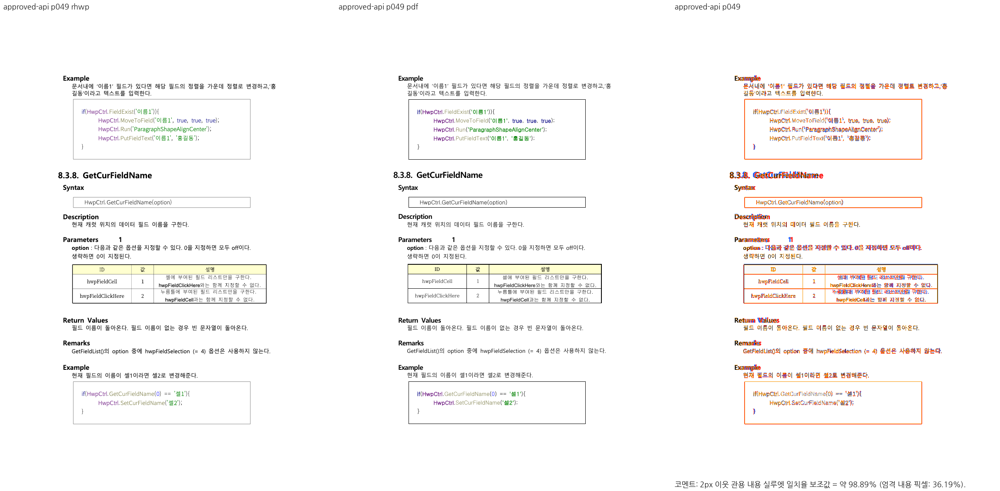

# PR #7401 검토 — 영문 슬롯 공백의 선언 전진폭

## 최종 판정

**승인.** 원 PR head의 `use_font_space` 경로는 #7395의 측정 face 변경과 함께 적용된 통합 code head `459d5e581eac979e8a3c69a72e71fb7cc3c9ea88`에서 관련 회귀 2건, Native/fresh WASM 영향 6쪽 Visual Sweep을 통과했다. 영문 슬롯이 실제 U+0020 폭을 선언한 경우에 한정한다. `exam_eng`의 별도 글꼴 크기·폭 문제와 메트릭 표에 없는 face는 해결 범위가 아니다. 통합 PR의 원격 CI·mergeability는 생성 후 별도로 확인한다.

## 접수와 적용

| 항목 | 값 |
| --- | --- |
| 원 PR | [#7401](https://github.com/edwardkim/rhwp/pull/7401), `planet6897`, `devel` 대상 |
| 원 head / `-x` 체리픽 | `3f71868c73bca84b816518bbd9284beb8070effd` / `0d61be71d330006af09ea11743c7ff74a112eadb` |
| 메인터너 제품 코드 보정 | 없음. #7395의 측정 face 경로와 함께 적용됨 |
| 검토 base / code head | `b3e3d4e2170a43ca449e3d832440a9274e4e8ee4` / `459d5e581eac979e8a3c69a72e71fb7cc3c9ea88` |
| 원격 참고값 (2026-09-25) | OPEN, MERGEABLE/CLEAN, Draft 아님; 10파일, +456/−4 |

## 조판 경로와 독립 기준

`style_resolver.rs::font_space_em`이 `use_font_space=true`인 영문 슬롯의 U+0020 선언 전진폭을 구한다. `composer.rs` 기본 공백 전진 → `TextStyle.font_space_em` → `text_measurement.rs` 줄 측정/배치가 같은 값을 소비한다. 속성이 꺼져 있거나 값이 없으면 기존 0.5em 대조군을 유지한다. #7395의 `metric_font_family`도 함께 보존해 폭을 측정할 face를 잃지 않는다.

원 PR의 수정 전 14쪽 `param :` 줄폭 432.48px와 한컴 기준 416.86px, 수정 후 일치 검사는 독립 PDF의 절대 px를 기대값으로 쓴다. 통합 head의 14·49·88쪽과 반각 공백 대조군 2건이 통과했으므로 해당 측정·배치 경로는 **충족**이다. 모든 글꼴 조합의 일치는 **미검증**이다.

입력 `samples/hwpctl_API_v2.4.hwp` SHA-256 `d11dd1331083be4e8c989dfbd587777626b3d77686d3436c35a2c20da9494603`, 한컴 PDF `pdf/hwpctl_API_v2.4-2022.pdf` SHA-256 `a0141ca188ca638b305d896e21749703a39529f7bd8cf2bc806dea4ff9aaac66`을 사용했다.

## 검증과 시각 증적

- 통합 head의 `issue_7387_use_font_space_latin_slot` 집중 release-test **2/2 PASS**, 전체 release-test **10,229/10,229 PASS·50 skip**. fmt·Native/WASM/workspace Clippy·workspace build·manifest base 비교 PASS.
- `scripts/visual_sweep.py --file-target approved-api samples/hwpctl_API_v2.4.hwp pdf/hwpctl_API_v2.4-2022.pdf --rhwp-bin target/pr-review/release-test/rhwp --pages 14,15,21,49,60,88 --dpi 96 --embed-fonts=full --out output/pr-review/planet6897-20260924/approved-visual/api-native-v2`와 같은 입력의 `--wasm-pkg pkg` fresh WASM 실행이 **6/6쪽, 두 gate `passed`**였다. Mac 사용자 글꼴 690개가 실제 공급됐고 한글 glyph가 보존됐다. 입력·실행 파일·스크립트 해시와 쪽별 수치는 [통합 시각 증적](../assets/approved_planet6897_20260925/evidence.json)에 있다.

| 쪽 | Native 2px 내용 실루엣 | fresh WASM 2px 내용 실루엣 |
| ---: | ---: | ---: |
| 14 | 98.07137% | 98.07137% |
| 15 | 97.18818% | 97.18818% |
| 21 | 98.99232% | 98.99636% |
| 49 | 98.88677% | 98.89377% |
| 60 | 99.68109% | 99.68491% |
| 88 | 98.67382% | 98.67535% |

[Native 49쪽 overlay](../assets/approved_planet6897_20260925/api-native-overlay-049.png) · [fresh WASM 49쪽 review](../assets/approved_planet6897_20260925/api-wasm-review-049.png) · [WASM overlay](../assets/approved_planet6897_20260925/api-wasm-overlay-049.png) · [Native 60쪽 review](../assets/approved_planet6897_20260925/api-native-review-060.png)

14·15쪽 `param :`와 후속 Example/Execute 절, 49·60쪽 표 외곽·후속 내용을 직접 대조했다. 자동 실루엣 통과만으로 전체 문서의 글꼴 fidelity를 주장하지 않는다. [Visual Sweep 정본](../../manual/verification/visual_sweep_guide.md#github-merge-comment)을 따른다.

## Merge 후 contributor PR comment 계획

실제 통합 merge 뒤 merge SHA·CI URL, 공백 전진폭 목표·반각 대조군과 남은 글꼴 범위를 한국어로 알린다. 대표 review·overlay PNG는 `https://raw.githubusercontent.com/edwardkim/rhwp/<merge-commit-sha>/mydocs/pr/assets/approved_planet6897_20260925/api-native-review-049.png` 형식의 merge SHA 고정 URL로 표시하고 [Visual Sweep 정본](../../manual/verification/visual_sweep_guide.md#github-merge-comment)을 연결한다. 현재 comment·approve·push·merge는 수행하지 않았다.
