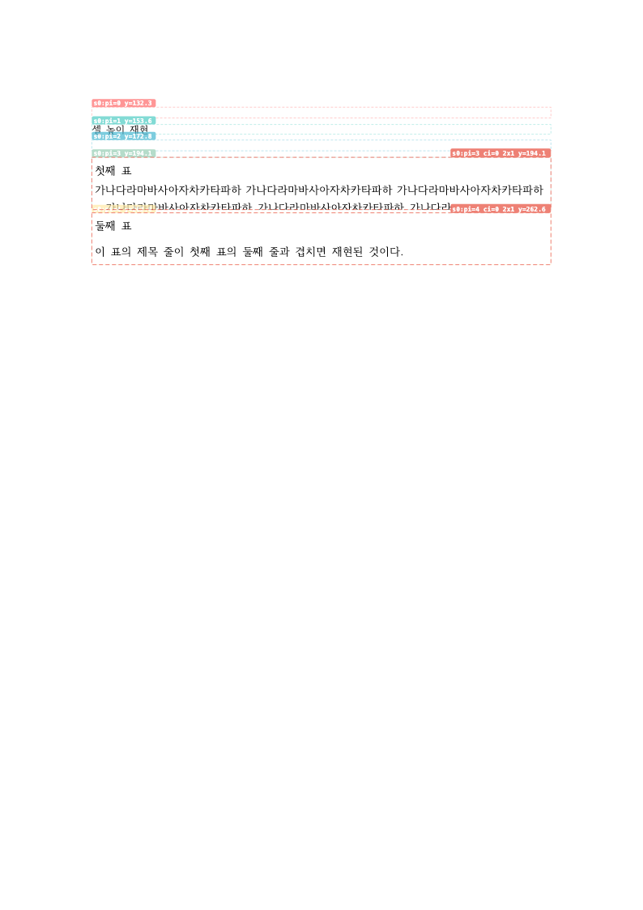
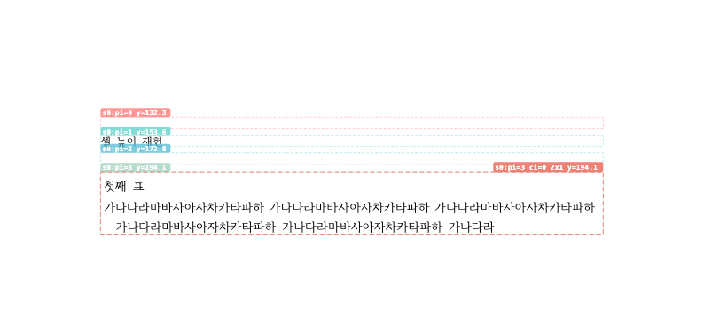
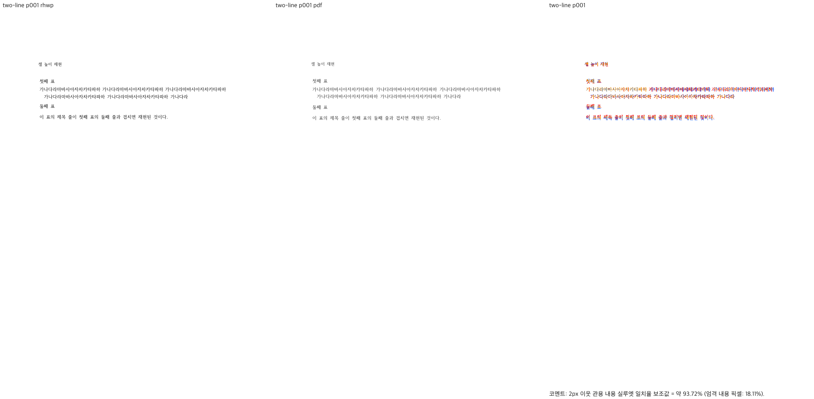
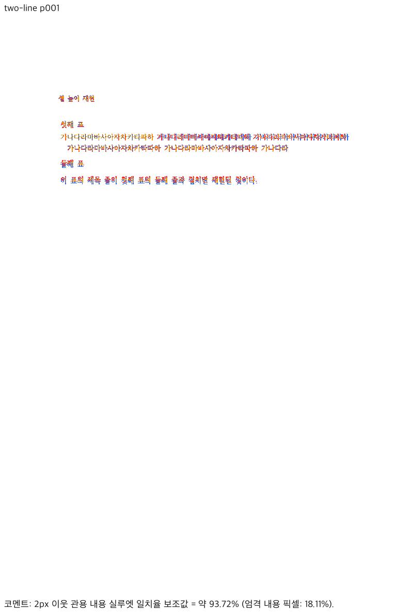
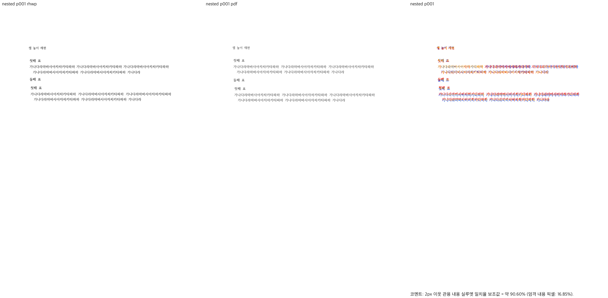
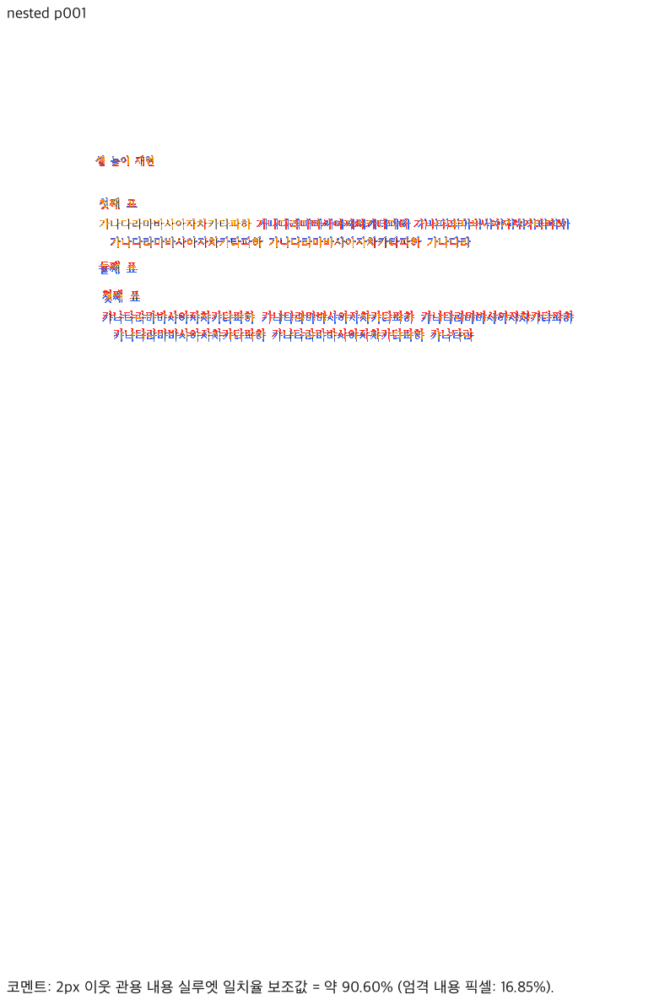
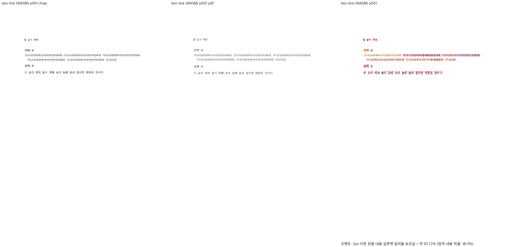
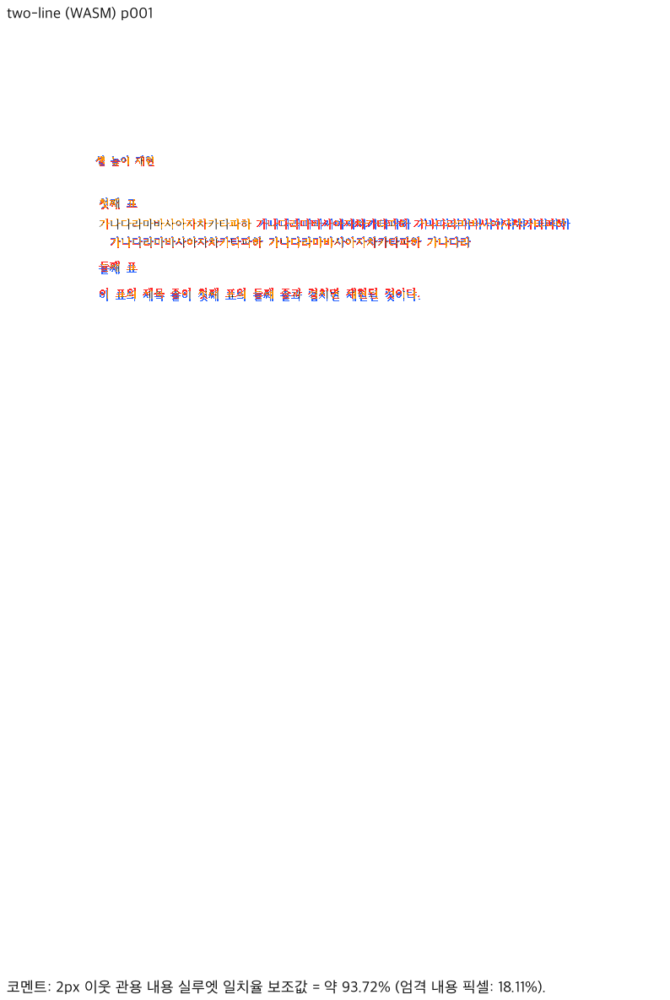
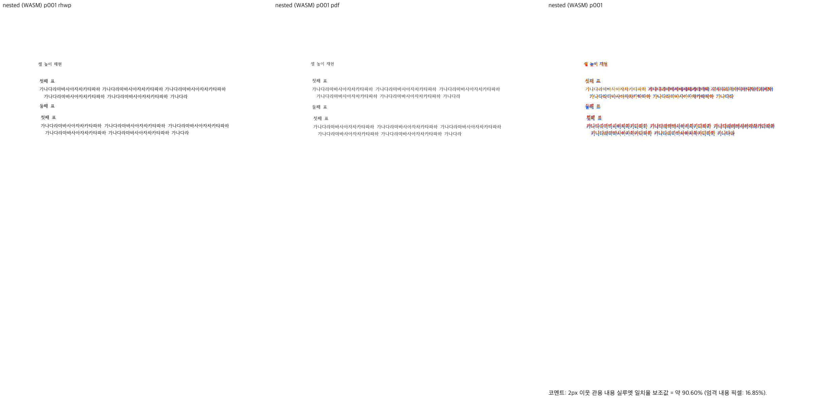
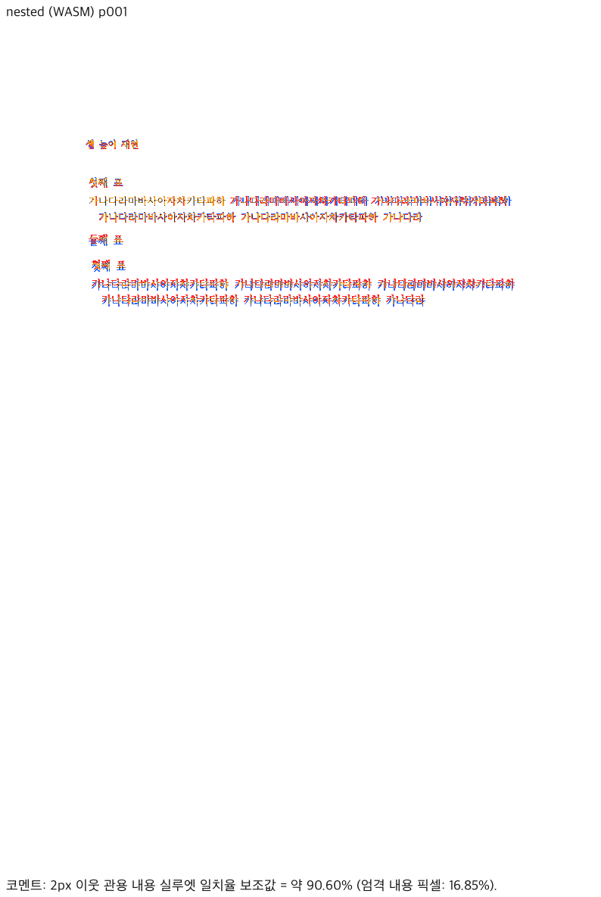

# PR #7433 리뷰 — 저장 LineSeg 없는 TAC 표의 행 성장

## 최종 판정

**머지 보류.** 원본 두 합성 사례의 셀 성장 개선은 확인했으나, 선언 높이 경계의 기존 잘림과 늘어난 표 footprint의 페이지 하단 넘침이 남습니다. GitHub의 정식 Request changes는 별도 확인 후 제출할 조치이며, 이 문서 자체는 review 제출·merge를 뜻하지 않습니다.

## 검토 대상과 출처

| 항목 | 값 |
| --- | --- |
| PR·관련 이슈 | [#7433](https://github.com/edwardkim/rhwp/pull/7433), [#7419](https://github.com/edwardkim/rhwp/issues/7419) |
| 작성자·reviewer | imsebeom / postmelee; 2026-10-01 KST |
| 원 code head | `4905a31d0746fa86e23fe03655f4538079e2d0a1` |
| 원 기능 commit | `52a51c0a97d0df7baab1e815ed820c6dff7ae2bb` |
| 수정 전 parent·PR API historical base | `c80a8370ab294259557c850c2e54495ecd0e79c0` |
| 실제 현재 devel tip | `02530b9ed567a44663edb26c65fb565c4a79f00d`; API ref·Git ls-remote 교차 확인 |
| 최신 devel 통합 검토 head | `e6503bcc315f9efd142e9d66e8a54d500668b578`; 원 두 commit을 순서대로 `-x` cherry-pick |
| 원격 상태 | OPEN, non-draft, maintainerCanModify=true, MERGEABLE/CLEAN |
| metadata | bug·layout·table, v1.0.0, assignee imsebeom, reviewer postmelee; 변경하지 않음 |
| 게시 경로 | 원 PR source head 뒤 single-parent 검토 문서·증적 commit; code/test 변경 없음 |

저장소의 작성자 전체 PR 조회 결과는 #7433 한 건이었습니다. 첫 기여자 절차를 읽고 원 기여의 개선과 보완 요청을 구분했습니다. 원 contributor 두 commit은 수정·rebase·amend하지 않습니다. 로컬 통합 검토 이력은 `refs/codex/review/pr7433/integration-e6503bcc`에 보존했고 contributor fork로 보내지 않습니다.

## 재현된 차단 사항

### P2 — 0.5px 선언 높이 차이에 의존하여 기존 잘림이 남음

`height_measurer.rs:3937–3953`의 `generator_restated_height`는 모든 셀의 NO_LS 및 행 선언 합과 표 선언의 ±0.5px 일치를 요구합니다. 원본에서 첫 표 `hp:sz/@height`만 바꾼 반례는 다음과 같습니다. 내용·폭·셀 선언·문단 속성은 바뀌지 않았습니다.

| 표 선언 HU | 선언 차이 px | 두 줄 셀 높이 px | 셀 clip 하단 px | 둘째 줄 baseline px |
| --- | ---: | ---: | ---: | ---: |
| 4800 | 0 | 38.4533 | 264.5867 | 260.6933 |
| 4836 | 0.4800 | 38.4533 | 264.5867 | 260.6933 |
| 4838 | 0.5067 | 32.5067 | 258.6400 | 260.6933 |

경계를 넘으면 기존 TAC 축소가 다시 선택되어 셀 clip이 둘째 줄 baseline보다 위에 놓입니다. Native의 실제 Chrome 캡처에서 글자 잘림을 확인했고 새 WASM도 같은 좌표를 냅니다. 수정 전 parent에서도 4838HU는 같은 32.5067px였으므로 **기존 결함이 남는 불완전한 수정**입니다. 정상 동작의 회귀로 부르지 않습니다.

독립 근거는 동일 원본 한컴 PDF의 두 줄 존재·점유와 내용이 자신의 셀 clip 안에 있어야 하는 배치 계약입니다. 변형 입력을 한컴에 다시 변환하지 않았으므로 변형의 한컴 출력 일치를 주장하지 않습니다. 임계값을 키우는 보정만으로 완료하지 않고, NO_LS 재조판 줄의 내용 하한을 행 측정과 실제 행 배치가 함께 소비하는지 확인해야 합니다.

### P2 — 늘어난 표 높이가 페이지 예산·실제 배치까지 공유되지 않음

원본 `hp:pagePr/@height`만 84186 → 28000HU로 줄여 선언 높이만 fit하는 예산을 만들었습니다. 독립 기대값은 표의 실제 점유 끝점이 본문 clip 안에 들어가거나 적절히 이월·분할돼야 한다는 계약입니다. 이 변형의 한컴 페이지 수를 정답으로 제시하지 않습니다.

| 단계 | 수정 전 parent | PR code head |
| --- | ---: | ---: |
| 표 시작 y | 194.1333px | 194.1333px |
| 표 높이·끝점 | 64.0000px / 258.1333px | 70.4533px / 264.5867px |
| 본문 clip 하단 | 259.9467px | 259.9467px |
| 실제 table footprint overflow | 없음 | 4.64px; `LAYOUT_OVERFLOW` |

수정 전에는 셀 자체가 작아 내용이 잘리는 결함이 있었습니다. 이를 정상 출력이라고 주장하지 않습니다. 그와 별개로 **변경 후에 새로 늘어난 물리 점유가 본문 밖으로 넘어가는 회귀**를 확인했습니다. 새 WASM의 render tree와 Native/Chrome 캡처 모두 같은 결과이며, body clip에 둘째 줄 하단이 잘립니다.

실제 경로는 `measure_table_impl`의 성장한 row/total → `typeset/table.rs`의 `FormattedTable` → `block/entry.rs`의 선언 높이 생산 → `block/whole_fit.rs`의 HWPX CELL/TAC declared-fit → `entry.rs`의 whole-fit OR 판정 → `place_table_with_text` → 실제 Table/Cell 및 body clip입니다. 공통 측정 값이 있어도 이후의 선언 fit 갈래가 별도로 통째 배치를 허용합니다. 선언만 fit하는 예산·이월 후 첫 배치·뒤 표/문단 보존까지 검사해야 합니다. PR 본문이 pagination을 범위 밖으로 명시했지만, 수용 시 필요한 점유 계약을 대신하지는 않습니다.

## 구현 주장과 조판 원칙 대조

| 주장·원칙 | 판정 | 근거 |
| --- | --- | --- |
| 원본 NO_LS TAC 두 줄 셀 성장 | 충족, 제한된 입력 | 새 정식 case 두 개는 parent에서 2 FAIL, 통합 검토에서 2 PASS; 정확한 source CI도 두 개 PASS |
| 생성 출처·일반 조건 | 미충족: 실행으로 확인한 불완전한 수정 | 0.48 → 0.5067px 경계에서 내용 하한·clip 계약이 깨짐; 숫자 일치만으로 출처를 확정하지 않음 |
| nested NO_LS 성장분의 바깥 칸 반영 | 원본 사례 충족 / 일반 경계 미검증 | 원본 nested host 67.8 → 약 74.2px; 여러 표의 같은/다른 줄 소속, 명시 개행·가용 폭·여백 혼합에 대한 새 delta 가지는 별도 실행하지 않음 |
| 생산 높이 → 예약·fit → 실제 배치 | 미충족: 실행으로 확인한 회귀 | 페이지 예산 반례에서 실제 표 끝점이 body clip보다 4.64px 큼 |
| 편집 후 재조판·저장 정보 재사용 | 미검증 | 무편집 합성 NO_LS 경로 검토; 실제 저장 LineSeg·편집 세션으로 일반화하지 않음 |
| 분할·rowspan·continuation·종료 | 일부 경계 확인 / 일반 경계 미검증 | 선언-only fit 경계·다음 표 p2 확인; 실제 컷 보존·rowspan 동시 종료·후속 각주/캡션은 실행하지 않음 |
| baseline·golden 변경 | 비해당 | 신규 case/fixture 원 기여만 있으며 허용치·기존 baseline 보정 없음 |

## 실행 검증

- 통합 검토 head `e6503bcc…`: `node scripts/rust-test-suite-manifest.mjs --prepare`, `--check --base-ref 02530b9e…` PASS. `node scripts/run-rust-test.mjs issue_7419_no_ls_tac_row_growth -- --cargo-profile release-test --target-dir target/pr-review`: exit 0, 2 PASS / 208 skipped.
- parent `c80a8370…`: source에 같은 새 test/fixture만 일시 복사하고 같은 focused 명령 실행. exit 100, 0 PASS / 2 FAIL / 218 skipped. 일반 높이 32.0, nested host 67.8의 assertion으로 실패했으며 빌드·환경 실패가 아닙니다. 일시 복사본은 동일성 확인 후 정리했습니다.
- 원 code head Native: `cargo build --locked --profile release-test --target-dir target/pr-review --bin rhwp`, exit 0. 각 head별 실행 바이너리를 따로 보존하여 cache의 마지막 빌드를 혼동하지 않았습니다.
- fresh source WASM: 루트에서 `CARGO_TARGET_DIR=target/pr-review scripts/wasm-pack-locked.sh --target web --out-dir output/pr-review/pr7433-review-20261001/source-wasm-pkg --no-opt`, exit 0. Docker daemon이 실행되지 않아 공식 진단 경로를 썼습니다. 최적화된 배포 빌드의 검증을 대체하지 않습니다.
- 전체 로컬 회귀·세 lint·통합 head의 새 WASM은 보류 사유가 확인되어 실행하지 않았습니다. 실행하지 않은 것을 완료로 표시하지 않습니다.

정확한 source의 [Full CI 36122994741](https://github.com/edwardkim/rhwp/actions/runs/36122994741)은 성공했습니다. 실제 A/B/C/D 로그의 합계는 10045 PASS / 50 skipped이며, [Archive D](https://github.com/edwardkim/rhwp/actions/runs/36122994741/job/108047856374)에서 #7419 두 테스트 PASS를 직접 확인했습니다. [Lint](https://github.com/edwardkim/rhwp/actions/runs/36122994741/job/108044903195)의 Native/WASM/workspace 세 Clippy 단계도 성공했습니다. 이 CI는 최신 devel 통합 head의 전체 검증을 대체하지 않습니다.

## 한컴 기준과 Native/fresh WASM Visual Sweep

사용자가 승인한 커밋된 원본 두 파일만 기존 한컴 2024 변환 서비스로 전송했습니다. 엔진 `13.0.0.3901`, 입력 전처리 없음, 각 1쪽, 반환 byte/SHA 일치를 확인했습니다. 합성 원본 출력이며 실제 정상 저장 문서 전반의 정답으로 일반화하지 않습니다. 폰트 파일은 공개하지 않습니다.

| 원본·출력 p1 | pixel match | 내용 픽셀 보조값 | 2px 실루엣 | gate·직접 판독 |
| --- | ---: | ---: | ---: | --- |
| 일반 Native / 새 WASM 각각 | 99.17065% | 18.10631% | 93.72093% | passed; 두 줄 셀 성장, 다음 표 약 4px 위 차이 남음 |
| 중첩 Native / 새 WASM 각각 | 98.76691% | 16.84943% | 90.59971% | passed; 안쪽 표·바깥 셀 성장, 다음 표/중첩 내용 약 4px 위 차이 남음 |

macOS, 96 DPI, Chrome 웹폰트 rasterizer입니다. 한컴뷰어의 `HANBatang.ttf`·`HANDotum.ttf`가 함초롬바탕/돋움과 Unicode cmap을 공급하는 것을 확인하고 full embed로 캡처했습니다. PDF의 embedded family는 HCRBatang입니다. 동일 family가 모든 glyph outline·버전까지 같다는 증거로 쓰지 않았고 font mismatch 예외도 적용하지 않았습니다. Native와 새 WASM 출력·overlay/review를 직접 열어 판독했습니다. `flagged=0`이나 90% gate 통과를 남은 배치 차이의 해결로 바꾸지 않습니다.

| 경로 | review | standalone overlay |
| --- | --- | --- |
| Native 일반 |  |  |
| Native 중첩 |  |  |
| 새 WASM 일반 |  |  |
| 새 WASM 중첩 |  |  |

코멘트: 내용 픽셀 중심 자동 일치율 보조값 = 일반 약 18.11%, 중첩 약 16.85%.
높을수록 좋음: 기준 PDF와 rhwp PNG가 더 비슷함
낮을수록 나쁨/검토 필요: 잉크 위치나 형태 차이가 큼
단, 사람 판정 정확도가 아니라 내용 픽셀 중심 자동 일치율 보조값입니다.

명령·입력/기준/바이너리 해시·원본 생성 방식·최종 자산과 임시 compare/overlay/review 경로는 [증적 README](../assets/pr_7433/README.md)에 모았습니다. [사전 판정 보고서](pr_7433_report.md)는 보정 선택과 재검토 조건을 기록합니다.
