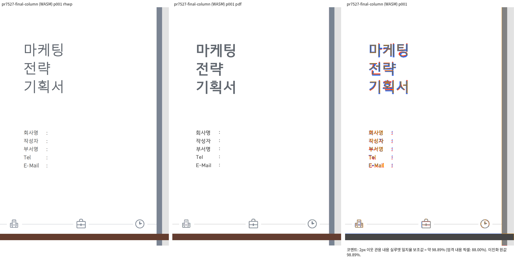
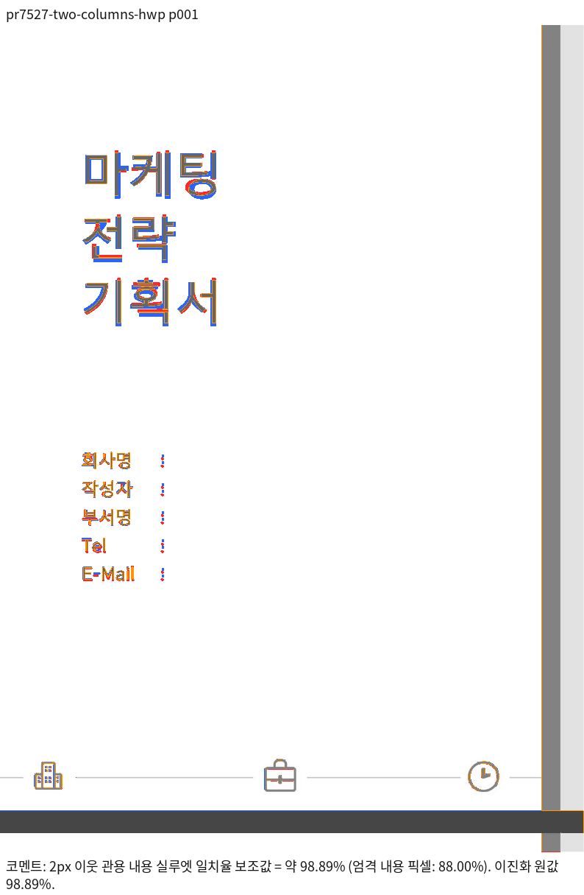

# PR #7527 리뷰 — 수정: #7523 바꾼 단 정의를 HWP 저장본에 싣는다

## 최종 판정

**머지 보류 — 누적 후보 검증 진행 중.** 원 head의 CI와 이번 누적 head의 실행 결과를 구분한다. 필수 코드·회귀·시각 검증 결과를 확인한 뒤 판정을 갱신한다.

## 접수 정보

- 원 PR: [#7527](https://github.com/edwardkim/rhwp/pull/7527), semanticist21, devel 대상, non-draft.
- 원 head: `34310be3b84cc39ad9d06ad3eebb27f595eca7ca`; 접수 시점 `MERGEABLE` / `CLEAN`. 원 head의 상태이며 누적 후보 판정이 아니다.
- 누적 branch: `review/semanticist21-20261005`; 고정 base `cdba77b609c399fdef26a6c9e637716aa32c2177`; 누적 code candidate `1d809afe7b965c9ea6137012d59d139d63b038d0`.
- Reviewer: jangster77 지정. 기본 maintainer_general; intake_and_review, local_validation, multi_pr_update_branch, 렌더 영향 시 visual_fixture_evidence를 적용.
- 관련 이슈: #7523.
- 사용자 지시: non-draft 19건을 번호 순으로 누적 체리픽; 충돌은 메인터너 보정; 원 PR별 리뷰 기록을 개별 작성.

## 적용 이력

| 원 commit SHA | 상태 | 로컬 적용 SHA | 메인터너 보정 |
| --- | --- | --- | --- |
| `34310be3b84cc39ad9d06ad3eebb27f595eca7ca` | applied | `e51b8d26eddf644e5af8329e8d159a8cfa445585` | — |

원 저자와 `cherry-pick -x` 출처를 보존했다. 이미 patch-id가 같은 원 commit은 중복 적용하지 않았다. 원 contributor branch는 수정하지 않았다.

## 변경·소비 경로 검토

- `src/document_core/commands/text_editing.rs`
- `src/serializer/control.rs`

set_column_def는 편집 후 stale raw_attr를 비우고 단 수와 widths 계약을 정리한다. serialize_column_def는 불완전 혼합 폭 입력을 동일 폭으로 기록하며 실제 count개 레코드를 발행한다.

동일 폭/혼합 폭/단 수 변경과 CLI dry-run·잘못된 입력 출력 계약을 검사한다. 기존 임의 raw_attr를 갖는 합성 입력은 정상 생성본과 구분한다. 합성 입력의 계약 결과를 한컴 출력과의 일치 증거로 바꾸지 않는다.

## 검증 입력·결과

- `tests/cases/issue_7523_column_def_hwp_save.rs` (3개 테스트): 누적 head 실행 3 PASS / 0 FAIL
- `tests/cases/set_column_def_contract.rs` (4개 테스트): 누적 head 실행 4 PASS / 0 FAIL

- 로컬 Cargo는 공유 `target/pr-review`에서 순차 실행한다. 같은 원 head의 CI를 19건 누적 후보의 전체 검증으로 재사용하지 않는다.
- 필수 fmt·Native/WASM/workspace-all-targets Clippy·workspace build·manifest/base 정책·source unit tier 검사: PASS. 전체 Rust·Native Skia·fresh WASM 및 직접 시각 검증은 진행 중.
- focused: `output/pr-review/semanticist21-20261005/run-records/focused-command.json`의 20 case 필터, 전체 74건 중 73 PASS / 1 FAIL. PR별 결과는 위 case 항목에서 구분한다. 실행 증거: `output/pr-review/semanticist21-20261005/logs/focused.log`.
- 실제 HWP/HWPX/PDF 입력과 commit의 해시, 독립 기준, source/build provenance: 입력 사용 시 기록한다.
- source 교정 또는 검사 실패가 생기면 이 PR의 보정과 재실행을 별도로 기록한다. Golden/baseline/래칫을 완화하지 않는다.

## 원 head CI 참고값

- Lint (fmt, clippy, WASM check): SUCCESS
- Build & Test: SUCCESS
- CI Impact Policy: SUCCESS

## 조판·시각 판정

적용 여부와 필요한 직접 증거를 확인 중이다. 원 PR 제공 before/after·수치를 누적 head의 Visual Sweep 통과로 간주하지 않는다. 자료 부족과 실제 회귀를 구분하여 미검증/미충족으로 판정한다.

## 남은 범위·후속 처리

원 PR 전체 해결 여부와 이슈 종료 표현은 직접 검증한 범위로 제한한다. 이 기록은 로컬 누적 검토이며 원격 approve/comment/merge를 의미하지 않는다. 통합 결과는 같은 누적 branch에 두고 원 PR별 판정이 확정된 뒤 게시 범위를 결정한다.

## 최종 공통 회귀 결과 (폼 source cf2336295)

Rust source `cf2336295540ea8ce3e94eb6517cb406fca8d28f`, 정책 base `cdba77b609c399fdef26a6c9e637716aa32c2177`에서 fmt·Clippy Native/WASM/workspace-all-targets·workspace build·manifest/unit tier 정책 PASS. 전체 nextest10,437건 중10,436 PASS/1 FAIL/50 SKIP이며 실패는 #7491의 편집 뒤 표 우변 assertion1건이다. 이 실패는 고정 base에서도 관측했다. Native Skia lib·missing picture2개·direct PDF4개·ComboBox4개·암호4개는 모두 PASS다. 명령/exit/시간은 검증 정본 (`output/pr-review/semanticist21-20261005/run-records/appearance-final-validation.json`), 요약과 원 로그 SHA는 실행 요약 (`output/pr-review/semanticist21-20261005/run-records/appearance-final-validation-summary.txt`)에 보존했다.

#7491은 사용자가 지정한 실패 입력에서 MCP 재산출 PDF·90% 시각 gate와 독립 기대값을 추가 검증 중이며, #7521의 loose inline 길이 제한 우회도 보류 사유로 남는다. 전체 회귀 통과 또는 통합 merge를 선언하지 않는다. 이후 Rust source/test 변경에는 이 결과를 그대로 승계하지 않고 해당 검증을 다시 수행한다.

## upstream/devel 위 rebase 적용 위치 — 2026-10-05

기준 `c167dc6abbebf69546575e2d16d06223791bab82`. 아래는 현재 이력의 실제 적용 위치이며 위의 이전 검증 SHA는 당시 이력으로 보존한다.

| 원 commit SHA | rebase 전 로컬 SHA | 현재 적용 SHA | 상태 |
| --- | --- | --- | --- |
| `34310be3b84cc39ad9d06ad3eebb27f595eca7ca` | `e51b8d26eddf644e5af8329e8d159a8cfa445585` | `a2102878c29290ddf59816463e95ac63a9d7df5f` | rebased |

원 저자와 cherry-pick 출처를 유지했다. #7491의 원4개는 #7599를 통해 이미 base에 포함되어 중복 적용하지 않았다. 메인터너 보정과 개별 리뷰 기록은 재배치했다. 최종 후보의 시각·전체 회귀 및 CI는 별도 확인한다.

## 2026-10-06 직접 판독에서 발견한 저장 경계 오인

최신 Native 재출력의 3쪽 실루엣은93.57765%/98.78769%/99.98564%지만, p1의 회사명·작성자 블록은 한컴 Print의 왼쪽 제목 아래와 달리 오른쪽 단 상단에 있다. 누름틀 안내문은 사용자 지시에 따라 비교 대상에서 제외하되 이 실제 본문 위치 차이는 제외하지 않는다. 90% 점수만으로 이 입력을 승인하지 않는다.

실제 API로 단 폭을 바꾼 입력의 재조판 LineSeg는 문단 내부 원점0과 `TAG_IMPLEMENTATION_PROPERTY`를 갖는다. 여러 줄인 제목 끝6500→다음 문단 첫0을 `apply_stored_paragraph_boundary`가 저장 쪽/단 되감김으로 해석해 p4부터 오른쪽 단으로 넘긴다. 이는 균등 배분이 아니라 문단 내부 좌표와 저장 쪽 좌표의 혼동이다. **재조판 줄 생산 → stored_reset의 앞/뒤 LineSeg 수용 → advance_column_or_new_page → PageItem의 단 소속 → 실제 column 원점**을 추적했다. legacy pagination/engine은 이미 synthetic 줄을 제외한다. 같은 원칙으로 Typeset도 양쪽 경계의 유효한 저장 줄만 수용하고 명시적 단나누기는 entry의 별도 계약을 유지해야 한다. 아직 보정/새 source 검증 전이다.

Typeset의 curr.first/prev.last 수용에 `!is_synthetic_line_seg`를 적용했다. 같은 입력·Print의 Native 3쪽은98.88948%/98.78769%/99.98564%이고, p1 회사 정보가 왼쪽 제목 아래로 돌아온 것을 직접 review/overlay에서 확인했다. 원본·보정 전93.57765% 출력은 보존한다. 글꼴 굵기 등 잔여 raster 차이와 누름틀 안내문은 위치 수정의 증거와 구분한다. fresh WASM 전쪽 검증과 관계 회귀 추가는 아직 진행 중이다.

## 2026-10-06 보정 후 독립 출력·관계 회귀

- production source `2b1f21ef1ab35a13ebcae11f562a3ebf3a998e4d`, base `c167dc6abbebf69546575e2d16d06223791bab82`.
- 실제 단 폭 편집·저장 입력: [HWP](../assets/semanticist21-20261005/pr7527/pr7527-two-columns.hwp), SHA-256 `f8fc3f24f7c46e8a9bea86e0af26298e583eb9a5fa242526a3542590b78a2086`. 독립 [한컴 2020 Print PDF](../../../pdf/semanticist21-20261005/pr7527/mcp/pr7527-two-columns-2020.pdf), SHA-256 `b08104e9ed8bf5f94340dcbb333c462f6ec7edb8a2c5a1a34242c0e48222796d`. 원 입력과 Print는 변경하지 않았다.
- Native/fresh WASM 모두 전체 3쪽:98.88948% / 98.78769% / 99.98564%, gate `passed`, 누락 쪽0. fresh WASM SHA-256 `24565cae976b3c6929c858f13c52785a4651a26dc61c0fd566f5a8f801d631f7`; root pkg/Studio 해시 일치 확인.
- 직접 review/overlay에서 회사명·작성자·부서·연락처가 왼쪽 제목 뒤에 놓이고, 2·3쪽의 이미지·목차·본문 순서가 유지됨을 확인했다. 글꼴 굵기/래스터 차이는 남으며 font exception은 사용하지 않았다. 누름틀 안내문은 사용자 지시에 따라 Print 비교에서 제외한다.
- 정식 `tests/cases/issue_7523_column_def_hwp_save.rs`에 `reflowed_paragraph_local_positions_do_not_advance_column`을 추가했다. 단 소속·첫 단 내부 포함·제목 뒤 순서·3쪽 내용 누락/중복을 검사하며 절대 픽셀 좌표를 고정하지 않는다. 보정 전 보존 library에서 회사명의 단 소속1로 FAIL(exit101), 보정 후 소속0 및 모든 관계 PASS(exit0). 기존 3개 단 정의 저장 계약과 명시적 단나누기 대조군은 최종 전체 nextest로 확인한다.
- 명령: `python3 scripts/visual_sweep.py --hwp mydocs/pr/assets/semanticist21-20261005/pr7527/pr7527-two-columns.hwp --pdf pdf/semanticist21-20261005/pr7527/mcp/pr7527-two-columns-2020.pdf --key pr7527-final-column --rhwp-bin target/pr-review/release-test/rhwp --embed-fonts=full --wasm-pkg pkg --out output/pr-review/semanticist21-20261005/column-reset-final-wasm-review`.
- raw TSV·빌드/수정 전후 로그는 ignored `output/pr-review/semanticist21-20261005`에 보존한다. 최종 lint·전체 회귀·CI·merge는 아직 진행 중이며 이 부분 결과만으로 승인하지 않는다.

