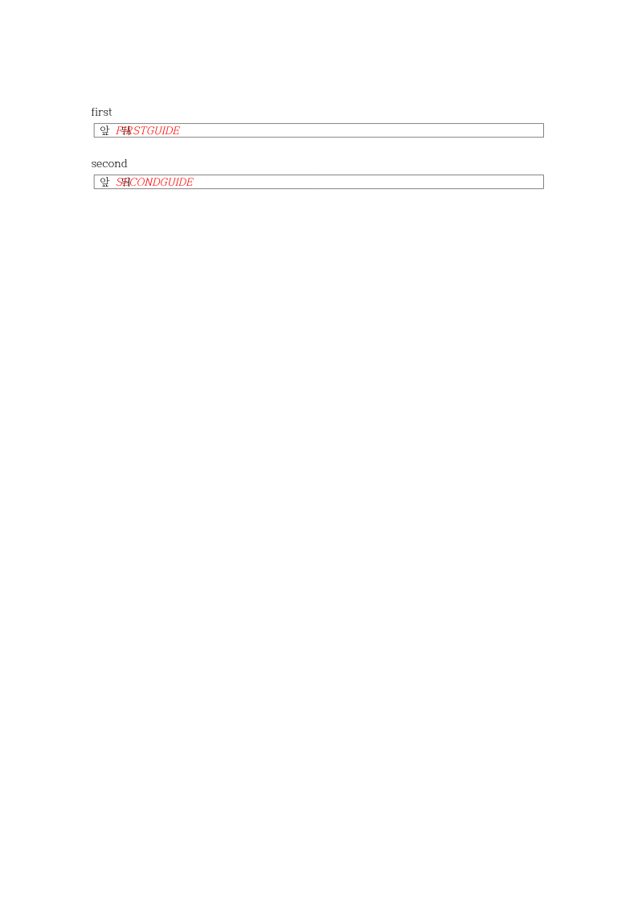
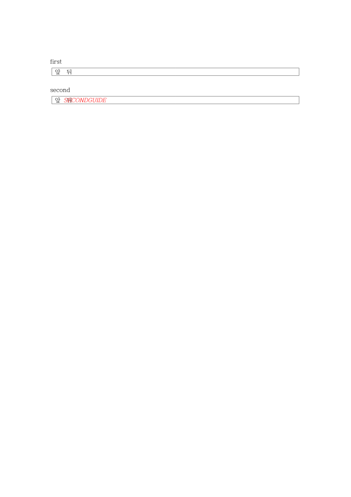
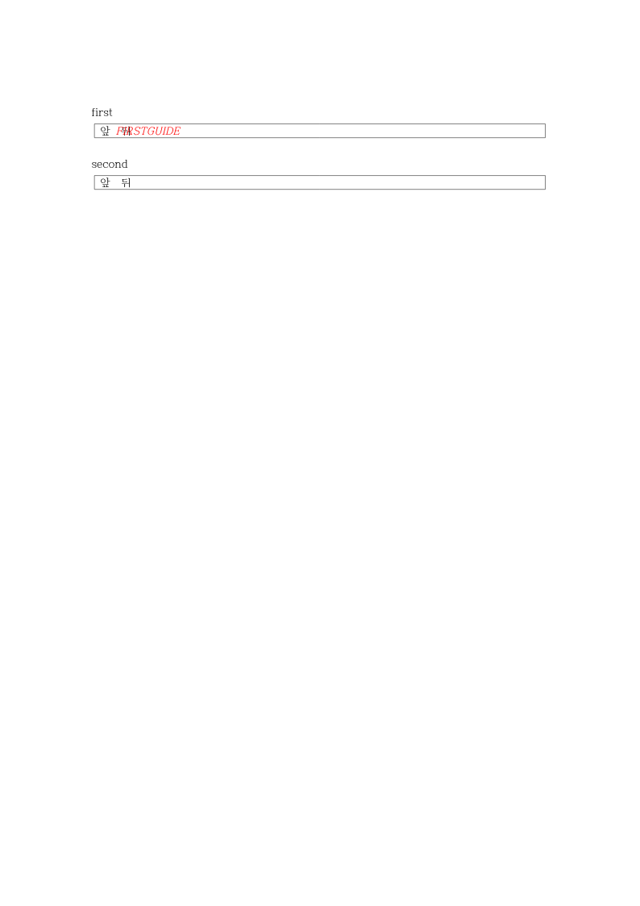

# PR #7565 리뷰 — fix: isolate active cell ClickHere fields by their complete address

## 최종 판정

**머지 보류 — 누적 후보 검증 진행 중.** 원 head의 CI와 이번 누적 head의 실행 결과를 구분한다. 필수 코드·회귀·시각 검증 결과를 확인한 뒤 판정을 갱신한다.

## 접수 정보

- 원 PR: [#7565](https://github.com/edwardkim/rhwp/pull/7565), semanticist21, devel 대상, non-draft.
- 원 head: `71c6dc8959f4d79acd449fb88b916ae27affc9c3`; 접수 시점 `MERGEABLE` / `CLEAN`. 원 head의 상태이며 누적 후보 판정이 아니다.
- 누적 branch: `review/semanticist21-20261005`; 고정 base `cdba77b609c399fdef26a6c9e637716aa32c2177`; 누적 code candidate `1d809afe7b965c9ea6137012d59d139d63b038d0`.
- Reviewer: jangster77 지정. 기본 maintainer_general; intake_and_review, local_validation, multi_pr_update_branch, 렌더 영향 시 visual_fixture_evidence를 적용.
- 관련 이슈: PR 본문과 실제 변경 범위에서 추가 확인 필요.
- 사용자 지시: non-draft 19건을 번호 순으로 누적 체리픽; 충돌은 메인터너 보정; 원 PR별 리뷰 기록을 개별 작성.

## 적용 이력

| 원 commit SHA | 상태 | 로컬 적용 SHA | 메인터너 보정 |
| --- | --- | --- | --- |
| `7ce5c927e353bed3b5585641ef74c477efee383c` | applied | `cc26e29c87e7ca5dc12936ade2e2fae79c369056` | — |
| `a65a7664a9d6bc92dc4a9a378c1fcb2af99368df` | applied | `f691401c7e49558920cc4cbaf93414f788f91802` | — |
| `e36568fb931a4f24aefed82f4d417931c1bd140e` | applied | `34d236cb5f4962d8c18e92b4be21b52af1baba90` | — |
| `71c6dc8959f4d79acd449fb88b916ae27affc9c3` | applied | `94c71d28c081511b0b7ee8958e9672e61970c458` | — |

원 저자와 `cherry-pick -x` 출처를 보존했다. 이미 patch-id가 같은 원 commit은 중복 적용하지 않았다. 원 contributor branch는 수정하지 않았다.

## 변경·소비 경로 검토

- `src/document_core/commands/text_editing.rs`
- `src/document_core/mod.rs`
- `src/document_core/queries/field_query.rs`
- `src/renderer/layout.rs`
- `src/renderer/layout/paragraph_layout.rs`

ActiveFieldInfo.para_idx는 body host 문단이며 cell_path는 모든 단계의 control/cell/paragraph를 포함한다. field query·편집 소비자·paragraph_layout의 active guide 비교가 같은 주소를 사용한다.

두 host와 중간 셀 문단이 다른 nested table을 검사한다. guide는 screen profile 대상이므로 print PDF의 안내문 제외를 기대 화면으로 사용하지 않는다. 합성 입력의 계약 결과를 한컴 출력과의 일치 증거로 바꾸지 않는다.

## 검증 입력·결과

- `tests/cases/clickhere_cell_parent_identity.rs` (4개 테스트): 누적 head 실행 4 PASS / 0 FAIL

- 로컬 Cargo는 공유 `target/pr-review`에서 순차 실행한다. 같은 원 head의 CI를 19건 누적 후보의 전체 검증으로 재사용하지 않는다.
- 필수 fmt·Native/WASM/workspace-all-targets Clippy·workspace build·manifest/base 정책·source unit tier 검사: PASS. 전체 Rust·Native Skia·fresh WASM 및 직접 시각 검증은 진행 중.
- focused: `focused-command.json`의 20 case 필터, 전체 74건 중 73 PASS / 1 FAIL. PR별 결과는 위 case 항목에서 구분한다. 실행 증거: `output/pr-review/semanticist21-20261005/logs/focused.log`.
- 실제 HWP/HWPX/PDF 입력과 commit의 해시, 독립 기준, source/build provenance: 입력 사용 시 기록한다.
- source 교정 또는 검사 실패가 생기면 이 PR의 보정과 재실행을 별도로 기록한다. Golden/baseline/래칫을 완화하지 않는다.

## 원 head CI 참고값

- Lint (fmt, clippy, WASM check): SUCCESS
- Build & Test: SUCCESS
- CI Impact Policy: SUCCESS

## 조판·시각 판정

적용 여부와 필요한 직접 증거를 확인 중이다. 원 PR 제공 before/after·수치를 누적 head의 Visual Sweep 통과로 간주하지 않는다. 자료 부족과 실제 회귀를 구분하여 미검증/미충족으로 판정한다.

## 남은 범위·후속 처리

원 PR 전체 해결 여부와 이슈 종료 표현은 직접 검증한 범위로 제한한다. 이 기록은 로컬 누적 검토이며 원격 approve/comment/merge를 의미하지 않는다. 통합 결과는 같은 누적 branch에 두고 원 PR별 판정이 확정된 뒤 게시 범위를 결정한다.

## fresh WASM 화면 계약

Chromium 실제 Canvas를 inactive → first → second → clear 순서로 직접 확인했다. guide run은 `[FIRSTGUIDE, SECONDGUIDE]` → `[SECONDGUIDE]` → `[FIRSTGUIDE]` → `[FIRSTGUIDE, SECONDGUIDE]`; clear SVG는 초기 SVG와 byte 동일하다. 본문·표 외곽과 다른 누름틀은 유지되고 선택한 안내문만 숨겨진다. [관측](../assets/semanticist21-20261005/browser-observations.json). 사용자 지시에 따라 이 안내문은 PDF에서 보이지 않는 것이 정상이며 PDF 비교 대상에서 제외했다.

## 최종 공통 회귀 결과 (폼 source cf2336295)

Rust source `cf2336295540ea8ce3e94eb6517cb406fca8d28f`, 정책 base `cdba77b609c399fdef26a6c9e637716aa32c2177`에서 fmt·Clippy Native/WASM/workspace-all-targets·workspace build·manifest/unit tier 정책 PASS. 전체 nextest10,437건 중10,436 PASS/1 FAIL/50 SKIP이며 실패는 #7491의 편집 뒤 표 우변 assertion1건이다. 이 실패는 고정 base에서도 관측했다. Native Skia lib·missing picture2개·direct PDF4개·ComboBox4개·암호4개는 모두 PASS다. 명령/exit/시간은 [검증 정본](../assets/semanticist21-20261005/appearance-final-validation.json), 요약과 원 로그 SHA는 [실행 요약](../assets/semanticist21-20261005/appearance-final-validation-summary.txt)에 보존했다.

#7491은 사용자가 지정한 실패 입력에서 MCP 재산출 PDF·90% 시각 gate와 독립 기대값을 추가 검증 중이며, #7521의 loose inline 길이 제한 우회도 보류 사유로 남는다. 전체 회귀 통과 또는 통합 merge를 선언하지 않는다. 이후 Rust source/test 변경에는 이 결과를 그대로 승계하지 않고 해당 검증을 다시 수행한다.
