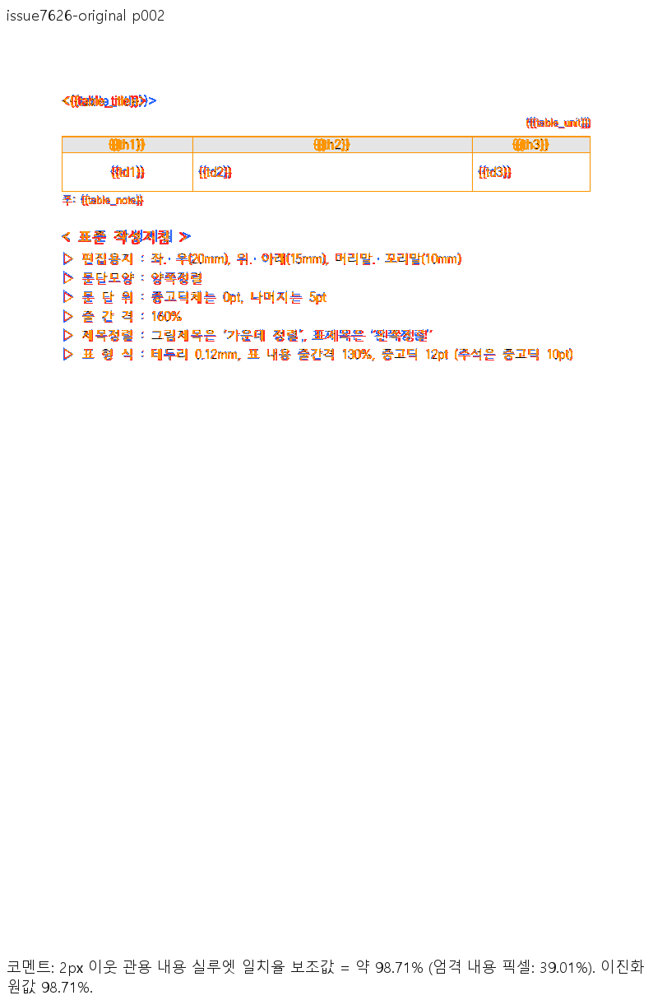
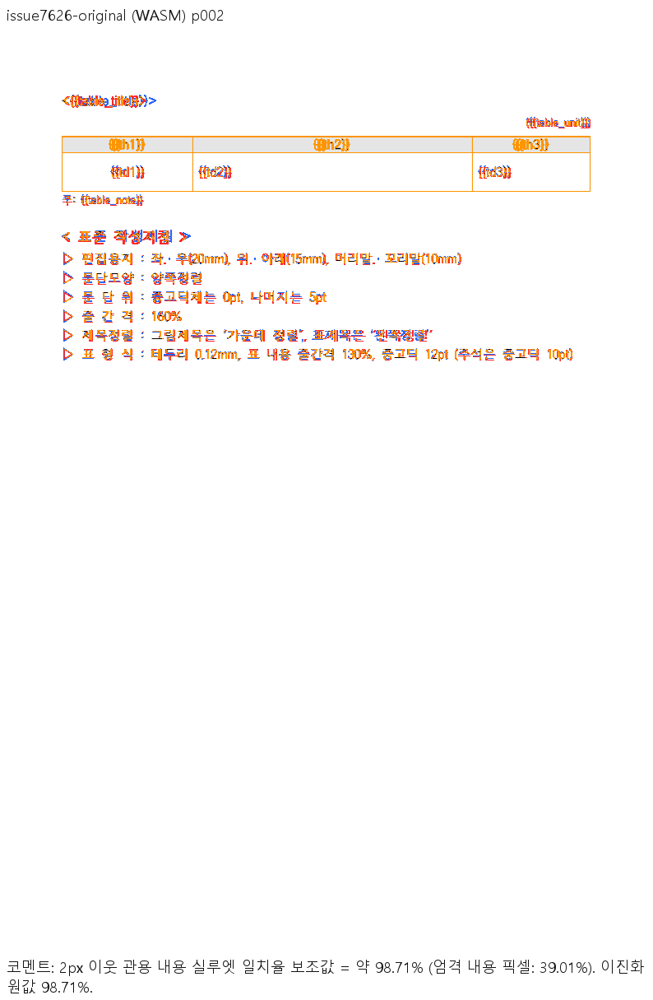

# PR #7643 리뷰 — 미배치 줄 캐시와 문단 끝 높이의 쪽 예산 복원

## 최종 판정

**승인.** 원본 2쪽의 문단 소속과 마지막 물리 줄의 공간을 복원한 범위에서 독립 한컴 Print·정식 회귀·Native/fresh WASM 비교와 최초 Full CI를 충족했다. 이는 collaborator self-review이며 GitHub 본인 PR Approve event와 구분한다. 사용자는 최초 CI 완료 후 오늘할일·review trailing commit, 최종 CI 완료 후 일반 merge와 후속 처리를 승인했다. 병합 전 정확한 후행 head의 CI·policy·mergeability를 다시 확인한다.

## 접수 정보

| 항목 | 값 |
| --- | --- |
| PR·작성자·base | [#7643](https://github.com/edwardkim/rhwp/pull/7643) / jangster77 / devel |
| 검증 code / 최초 제출 candidate | `b79f283b614be07e32cc2657d4f72ee3d0335285` / `c9d776317081290ffc4e53d71409f9f2fc7b3f84` |
| 로컬 검증 시작 base / 최초 CI base | `fe9ffd27e91d8d260fbccde5ff68aa08aadf94ca` / `b34fa18d74391a583efe8f5b4db8e84d36e130dd` |
| 관련 이슈 | [#7626](https://github.com/edwardkim/rhwp/issues/7626) 열기·쪽 배치 문제를 종료 |
| 작성 시점 상태 | 최초 candidate MERGEABLE/CLEAN, 31 SUCCESS / 4 SKIPPED, 실패·대기 없음 |
| route | collaborator_self_merge; intake_and_review, local_validation, visual_fixture_evidence, review_only_fast_pass, post_merge |

모 문서·조건별 선택표·위 역할/보조 문서와 review_template, github_operations를 읽었다. 최초 CI가 끝난 뒤 이 두 문서만 single-parent 후행 commit으로 추가한다. 다른 devel 기록 때문에 source를 반복 rebase하지 않는다. latest-base merge-tree의 링크·기록 보존은 push 전 검사하고 그 결과를 ignored 실행 기록에 보존한다.

## 변경과 검토 범위

구역의 genuine source LineSeg 전체가 폭·가로 원점·세로 원점 없이 미배치일 때만 렌더 사본의 캐시를 제외한다. 원본 document/composed 저장 정보는 보존한다. 유효 높이 사다리와 폭 0 표 host, 생성 줄, HWP3 기하는 해당 조건과 구분한다. 마지막 빈 CharShapeRef의 크기는 `ParagraphEnd`인 마지막 물리 줄의 공통 frame 높이·간격·기준선에만 반영한다. 문서 ID 예외나 좌표 clamp는 없다.

생산/소비와 실제 호출 경로는 [조사 기록](../../tech/investigations/issue-7626/README.md)에 있다. `rendering.rs:5900` 파생 문단 → `:5183` 선택 → `:5235` 표 측정 → `:5331` TypesetEngine 조판으로 이어진다. 본문 예산은 `typeset/section/flow.rs:122` format → `paragraph/format.rs:55` 줄 메트릭/`:93` total_height → `paragraph.rs:627` 예산 → `:109` scan/`:122` 컷 → `:142` 계획/`:161` 예약이다. 계획 실패 시 같은 cursor를 다음 쪽에서 검사하고 마지막 줄 소비 후 종료한다. HeightMeasurer 본문 fallback은 프로덕션 문단 예산의 입력이 아니다.

## 조판 원칙 준수 검토

| 항목 | 독립 근거·실제 검사 | 판정 |
| --- | --- | --- |
| 구현 근거와 일반성 | 원본 Print 2쪽, 전체52개 미배치 source 줄, 한컴 재저장 유효 높이 사다리. 전체 구역 조건·생성/HWP3 제외를 실제 diff와 대조 | 충족 |
| 측정·배치 일관성 | 공통 frame 종단 메트릭을 format/예산/paint가 소비. fallback 본문 높이와 구분. 같은 Print 경계의 두 backend 비교 | 충족 |
| 분할·이어받기 | 원본 p27/p28 쪽 소속·41개 소유 순서·누락/중복·본문 포함과 다음 표/주석 검사. scan/컷/계획/예약/종료 실제 경로 확인. rowspan/clipping 내용 컷 알고리즘의 신규 보정은 없음 | 충족(이번 문단 예산 범위) |
| 줄 소속·점유 높이 | 한컴의 마지막 줄 1200HU 및 뒤 진행1920HU; 두 줄 반례의 앞줄1600HU. 유효 저장 HWP host 보존 | 충족 |
| 증거 독립성 | 실제 원본과 합성 개행 변형을 구별하고 각 형식을 독립 Print. 동일 정식 test source의 기준 CLI 1 PASS/2 FAIL → 수정3 PASS | 충족 |
| 기준값 변경 | oracle 신규4행은 canonical PDF 선택기로 재계산해 모두2쪽, 반복 bytes 동일. 다른 baseline/golden/허용치 완화 없음 | 충족 |
| 주장과 범위 | 로컬·Full CI·전16쌍 Sweep·직접 판독 연결. 편집 저장본 독립 Print/배제 구간별 종단 스타일/macOS 한컴 재생성은 미검증 | 충족(열기·쪽 배치 범위) |

## 검증 입력 커밋 확인

**충족.** 실제 입력/기준 PDF 8개를 최초 제출 candidate의 Git blob과 비교했다. 생성 방식·출처·한컴 제품/Print 설정은 [sample README](../../../samples/issue7626/README.md)에 있다. 두 줄 HWPX는 원본 ZIP의 단위 표기에 명시적 개행과 같은 텍스트를 추가한 합성 입력이고, 그 HWP는 한컴 재저장이다. 합성의 수동 캐시를 원본 저장본의 수용 조건 근거로 쓰지 않는다.

| 저장소 경로 | SHA-256 |
| --- | --- |
| `samples/issue7626/end-run-two-lines.hwp` | `0dd5cf4573901716e58700bfab60f6c308ba58ab5af6d47d7bd6c9e43de11e22` |
| `samples/issue7626/end-run-two-lines.hwpx` | `444ca7fe666cf64e9d044718f17a20959d1e42a7a318a739e34c3f6e85e7d16f` |
| `samples/issue7626/hancom-resaved.hwp` | `5856ad9002cce54a53b831dc7ca557e4da6e3a56f652c738ca74072dea640cfe` |
| `samples/issue7626/sample-document.hwpx` | `8fa018bafb94ae023ed1a9be50cd710bec2a09ee19d76dbc755bb1ba0310ed92` |
| `pdf/issue7626/end-run-two-lines-hwp-2020.pdf` | `9f11266aa551d8122fd80ab656c70a3ee9ca00507d3a5f466a8d9ecaaca12f5a` |
| `pdf/issue7626/end-run-two-lines-hwpx-2020.pdf` | `f79a1795430cf2af645ef8724e8f3a1d2e5bcd0cc1ee0d5a1d4e00c4f214bff8` |
| `pdf/issue7626/hancom-resaved-hwp-2020.pdf` | `fd4fac16f44ff0ade3623d48d8d6527f013298df5dd872a50e9556139639124f` |
| `pdf/issue7626/sample-document-hwpx-2020.pdf` | `2fd348b692e2c555bc33dd26c4feb2f5ed5f33e2f3a7ce2214b515836e5d1546` |

## 로컬 검증 결과

Windows 네이티브 review worktree에서 파생 suite를 준비하고 공유 `target/pr-review`를 순차 사용했다. 정확한 code source 이후 source/test/fixture 보정은 없다. generated suite/manifest와 원시 실행 로그/TSV는 커밋하지 않았다.

| 검사 | 실제 결과 |
| --- | --- |
| 전체 nextest release-test, threads8/build jobs2 | 10,506 PASS / 0 FAIL / 50 skipped |
| 집중 #7626 정식 integration | 3 PASS / 0 FAIL |
| fmt, native/WASM32 lib/workspace all-target Clippy, workspace build | 모두 exit0 |
| manifest 고정 base 비교·Node manifest 계약 | PASS / 23 PASS |
| Native Skia lib | 3,927 PASS / 0 FAIL / 13 ignored |
| Native Skia placeholder / direct-PDF | 2 PASS / 4 PASS |
| 신규4문서 보안 입력 | 명시 JSON을 전달한 detector 검사 PASS |
| corpus IR/cell-overflow/off-canvas/text-overlap/body-overflow/oracle | 전체 회귀 PASS, oracle 신규4행 재계산2쪽 일치 |
| Node24.19.0 fresh WASM 직접 진입 | 4입력 pageCount2, print SVG/tree 생성 PASS |
| source-side cfg(test)/Studio/npm 변경 검사 | 변경 없어 비해당 |

외부 clipping controlset92개는 두 checkout에 없어 **미검증**(0 checked/92 missing)이며 통과로 세지 않는다. filesystem-wide redirect 탐색 보조 명령은 ignored cache를 순회해 중지했고 PASS로 기록하지 않았다. 제출 gate의 Markdown 링크는 실제 Git merge tree의 대상 존재·최신 오늘할일 보존으로 확인한다. 다음 전체 회귀부터 사용자 지시대로 `--test-threads 10`을 사용한다.

## 시각 증적과 남은 차이

네 입력의 2쪽 전체를 Native release-test/fresh WASM release로 비교한16쌍이 모두 gate passed이고 90% 미만·누락·미측정0, 최저 **98.70902%**다. 원본/HWP 대조군 최저98.70902%, 두 줄 HWPX/HWP 반례 최저98.85353%다. [Native 전쪽 TSV 원본/출력 provenance](https://gist.github.com/jangster77/e2e5e9328a9613ba21d30268acab7d16)은 공개 후 로컬 bytes와 다시 비교했다.

한컴2020 `11.0.0.9136`, 전처리 없음, session0, 1-up Print의 독립 PDF다. PDF 메타데이터 Creator0.0.0.0을 실제 빌드로 추정하지 않는다. Native/fresh WASM의 실제 빌드 source는 `926b363f78c46fb6f49cf552a95666c373fa9b04`이며 production source가 검증 code SHA와 같은 것을 Git diff로 확인했다. 원본/대조군은 rebase 후 재출력, 반례는 commit 입력과 같은 bytes의 기존 캡처임을 구별했다. wrapper lock의 wasm-bindgen0.2.127, no-install/no-opt, Windows 글꼴 공급, binary/package 해시는 조사 기록에 연결했다.

원본/대조군 p1과 네 입력의 Native/WASM p2 review·standalone overlay를 직접 판독했다. 본문 소속·순서·단위 줄·표 괘선·뒤 주석/작성지침의 경계는 Print와 맞고 누락/겹침이 없다. 제목선 색상/그라데이션과 글꼴 획·농도 차이가 남는다. 지표는2px 관용 내용 실루엣이며 원본 strict ink match 최저23.383%, 평균31.19566%를 전체 fidelity98.71%로 바꾸지 않는다. 전체 이미지/명령/TSV해시는 조사 기록과 최초 PR 본문에 있다.

| 원본 p2 경로 | review | standalone overlay |
| --- | --- | --- |
| Native |  |  |
| fresh WASM |  |  |

## 최초 원격 CI

- [CI Impact Policy Controller](https://github.com/edwardkim/rhwp/actions/runs/37620897561): success, exact candidate SHA.
- [Adapter inter-diff](https://github.com/edwardkim/rhwp/actions/runs/37620898081): success, exact candidate SHA.
- [Proptest roundtrip](https://github.com/edwardkim/rhwp/actions/runs/37620897797): success, exact candidate SHA.
- [Render Diff](https://github.com/edwardkim/rhwp/actions/runs/37620897562): success, exact candidate SHA.
- [CodeQL](https://github.com/edwardkim/rhwp/actions/runs/37620898322): success, exact candidate SHA.
- [CI](https://github.com/edwardkim/rhwp/actions/runs/37620898471): success, exact candidate SHA.

위 Full CI와 31 SUCCESS/4 SKIPPED rollup을 확인한 뒤 기록을 작성했다. `CI Impact Policy`는 최초 감사가 missing-workflow 스냅샷으로 pending을 발행했지만, 정확히 PR7643/head `c9d776317081290ffc4e53d71409f9f2fc7b3f84`에 귀속된 [controller run37623261859 attempt2](https://github.com/edwardkim/rhwp/actions/runs/37623261859/attempts/2)의 audit/published state success와 실제 commit status success를 확인했다. workflow 종료 성공과 발행 상태를 구분한다. 후행 commit은 이 review·오늘할일만 포함하며 최신 head의 재사용 판정과 CI를 다시 확인한다.

## Merge 후 contributor PR comment 계획

최종 후행 head의 CI/policy·mergeability·SHA 재확인 → 일반 squash merge(`--match-head-commit`, admin 우회 없음) → duration refresh 성공/증거 부족 보류 확인 → devel fast-forward → issue7626 종료 확인/필요시 수동 종료·한국어 후속 댓글 → PR 후속 댓글 → 작업 전용 branch/worktree 정리 순서다. 머지 뒤 검증 workflow를 재실행하지 않는다.

댓글은 실제 merge SHA와 최종/후보 CI run URL, [Visual Sweep 정본](../../manual/verification/visual_sweep_guide.md#github-merge-comment), merged 조사 기록과 Native TSV 원본을 포함한다. 원본 p2 Native/WASM review·standalone overlay 네 이미지를 동일 merge SHA raw URL로 실제 Markdown 표시하고, 전16쌍 최저98.70902%·본문/표/주석 소속 판독·남은 제목선/글꼴 차이·clipping외부자료/편집Print 미검증을 명시한다. asset의 devel 존재와 bytes를 확인한 뒤 UTF-8 without BOM body-file로 게시하고 API로 한글/BOM을 재확인한다. 실제 merge SHA·최종 결과는 이 계획을 실행한 댓글에 보존하므로 merge 후 별도 기록 PR을 반복하지 않는다.

작업 소유의 clean한 local fix/issue-7626-lineseg-pagination과 backup codex/issue7626-before-rebase-926b, 관리 validation worktree를 정리한다. 관리 worktree는 Codex archive 도구를 사용한다. 이번 remote codex/issue-7626-lineseg-pagination은 MERGED·devel 포함·마지막 head SHA 일치·활성 작업 부재 확인 후 SHA lease로 삭제한다. 공유 target/pr-review·기본 작업공간·다른 작업 자료는 보존한다. 새로운 CI 신속 판정 개선 요청은 별도 범위다.
