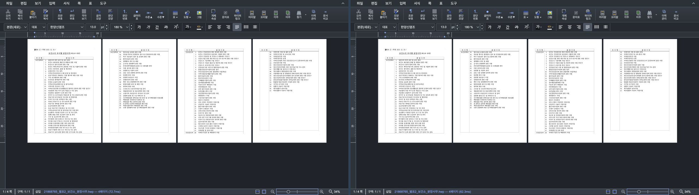
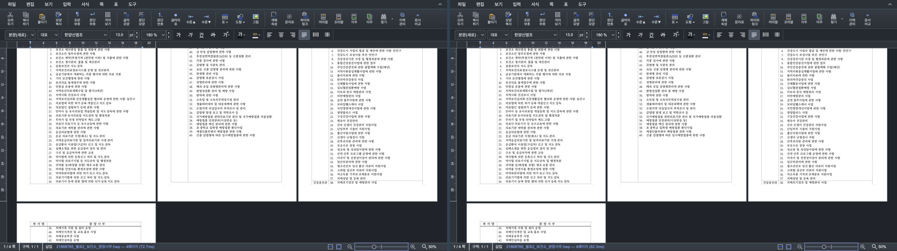
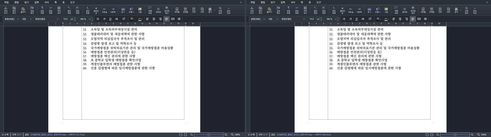
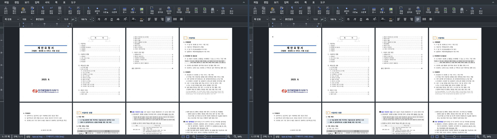
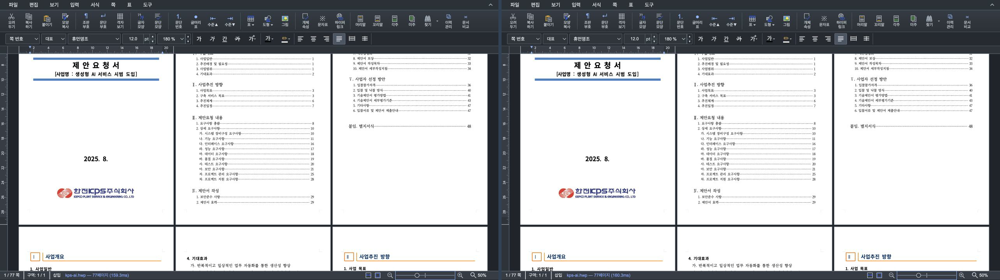
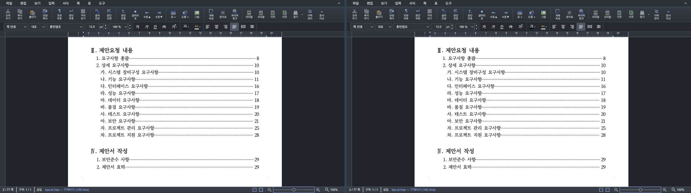
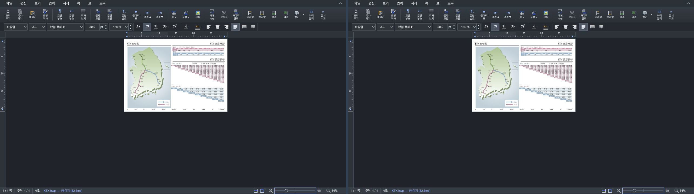
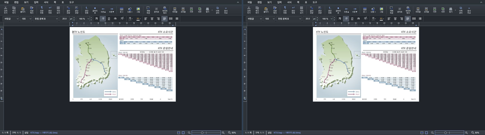
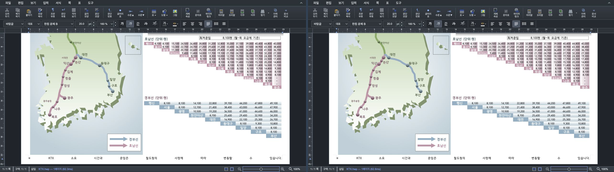

# #6041 render surface 예산 검증

## 범위와 기준

- 수정 전: #6040 PR head `dfe27e18884cd067b0f4ccd0ed9141e20640fac5`
- 수정 후: #6041 code candidate `e37d483fd5f16b2c710a95389f882c9985d50851`
- backend: Canvas2D
- browser viewport: 1280×720 CSS px, 문서 viewport 1260×558 CSS px
- raw DPR: 2
- Canvas2D surface 추정: 페이지별 plane 요약에서 main/flow-static/background/behind/front Canvas 상한을 계산

화면 렌더 해상도만 바꾸는 Studio 작업이므로 PDF/SVG 출력 비교가 아니라 실제 Canvas의 CSS/물리
크기, tier, surface 비용과 같은 화면 캡처를 비교했다. print/PDF/SVG/highQuality 출력 경로는 정책에서
제외된다. 최종 사용자-visible 판정은 작업지시자의 로컬 조작 확인을 남겨 둔다.

수정 전·후를 각각 새 탭에서 같은 문서와 34→50→100% 순서로 열었다. 아래 합성 PNG는 모두
**왼쪽이 수정 전(#6040), 오른쪽이 수정 후(#6041)**이며 가운데 8px 선으로 구분한다. 두 화면 모두
1280×720 원본 PNG를 무손실로 붙였고 리사이즈나 JPEG 재압축을 하지 않았다.

## 4쪽 실문서 34%·50%·100%

fixture: `samples/21868765_별표2_보건소_분장사무.hwp`

- SHA-256: `ae694583e739ac48af97cb12ce573c2da9f4cb637721fdf84e5af4bf7ca17c13`
- 수정 후 세 배율 모두 retained 페이지가 `layerCount=1`, `screen`, effective DPR 2를 유지했다.
- 34%는 자동 4열·visible 4쪽이며 쪽당 540×764 physical px / 270×382 CSS px다.
- 100%는 viewport와 prefetch 범위에 따라 retained 3쪽이며 모두 DPR 2다.

| 배율 | screenshot SSIM | 수정 후 판정 |
| ---: | ---: | --- |
| 34% | 0.999885 | 4쪽 모두 DPR 2 / `screen` |
| 50% | 0.999894 | 4쪽 모두 DPR 2 / `screen` |
| 100% | 0.999893 | retained 3쪽 모두 DPR 2 / `screen` |

## 다중 쪽 `kps-ai.hwp` 34%·50%·100%

fixture: `samples/kps-ai.hwp`

- SHA-256: `9b0fceb3d96956f27c893e15a72a1ad94f7ee005bd581381a1aadfcb1f57a7b9`
- 비교 캡처 순서: 34 → 50 → 100%
- 수정 후 모든 캡처의 retained 페이지는 `screen`, effective DPR 2다.
- 페이지별 보수적 layer count는 콘텐츠에 따라 1~2이며 100%에서도 비용이 예산 이내라 강등하지 않았다.

| 지표 | 수정 전(#6040) | 수정 후(#6041) | 판정 |
| --- | ---: | ---: | --- |
| visible tier/DPR | 2쪽 모두 DPR 2 | 2쪽 모두 DPR 2 | 품질 보존 |
| offscreen prefetch | DPR 2 | DPR 2 | 실제 비용이 예산 이내라 보존 |
| retained main physical px | 10,699,944 | 10,699,944 | 동일 |
| 페이지별 추정 surface | 해당 정책 없음 | 57,019,408 bytes | 40M pixel 예산 이내 |
| budget state | 해당 정책 없음 | `within` | 강등 불필요 |

초기 candidate는 모든 Canvas2D 페이지를 고정 4-layer로 계산해 이 문서를 163.27MiB로 과대 평가하고
화면 밖 페이지를 DPR 1.5로 낮췄다. DOM을 다시 조사한 결과 retained 페이지의 실제 Canvas는 모두 main
한 장이고, 첫 페이지에만 정적 flow 가능성 1장을 보수적으로 더 잡으면 충분했다. 현재 구현은 이
페이지별 구성을 사용하므로 100%에서도 세 쪽 모두 raw DPR 2를 유지한다.

| 배율 | screenshot SSIM | 수정 후 판정 |
| ---: | ---: | --- |
| 34% | 0.999896 | retained 12쪽 모두 DPR 2 / `screen` |
| 50% | 0.999975 | retained 9쪽 모두 DPR 2 / `screen` |
| 100% | 0.999975 | retained 3쪽 모두 DPR 2 / `screen` |

## 실제 4-layer `KTX.hwp` 34%·50%·100%

fixture: `samples/basic/KTX.hwp`

- main + background + behind + front의 실제 Canvas 네 장을 DOM에서 확인했다. 34%·50%·100% 모두
  `layerCount=4`, `screen`, effective DPR 2다.
- screenshot SSIM은 각각 0.999910, 0.999889, 0.999979이며 수정 전과 같은 화면 품질을 보존했다.

- 136%에서 `layerCount=4`, effective DPR 2, `screen`, 약 105.46MB surface로 visible 32M pixel
  예산 안에 있어 최대 해상도를 유지했다.
- 163%에서는 visible 예산을 넘지만 현재 편집/포커스 페이지이므로 DPR 2를 유지하고 상태만
  `exceeded`로 노출했다. 포커스 페이지와 print/highQuality는 예산을 위해 낮추지 않는 계약이다.
- 3개 A4 4-layer 페이지를 100%에서 유지하는 순수 planner 회귀 테스트는 두 visible 페이지를 DPR 2로
  보존하고 화면 밖 한 페이지만 DPR 1.5로 낮춘다. 이때 추정 surface pixel은 약 42.77M에서 36.53M으로
  14.59% 줄어든다. 이는 정책의 결정론적 검증값이며 실제 제품 속도 향상 측정으로 주장하지 않는다.

## 실제 예산 발동 계측 — 21쪽 다중 페이지 문서

fixture: `samples/issue6280/156742029_prosecutor_transfer_list.hwp`

- SHA-256: `522b4522395bbd25993f52799eb0607e9f81286f875b7ceddad7264edecc6ead`
- 21쪽 문서이며 첫 두 retained 쪽 모두 실제 main + front Canvas 두 장을 가진다.
- 100%에서는 두 쪽 모두 raw DPR 2를 유지한다.
- 200%에서는 화면에 보이는 첫 쪽의 DPR 2를 유지하고, 화면 밖 prefetch인 두 번째 쪽만 DPR 2→1로
  낮춘다. visible 쪽의 글자와 표를 희생하지 않는 우선순위가 실제 DOM에서도 확인됐다.

| 배율 | 수정 전 physical Canvas pixel | 수정 후 physical Canvas pixel | raw RGBA 환산 | 판정 |
| ---: | ---: | ---: | ---: | --- |
| 100% | 14,266,592 | 14,266,592 | 양쪽 54.42MiB | 예산 이내, 강등 없음 |
| 200% | 57,035,700 | 35,651,146 | 217.57→136.00MiB | 21,384,554 pixel, 37.49% 감소 |

physical pixel은 DOM에 존재하는 `document-page-canvas`와 `data-rhwp-layer-kind` Canvas의 실제
`width × height` 합이다. 수정 전 200%에서는 네 Canvas가 모두 3175×4491이고, 수정 후에는 visible
쪽의 두 Canvas만 3175×4491을 유지하며 offscreen 쪽의 두 Canvas는 1588×2246이 된다. raw RGBA
환산은 physical pixel×4로 계산한 backing-store 등가값이며 브라우저 객체 overhead와 GPU 복사본은
포함하지 않는다.

100→200% 전환 뒤 모든 retained main Canvas가 목표 zoom을 보고하고 surface 크기가 500ms 동안
안정된 시점까지 같은 브라우저에서 3회 반복 측정했다. 수정 전은 `[1366, 1352, 1345]ms`(중앙값
1352ms), 수정 후는 `[1354, 1360, 1360]ms`(중앙값 1360ms)였다. 중앙값 차이 8ms(0.59%)는 UI 조작과
polling을 포함한 표본 해상도 안이므로 zoom 지연 개선 또는 악화로 해석하지 않는다. 이 계측에서
확정할 수 있는 성능 효과는 steady-state physical Canvas pixel과 raw backing-store 등가값의 37.49%
감소다.

## 비교 asset SHA-256

| 문서·배율 | SHA-256 |
| --- | --- |
| 4쪽 34% | `8f44d5079b27eeb6898024afc6cfb2596f80a740db7553982f4409a768fd40f3` |
| 4쪽 50% | `885dfd7915c5e3596d9970e7697664a32fb59ef66ffb6f9c350ef4b69f0f1422` |
| 4쪽 100% | `3e3e4432e2b737cc044132e4a4cdf4df7bc9d92d38fb4c05ed4087c23331fac4` |
| kps-ai 34% | `7887ed62f7fb47acf4a0d7ca304ed15569824ee5c46e1897cc768e496b445c28` |
| kps-ai 50% | `309050d9adb99b41817bc0496fb9144d73cc325beac1bc68ced12ec2bc5c97b3` |
| kps-ai 100% | `de772c1f1625c20a51a6397083d2ba415024d067b5eb87c7ad2c2a587c7e735d` |
| KTX 34% | `3cd1452904c1386c0925bb9496388f9c2ceee7f84927f83bdf82f976fbff4b12` |
| KTX 50% | `dd87dfd1e17ddbb2b622468a4c708987dd68b35120928533489129c60bab6fac` |
| KTX 100% | `0c1b3f217bdef83dab088b0fe8404fd62b12d91d53f57892c2c1a5b5d916707f` |

## 성능 측정의 해석과 한계

60→100% 전환 완료를 같은 탭에서 각각 5회 측정한 중앙값은 기준 126ms, 변경본 132ms였다.
표본은 `[141,126,134,116,94]`와 `[122,132,142,322,100]`으로 변동이 크고 변경본에 outlier도 있어,
이 결과로 속도 향상을 주장하지 않는다. 페이지별 비용 보정 뒤 위 34%·50%·100% 품질 비교 문서들은
모두 예산 이내여서 candidate가 의도적으로 물리 픽셀을 줄이지 않는다. 반면 issue6280 실문서의 200%
상태에서는 예산이 실제로 발동해 비포커스 페이지의 physical pixel을 줄였다. 따라서 이 PR의 근거는
일반 문서의 최대 해상도 보존과 과도한 surface 상태에서의 결정론적 steady-state 비용 감소이며,
브라우저 wall-clock 속도 향상은 별도 장기 benchmark 없이는 주장하지 않는다.

## 자동 검증

- `node --test tests/render-surface-budget.test.ts`: 13 passed
- `npx tsc --noEmit`: passed
- `npm test`: 1,290 passed, 1 skipped, 0 failed
- `npm run build`: passed, 기존 대형 chunk 경고만 발생
- `git diff --check`: passed
