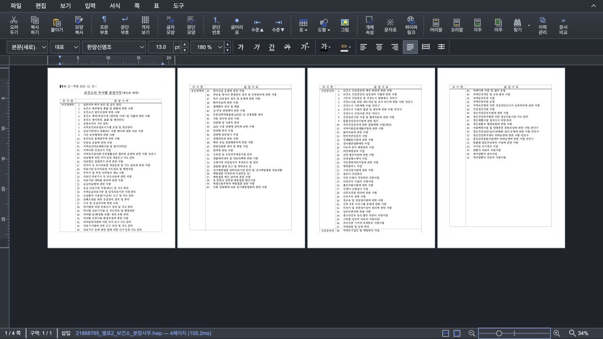

# #6041 render surface 예산 검증

## 범위와 기준

- 기준: #6040 Stage 1 head `dfe27e18884cd067b0f4ccd0ed9141e20640fac5`
- 비교 대상: `codex/issue-6041-budget-first-render-scale`
- backend: Canvas2D
- browser viewport: 1280×720 CSS px, 문서 viewport 1260×558 CSS px
- raw DPR: 2
- Canvas2D surface 추정: 페이지별 plane 요약에서 main/flow-static/background/behind/front Canvas 상한을 계산

화면 렌더 해상도만 바꾸는 Studio 작업이므로 PDF/SVG 출력 비교가 아니라 실제 Canvas의 CSS/물리
크기, tier, surface 비용과 같은 화면 캡처를 비교했다. print/PDF/SVG/highQuality 출력 경로는 정책에서
제외된다. 최종 사용자-visible 판정은 작업지시자의 로컬 조작 확인을 남겨 둔다.

## 34% 4쪽 실문서 품질 보존

fixture: `samples/21868765_별표2_보건소_분장사무.hwp`

- SHA-256: `ae694583e739ac48af97cb12ce573c2da9f4cb637721fdf84e5af4bf7ca17c13`
- 자동 4열, retained/visible 4쪽
- 기준과 변경본 모두 네 쪽 `screen`, effective DPR 2
- 쪽당 Canvas 540×764 physical px / 270×382 CSS px
- 네 페이지 모두 `layerCount=1`, main Canvas 합계 1,650,240 physical px / 6.30MiB RGBA
- JPEG 화면 캡처 SSIM: 0.999901. 상태줄 시간처럼 정책과 무관한 미세 차이만 있다.

asset SHA-256:

- baseline: `9969d7582154c6a4768c98b5213ee305c49002d031ef44c75321463727090bd3`
- budget-first: `aae1878c0674ce13e4153dd3fda782dfe13a5b10161c7ba9739ab0a838c84d2e`

## 100% 실제 다중 쪽 문서의 불필요한 강등 방지

fixture: `samples/kps-ai.hwp`

- SHA-256: `9b0fceb3d96956f27c893e15a72a1ad94f7ee005bd581381a1aadfcb1f57a7b9`
- 재현 순서: 25 → 34 → 36 → 50 → 60 → 100%
- 최종 retained 3쪽, visible 2쪽
- 첫 페이지는 정적 flow 가능성을 포함한 보수적 `layerCount=2`, 나머지는 `layerCount=1`

| 지표 | Stage 1 기준 | page-specific budget-first | 판정 |
| --- | ---: | ---: | --- |
| visible tier/DPR | 2쪽 모두 DPR 2 | 2쪽 모두 DPR 2 | 품질 보존 |
| offscreen prefetch | DPR 2 | DPR 2 | 실제 비용이 예산 이내라 보존 |
| retained main physical px | 10,699,944 | 10,699,944 | 동일 |
| 페이지별 추정 surface | 해당 정책 없음 | 57,019,408 bytes | 40M pixel 예산 이내 |
| budget state | 해당 정책 없음 | `within` | 강등 불필요 |

초기 candidate는 모든 Canvas2D 페이지를 고정 4-layer로 계산해 이 문서를 163.27MiB로 과대 평가하고
화면 밖 페이지를 DPR 1.5로 낮췄다. DOM을 다시 조사한 결과 retained 페이지의 실제 Canvas는 모두 main
한 장이고, 첫 페이지에만 정적 flow 가능성 1장을 보수적으로 더 잡으면 충분했다. 현재 구현은 이
페이지별 구성을 사용하므로 100%에서도 세 쪽 모두 raw DPR 2를 유지한다.

## 실제 4-layer 콘텐츠와 예산 동작

fixture: `samples/basic/KTX.hwp`

- main + background + behind + front의 실제 Canvas 네 장을 DOM에서 확인했다.
- 136%에서 `layerCount=4`, effective DPR 2, `screen`, 약 105.46MB surface로 visible 32M pixel
  예산 안에 있어 최대 해상도를 유지했다.
- 163%에서는 visible 예산을 넘지만 현재 편집/포커스 페이지이므로 DPR 2를 유지하고 상태만
  `exceeded`로 노출했다. 포커스 페이지와 print/highQuality는 예산을 위해 낮추지 않는 계약이다.
- 3개 A4 4-layer 페이지를 100%에서 유지하는 순수 planner 회귀 테스트는 두 visible 페이지를 DPR 2로
  보존하고 화면 밖 한 페이지만 DPR 1.5로 낮춘다. 이때 추정 surface pixel은 약 42.77M에서 36.53M으로
  14.59% 줄어든다. 이는 정책의 결정론적 검증값이며 실제 제품 속도 향상 측정으로 주장하지 않는다.

## 성능 측정의 한계

60→100% 전환 완료를 같은 탭에서 각각 5회 측정한 중앙값은 기준 126ms, 변경본 132ms였다.
표본은 `[141,126,134,116,94]`와 `[122,132,142,322,100]`으로 변동이 크고 변경본에 outlier도 있어,
이 결과로 속도 향상을 주장하지 않는다. 페이지별 비용 보정 뒤 위 일반 문서들은 모두 예산 이내여서
candidate가 의도적으로 물리 픽셀을 줄이지 않는다. 이 PR의 근거는 과도한 surface가 실제로 예상되는
경우에만 비포커스 페이지를 단계적으로 낮추는 planner 계약과, 일반 문서의 최대 해상도 보존이다.

## 자동 검증

- `node --test tests/render-surface-budget.test.ts`: 13 passed
- `npx tsc --noEmit`: passed
- `npm test`: 1,290 passed, 1 skipped, 0 failed
- `npm run build`: passed, 기존 대형 chunk 경고만 발생
- `git diff --check`: passed
