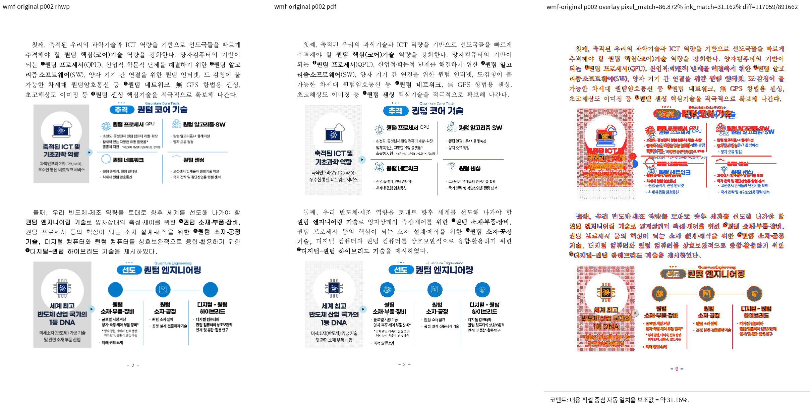
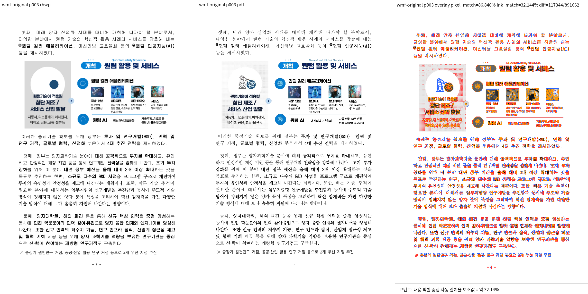
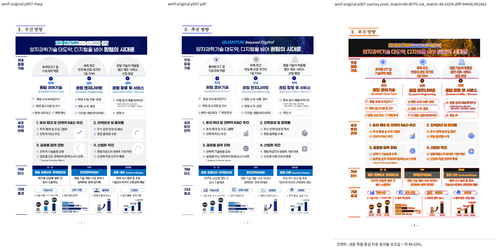

# PR #6949 검토 기록

## 발견 사항과 최종 판정

**최종 판정: 머지 보류.** 원 head CI는 성공했지만 아래 두 소스 결함과 통합 후보의 직접 시각 검증 누락 때문에 수용하지 않는다. 아래 결함은 정적 제어 흐름 검토 결과이며 실행 재현을 완료했다는 뜻이 아니다.

### P1: 완성된 ROP 관용구를 확인하기 전에 DPA를 삭제한다

[drops_monochrome_mask](../../src/wmf/converter/svg/ternary_raster_operator.rs#L91)는 앞 PATINVERT로 만든 AwaitDpa 상태와 출력 요소 수만 확인한다. [observe의 DPA 분기](../../src/wmf/converter/svg/ternary_raster_operator.rs#L59)도 같은 조건에서 즉시 true를 반환해 중간 DPA를 삭제한다.

마지막 PATINVERT의 존재·브러시·좌표 일치는 나중에 확인하며, 그때 불일치하더라도 이미 삭제한 DPA를 복원하지 않는다. DPA 자체의 목적 사각형도 앞 PATINVERT와 대조하지 않는다. 따라서 `PATINVERT(A) → DPA(1bpp, B) → EOF`처럼 다른 영역의 독립된 DPA가 이어지거나, 동일 영역이라도 마지막 PATINVERT가 없는 입력에서 기존에 표시하던 패턴이 사라진다. 마지막 PATINVERT의 사각형/브러시만 달라져도 앞서 삭제한 출력은 돌아오지 않는다.

현재 음성 대조는 앞 PATINVERT가 전혀 없는 단독 DPA뿐이다. [합성 시험](../../tests/cases/issue_6865_wmf_monochrome_mask_rop.rs#L214)은 위 불완전·다른 영역의 두 연산 접두부를 다루지 않는다.

해제 조건: 세 연산과 같은 목적 영역/유효 DC 조건을 확인한 뒤 삭제를 확정하거나, 대기 중 DPA를 보존해 미완성/불일치 시 원래 출력을 복구한다. EOF, 다른 영역, 다른 마지막 브러시와 끼어드는 draw에 대한 음성 대조가 필요하다.

### P2: 1bpp만으로 흑백 마스크라고 판단한다

[brush_is_monochrome_mask](../../src/wmf/converter/svg/ternary_raster_operator.rs#L111)는 DIBPatternPT의 bit_count만 검사한다. 실제 팔레트 색, 색 테이블 사용 방식, 패턴 용도는 검사하지 않는다.

1bpp는 색 테이블의 두 색을 선택하는 형식이지 흑백 또는 마스크 전용 형식이 아니다. [MS-WMF BitCount 정본](https://learn.microsoft.com/en-us/openspecs/windows_protocols/ms-wmf/792153f4-1e99-4ec8-93cf-d171a5f33903)은 0/1 비트가 각각 색 테이블의 첫째/둘째 색을 선택한다고 규정한다. 따라서 유효한 빨강/파랑 1bpp 패턴도 마스크로 분류되어 해당 DPA가 사라질 수 있다. "색 정보를 싣지 않는다"는 코드 주석도 이 조건에서는 성립하지 않는다.

해제 조건: 실제 확인한 흑백 마스크 범위로 좁히고, 유색 1bpp 및 별도의 흑백 그림 입력을 보존하는 음성 대조를 추가한다. 위 P1의 시퀀스 완결성도 함께 해결해야 한다.

## 대상과 적용

| 항목 | 기록 |
| --- | --- |
| 원 PR | [#6949](https://github.com/edwardkim/rhwp/pull/6949), planet6897 |
| 관련 이슈 | [#6865](https://github.com/edwardkim/rhwp/issues/6865), Closes #6865 |
| base / 규모 | devel, 7파일, +343/-9, 1 commit |
| 원 head | `8fbfd865b1190fdf95b5a98d80467a53c944ce59` |
| 검토 기준 | upstream/devel `92f6242af96f51ede912588fa6fe35f5447709bc` |
| 검토 branch | `review/planet6897-6949-6952-20260909` |
| 출처 보존 적용 commit | `32554ff8bf193e4da64e7855854dcb3b80bffa64`, 충돌 없음 |
| 누적 code candidate | `d01f7989b25e5ecff7a6a42a04b1d901ea44c1d6` |
| reviewer | jangster77 지정 완료 |
| 원격 상태 참고값 | 2026-09-09, MERGEABLE / CLEAN; merge 전 최신 head 재확인 필요 |

기본 경로는 maintainer 일반 경로이며 intake, multi-PR, local validation, visual fixture, post-merge 지침을 적용했다. 원 PR 본문·commit·diff·기존 합성 시험·보고서·#6865 본문과 코멘트를 읽었다. 원 PR의 일반/inline/review 코멘트는 조회 시점에 없었다.

## CI와 로컬 실행 구분

- 원 head의 [CI](https://github.com/edwardkim/rhwp/actions/runs/34339873622)는 Build & Test, A/B/C/D 기본 회귀, lint 성공이다. Native Skia와 WASM Build는 SKIPPED였으며 통과로 세지 않는다.
- [CodeQL](https://github.com/edwardkim/rhwp/actions/runs/34339873660) 분석, [Adapter](https://github.com/edwardkim/rhwp/actions/runs/34339873605), [Proptest](https://github.com/edwardkim/rhwp/actions/runs/34339873758)가 성공했다. CodeQL aggregate는 NEUTRAL, CI Impact Policy는 SUCCESS다. Render Diff run은 해당 head의 조회 결과에 없었다.
- PR 본문이 언급한 로컬 golden/flake 실패와 원격 최종 CI는 별개의 실행 결과다. 어느 쪽도 이번 통합 candidate의 실행 결과로 옮겨 적지 않는다.
- 이번 단계에서는 로컬 build, Cargo 회귀, Clippy, 새로운 렌더/visual sweep을 실행하지 않았다. 실행하지 않은 검증을 PASS로 기록하지 않는다. 발견 결함의 보정과 통합 후보 검증 승인이 다음 단계다.

## 원 PR 시각 자료 판독

원 PR에 포함된 [before p3](../report/6865-wmf-monochrome-mask-rop/before-p3.png), [after p3](../report/6865-wmf-monochrome-mask-rop/after-p3.png), [before p7](../report/6865-wmf-monochrome-mask-rop/before-p7.png), [after p7](../report/6865-wmf-monochrome-mask-rop/after-p7.png)를 실제 열었다.

3쪽 패널의 체커보드 감소와 7쪽 배너의 어두운 파란 면 노출은 제공 이미지에서 보인다. 그러나 after p3는 영역 이미지이며, 이 자료는 원 contributor가 만든 before/after다. 통합 candidate를 다시 렌더한 자료도, maintainer가 기준 한컴 PDF와 직접 대조한 review PNG도 아니다. 7쪽 영문 제목 주변의 얼룩도 남아 있어 전체 도해 fidelity 해결로 표현하지 않는다.

기여자는 패널 샘플값 96~98 → 217, 한컴 기준 245 및 21개 문서 비교를 보고했다. 이 수치와 전수 범위는 기여자의 측정이며 이번 세션에서 독립 재측정하지 않았다. 기존 fixture `samples/issue6469/wmf_fill_shapes.hwpx`와 원본 156627451을 직접 비교할 필요가 있다. 기준 PDF는 기존 자료와 pdfinfo를 우선 확인하고, 적합한 파일이 있으면 재출력하지 않는다.

## Merge 후 contributor PR comment 계획

- 정본: [Visual Sweep GitHub merge comment](../manual/verification/visual_sweep_guide.md#github-merge-comment).
- 현재는 `visual sweep 미실행`, `원 PR 증적만 확인`, `머지 보류`다. 새로운 flagged/pixel_match/proxy나 대표 review PNG URL을 만들어 쓰지 않는다.
- 위 P1/P2 보정과 음성 대조, 통합 head의 원 문서 3/7쪽 및 최소 fixture 직접 검증이 완료되면 실제 수치와 판독·남은 색상 차이를 기록하고 대표 PNG만 mydocs/pr/assets에 보관한다. 로그·SVG·중간 raster는 output에 두고 커밋하지 않는다.
- 향후 수용 시에도 #6865의 정확한 색상/하프톤 잔여가 해결됐는지 또는 별도 이슈로 분리됐는지 판단한 뒤 close 범위를 정한다. 현재 #6865 close나 GitHub approve/merge/comment는 수행하지 않았다.
- 실제 merge 뒤 asset의 devel 포함을 확인한 다음 merge SHA 고정 raw URL을 `--body-file`로 게시한다. 현재는 그 선행 조건이 충족되지 않았다.

## 1차 메인터너 보정·검증 결과 (2026-09-09)

**판정: 머지 보류. 보정 후보의 집중 회귀 실패로 전체 검증 미완료.**
이 절은 앞선 정적 검토 이후의 실제 실행 결과다. `399491937` 위 미커밋 보정이며,
그 SHA만으로 수정본을 식별하지 않는다. 상세 source/binary SHA-256과 공통 실행 결과는
[통합 검토 기록](pr_6949_6952_review_impl.md#1차-메인터너-검증-실행-2026-09-09)을 따른다.

### 적용한 보정과 실패

- 중간 DPA를 즉시 버리지 않고, 마지막 PATINVERT까지 시퀀스가 완성된 경우 SVG 최종 출력에서 제거한다.
- 목적지 사각형·클립과 첫/마지막 브러시를 대조하며, RGB 팔레트가 실제 흑백인 1bpp DIB만 mask 후보로 삼는다.
- 불완전 시퀀스, 영역·브러시 불일치, 중간 그리기, 클립 변경, 유색/역순 흑백 팔레트 회귀 8개를 추가했다.
- 집중 회귀에서 새 `issue_6865_clip_change_keeps_middle_draw`가 실패했다. 기대한 `rop_pat0`가 없다.
- 기존 `issue_6469_wmf_brush_only_raster_ops::xor_pair_is_cancelled_so_gray_rect_is_emitted_once`도 실패했다.
  도해 0의 회색 사각형이 기대 1개 대신 2개다. 따라서 안전성 보정이 완료됐다고 판단하지 않는다.
- 실패를 없애기 위해 assertion을 완화하거나 기존 테스트를 삭제하지 않았다. 원인 수정은 사용자 확인 후 진행한다.

### 직접 시각 증적

- 원본: `/home/tsjang/Downloads/korea_downloads/과학기술정보통신부/156627451_240426 조간 (보도참고) 양자과학기술 대도약, 디지털을 넘어 퀀텀의 시대로 v3.hwpx`.
- 기준: `pdf/156627451-quantum-science-press-note-2020.pdf`를 그대로 재사용했다. 원본 기준 PDF를 다시 출력하지 않았다.
- `pdfinfo`: Creator `Hwp 2022 0.0.0.0`, Producer `Hancom PDF 1.3.0.550`, PDF 1.6, 15페이지, A4 595x841 pt.
- 기준 SHA-1: `3af3fe2954cef15e14f40c7755cde5a189cae8da`.
- 기준 SHA-256: `b8dd078c223fc257c2175c8c63c1116344a0ab4b6ff45324f56e066399375411`.
- `scripts/visual_sweep.py --pages 1-15 --dpi 96 --svg-rasterizer rsvg`로 현 보정 바이너리의 SVG와 기준 PDF를 비교했다.
- 임시 증적: `output/pr_6949_6952_maintainer_20260909/wmf-sweep/wmf-original/{compare,overlay,review}/`.
- 15/15페이지 생성·비교 완료, 자동 구조 이상 후보 0개. 평균 pixel match 90.15392%, 평균 visual_accuracy_proxy_percent 26.80208%.
- p3 pixel match 86.787%, visual proxy 32.122%; p7 pixel match 89.407%, visual proxy 48.032%.
- Codex가 전체 contact sheet와 대표 p3/p7 review PNG를 직접 열었다. 도구 라벨·수치는 판독 가능하다.
- 큰 체크무늬 가림 제거는 확인했지만 회색 농도 차이, 아이콘 누락, p7 배너 영문 깨짐이 남아 있다.
  자동 후보 0개나 이번 국소 개선을 전체 fidelity 통과로 해석하지 않는다. 잔여 차이의 신규/기존 회귀 여부는
  보정 전 동일 바이너리의 독립 A/B 비교로 확정하지 않았다. 작업지시자의 시각 승인도 아직 없다.
- `samples/issue6469/wmf_fill_shapes.hwpx`도 15페이지 SVG 출력에 성공했다. 원본과 image3/4/5.wmf가
  동일하지만 image9/10.wmf는 46바이트 placeholder이므로 원본 p7 기준 PDF와 동등한 축소 증적으로 취급하지 않는다.

### Merge 후 contributor PR comment 계획 보완

현재는 회귀 실패 때문에 merge/close/comment를 실행하지 않는다. 수정·검증과 사용자 승인이 완료된 뒤,
실제 최종 head 결과로 이 계획을 갱신하고 다음 대표 이미지 2개만 사용한다.

- `mydocs/pr/assets/pr_6949_6952_maintainer_20260909/pr6949-original-p003-review.png`
- `mydocs/pr/assets/pr_6949_6952_maintainer_20260909/pr6949-original-p007-review.png`
- 이미지 URL: `https://raw.githubusercontent.com/edwardkim/rhwp/<merge-commit-sha>/mydocs/pr/assets/pr_6949_6952_maintainer_20260909/pr6949-original-p003-review.png` 및 같은 경로의 p007 파일.
- [Visual Sweep 정본](../manual/verification/visual_sweep_guide.md#github-merge-comment)을 함께 링크하고,
  15페이지/자동 후보 0개/위 지표/직접 확인 범위/잔여 차이/회귀 결과를 구분해 적는다.
- 실제 게시 시 UTF-8 `--body-file`을 사용하고 API로 본문과 commit 고정 이미지 URL을 재조회한다.
- `.log`, 원시 raster, SVG, JSON, contact sheet는 `output/`에만 두며 커밋 대상에서 제외한다.

## 최종 보정 후보 검증 (2026-09-09)

**현재 결과: 기존 회귀 실패와 보정 중 발생한 체크무늬 재출현을 해소했고, 로컬 자동 검증을 완료했다.**
앞선 정적 검토·1차 검증의 실패 상태는 이 결과로 갱신한다. 다만 아직 미커밋 후보이므로 보정 commit 고정,
작업지시자 시각 승인과 최종 통합 CI를 거치기 전 merge/close 승인으로 사용하지 않는다.
실행별 결과와 후보 SHA-256은 [최종 통합 기록](pr_6949_6952_review_impl.md#최종-보정-후보-검증-2026-09-09)을 따른다.

### 수정 내용과 회귀 해소

- 기존 외곽 `PATINVERT → DPA → PATINVERT` 상쇄와 추가 DPA mask 삭제 판단을 분리했다.
  중간 DPA 영역이 다르다는 이유로 마지막 XOR을 다시 그려 회색 사각형을 중복하지 않는다.
- 클립 ID뿐 아니라 DC의 실제 사각형도 대조한다. `INTERSECTCLIPRECT`처럼 SVG clip ID를 만들지 않는
  상태 변경을 놓치지 않으며, 서로 다른 클립의 XOR/마스크는 보존한다.
- 원본 image3/4/5.wmf의 마스크는 8x8, BI_RGB, 1 plane, 실제 흑백 RGB 팔레트,
  `55/AA` 또는 `AA/55` 교대 행의 1bpp 체크무늬다. 경계가 1단위 다른 DPA가 실측됐다.
- 기본은 사각형 일치이며, 위에서 확인한 8x8 하프톤에만 각 변의 device 좌표 차이 1단위를 허용한다.
  양쪽 대상 크기도 최소 8x8이어야 한다. 일반 패턴·2단위 이상 경계 차이에는 이 예외를 적용하지 않는다.
- 첫/마지막 XOR의 영역·브러시·클립은 여전히 정확히 일치해야 한다. 완결되지 않은 시퀀스는 삭제하지 않는다.
- 1단위 하프톤 경계의 양성 대조와 2단위 차이·비하프톤·마지막 XOR 불일치 음성 대조 4개를 추가했다.
  기존 회귀나 assertion을 삭제·완화하지 않았다.
- 집중 회귀 32/32 및 전체 회귀 9,377/9,377 통과(46 skipped). 빌드·Clippy 3종·Native Skia·WASM 패키지도 통과했다.

### 최종 시각 결과와 한계

- 입력 SHA-256: `57cf43b40a2b465b30c6a3e5ba23fbe7874f93e053336d375d1e0f3925e3ab1b`.
  기준 PDF는 위 1차 기록의 한컴 생성본을 그대로 재사용했으며 새로 출력하지 않았다.
- 최종 임시 증적: `output/pr_6949_6952_halftone_20260909/wmf-sweep/wmf-original/{compare,overlay,review}/`.
- 같은 `scripts/visual_sweep.py` 명령으로 15/15페이지를 비교했다. 자동 구조 이상 후보 0개,
  평균 pixel match 90.16332%, 평균 visual_accuracy_proxy_percent 26.81390%다.
- p2/p3/p7 대표 PNG를 Codex가 직접 열어 도구 라벨·지표와 본문을 확인했다. p2/p3의 체크무늬 가림이
  사라졌고 p7의 가림 제거도 유지됐다. 이는 작업지시자의 최종 시각 승인을 대신하지 않는다.
- p2 pixel match 86.87182%, visual proxy 31.16201%; p3 86.83986% / 32.14364%; p7 89.40675% / 48.03171%.
- 회색 농도 차이, 일부 아이콘 누락과 p7 배너 영문 깨짐은 여전히 남아 있다. 이번 근사는 정확한 ROP
  합성 전체를 구현한 것이 아니며, 낮은 visual proxy나 자동 후보 0개를 전체 fidelity 통과로 쓰지 않는다.
- 축소 fixture `samples/issue6469/wmf_fill_shapes.hwpx`도 최종 바이너리로 15페이지 SVG를 출력했다.
  원본 image9/10이 placeholder라는 한계는 그대로이며 원본 p7 검증을 대체하지 않는다.

### 최종 comment 계획 갱신

이전 계획의 p3/p7 파일을 최종 후보 이미지로 갱신했고, 실제 경계 보정의 근거인 p2를 추가했다.
merge 이후 사용자 승인된 comment에는 세 이미지를 모두 `<merge-commit-sha>` 고정 raw URL로 표시하고,
[Visual Sweep 정본](../manual/verification/visual_sweep_guide.md#github-merge-comment), 15페이지/후보 0개/
위 지표/직접 확인 범위/잔여 한계/최종 자동 검증 결과를 함께 적는다.

추가 이미지 URL 형식은 `https://raw.githubusercontent.com/edwardkim/rhwp/<merge-commit-sha>/mydocs/pr/assets/pr_6949_6952_maintainer_20260909/pr6949-original-p002-review.png`다.
실제 게시 시 `--body-file`과 API 재조회 원칙을 유지한다. 현재 게시·commit·push·merge는 수행하지 않았다.
