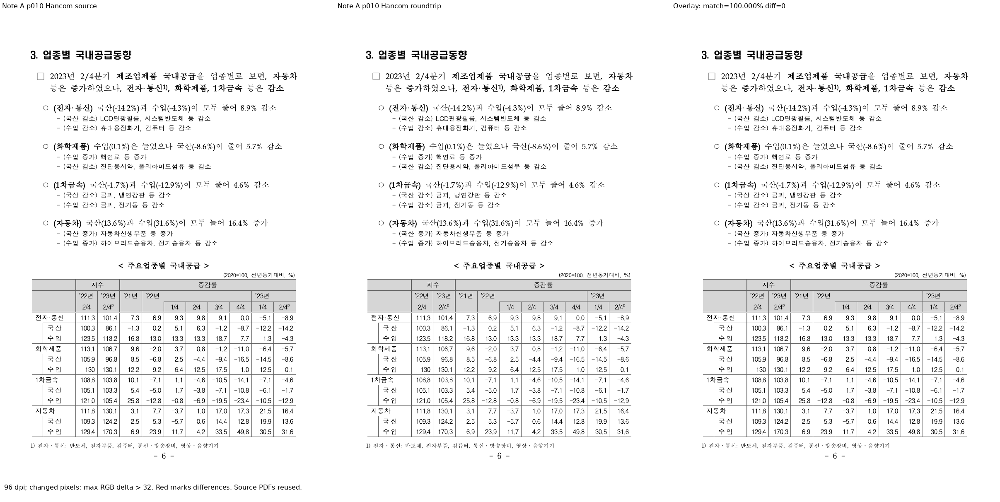
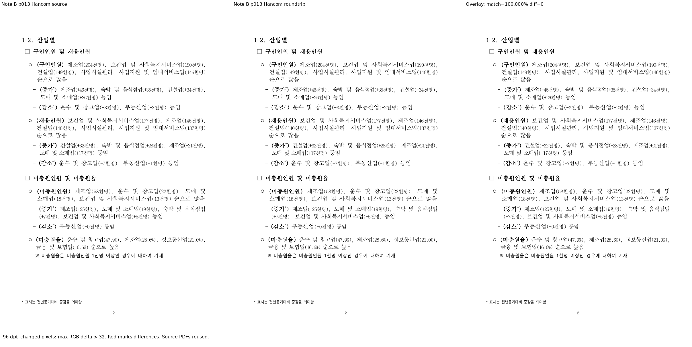

# PR #6952 검토 기록

## 발견 사항과 최종 판정

**최종 판정: 머지 보류.** #6940과의 충돌은 로컬에서 해소했지만, 그 보정이 포함된 통합 후보의 회귀·Clippy·실물 왕복/시각 검증은 아직 실행하지 않았다. 원 head CI 성공으로 충돌 해소본의 검증을 대체하지 않는다.

### 기존 #6940의 명시적 빈 접미 보존을 유지해야 한다

최신 devel에는 #6940이 이미 반영되어 `ON_PAGE`/`ON_SECTION`과 `deco_chars_from_source`에 따른 빈 접미 보존이 존재한다. #6952의 오래된 base는 suffix fallback을 `USER_CHAR` 여부만으로 선택하므로, 원 PR 쪽을 통째로 선택하면 숫자 형식의 명시적 `suffixChar=""`를 다시 `)`로 바꾸는 회귀를 만들 수 있다.

`src/serializer/hwpx/section.rs`의 두 충돌을 다음 원칙으로 해소했다.

- 이미 적용된 ON_* 토큰은 유지하고 중복 주석 충돌만 제거했다.
- `shape.deco_chars_from_source || shape.number_format == NumberFormat::UserChar`이면 빈 fallback을 사용한다.
- 그 외 미설정 숫자 형식은 기존 `)` fallback을 유지한다. 실제 suffix 문자가 있으면 note_deco_char_attr가 그 문자를 방출한다.
- 새 `decoration_is_user_char`와 인라인 `USER_CHAR ↔ 18` 처리는 보존했다.

이것은 충돌 해소/호환 보정에 대한 정적 설명이다. 보정 코드가 테스트로 확인됐다는 주장이 아니다.

### 시험 범위의 공백

[추가 시험 6개](../../tests/cases/issue_6872_hwpx_footnote_autonum_roundtrip.rs#L72)는 합성 IR을 직렬화하는 계약이다. 원 HWPX의 userChar를 읽는 parser, 미주 Endnote 경로, 인라인 AutoNumber의 USER_CHAR parse/serialize 왕복은 직접 다루지 않는다. 따라서 "네 필드 모두 왕복 검증"을 이 6개 시험만으로 입증할 수 없다.

수용 전에는 명시적 빈 DIGIT/USER_CHAR 접미와 기존 #2742 계약, footNote/endNote의 userChar, 인라인 autoNum 5개 슬롯을 함께 확인해야 한다. 추가적인 확정 런타임 결함은 현재 읽은 변경 범위에서 발견하지 못했지만, 이 공백과 통합 검증 누락은 남아 있다.

## 대상과 적용

| 항목 | 기록 |
| --- | --- |
| 원 PR | [#6952](https://github.com/edwardkim/rhwp/pull/6952), planet6897 |
| 관련 이슈 | [#6872](https://github.com/edwardkim/rhwp/issues/6872), [#6941](https://github.com/edwardkim/rhwp/issues/6941) |
| base / 규모 | devel, 4파일, +271/-7, 1 commit |
| 원 head | `4529c2a0c0104a2783b44a5b798a7badce628042` |
| 검토 기준 | upstream/devel `92f6242af96f51ede912588fa6fe35f5447709bc` |
| 검토 branch | `review/planet6897-6949-6952-20260909` |
| 출처 보존 적용/누적 candidate | `d01f7989b25e5ecff7a6a42a04b1d901ea44c1d6` |
| 충돌 | src/serializer/hwpx/section.rs 2개 구간, 기존 #6940 규칙과 새 USER_CHAR 처리를 함께 유지 |
| reviewer | jangster77 지정 완료 |
| 원격 상태 참고값 | 2026-09-09, 원 PR CONFLICTING / DIRTY. 로컬 해소가 원 PR branch를 갱신한 것은 아님 |

기본 경로는 maintainer 일반 경로이며 intake, multi-PR, local validation, visual fixture, post-merge 지침을 적용했다. PR 본문·commit·변경 파일·시험을 읽었고 #6872의 기존 #6940 수용 범위와 #6941 본문을 대조했다. 원 PR의 일반/inline/review 코멘트는 조회 시점에 없었다.

## CI와 로컬 실행 구분

- 원 head의 [CI](https://github.com/edwardkim/rhwp/actions/runs/34345926899)에서 Build & Test, A/B/C/D 기본 회귀, lint, Native Skia가 성공했다. WASM Build 등 정책 skip은 실행 성공으로 세지 않는다.
- [CodeQL](https://github.com/edwardkim/rhwp/actions/runs/34345926849) 분석, [Render Diff](https://github.com/edwardkim/rhwp/actions/runs/34345926557), [Adapter](https://github.com/edwardkim/rhwp/actions/runs/34345926883), [Proptest](https://github.com/edwardkim/rhwp/actions/runs/34345926925)가 성공했다. CodeQL aggregate는 NEUTRAL, CI Impact Policy는 SUCCESS다.
- 이 결과는 원 head에 귀속되며 이미 #6940이 들어간 최신 devel과 충돌 해소본의 검증은 아니다. 이번 로컬 후보에서 build/회귀/Clippy/새 렌더를 실행하지 않았다.
- 이번 단계에서 원 head를 수정하거나 원격 push/PR 생성/merge/issue close를 수행하지 않았다. 수용 조건은 충돌 해소본 검증, 최신 통합 head CI와 작업지시자 승인이다.

## 실물과 시각 증적 경계

대상 원본은 기존 #6940 검토와 같은 `156584446` 및 `156513948` HWPX다. 기준은 기존 `pdf/pr6940-156584446-source-2020.pdf`, `pdf/pr6940-156513948-source-2020.pdf`를 우선 재사용한다. 이번에는 PDF를 다시 출력하거나 새 증적 파일을 복제하지 않았다.

기존 [#6940 review](archives/pr_6940_review.md)의 68쪽 텍스트/대표 2쪽 raster 일치는 이전 candidate 결과다. #6952 보정본의 결과로 재사용하지 않는다. #6941은 해당 문서의 인라인 USER_CHAR 손실이 한컴 PDF에 나타나지 않았다고 보고하므로, 그림만 같아도 성공으로 판단하지 않고 section3.xml의 인라인 autoNum 5개 type/userChar 및 note 속성을 직접 대조해야 한다.

## Merge 후 contributor PR comment 계획

- 정본: [Visual Sweep GitHub merge comment](../manual/verification/visual_sweep_guide.md#github-merge-comment).
- 현재 통합 후보의 실물 왕복·visual sweep은 미실행이다. #6940의 예전 100% 수치나 PNG를 #6952의 새 증적처럼 게시하지 않는다.
- 검증 뒤에는 번호 토큰, footNote/endNote 속성 이름, 인라인 autoNum 5개 슬롯, 접미 보존의 실제 XML 결과와 대표 PDF 판독을 함께 기록한다. 직접 생성한 대표 PNG만 안정 경로에 보존하고 중간 파일/로그는 output에 둔다.
- 그 결과에 따라 #6872와 #6941의 수용/close 범위를 각각 판단한다. 현재 두 이슈는 close하지 않았다.
- 이후 실제 merge와 asset의 devel 포함, 최신 CI 및 승인이 충족된 뒤에만 merge SHA 고정 이미지와 실제 수치를 `--body-file`로 게시한다. 현재는 승인 코멘트를 작성할 선행 증적이 부족하다.

## 1차 메인터너 보정·검증 결과 (2026-09-09)

**판정: 머지 보류. 실제 문서의 구조·PDF 비교는 양호하지만 추가 회귀 2개가 fixture 오류로 실패했다.**
이번 결과는 `399491937` 위의 미커밋 메인터너 후보에 대한 것이다. 보정 commit 확정·전체 회귀 통과·
작업지시자 시각 승인·최신 통합 CI를 대신하지 않는다. 공통 SHA와 명령은
[통합 검토 기록](pr_6949_6952_review_impl.md#1차-메인터너-검증-실행-2026-09-09)에 기록했다.

### 보정 및 회귀 범위

- 충돌 보정은 `deco_chars_from_source || number_format == UserChar`일 때 빈 suffix fallback을 유지한다.
  기존 ON_* numbering 보존을 되돌리지 않는다.
- 명시적 빈 DIGIT suffix 테스트와 literal HWPX 입력을 이용한 footnote/endnote userChar·inline USER_CHAR
  parse/serialize 반복 테스트 3개를 추가했다.
- 새 parser 왕복 테스트 2개가 `XmlError("미등록 ID 참조 발견: charPrIDRef: [0]")`로 실패했다.
  메인터너가 만든 literal 입력의 문자 속성 참조/헤더 구성을 바로잡아야 한다. 제품 동작 통과로 계산하지 않았다.
- 통합 집중 회귀는 28개 중 24개 통과, 4개 실패다. 나머지 2개 실패는 #6949 WMF 경로다.

### 실제 원본 2종의 구조·시각 검증

| 구분 | A: 156584446 제조업 국내공급동향 | B: 156513948 직종별사업체노동력조사 |
| --- | --- | --- |
| 원본 위치 | `/home/tsjang/Downloads/korea_downloads/통계청/156584446_2023년 2분기 제조업 국내공급동향 보도자료.hwpx` | `/home/tsjang/Downloads/korea_downloads/고용노동부/156513948_6.29 2022년 상반기 직종별사업체노동력조사 결과(노동시장조사과).hwpx` |
| 원본 SHA-256 | `0ff8f7c152842e14d40fec26510d74fc7cfcd8ef812e605c678141dbdb81c22f` | `d1d618c0a38d0efdb3348d21ec81fc400780a8c801ccbbc367c8ea08b495482d` |
| 재사용 기준 PDF | `pdf/pr6940-156584446-source-2020.pdf` | `pdf/pr6940-156513948-source-2020.pdf` |
| 기준 SHA-1 | `71b8f771cd5094ab8c1c8083ae59df94e83bd98f` | `780558003ece60ce1c9a14d10f9e854842852385` |
| 왕복 HWPX SHA-256 | `1e19ecabf5773c3d98c068942c5bde898d4cd9a8143baa0707517cbe9b67d98f` | `26ecbda65a52bc38419d687e93285b162579bc7351025fe30666615f3fc07068` |
| 현 후보 왕복 PDF | `pdf/pr6952-note-a-roundtrip-2020.pdf` | `pdf/pr6952-note-b-roundtrip-2020.pdf` |
| 왕복 PDF SHA-256 | `ad3a16cfb1f2a3bdf157d3e7f51573e8c42463513d5c76c1c67322713798cf63` | `d0c974353dd978fbe3a47c25f6f94c22a8e72123288ec24046342f0aa84b83f0` |
| 왕복 PDF SHA-1 | `a1051ff07842209729a909d74dbfa90d37e8dab6` | `65282eb8df91c42bf3c975db9083f85eb5444277` |
| MCP engine / job | 2020 / `a837836b-23b7-492f-8c70-82618ed271b7` | 2020 / `0694f27d-681a-43a2-8ab2-d346885af86f` |
| PDF 페이지 수 | 기준 36 / 왕복 36 | 기준 32 / 왕복 32 |
| 비교 범위 | 1-36페이지, 대표 p10 | 1-32페이지, 대표 p13 |
| `pdftotext -layout` | 전체 동일 | 전체 동일 |
| 96 dpi 픽셀 비교 | 36페이지 모두 RGB delta >32 차이 0; p2에 임계값 이하 3픽셀 차이 | 32페이지 모두 완전 동일 |

- 기존 한컴 기준 PDF 2개는 재출력하지 않았다. 새 PDF는 현 후보가 export한 왕복 HWPX의 결과다.
  A의 왕복 HWPX는 이전 #6940 산출본과 바이트가 동일함도 확인했다.
- 원본 2종의 저장 제품은 앞선 접수 기록상 2018이므로 engine 2020을 명시했다.
  새 PDF와 기존 기준 모두 Creator `Hwp 2022 0.0.0.0`, Producer `Hancom PDF 1.3.0.550`, PDF 1.6, A4 595x841 pt다.
  버전 1.6만으로 engine을 추정하지 않았다.
- MCP `start -> status(succeeded) -> download(success)`를 완료했다. 요청/응답 engine 2020과
  다운로드 응답의 파일 크기·SHA-256을 실제 로컬 파일과 대조했다. 크기는 A 940074, B 1171146바이트다.
  기존 기준과 SHA-1이 다르므로 같은 바이트의 중복 PDF로 삭제하지 않는다.
- 원본/왕복의 numbering, footNote/endNote 속성, autoNumFormat 속성을 XML로 직접 대조해 모두 동일함을 확인했다.
  B의 inline USER_CHAR 5개, note 속성 `userChar="42"` 5개와 빈 suffix가 유지된다.
  section footNotePr의 USER_CHAR 설정 1개는 inline 5개와 구분한다.
- PDF 비교는 SVG sweep이 아니라 Hancom 원본 PDF 대 Hancom 왕복 PDF의 동등한 판정이다.
  두 대표 페이지의 pixel match 및 명시적 ink-union 비교 proxy는 100%, 차이 후보는 전체 68페이지 중 0개다.
  단, A는 모든 픽셀이 완전 동일하다고 쓰지 않는다. 임계값은 max RGB delta >32, ink union은 밝기 <245다.
- Codex가 대표 p10/p13의 본문·각주·도구 라벨·수치를 직접 열어 확인했다. 작업지시자 최종 시각 승인은 별도다.
- 임시 XML/왕복 HWPX/원시 raster/비교 JSON/로그는 `output/pr_6949_6952_maintainer_20260909/notes/`에 있다.

### Merge 후 contributor PR comment 계획 보완

회귀 입력 오류 수정 및 전체 검증 전에는 게시/merge/close하지 않는다. 완료 후 실제 최종 head 결과를
반영하고 [Visual Sweep 정본](../manual/verification/visual_sweep_guide.md#github-merge-comment)과
위 XML·PDF 비교 방법, 68페이지/후보 0개/대표 2페이지/임계값 이하 차이의 한계를 함께 기록한다.

- `mydocs/pr/assets/pr_6949_6952_maintainer_20260909/pr6952-note-a-p010-review.png`
- `mydocs/pr/assets/pr_6949_6952_maintainer_20260909/pr6952-note-b-p013-review.png`
- 이미지 URL: `https://raw.githubusercontent.com/edwardkim/rhwp/<merge-commit-sha>/mydocs/pr/assets/pr_6949_6952_maintainer_20260909/pr6952-note-a-p010-review.png` 및 같은 경로의 note-b-p013 파일.
- 실제 게시에는 UTF-8 `--body-file`과 API 재조회가 필요하다. 현재 GitHub 게시·push·merge는 수행하지 않았다.

## 최종 보정 후보 검증 (2026-09-09)

**현재 결과: 메인터너 테스트 입력 오류를 수정했고, 구조 보존·로컬 자동 검증을 완료했다.**
앞선 1차 검증의 `charPrIDRef: [0]` 실패는 해소됐다. 보정 commit 고정·작업지시자 시각 승인·
최종 통합 CI 전이므로 아직 merge/close는 수행하지 않는다.
실제 결과와 source/binary SHA는 [최종 통합 기록](pr_6949_6952_review_impl.md#최종-보정-후보-검증-2026-09-09)을 따른다.

- literal HWPX의 `charPrIDRef="0"`에 대응하는 문자 모양을 header에 등록했다.
  parser의 ID 검증을 끄거나 assertion을 완화하지 않았다.
- footnote/endnote `userChar`, inline USER_CHAR의 parse/serialize 반복과 명시적 빈 DIGIT suffix 회귀가 통과했다.
- 집중 회귀 32/32, 전체 회귀 9,377/9,377 통과(46 skipped). workspace build, Clippy 3종,
  Native Skia lib/CLI/#1144, WASM 패키지 검증도 모두 통과했다.
- 최종 바이너리로 원본 A/B를 다시 export한 왕복 HWPX의 SHA-256이 1차 검증본과 각각 정확히 같다.
  A `1e19ecabf5773c3d98c068942c5bde898d4cd9a8143baa0707517cbe9b67d98f`,
  B `26ecbda65a52bc38419d687e93285b162579bc7351025fe30666615f3fc07068`.
- 따라서 위에서 확인한 XML 구조 비교와 한컴 왕복 PDF 2개, 68페이지 비교 증적을 그대로 재사용했다.
  원본 기준 PDF뿐 아니라 왕복 PDF도 이번 최종 보정에서 재출력하지 않았다.
- 68페이지의 `pdftotext -layout` 동일, RGB delta >32 차이 0개 결과를 유지한다.
  A p2의 임계값 이하 3픽셀 차이와 B 전 페이지의 완전 일치를 구분한다.
  대표 p10/p13의 pixel match와 명시적 ink-union proxy는 100%다.
- 최종 왕복 HWPX와 해시 대조 로그는 `output/pr_6949_6952_halftone_20260909/notes/`에 있으며 커밋하지 않는다.
  장기 보관 PDF·대표 PNG·MCP provenance와 comment 계획은 위 1차 기록의 경로를 그대로 사용한다.
- 기존 원 PR head의 충돌 상태나 CI를 이번 로컬 통합 후보의 결과로 바꿔 쓰지 않는다.
  commit/push/PR 생성/GitHub comment/merge는 아직 수행하지 않았다.

