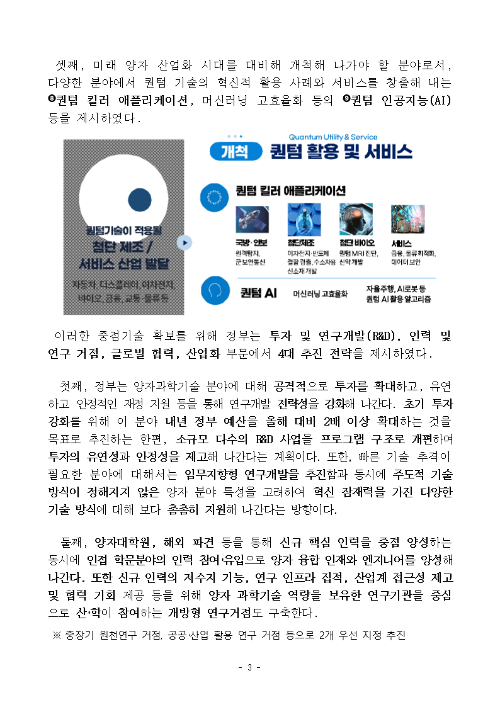
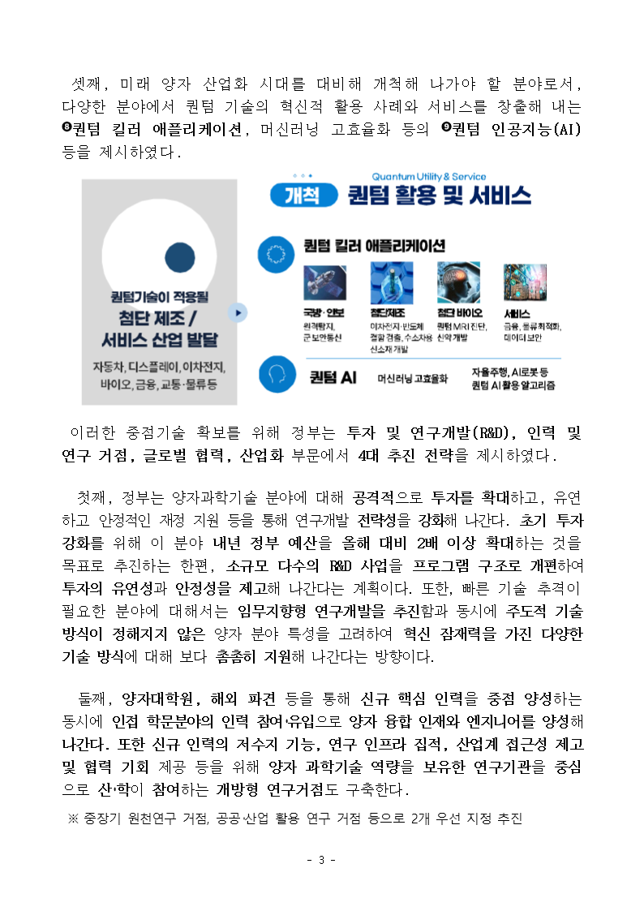
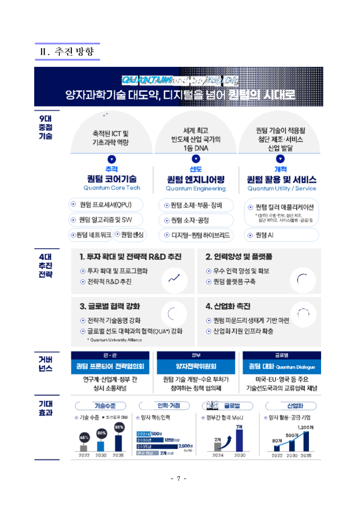
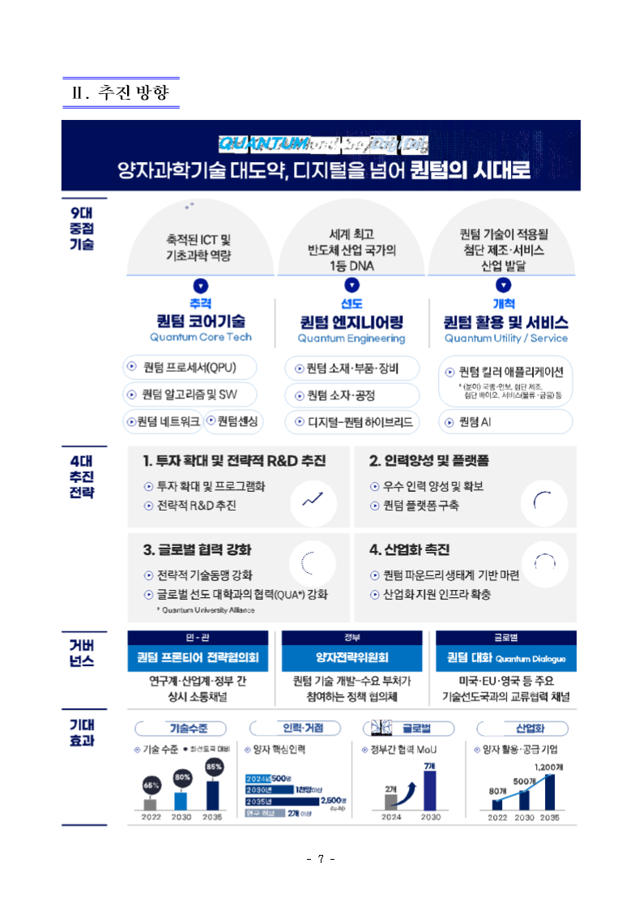

# #6865 — WMF ROP 관용구의 1비트 마스크는 보이는 칠이 아니다

`156627451_240426 조간 (보도참고) 양자과학기술 대도약…v3.hwpx`.

## 3쪽 도해

| 수정 전 | 수정 후 |
| --- | --- |
|  |  |

패널 4점의 픽셀값(96dpi PNG).

```text
              수정 전   수정 후   정본(engine 2020)
  (130,460)      96       217          245
  (150,250)      98       217          245
  (200,430)      96       217          245
  (120,300)      98       217          245
```

## 7쪽 배너

| 수정 전 | 수정 후 |
| --- | --- |
|  |  |

디더 띠 220개가 걷히고 남색 그러데이션이 드러난다.

## 폭발반경

코퍼스 10,000건에서 1비트 패턴 브러시를 가진 문서는 **21건**이다. 전/후 바이너리로 각
문서 최대 12쪽을 렌더해 대조했다.

```text
  문서 21 · 쪽수 달라진 문서 0
  화소 바뀐 문서 10 · 바뀐 화소 178,568
    밝아짐 135,720 · 어두워짐 42,848
```

어두워진 화소는 체커보드의 **흰 칸**이 단색으로 덮이는 자리다 — 검은 칸이 밝아지는 것과
짝을 이룬다. 큰 변화 문서를 눈으로 확인하면 가려져 있던 면이 드러난다(예:
`1690000-200600005` 3쪽의 검은 디더 블록 → 연초록 패널).
