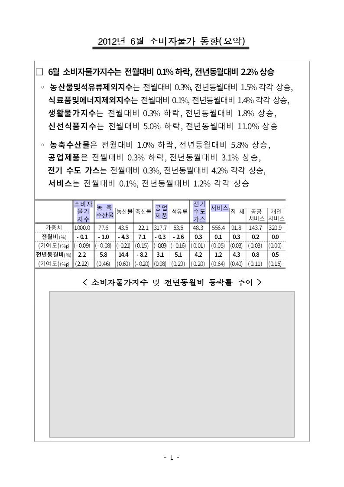
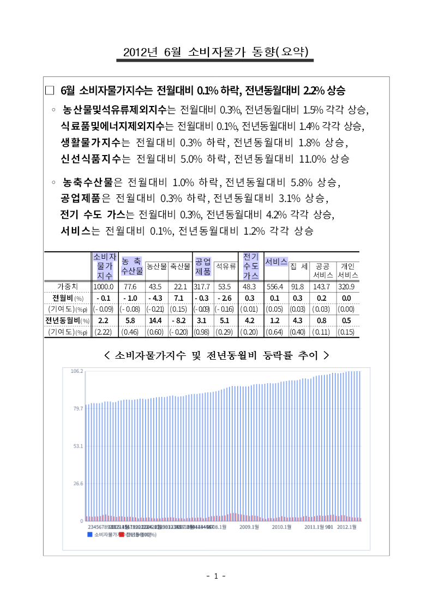

# #6922 — 레거시 차트 그리드를 아카이브 순차 워커로 읽는다

`148735526_2012년_6월_소비자물가동향.hwp` 3쪽(0-based 2). 왼쪽이 수정 전, 오른쪽이 수정 후다.

| 수정 전 | 수정 후 |
| --- | --- |
|  |  |

수정 전에는 `NumberCellCountMismatch` 로 그리드 해석이 막혀 빈 회색 자리표시자가 남았다.
수정 후에는 102개 데이터 행 · 2개 계열의 막대 차트가 그려진다.

## 코퍼스 전수 대조

코퍼스 10,000건에서 `VtDataGrid` 표지를 가진 개체 **74개**를 뽑아, 수정 전/후 바이너리로
각각 `scan_legacy_grid` 결과(치수 · 창 · 셀 좌표 · 값 · 패치 주소)를 덤프해 대조했다.

```text
  수정 전  성공 55 · 실패 19
  수정 후  성공 74 · 실패  0

  종전 통과 55개 중
    바이트 동일 53
    달라짐      2   ← 잃거나 바뀐 셀 0, 종전에 버려지던 라벨 15칸을 더 찾았다
  새로 열림    19
  잃음          0
```

달라진 2개는 `148759031_인천세관 13년 3월중 수출입동향.hwp` 의 두 그리드다. 이 작성기는
문자 셀을 `cp949 \0\0 utf16le \0\0` 이 아니라 **cp949 한 벌**로만 싣는데, 종전 디코더가
`\0\0` 경계를 요구해 `'12년 3월`·`4월`·`5월` 같은 머리 라벨 15칸을 통째로 버렸다.
