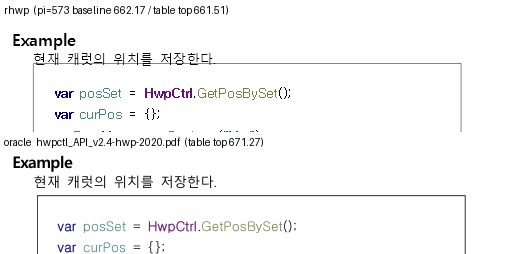

# #7035 — 한글97 마지막 줄 허용치가 진짜 HWP5 문서에 새어 본문 바닥을 넘긴다

`속기자료` 4문서의 본문 바닥 넘침 30건은 조판 fit 규칙의 결함이 아니라 **조판 예산이
21.3px 부풀려져 있었던 것**이다. 부풀린 값은 HWP3 파서가 세우는 한글97 호환 허용치이고,
그것을 진짜 HWP5 문서에 붙인 것은 `[Task #554]` 의 **비율 단독 판정**이다.

## 1. 이슈가 세운 가설은 틀렸다

이슈는 원인을 *"typeset 누적 높이 ↔ layout y 사다리의 어긋남"* 으로 봤다. 둘은 어긋나지
않았다. 같은 값을 보고 같은 결론을 냈고, 다만 **비교 대상인 예산이 틀렸다**.

이슈 본문의 `148733091` 20쪽 산수를 그대로 이어서 계산하면 닫힌다.

```text
  본문 높이        1009.2 - 132.3          = 876.9 px
  28줄 fit 높이    27 * 32 + 20            = 884.0 px   (말미 줄간격 트림 적용)
  차이                                      =   7.1 px  <- 관측 넘침과 정확히 같다
  그려진 바닥      1016.3 - 1009.2          =   7.1 px

  조판이 물은 값   available = 876.9 + 21.3 = 898.2 px
                   884.0 <= 898.2           -> 들어간다고 판정
  허용치가 없으면  884.0 >  876.9           -> 다음 쪽으로 넘긴다
```

`+7.1px` 은 28번째 줄이 본문을 넘는 양 그 자체이고, `21.3px` 은 정확히 그 줄을
들여보내는 데 쓰인 값이다. `RHWP_DIAG_6031` 이 한 줄도 찍지 않은 것도 같은 이유다 —
조판은 "들어간다"고 **옳게** 판정했다. 부등식의 오른쪽이 틀렸을 뿐이다.

## 2. 21.3px 의 출처

`pagination_bottom_tolerance = 1600 HU` 는 HWP3 파서가 세운다. 한글97 이 마지막 줄을
본문 밖으로 조금 넘겨 두던 동작을 흉내 내는 **렌더러 내부 값**이며 파일 포맷 필드가
아니다(`--verify` IR 비교에서도 제외된다).

HWP5 문서에도 "HWP3 변환본으로 의심되면" 같은 값을 붙인다. 그런데 같은 질문에 답하는
두 판정이 서로 다른 근거를 쓰고 있었다.

| 판정 | 근거 | 결과물 |
| --- | --- | --- |
| `is_hwp3_variant` (`[Task #1001]`, `mod.rs:556`) | `summary_hwp3_era` **AND** 비율 `< 0.20` | 레이아웃 프로파일 · lineage |
| `apply_hwp3_origin_fixup` (`[Task #554]`, `mod.rs:749`) | 비율 `< 0.05 / < 0.15` **만** | **조판 예산(허용치)** |

더 약한 쪽이 조판 예산을 쥐고 있었다. 비율은 추정이다 — 스타일을 아껴 쓰는 진짜 HWP5
문서도 그대로 걸린다. 속기자료 4문서가 정확히 그 경우다.

```text
  148737458   version 5.0.0.6 · 저장 5.7.9.3051 · HWP3 출처 마커 없음
              ParaShape/문단 = 0.004   CharShape/문단 = 0.005   -> 비율 통과
```

이 함수의 `[#3707]` 주석은 이미 같은 함정을 한 번 적어 뒀다 — *"이 판정은 확정이 아니라
추정이라 오탐이 있는데, 오탐이 파일 값을 바꾸면 …"*. 그때는 `margin_bottom` 을 건드리지
않는 것으로 피했고, 허용치 쪽은 남겨 뒀다.

## 3. 수정 — 결정론 신호를 함께 요구한다

같은 파일에 결정론 신호가 이미 있다. `HwpSummaryInformation` 의 1990~2003년 표기이며,
`[Task #1001]` 은 이미 이것을 요구한다. `[Task #554]` 에도 같은 문지기를 세웠다.

신호는 두 무리를 **완전히** 가른다.

```text
  저장소 HWP3 -> HWP5 변환본 16건   summary_hwp3_era = true    16 / 16
  속기자료 4문서 (진짜 HWP5)         summary_hwp3_era = false    4 / 4
```

lenient(손상 복구) 경로도 같은 신호를 계산하도록, 판정식을
`cfb_reader::hwp_summary_indicates_hwp3_era` 로 꺼내 두 경로가 함께 쓴다.

## 4. 측정

`layout-anomaly --overflow-tolerance 2.0` (native-skia release).

| 문서 | 수정 전 | 수정 후 | 쪽수 | 정답지 쪽수 |
| --- | ---: | ---: | ---: | ---: |
| `148733091` | 6 | **0** | 36 | 36 |
| `148737458` | 14 | **0** | 29 | 29 |
| `148759033` | 5 | **0** | 36 | 36 |
| `148762372` | 9 | **0** | 25 | 25 |

쪽수는 넷 다 불변이며 한/글 engine 2020 정답지와 같다. 이슈가 요구한 것이 *"쪽 개수가
아니라 쪽 경계"* 였으므로 이것이 판정이다.

`148737458` 의 14건에는 `#6920` 축 A 의 `+39.1 · +71.1` 8건이 포함된다. **그 축도 같이
닫힌다** — 그쪽 넘침 역시 부풀린 예산 위에서 일어났다. `#6920` 은 이 예산을 고정으로 두고
저장-꼬리 신뢰 쪽을 좁히려다 `#2070` 과 구분되지 않아 막혔던 것이다.

### 허용치는 한/글 동작이 아니다 — 정본이 직접 말한다

허용치의 명분은 *"한글97 이 마지막 줄을 본문 밖으로 조금 넘겨 둔다"* 였다. 이 판정에
걸려 있던 저장소 표본 `hwpctl_API_v2.4.hwp`(진짜 HWP5 · `5.1.0.1` · 2016년 저장)의
한/글 engine 2020 정본을 줄 단위로 재면 그런 일이 없다.

```text
  pdf/hwpctl_API_v2.4-hwp-2020.pdf   105쪽
  본문 상자 (pt)                     99.20 .. 756.86
  마지막 줄 바닥이 756.86 을 넘는 쪽   0 / 105
```

한/글은 이 문서에서 **한 번도** 본문 바닥을 넘기지 않는다. 그런데 rhwp 는 수정 전
같은 문서에서 넘침 27건이었다 — 허용치가 만든 것이다.

## 5. 남은 회귀 — `samples/hwpctl_API_v2.4.hwp` 총쪽수 105 -> 106

게이트에서 두 핀이 깨진다. 둘 다 같은 문서 · 같은 값이다.

```text
  oracle_page_count_baseline::..._partition_15    정답지 105, 기준 105(차 0) -> 현재 106(차 1)
  issue_6368_row_cut_fp_epsilon::..._page_12      105 -> 106
```

**숨기지 않는다.** 다만 총쪽수 한 줄로는 방향이 안 나와, 정본 PDF 의 쪽별 첫 줄과
rhwp 출력의 쪽별 첫 줄을 시프트 보정해 맞춰 봤다(`difflib` 정렬).

| 지표 | 수정 전 | 수정 후 |
| --- | ---: | ---: |
| 총쪽수 (정본 105) | **105** | 106 |
| 정본과 첫 줄이 같은 쪽 경계 | 92 / 105 | **97 / 105** |
| 본문 바닥 넘침 (정본 0건) | 27 | **23** |

쪽 **경계**와 넘침은 좋아지고 쪽 **개수**만 나빠진다. 원인은 이 문서에 **이 이슈와
무관한 과소적재 결함**이 따로 있고, 그것을 허용치가 가리고 있었기 때문이다.

```text
  정본 p51   52줄, 마지막 줄 바닥 749.61 (본문 바닥까지 7.25pt 여유)
  rhwp p51   51줄 — `var MousePosSet = pHwpCtrl.GetMousePos(0, 0);` 를 못 싣는다
                   (수정 전·후 동일 — 허용치와 무관한 기존 결함)
  정본 p52   30줄, 마지막 줄 바닥 731.61 (여유 25.25pt)
  rhwp p52   수정 후 29줄 + **두 줄짜리 고아 쪽** p53
```

앞 쪽에서 덜 실은 줄이 뒤로 밀리다가, 허용치라는 21.3px 완충이 사라지자 고아 쪽으로
드러났다. `typeset-layout-opposite-errors-cancel` 이 기록한 그 형태다 — 부호가 반대인
두 오류가 총쪽수에서만 상쇄되고 있었다.

### 가려져 있던 것 — 표 상자의 세로 위치

p51 의 그 코드 상자는 표다. 조각 항목이 스스로 말한다.

```text
  dump-pages p51 마지막 항목   partialTable  endRow=1  endCut=[2]  isContinuation=false
  -> 칸 안 줄을 2줄에서 끊었다 (빈 줄 1 + 코드 1). 한/글은 3줄에서 끊는다.

  표 윗변     rhwp 948.40   정본 940.73        차 +7.67
  남은 자리   1009.15 - 948.40 = 60.8px   3줄(63.9px)이 안 들어간다
              1009.15 - 940.73 = 68.4px   한/글은 들어간다
```

**글자 위치는 거의 완벽하다.** 같은 쪽 텍스트 줄들의 정본 대비 오차는 `-2 ~ -4px`
(베이스라인 대 글리프 상자 차이)로 일정하다. 어긋나는 것은 **표 상자 경계**뿐이다.

#### 세로 원점이 한 값이 아니다

이 표는 `treat_as_char=false · wrap=자리차지 · vert=문단(0.0mm)` 이다. 그런 표의 윗변을
**앵커 문단의 저장 `vertical_pos`** 가 가리키는 자리와 견주면(앞 문단의 그려진 줄 top 과
저장 vpos 차이로 환산) 두 엔진이 이렇게 갈린다 — 유효 27건.

```text
  정본 윗변 − 앵커 저장 위치    -3.5px 근방 17건 · +3.5px 근방 10건   (바깥여백 283HU = 3.77px 한 개)
  rhwp 윗변 − 앵커 저장 위치    -13px 13건 · -7px 2건 · 0px 6건 · +4px 6건
```

한/글은 바깥여백 한 개 폭으로 일관되는데 rhwp 는 **네 값**에 흩어진다. `#7035` 의 발목을
잡은 p51 은 `+4px` 무리(쪼개진 표의 첫 조각)에 속한다.

`-13px` 무리(13건)는 눈으로도 보인다 — 표 윗변이 **앞 문단 글자를 뚫는다**.

```text
  p28(0-based 27) 문단 574   rhwp 표 윗변 661.51   앞 문단 pi=573 baseline 662.17
                             정본 표 윗변 671.27
```



같은 폭(`32079 HU` = 427.7px)의 코드 상자를 앵커 방식으로 갈라 재면 차이가 더 분명하다.

```text
  어울림(treat_as_char)   정본과 1.5px 이내   59 / 81
  자리차지(float)          정본과 1.5px 이내   11 / 40   중앙값 -3.6px
```

이것은 **별도 축**이다 — `#7035` 의 허용치와 무관하고, 수정 전·후 좌표가 같다.
`#7035` 의 수정은 그 축을 만들지 않았고, 다만 그 축을 가리고 있던 완충을 걷었다.

**래칫을 재생성해 통과시키지 않는다.** 고아 쪽은 실제 회귀이고, 이 표 상자 축을
따로 세워 푸는 것이 순서다.

## 6. 회귀 시험

- **결함을 드러내는 쪽** — `parser::tests::hwp3_origin_tolerance_requires_the_deterministic_era_signal`.
  비율은 발화 상태로 두고 신호만 `false` 로 넘긴다. **수정 전 `1600`, 수정 후 `0`**
  (A/B 실측으로 확인).
- **반대편 잠금** — `tests/cases/issue_7035_hwp3_tolerance_needs_era_signal.rs`.
  저장소 HWP3 변환본 중 `[#554]` 비율이 실제 발화하는 5건 전부가 허용치를 유지하는지
  실제 문서로 확인한다. 문지기가 진짜 변환본까지 막으면 `SO-SUEOP` 44쪽 · `issue_554`
  계약이 깨진다.

`hwp3-sample13/14/16/19-hwp5` 는 **수정 전에도 `0`** 이다 — 두 판정의 비율 문턱이 달라
lineage 만 서고 허용치는 서지 않는다. 이 이슈의 범위가 아니다.

## 7. 범위 밖

- 허용치의 값(`1600 HU`)과 HWP3 **원본** 경로(파서가 직접 세운다) — 손대지 않았다.
- `[Task #554]` / `[Task #1001]` 의 비율 문턱이 서로 다른 것 — 이번 수정과 독립이다.
