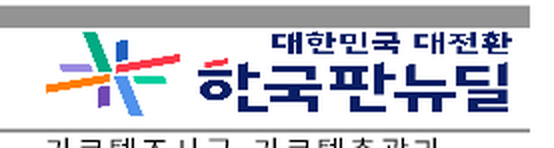
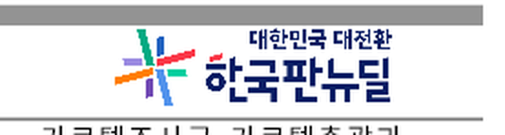

# 칸 배경 그림 채우기 `None` 은 칸에 맞춘 축소·가운데다 (#7235)

## 결함 — 한 의미를 backend 셋이 제각각 처리했다

이진 채우기 유형 **15(`ImageFillMode::None`)** 의 처리가 출력 경로마다 달랐다.

| 노드 | SVG | skia (PNG/PDF) | studio (CanvasKit) |
| --- | --- | --- | --- |
| `ImageNode` `None` (칸·도형 채우기) | **배치 모드** — 원본 크기·왼쪽 위 → 로고 사라짐 | **늘려 채우기** → 가로로 찌그러짐 | **배치 모드** |
| `ImageNode` `Zoom` (#6310) | contain | **팔 없음 → 배치 모드** | **팔 없음 → 배치 모드** |
| `PageBackground` `None` | 늘려 채우기 | 늘려 채우기 | — |

신고된 증상(로고가 보이지 않는다)은 SVG 경로다. 253.4x57.1px 칸에 1628x563 로고를 왼쪽 위
기준으로 놓고 칸 clip 으로 자르면, 칸에는 로고 이미지의 **흰 여백만** 남는다.

근인은 `renderer/svg.rs` `render_image_node` 의 채우기 유형 분기에 `None` 팔이 없어 `_`(배치
모드)로 떨어진 것이다. 같은 `None` 을 쪽 배경 경로(`render_page_background_image`)는 늘려
채우기로 묶어 두었다.

## 기대값의 근거 (구현과 독립)

`#7235` 본문의 한/글 출력 실측은 **로고가 칸 안 가로 511~676px** 에 그려진다는 것이다.
칸 상자(x=466.613, w=253.373, h=57.107)와 원본 종횡비 1628/563 으로 "비율 유지 축소 + 가운데" 를
계산하면

```text
  폭    = 57.107 x (1628/563) = 165.16
  왼쪽  = 466.613 + (253.373 - 165.16)/2 = 510.72
  오른쪽 = 675.88
```

세 수가 모두 정답지와 맞는다. 늘려 채우기라면 466.61~720.0(폭 253.37)이 되어 어긋난다.
즉 `None` 은 `Zoom`(HWPX `imgBrush mode="ZOOM"`)과 같은 결과다.

매핑 자체는 `src/serializer/doc_info/tests.rs` 의 `(ImageFillMode::None, 15)` 왕복 계약이
독립적으로 못 박고 있다.

## 수정

- `renderer/svg.rs` — `ImageFillMode::Zoom | ImageFillMode::None` 을 한 팔로 묶어 칸 상자에
  `preserveAspectRatio="xMidYMid meet"` 로 그린다.
- `renderer/skia/image_conv.rs` — `Zoom` contain 팔을 추가했다(종전에는 팔이 없어 배치 모드로
  떨어져 SVG 와 갈렸다).
- `renderer/skia/renderer.rs` — `ImageNode` 호출부에서만 `None` 을 contain 유형으로 해석한다.
  **쪽 배경 경로의 `None` 은 건드리지 않았다** — 그 축은 정답지를 확인하지 않았고, SVG 쪽 배경
  경로도 늘려 채우기이므로 두 backend 가 여전히 일치한다.
- `rhwp-studio` — `canvasKitImageFillModeContains` · `canvasKitImageContainRect` 를 넣어 같은
  기하를 쓴다(종전에는 `none`·`zoom` 둘 다 배치 모드였다).

결과적으로 **모든 출력 경로가 노드 종류별로 같은 규칙을 소비한다.**

## 시각 증적 — 실제 렌더 (skia PNG, 96dpi 1:1)

`samples/issue7235/156467175_press_release_header_logo_p1.hwp` 1쪽 머리 표 오른쪽 위 칸
(원본 PNG 를 455,92~732,166 으로 잘라 2배 확대).

| | |
| --- | --- |
| 수정 전 (늘려 채우기) |  |
| 수정 후 (contain·가운데) |  |

두 PNG 의 픽셀 차분으로 로고(유채색) 범위를 재면

| | 로고 x 범위 | 폭 | 중심 |
| --- | --- | ---: | ---: |
| 수정 전 (stretch) | 478~710 | 233 | 594.0 |
| **수정 후 (contain)** | **518~669** | **152** | **593.5** |
| 한/글 실측(이슈 본문) | 511~676 | 165 | **593.5** |

**가운데가 정확히 일치한다**(593.5 vs 593.5).

## SVG 경로 기하 — 수정 전/후

같은 fixture, `export-svg -p 0` 의 칸 채우기 `<image>` 태그다.

```text
  수정 전:  x=466.613 y=100.267  width=1628  height=563   preserveAspectRatio="none"   + fill-clip 상자
  수정 후:  x=466.613 y=100.267  width=253.373 height=57.107  preserveAspectRatio="xMidYMid meet"
```

## 회귀 시험

`tests/cases/issue_7235_cell_image_fill_contains.rs` 4건.

| 검사 | 수정 전 | 수정 후 |
| --- | --- | --- |
| 원본 픽셀 크기로 그리지 않는다 | **FAIL** (`1628 x 563`) | PASS |
| 칸 상자 + `xMidYMid meet` | **FAIL** | PASS |
| 그려지는 폭·왼쪽·오른쪽이 한/글 기하와 같다 | **FAIL** | PASS |
| 같은 쪽 일반 그림은 불변 (대조군) | PASS | PASS |

대조군은 양쪽에서 통과해야 맞는다 — 이 수정이 칸 채우기만 바꾸는지 보는 검사다.

studio 는 `rhwp-studio/tests/render-backend.test.ts` 에 `contains` 판정과 contain 사각형
기하(정답지 수치)를 넣었다 — 64/64 통과.

## 입력

원본 `156467175_210823(조간) 대구염색공단 발주 전기통신설비공사 입찰담합 제재.hwp`
(코퍼스 `korea_downloads/공정거래위원회`, 6쪽 10.3MB)에서
`rhwp extract-pages --from 1 --to 1` 로 1쪽만 남긴 발췌본이다.

```text
  samples/issue7235/156467175_press_release_header_logo_p1.hwp
  232,960 bytes · sha256 559b2760ccb678ae22484bc7de8bc61347fff17d3b980d9bec3f2ecec8e07d57
  추출: 6쪽 -> 1쪽, 문단 17개 남김, BinData 7 -> 3
```

발췌 전후 모두 같은 칸 상자(466.613, 100.267, 253.373x57.107)와 같은 결함(1628x563 배치)을
내는 것을 확인했다. 새 fixture 로 코퍼스 래칫 일곱을 다시 돌렸고 **어느 원장에도 행이 생기지
않았다**(전 래칫 0, 85/85 PASS).

## 미검증으로 남기는 것

- **잉크 폭 잔여** — 수정 후 로고 잉크가 152px 인데 이슈의 한/글 실측은 165px 다(약 8% 작다).
  중심은 정확히 맞고 방향·가운데 맞춤은 확정적이지만 배율에 잔여가 있다. 정답지 수치는 본문에
  "약" 으로 적혀 있고 그 자체 비율(165/50 = 3.30)이 원본 비율(2.89)과 어긋나 잉크 측정으로
  보인다. 이 세션에서는 한/글 MCP 가 연결되지 않아 기준 PDF 를 다시 뜨지 못했다.
- **쪽 배경의 `None`** — 늘려 채우기로 두었다. 정답지를 확인하지 않았고, 이 축의 변화는
  래칫(넘침·off-canvas·글자 겹침)이 못 보는 순수 paint 변화라 근거 없이 바꾸지 않았다.
- **SVG 경로의 래스터 전/후 이미지** — 확장이 `file://` 을 막고 로컬 SVG 래스터라이저가 없어
  화면 캡처를 만들지 못했다. SVG 축은 위 기하 실측과 회귀 시험으로 남긴다. skia PNG 는 실제
  렌더 전/후를 그대로 붙였다.
