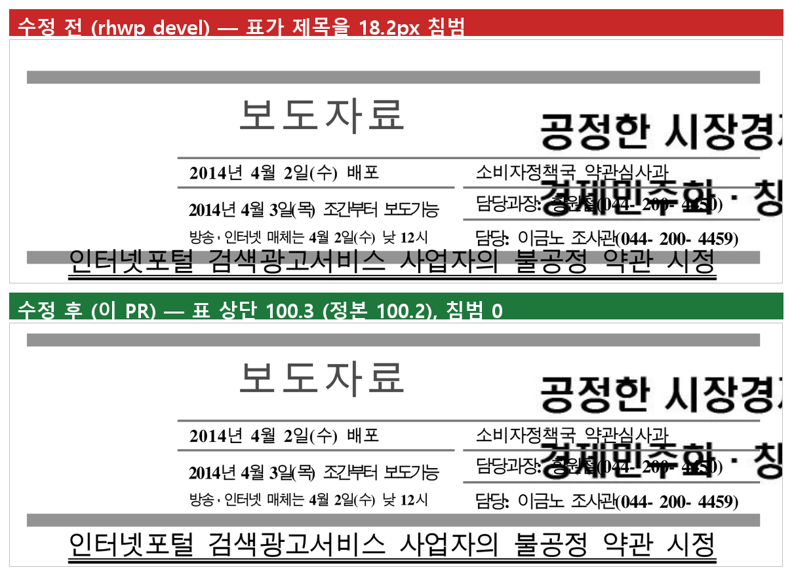

# #6929 — 문단 기준 자리차지 표의 `vertOffset` 이 push-down 에 덮인다

`samples/issue6929/148776468_search_ad_terms_press_release.hwp` 1쪽 머리 표가 제 자리보다
18.2px 아래에서 시작해, 아래끝이 제목 문단을 침범한다.

## 산술

```text
  본문 상단 94.5 · 저장 vertOffset 433 HU = 5.77px
  raw_y   = 94.5 + 5.77 = 100.3            ← 선언대로 (정본 100.2 와 0.07px)
  y_start = 118.5 = 94.5 + 24.0            ← 앵커 문단 자신의 줄 예약
  pushed  = max(100.3, 118.5) = 118.5      ← vertOffset 이 통째로 무시된다
```

`#347` 의 push-down 은 "앞선 표·텍스트 아래로 민다"인데, 앵커 문단이 단 최상단이고 잉크를
하나도 안 내면 그 아래에 있는 것은 앵커 자신의 줄 예약뿐이다.

## 좁힘

공동 앵커(co-anchored) 자리차지 표들의 쌓임은 `y_start` 가 만든다(`#1639` 가 순서를 잠근다).
그래서 **단에 아직 아무것도 안 놓였을 때**만 앵커를 push-down 바닥으로 쓴다. 보이는 host
제목이 있는 `#1549` 형상은 제목 줄이 먼저 놓이므로 조건에서 빠진다.

## 시각 증적



`export-png` 은 이 빌드에서 `native-skia` 가 필요해 `export-svg` 산출물을 같은 렌더 경로로
래스터화했다.

## 정정 — 표 높이 9.6px는 남은 결함이 아니다

[#6929의 후속 정정](https://github.com/edwardkim/rhwp/issues/6929)에 따라 이전 설명을 바로잡는다.
표 노드 bbox는 괘선 없는 마지막 빈 행 약 9.6px까지 포함한다. 한컴 PDF의 마지막 괘선과
노드 bbox 바닥을 비교해 높이 결함으로 잘못 판단했다.

2026-09-15 새 [한컴 기준 PDF](../../../pdf/issue6929/README.md)와 Native Visual Sweep을
직접 대조했다. 표 상단은 118.5 → 100.3px, 마지막 전폭 괘선 중심은 277.2 → 258.9px로
이동했고 제목은 268.5px를 유지했다. 한컴의 대응 괘선은 약 100.2 / 258.8px다.
두 출력 모두 빈 마지막 행의 높이를 흐름에 포함한다. 이 간격을 없애도록 표 높이를 줄이면 안 된다.

검토 범위와 기존 글꼴·페이지 수 차이는 [#7145 검토](../../pr/archives/pr_7145_review.md)에 별도로 기록한다.
