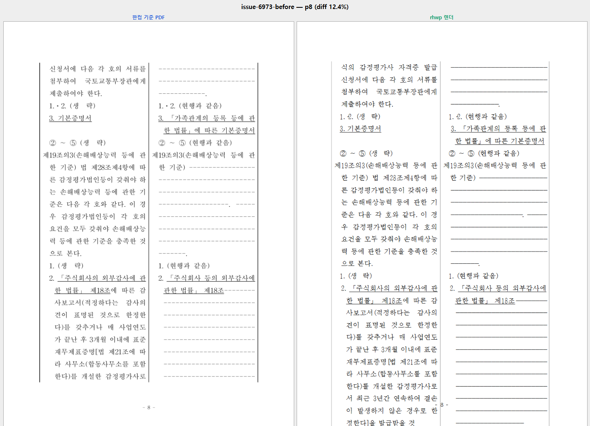
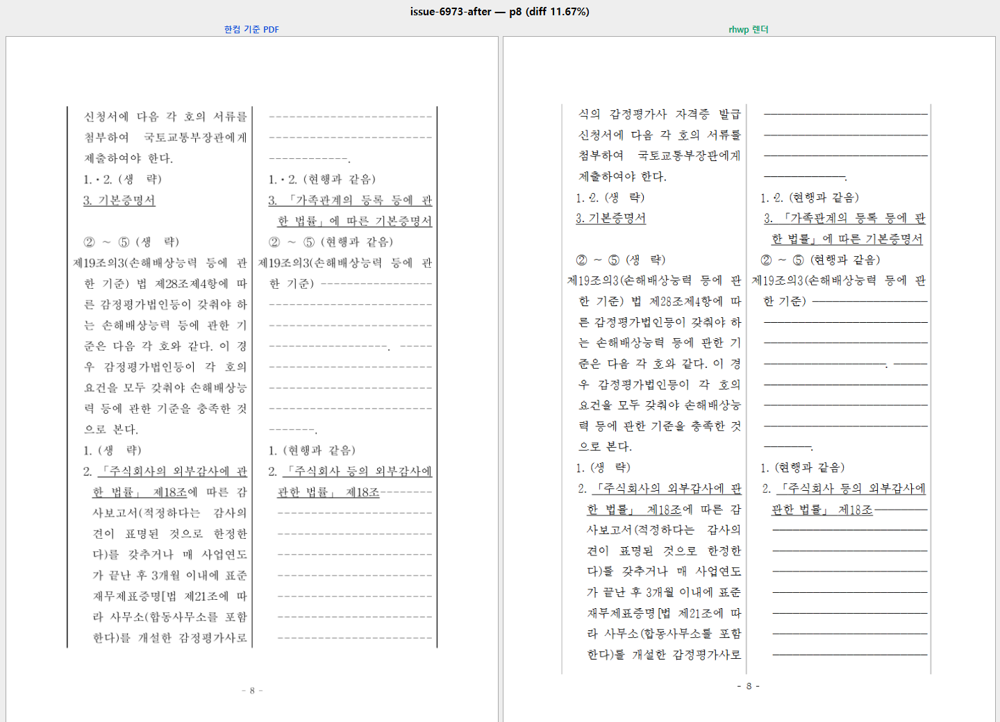
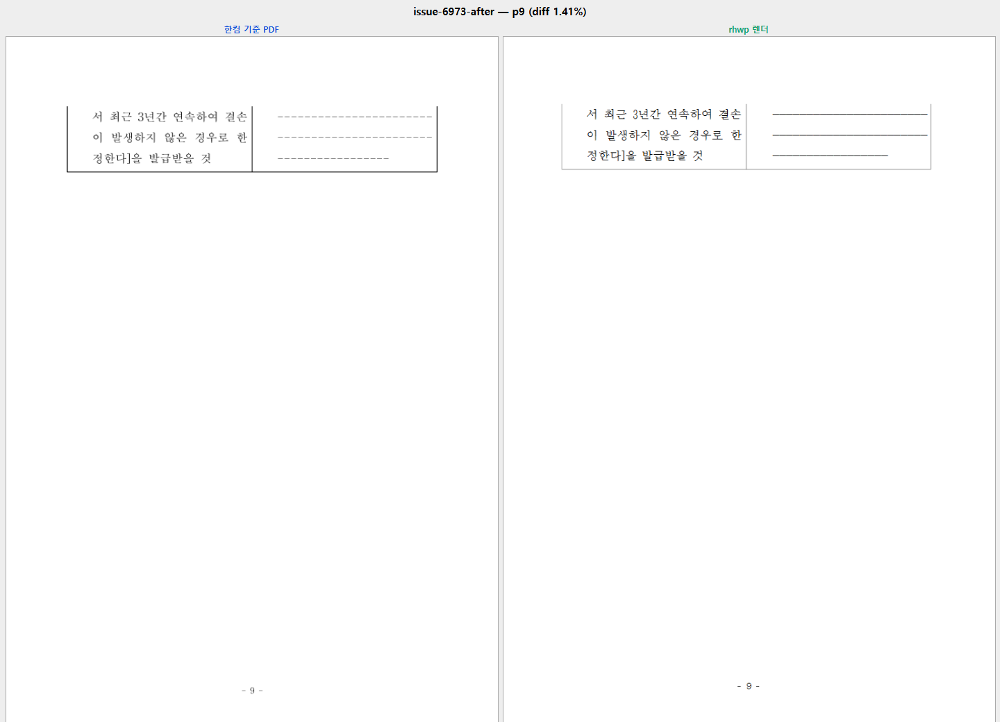

# #6973 — 파생 꼬리가 저장 물리 경계를 넘는다 (시각 증적)

## 산출 절차

```text
  원본     samples/issue6973/83818-appraisal-rules-amendment.hwpx
  기준     pdf/83818-appraisal-rules-amendment-2020.pdf
           hwp2024Convert engine 2020 (engine_profile=2020,
           backend hwp-managed-direct-dll-host, pdf_page_count=9, 260,345 bytes)
  하네스   tools/fidelity_compare/fidelity_compare.py 6 8 --source … --reference-pdf …
  좌: 한컴 기준 PDF · 우: rhwp export-svg → Chrome raster
```

바이너리 출처 — 같은 커밋(`600d788b9`, 조사 브랜치)에서 이 수정 경로만 env 로 끄고/켜
**단일 변수**로 냈다. off 회차가 `origin/devel` 동작과 같음은 samples 1,028건 래칫
baseline(넘침 노드 1,394)과 코퍼스 10,000건 전수에서 확인했다.

## 8쪽 — 수정 전

본문 바닥 아래로 3줄(`서 최근 3년간 연속하여 결손 / 이 발생하지 않은 경우로 한 /
정한다]을 발급받을 것`)이 이어져 꼬리말 띠와 겹친다. 픽셀 diff 12.4%.



## 8쪽 — 수정 후

한/글과 같은 자리(`한다)를 개설한 감정평가사로`)에서 끊긴다. 픽셀 diff 11.67%.



## 9쪽 — 수정 후 (수정 전에는 이 쪽이 없다)

저장 되감김 뒤 3줄이 9쪽으로 간다 — 한/글 9쪽과 같은 3줄이고 픽셀 diff **1.41%**.



## 픽셀 diff 랭킹

```text
  before   p8 12.4%   p7 11.4%   p9 없음(rhwp 8쪽)
  after    p8 11.67%  p7 11.4%   p9 1.41%
```

7쪽은 이 수정과 무관하게 동일하다(11.4%). 8쪽에 남는 11.67% 는 글꼴 대체 잡음과
`#6923` 축(행 7 이 4/4 로 끊겨 한 줄이 내려오는 5.6px 예산 차)이다.
