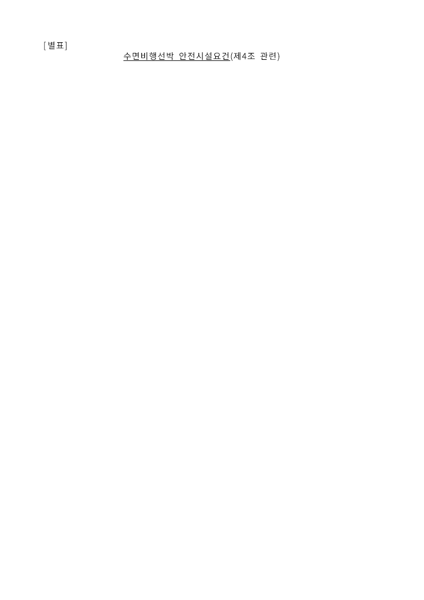
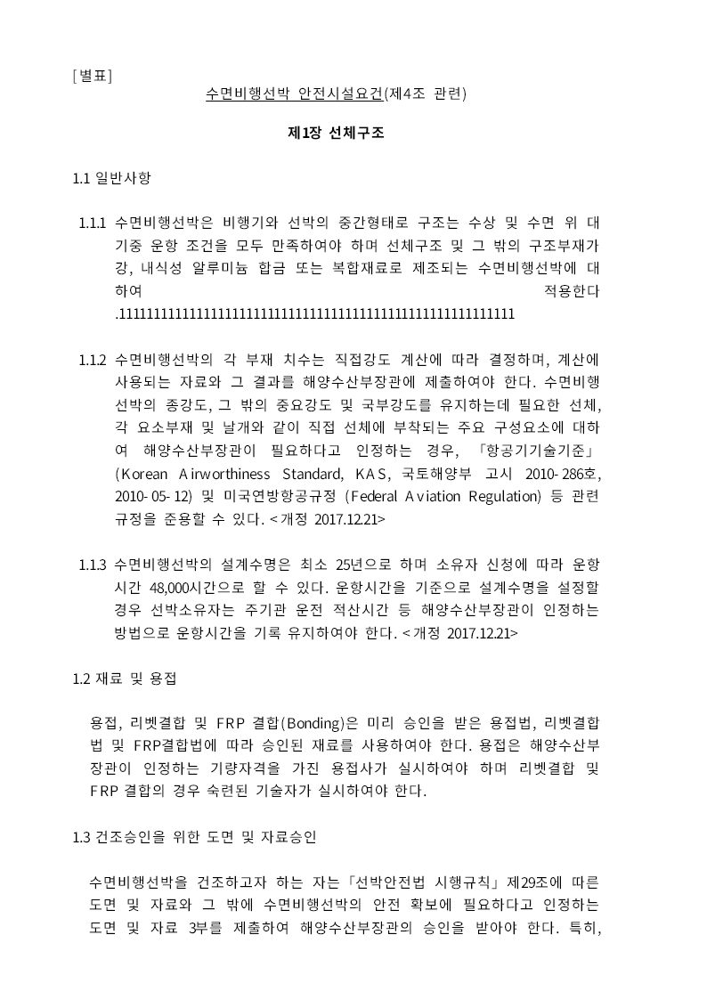
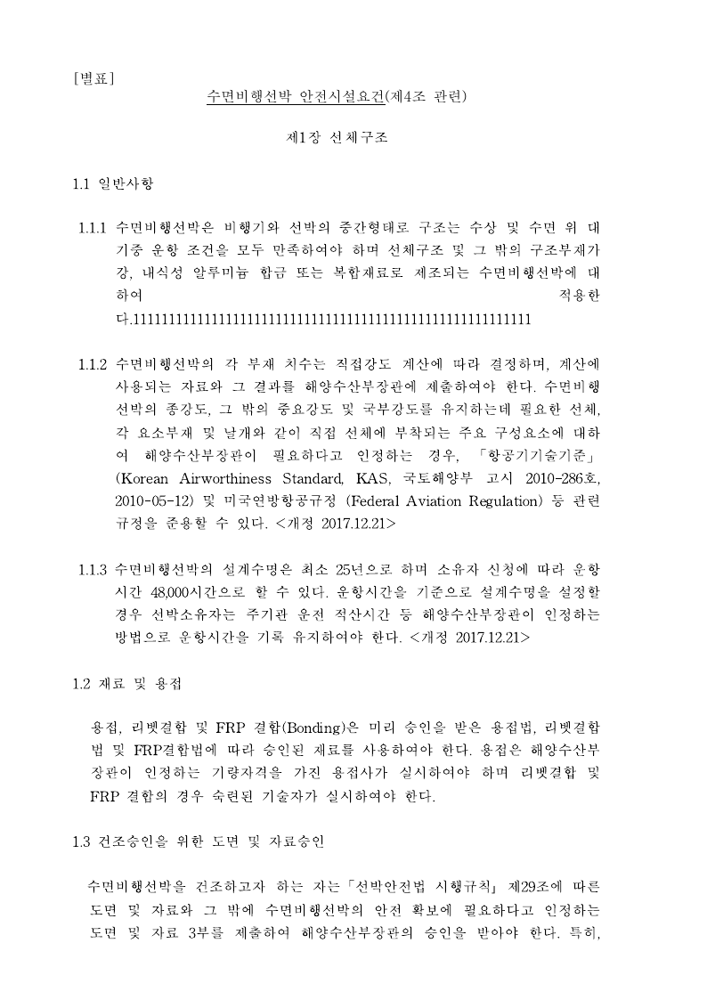
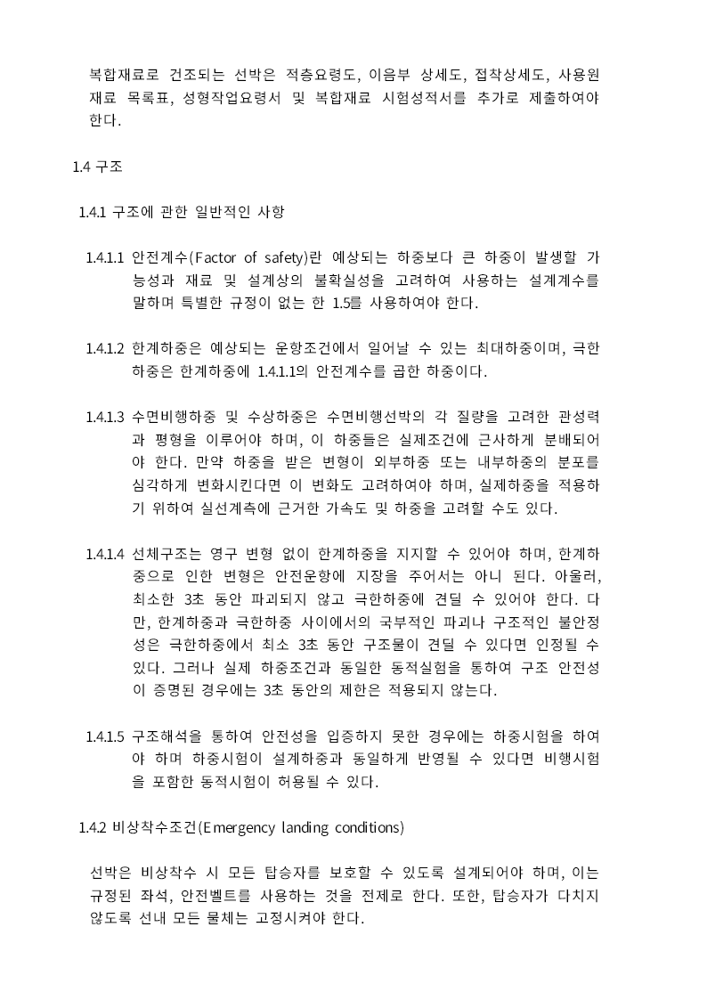
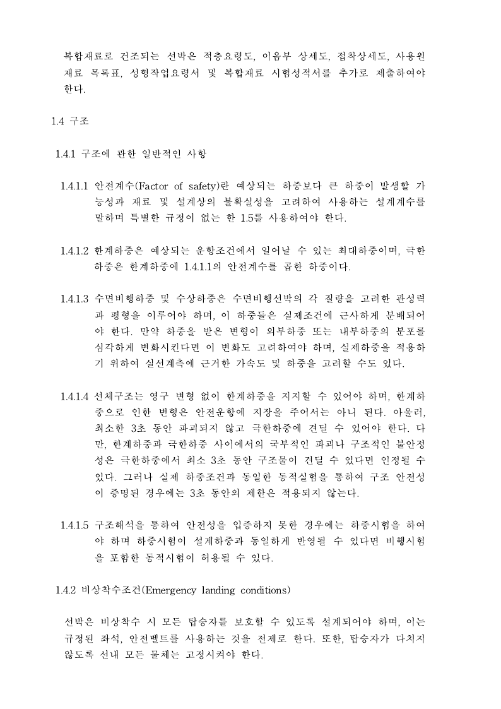

# #7114 시각 증적 — 저장 프레임을 실제 조판 컷으로 되쓴다

## 실행한 것

| 항목 | 값 |
|---|---|
| 입력 | `samples/issue1949_giant_cell_nested_tables_perf.hwp` (115쪽) |
| 편집 | `section=0, parentParagraph=0, control=2, cell=2, cellParagraph=5, offset=130` 에 `1` 56자 |
| 기준 PDF | `pdf/task_m100_3820_stage86_wasm_boundary_oracle/issue1949_cell_p5_append_56-2020.pdf` (한/글 2020, 115쪽) |
| 쪽 | 1·2쪽 (Native, DPI 96) |
| 명령 | `rhwp export-png <저장본> -p 0 --dpi 96` / `-p 1`, 정본은 `pdftoppm -r 96 -f 1 -l 2 -png` |
| 수정 전 저장본 | 116쪽 · 229,376 bytes |
| 수정 후 저장본 | 115쪽 · 228,864 bytes |

두 저장본은 **같은 실행**에서 만들었다 — 수정 전 경로는 되쓰기를 거치지 않는
`serialize_hwp(core.document())`, 수정 후 경로는 `export_hwp_with_adapter()` 다.
편집 직후 메모리 상태는 두 경우 모두 115쪽으로 같다.

## 1쪽 — 수정 전에는 제목만 남는다

수정 전 저장본을 다시 열면 첫 조각이 낡은 저장 프레임까지 꼬리를 흡수해 967.7px 를
1.9px 넘기고, 표가 통째로 2쪽으로 밀린다. 신고 문구 "첫 쪽 제목만 남음" 그대로다.

수정 후 1쪽은 정본과 **줄 단위로 일치**한다 — 삽입한 56자가 1.1.1 끝에 보이고,
쪽 마지막이 `… 승인을 받아야 한다. 특히,` 로 끝난다.

## 2쪽 — 경계가 정본과 같다

정본 2쪽은 `복합재료로 건조되는 선박은 …` 으로 시작해 `… 선내 모든 물체는 고정시켜야
한다.` 로 끝난다. 수정 후 재열기가 같은 줄 구성을 낸다.

## 쪽 구성 전수 대조

쪽수·외곽만으로는 귀속을 증명하지 못하므로 **115쪽 전부의 본문 낱말**을 편집 직후 상태와
비교했다(`issue_7114_saved_frame_follows_real_cuts`).

| 삽입 | 수정 전 | 수정 후 |
|---|---|---|
| 0자(무편집) | 115쪽 · 차이 0 | 115쪽 · 차이 0 |
| 1자 | 115쪽 · 차이 0 | 115쪽 · 차이 0 |
| 55자(대조군) | 115쪽 · 차이 0 | 115쪽 · 차이 0 |
| **56자(신고)** | **116쪽 · 차이 116쪽** | **115쪽 · 차이 0** |
| **61자** | **116쪽 · 차이 116쪽** | **115쪽 · 차이 0** |

## 한계

- 이 정본 PDF 는 **텍스트 층이 사실상 비어 있다**(115쪽에 816낱말). 쪽별 전수 텍스트
  대조에는 쓸 수 없어 쪽수와 1·2쪽 경계만 정본 근거로 썼고, 나머지 쪽은 "재열기 == 편집
  직후" 계약으로 검증했다.
- 정본은 같은 56자 편집 저장본의 출력이지만 **현재 저장본과 byte-identical 한 입력은
  아니다**(이슈 본문의 같은 유보). 3쪽 이후의 한컴 전체 일치까지 증명하지 않는다.
- Sweep 은 Native 단독이다. fresh WASM 비교는 실행하지 않았다.
- 쪽 경계가 **중첩 표 안**에 떨어지는 경우는 host 셀 사다리로 표현할 수 없어 되쓰기가
  뒤의 첫 host 줄로 해소한다. 200자 스트레스 입력에서 잔차 2쪽이 남는다(수정 전 113쪽).
