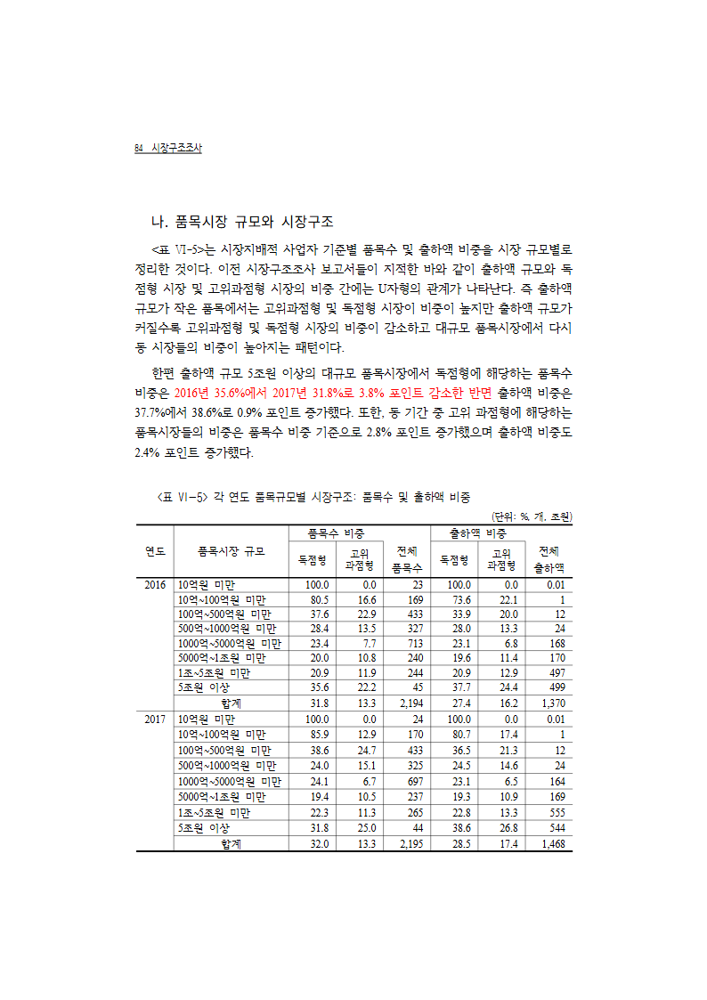
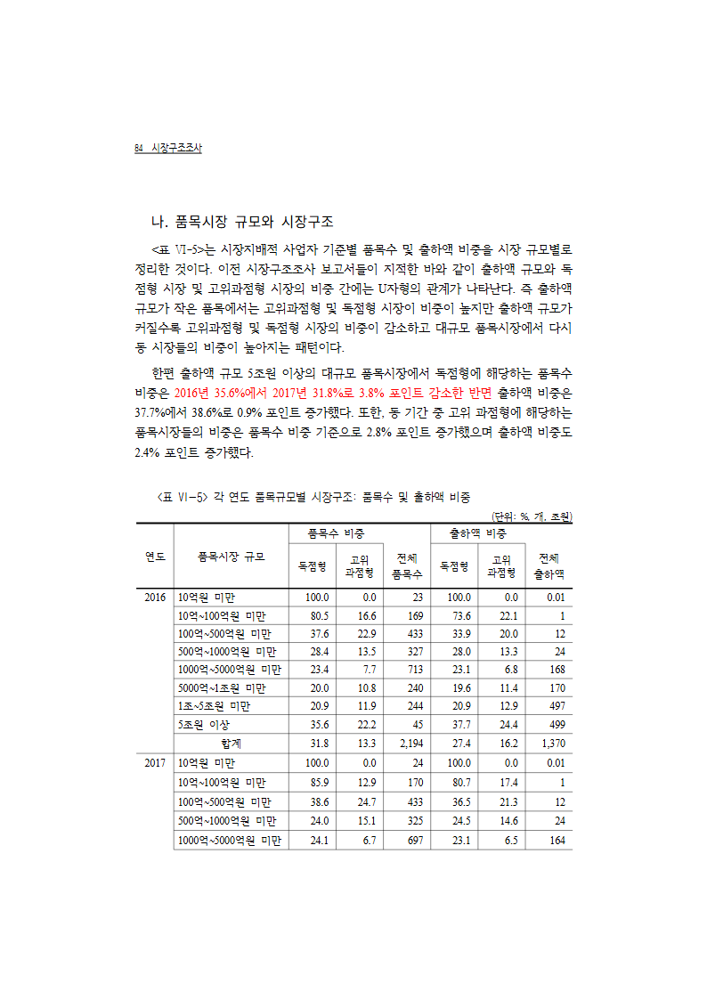
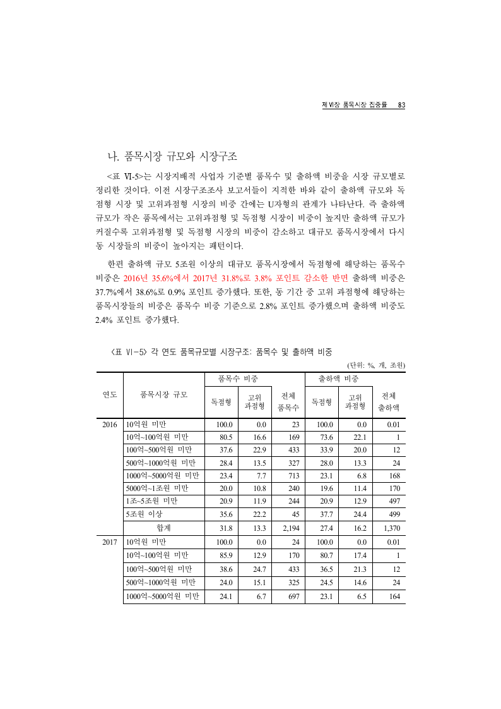
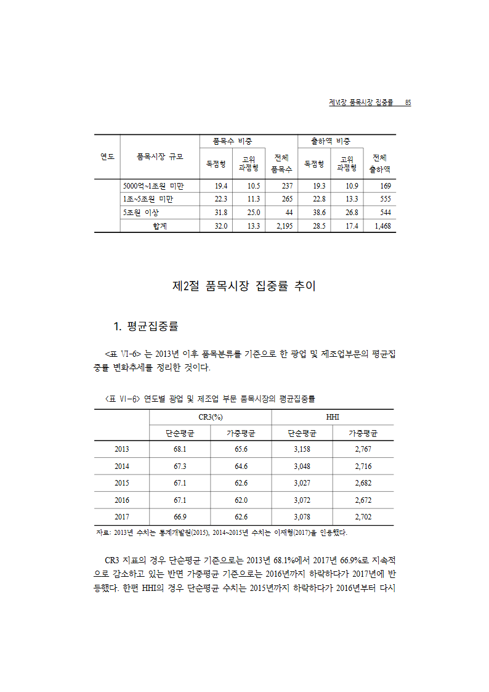
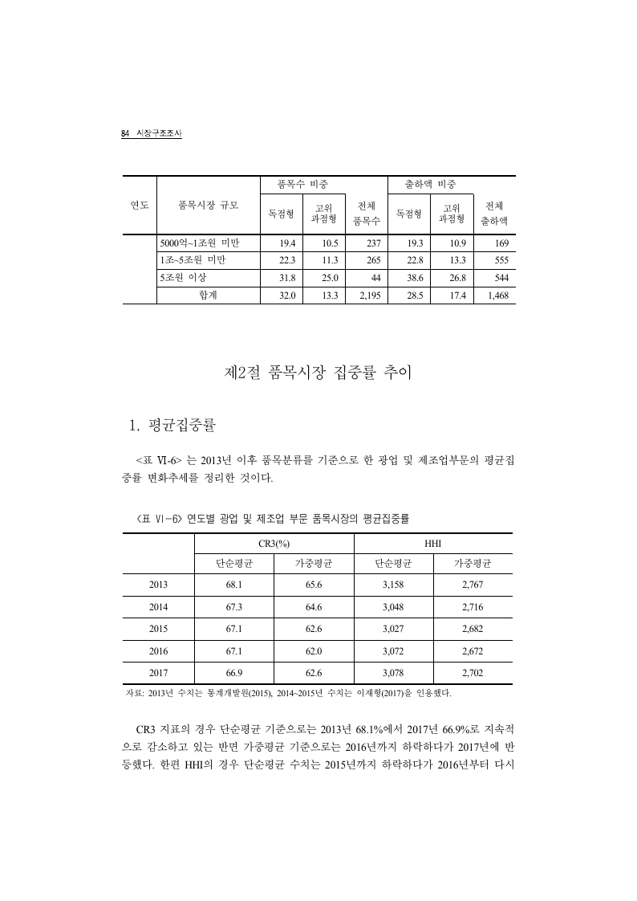
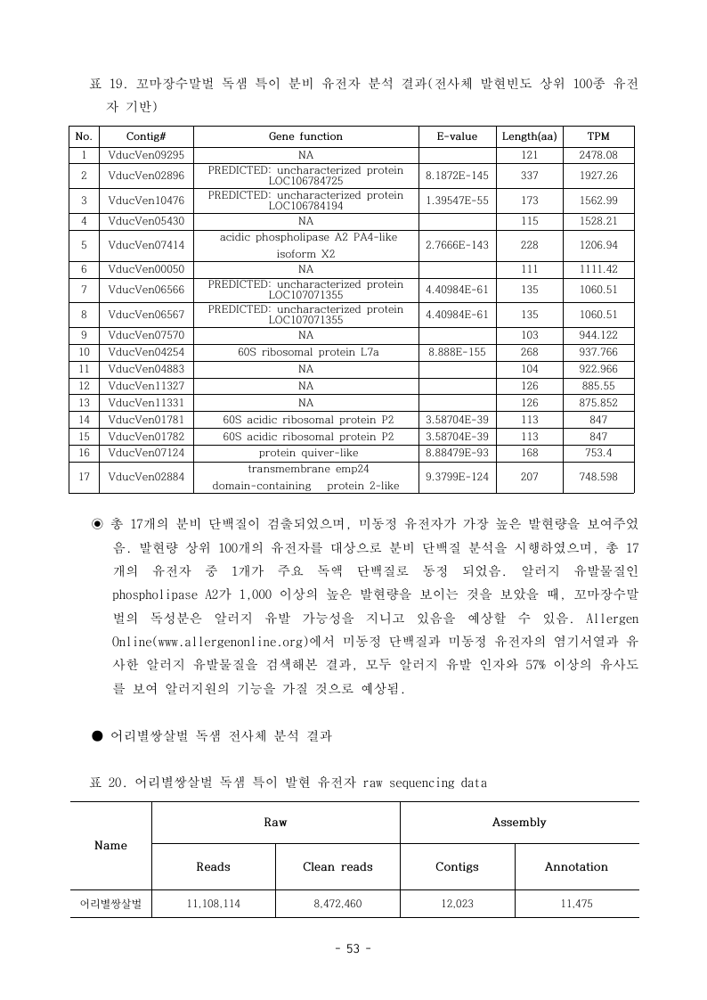

# #7147 시각 증적 — 비공백 host 표의 선언 높이 fit 이 원본 행높이를 일괄 축소

## 실행한 것

| 항목 | 값 |
|---|---|
| 입력 | `samples/task2070/1130000-201900011_D0150004-1-002_2017년기준 시장구조조사.hwp` |
| 기준 PDF | `pdf/task2070/1130000-201900011_D0150004-1-002_2017년기준 시장구조조사-2022.pdf` (315쪽) |
| 쪽수 | rhwp **315쪽** = 정본 **315쪽** |
| 대상 | `<표 Ⅵ-5> 각 연도 품목규모별 시장구조` — section 0, pi=934, 20행×8열 |
| 명령 | `python scripts/visual_sweep.py --file-target mkt7147 <hwp> <pdf> --rhwp-bin <bin> --pages 94,95 / 95,96 --dpi 96` |
| 수정 전 | `upstream/devel` `7a95e46e0` |
| 수정 후 | 같은 base + 이 PR |

> **쪽 번호 주의.** 이 자리에서 rhwp 와 정본은 쪽 색인이 **한 장 어긋나 있다**(총 쪽수는
> 315로 같고 뒤에서 상쇄된다). 이 표는 정본 **94·95쪽**, rhwp **95·96쪽**(1-based)에 있다.
> 이 어긋남은 이 변경 **전후가 동일한 별개 축**이며, 그래서 sweep 의 같은-번호 짝짓기 대신
> 각 쪽의 실제 래스터를 직접 붙여 읽는다.

## 판독 — 행 높이

**수정 전** (rhwp 95쪽): 20행 전부가 한 쪽에 들어가 있고 행이 눈에 띄게 납작하다.



**수정 후** (rhwp 95쪽): 행 높이가 원본 선언대로 돌아오고, 표가
`1000억~5000억원 미만` 행에서 끊겨 다음 쪽으로 이어진다.



**정본** (94쪽): 같은 행 높이, 그리고 **같은 행**(`1000억~5000억원 미만`)에서 끊긴다.



제목부 두 행을 재면:

| 행 | 원본 선언 | 정본 | 수정 전 | 수정 후 |
|---|---:|---:|---:|---:|
| IR row=0 | 6.004mm | **6.005mm** | 4.859mm | **6.005mm** |
| IR row=1 | 13.391mm | **13.405mm** | 10.836mm | **13.388mm** |

## 판독 — 이어받는 쪽

rhwp 96쪽(수정 후)과 정본 95쪽은 **쪽 단위로 같다** — 반복 제목 줄 뒤
`5000억~1조원 미만 / 1조~5조원 미만 / 5조원 이상 / 합계` 네 행, 이어서 `제2절 품목시장
집중률 추이`, `<표 Ⅵ-6>`, 그리고 같은 꼬리 문단까지 순서와 내용이 일치한다.
수정 전에는 이 이어받기 자체가 없었다(표가 앞 쪽에 통째로 들어갔다).





## 왜 축소가 일어났나

조판 진단으로 측정과 선언을 같이 찍으면 — 측정 행 높이가 **행 선언과 행 단위로 이미 일치**한다.

```text
FITDECL pi=934 rows=20 common_h=366.6 target_row_sum=366.6
        measured_sum=453.1  decl_row_sum=453.1  scale=0.8092
measured =[22.7, 50.6, 20.2, 20.2, 20.2, 20.2, 20.2, 20.2, 20.2, 21.2, 22.3, 21.6, …]
declared =[22.7, 50.6, 20.2, 20.2, 20.2, 20.2, 20.2, 20.2, 20.2, 21.2, 22.3, 21.6, …]
```

화해시킬 어긋남이 없는데도 개체 높이(366.6px)에 맞춰 0.8092배로 눌렀다.
개체 높이 366.6px 는 표 전체가 아니라 **첫 조각**의 높이다 — 정본이 이 표를 두 쪽에
나누고, 수정 후 첫 조각 상자가 366.8px 로 잡히는 것이 그 증거다.

## 반례 — 어디까지가 이 규칙인가

「측정이 행 선언과 일치한다」만으로 좁히면 **너무 넓다**. 같은 형상인데 정본이 반대로
그리는 표가 있다 — `samples/issue5941/1480000-201900698-native-neartop-reset.hwp`
쪽 53 의 3행 표(pi=303)다. 측정 144.7px = 행 선언 144.7px 로 같지만 개체 높이는 130.2px 다.

두 표를 가르는 것은 비율이 아니라 **개체 높이가 행 경계에 떨어지는가**이다.

```text
  시장구조조사 표 Ⅵ-5 (20행)   개체 366.6   누적 [22.7 … 345.0  366.6  388.2 … 453.1]
                                          → 15번 행 경계에 **정확히 적중**
  1480000-201900698 pi=303 (3행) 개체 130.2   누적 [47.0, 99.4, 144.7]
                                          → 어느 경계에도 안 맞음(**행 중간**)
```

한/글 정본이 정확히 그렇게 그린다. 반례 문서의 정본(전체 205쪽 PDF **55쪽**, 표 20)을
96DPI 로 래스터해 가로 괘선을 재면 **899 / 946 / 998 / 1029px** — 표 높이 **130px**,
곧 개체 높이(130.2px) 쪽이고 행 선언 합(144.7px)이 아니다. 그 표는 쪽을 나누지도 않는다.



그래서 규칙은 두 조건을 **함께** 요구한다 — ① 측정이 행 선언과 이미 일치하고,
② 개체 높이가 앞에서부터 정수 개의 행을 정확히 채울 때만 화해를 건너뛴다.
행 중간에서 끊기는 개체 높이는 조각 경계일 수 없으므로 종전대로 화해한다.
이 반례는 회귀 검사 `object_height_that_ends_mid_row_still_reconciles` 로 잠갔다 —
②를 빼면 그 표가 14.5px 자라 본문 하단을 9.4px 넘고 넘침 래칫이 40→41 로 는다.

## 한계

- Sweep 은 Native 단독이다. fresh WASM 비교는 실행하지 않았다.
- 위에 적은 rhwp↔정본 **쪽 색인 1장 차이**는 이 변경이 다루지 않는 별개 축이다.
- 정본 대조는 이 문서의 이 표에 대해서만 했다. 같은 규칙이 적용되는 다른 문서의
  시각 대조는 전체 회귀·래칫으로만 확인했고 개별 판독은 하지 않았다.
