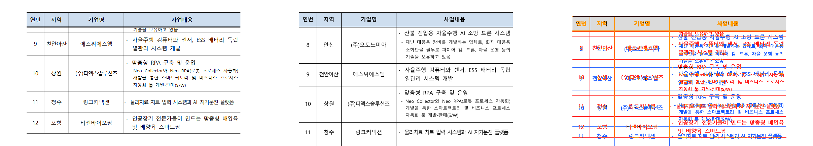
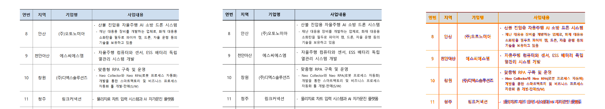
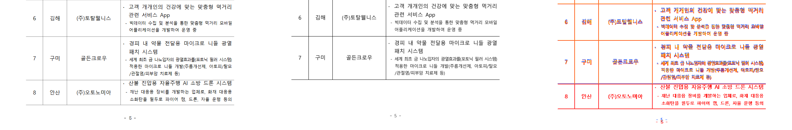
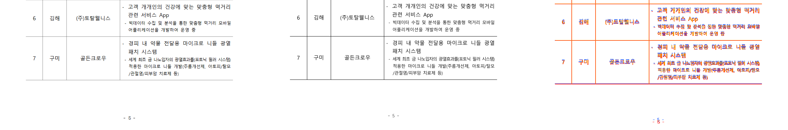

# #7288 시각 증적 — 값 1 «셀 단위로 나눔» 과 고아 쪽

## 실행한 것

| 항목 | 값 |
|---|---|
| 입력 | `samples/issue6132/156482639_startup_ir_contest.hwp` |
| 기준 PDF | `pdf/issue6132/156482639_startup_ir_contest-2020.pdf` — 이 PR 이 함께 등재 |
| 쪽 대응 | rhwp **10쪽** = 정본 **10쪽** (짝짓기 성립) |
| 쪽 | 5·6·7·8 (Native, DPI 96) |
| 명령 | `python scripts/visual_sweep.py --file-target ir6132 <hwp> <pdf> --rhwp-bin <bin> --pages 5,6,7,8 --dpi 96 --out <out>` |
| 수정 전 바이너리 | PR #7346 head (값 0 까지만 적용) |

수정 전·후 두 번 실행해 compare·overlay·review 를 산출하고 직접 읽었다.

## 정본 PDF 의 출처

원본의 `lastSavedWith.product` 가 `null` 이므로 [기준 PDF 정책](../../manual/pr_review/visual_fixture_evidence.md)
상 engine **2020** 이다. 원격 `hwp2024Convert` MCP 로 변환했다.

```text
engine 2020 · Hancom 11.0.0.9136 · hwp-managed-direct-dll-host · 452,890 bytes · 10쪽
```

같은 원문을 engine **2024**(Hancom 13.0.0.3901)로도 변환해 **역시 10쪽**임을 확인했다 —
버전 차이가 아니다. 2024 판은 판정용이라 저장소에 싣지 않는다.

## 판독 — 6쪽이 행 경계에서 시작한다

`review_p6_before.png` / `review_p6_after.png` 는 같은 쪽의 review 다(왼쪽 rhwp · 가운데 정본 ·
오른쪽 오버레이).

- **수정 전**: rhwp 6쪽이 `기술을 보유하고 있음` 이라는 **문장 한가운데**로 시작한다. 정본은
  같은 자리를 행 `8 안산 (주)오토노미아` 로 시작하므로 이후 행이 하나씩 밀리고, 오버레이가
  행마다 빨간 불일치로 덮인다.
- **수정 후**: rhwp 6쪽도 행 `8 안산 (주)오토노미아` 로 시작하고 행 경계가 정본과 맞는다.





5쪽도 같은 축이다 — 수정 전에는 항목 7 다음을 이어 담고, 수정 후에는 항목 7 에서 끝낸다.





8쪽(`참고3`)은 수정 전후 렌더가 **같은 SHA-256** 으로 바이트까지 동일하다 — 고아 쪽이 사라져도
그 쪽 내용은 변하지 않는다.

## 쪽 귀속 — 숫자로도 일치한다

오버레이 판독과 별개로, 쪽별 글자 수(공백 제외)가 정본과 **10쪽 전부 일치**한다.

```text
        1    2    3    4    5    6    7    8   9   10
정본   850  705  126  831  558  626  566  942  26  325
수정후 850  705  126  831  558  626  566  942  26  325
수정전 850  705  126  831  631  652  467  942  26  325
                          ^^^^ ^^^^ ^^^^  ← 표를 행 안에서 잘라 더 채웠다
```

값 1 만 적용하고 고아 쪽을 고치기 전 중간 상태에서는 8쪽이 본문 글자 0 인 빈 쪽이 되어
**11쪽**이었다. 두 검사(`issue_7288_issue6132_matches_hancom_oracle`)가 그 둘을 각각 잡는다.

## 한계

- Sweep 은 Native 단독이다. fresh WASM 비교는 실행하지 않았다.
- 오버레이의 글리프 수준 어긋남은 글꼴 래스터 차이이며 수정 전후 동일하다. 이 증적이 읽는
  것은 **행 경계와 쪽 귀속**이다.
- 5·6쪽 review 의 rhwp 패널에서 셀 안 항목 순서가 정본과 다르게 보이는 자리가 있다 —
  텍스트 추출 순서 축(#7160)이며 이 변경의 범위가 아니다. 쪽별 글자 수는 위 표대로 일치한다.
