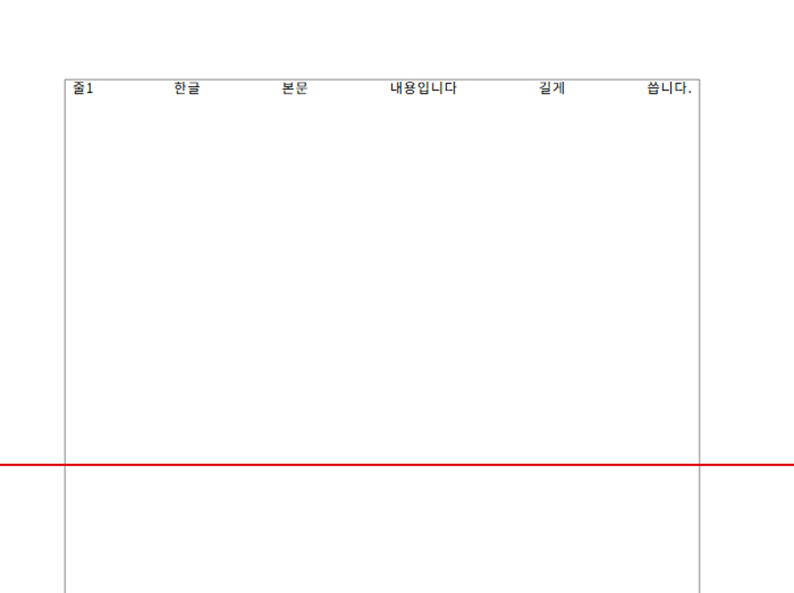
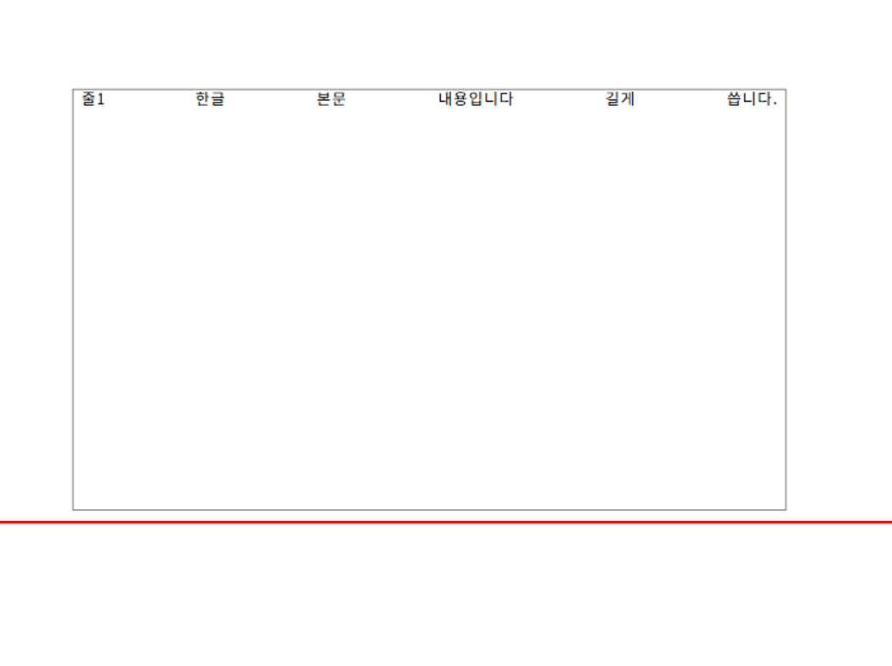
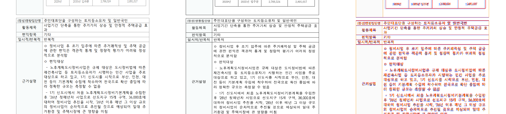

# #7288 시각 증적 — 저장 프레임 초과 허용의 선언 신뢰 상한

source head `8e8ce950e` (base `1966af77f`).

이 변경은 **선언 개체 높이가 실제 측정보다 크게 작을 때** 저장 프레임이 주는 예산 초과
허용치를 거둔다. 증적을 두 갈래로 나눠 남긴다 — ① 수정이 실제로 고치는 것, ② 실제 문서가
바뀌지 않는다는 것.

## ① 수정이 고치는 것 — 신고 재현체의 실제 렌더

신고자의 재현(`pageBreak=2`, 첫 행 60줄)을 `export_hwp_native` 로 **`.hwp` 파일로 떠서**
두 빌드로 `export-svg` 하고 Chrome 으로 래스터했다. 합성 입력이지만 엔진이 실제로 그린
출력이다. 빨간 선은 본문 바닥(`1009.1px`)이다.

| | 표 상자 | 본문 넘침 |
|---|---|---|
| 수정 전 | `y = 669.9 .. 1185.1` | **176px 초과** |
| 수정 후 | `y = 669.9 .. 1000.3` | 없음 |





⚠ 셀 안에 첫 줄만 보이는 것은 이 합성 입력의 선언 셀 높이가 한 줄(25pt)이기 때문이다.
이 증적이 보이는 것은 **표 상자가 본문 바닥을 넘는지**이며, 셀 내용 조판은 이 변경의 범위가
아니다.

## ② 실제 문서가 바뀌지 않는다 — Visual Sweep

새 게이트가 실제로 발동하는 문서를 프로브(`RHWP_PROBE_DFA`)로 찾아 전수 확인했다.
`samples/**` 에서 **26건**이 이 갈래를 타고, 그중 **출력이 바뀌는 문서는 0건**이다
(쪽수·overflow·textOverlap·offCanvas 네 지표 전부 동일).

그중 정본 PDF 가 있고 쪽수가 맞는 문서로 Sweep 을 돌렸다.

| 항목 | 값 |
|---|---|
| 입력 | `samples/86712_regulatory_analysis.hwp` (rhwp 64쪽) |
| 기준 PDF | `pdf/86712_regulatory_analysis-hwp-2024.pdf` (**64쪽** — 쪽 대응 성립) |
| 쪽 | 28·29 — 억제가 일어나는 문단(`pi=182`)의 5행 표가 **두 쪽에 걸치는** 자리 |
| 명령 | `python scripts/visual_sweep.py --file-target r86712 <hwp> <pdf> --rhwp-bin <bin> --pages 28,29 --dpi 96 --out <out>` |

**전후 렌더가 바이트까지 동일하다** — 같은 SHA-256 이다.

```text
  before      rhwp_028.png  abbd60ad8aa248fd    rhwp_029.png  fd7e7216d71d1b42
  dfa_after   rhwp_028.png  abbd60ad8aa248fd    rhwp_029.png  fd7e7216d71d1b42
```

그 쪽이 정본과도 맞는다 — 행 경계·줄 나눔·항목 순서가 일치한다(오버레이의 글리프 수준
어긋남은 글꼴 래스터 차이로 수정 전후 동일).



## 반대쪽 잠금

이 허용치를 도입한 [#5057] 의 문서 `21484591-gimcheon-sewage-ordinance.hwp` 는 프로브
HIT 목록에 **없다** — 게이트가 그 계약을 건드리지 않는다. 계약 시험 2건도 그대로 통과하는데,
그 시험은 허용치가 실제로 발동해야 통과하므로(없으면 13쪽 대신 14쪽) 기능이 죽지 않았음을
함께 증명한다.

## 한계

- 수정이 **고치는** 쪽에는 대응하는 한컴 출력이 없다. 재현체가 편집 API 로 만든 합성
  문서이고, 실제 코퍼스 문서는 전수에서 출력이 바뀌지 않아 비교할 대상 자체가 없다.
  ①은 그래서 기준 PDF 대조가 아니라 **전후 실제 렌더 대조**다.
- Sweep 은 Native 단독이다. fresh WASM 비교는 실행하지 않았다.
- 프로브 전수는 `samples/**` 범위다. 10k 코퍼스 전체는 돌리지 않았다.
