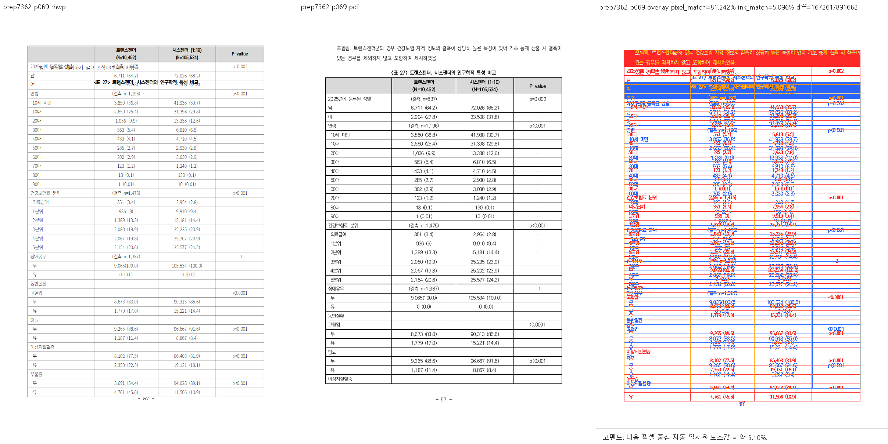
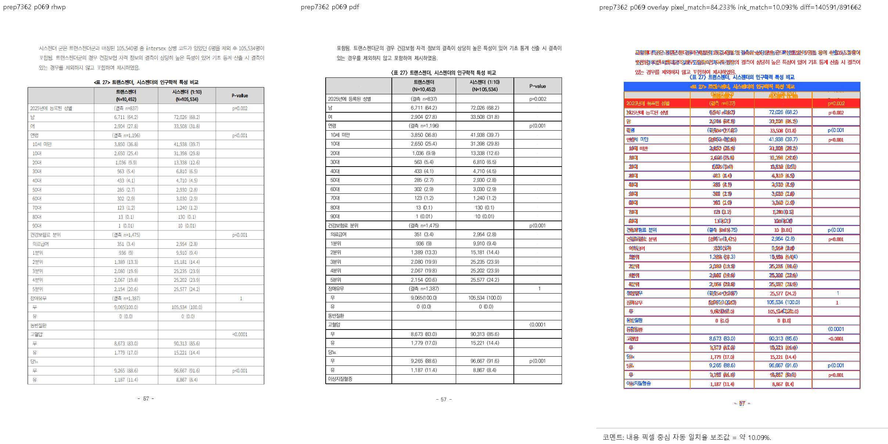
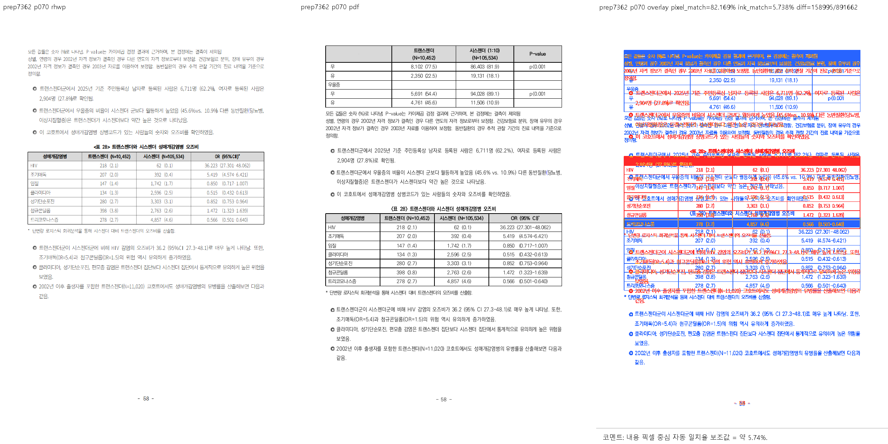
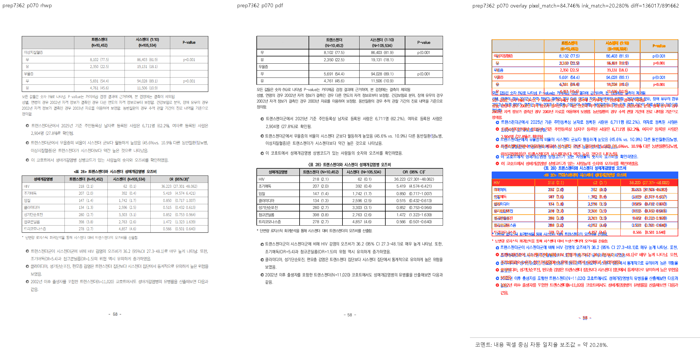

# #7362 시각 증적 — 자리차지 표가 앞 본문 글줄 위에 그려진다

## 실행한 것

| 항목 | 값 |
|---|---|
| 입력 | `samples/issue2006/1790387_prep_final_report.hwpx` |
| 기준 PDF | `pdf/issue2006/1790387_prep_final_report-hwp2020-20260814.pdf` (저장소 기존 정본) |
| 쪽 대응 | rhwp **140쪽** = 정본 **140쪽** (짝짓기 성립) |
| 쪽 | 69·70 (1-based, Native, DPI 96) |
| 명령 | `python scripts/visual_sweep.py --file-target prep7362 <hwpx> <pdf> --rhwp-bin <bin> --pages 69,70 --dpi 96 --out <out>` |
| 수정 전 바이너리 | `upstream/devel` `7a95e46e0` |
| 수정 후 바이너리 | 같은 base + 이 PR 의 변경 |

수정 전·후 두 번 실행해 compare·overlay·review 를 산출하고 직접 읽었다.

## 판독 — 69쪽: 표가 앞 본문과 캡션을 덮는다

왼쪽 rhwp · 가운데 정본 · 오른쪽 오버레이.

- **수정 전**: rhwp 69쪽이 **표부터** 시작한다. 본문 문단(`포함됨. 트랜스젠더군의 경우 …`)과
  캡션(`<표 27> 트랜스젠더, 시스젠더의 인구학적 특성 비교`)이 표 첫 두 행 **위에 겹쳐** 그려져
  글자가 서로 엉킨다. 38행 전부를 이 쪽에 욱여넣어 쪽 바닥을 31.3px 넘긴다.
- **수정 후**: 본문 문단 → 캡션 → 표 순서로 정본과 같아진다. 표는 흐름 위치(208.0)에서
  시작하고 쪽 경계에서 잘려 다음 쪽으로 이어진다.





## 판독 — 70쪽: 이어받는 조각이 통째로 사라졌었다

- **수정 전**: rhwp 70쪽에 **표 이어받기가 아예 없다**(본문 `모든 값들은 숫자 …` 로 바로 시작).
  앞 쪽이 표를 통째로 삼켰기 때문이다. 정본은 같은 자리에서 반복 제목 줄과 나머지 행을 이어받는다.
- **수정 후**: 반복 제목 줄 뒤로 `이상지질혈증 / 무 / 유 / 우울증 / 무 / 유` 행이 이어지고,
  그 뒤 본문과 `<표 28>` 이 정본과 같은 순서로 놓인다. 유닛 누락·중복 없다.





## 수치

오버레이 판독과 별개로 sweep 이 산출한 보조 지표도 같은 방향이다.

```text
          pixel_match      ink_match       diff
 69쪽  81.242 → 84.233   5.096 → 10.093   167261 → 140591
 70쪽  82.169 → 84.746   5.738 → 20.280   158995 → 136017
```

조판 회계도 같이 바뀐다 — 69쪽(0-based 68)의 `usedHeight` 가 **1070.9 → 922.9**
(본문 926.0) 로 내려오고, 항목 종류가 `table` → `partialTable` 로 바뀐다.

## 한계

- Sweep 은 Native 단독이다. fresh WASM 비교는 실행하지 않았다.
- rhwp 69쪽은 정본보다 본문 줄이 하나 많고(`시스젠더 군은 … 105,534명이 포함됨.`),
  잘린 행 위치가 한 행 뒤다(정본 33행 / rhwp 32행). 이 둘은 별개가 아니라 **한 원인의
  앞뒤**이며, 그 원인은 이 변경의 축이 아니라 **기준 PDF 와 입력의 조판 환경 불일치**다.
  이 변경 전후 동일하다.

  실측(`review_p69_after.png` 세 패널의 잉크 프로파일, 양쪽 `a<200`·행 잉크 0.45):

  | | rhwp | 정본 |
  | --- | ---: | ---: |
  | 표 행 피치(중앙) | 24.50px | 25.00px |
  | `<표 27>` 상단 | 237.5 | 211.0 |
  | 표 하단 | 1047.0 | 1045.5 |

  하단은 같고 상단만 26.5px 내려와 행 하나를 잃는다. 행 피치는 rhwp 가 오히려 근소하게
  좁으므로 **줄 간격 축이 아니다**. 사다리를 거슬러 올라가면 67쪽 `pi=14` 가 rhwp 5줄 /
  정본 4줄이고, 그 +26.4px 가 68쪽을 균일하게 밀어 69쪽 표 시작 y 를 만든다.

  그 5줄은 rhwp 의 측정이 아니라 **입력의 저장 조판 정보**가 지정한다.

  - 기준 PDF `pdf/issue2006/…-hwp2020-20260814.pdf` 는 `KoPubDotumLight`/`Bold`
    서브셋을 **내장**한다 → KoPub 설치 환경 인쇄이고 그 문단이 4줄이다.
  - 입력의 저장 `hp:linesegarray` 는 같은 문단을 **5줄**로 적는다 → 치환 환경 저장본이다.
    rhwp 는 그 저장 줄을 그대로 놓으므로 5줄이 된다.
  - 교차 확인 — 저장 lineSeg 4,155개를 전부 제거해 재조판시키면 `pi=14` 의
    `lineHeightSum` 이 현행 폭 모형에서 73.33(**5줄**, 저장본과 같음), KoPub 실측
    폭에서 58.67(**4줄**, 정본 인쇄와 같음)로 갈린다. 두 모형이 각각 다른 환경을 재현한다.

  AGENTS.md 「저장 조판 정보의 유효성 확인」이 말하는 경우이므로, 이 26.5px 는 rhwp 의
  결함이 아니라 **입력과 기준의 환경 차**로 기록한다. 같은 쪽에서 본문 줄 수가 구조적으로
  1 다르므로 이 문서의 69쪽 이후는 정본과 줄 단위로 맞출 수 없다.
  (`RHWP_KOPUB_REAL_LATIN` env A/B 로 이 문서 140쪽 `dump-pages` 해시가 전부
  `6ea76ec62fdde645` 로 동일함을 확인했다 — 폭 상수 축 `#7390` 은 여기서 발화하지 않는다.)
- 오버레이의 글리프 수준 어긋남은 글꼴 래스터 차이이며 수정 전후 동일하다. 이 증적이 읽는
  것은 **항목 순서·겹침·조각 이어받기**다.
