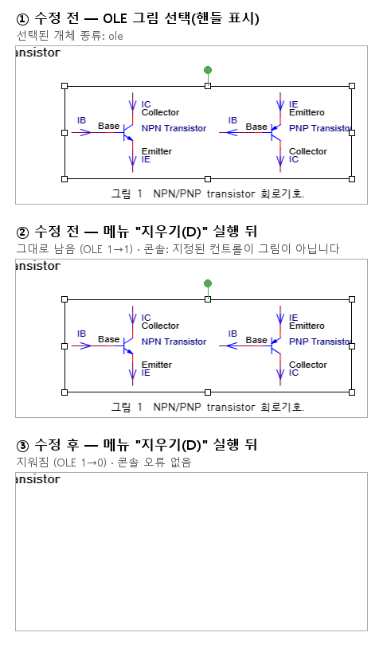

# #7105 메뉴 "지우기(D)" 로 OLE 개체 삭제 — 수정 전 / 수정 후

재현 문서는 #7105 첨부 `실험4 Transistor-MOSFET.hwp`(11쪽)다. 현재 저장소에는 같은 원본이
`tests/fixtures/issue_7105/transistor-mosfet.hwp`, 한컴 기준 PDF가
`pdf/issue7105/transistor-mosfet-hancom2022.pdf`로 이미 포함되어 있다.
2026-09-14 통합 검토는 이 기존 경로를 사용했으며 이름을 바꾼 중복 파일을 추가하지 않았다.

## 산출 방법

- **환경:** `rhwp-studio` 개발 서버(vite, 127.0.0.1:7700)를 로컬 headless Chrome(puppeteer-core)으로 열었다.
- **동작:** 문서를 `window.__wasm.loadDocument` 로 연 뒤 1쪽 OLE 그림(문단 18)을 `enterPictureObjectSelectionDirect(…, 'ole')` 로 선택했다. 이어 오른쪽 클릭 메뉴 "지우기(D)" 의 명령 `insert:picture-delete` 를 실행했다.
- **수정 전:** 이 PR 의 수정 커밋 바로 앞(`HEAD~1`)의 `insert.ts`.
- **수정 후:** 이 PR 의 `insert.ts`.
- 두 실행 모두 같은 WASM 산출물을 쓴다. 이 수정은 TypeScript 명령 분기만 바꾼다.

## 결과

| | 선택된 종류 | OLE 개수(1쪽) | 콘솔 |
|---|---|---|---|
| 수정 전 | `ole` | 1 → 1 (남음) | `[error] [CommandDispatcher] 커맨드 실행 실패: insert:picture-delete 렌더링 오류: 지정된 컨트롤이 그림이 아닙니다` |
| 수정 후 | `ole` | 1 → 0 (지워짐) | 없음 |

