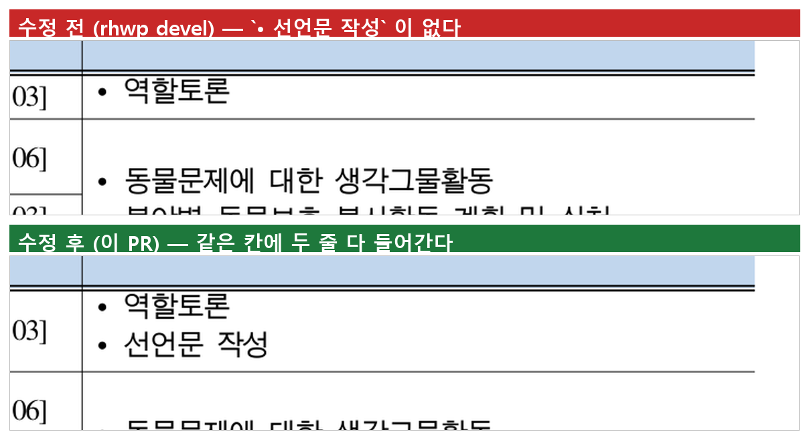

# #6981 — 이어받는 조각의 걸친 셀이 제 높이를 못 받아 글자가 사라진다

`samples/task2287/1342000_edu_curriculum_map.hwp` 377쪽의 `• 선언문 작성` 이 렌더 트리에는
정상 좌표로 있는데 화면에 한 자도 안 나간다. 그 줄이 **자기 칸 상자 밖**에 있어 clip 이
지우기 때문이다.

## 저장 사다리가 산술을 전부 설명한다

셀 `(62,8) row_span=2`:

```text
  저장 셀 3882 HU = 51.76px · 여백 141 HU = 1.88px
  문단 3개 vpos 0 · 1300 · 2600 HU, 줄높이 1000 HU
     내용 바닥 48.00px + 1.88 = 49.88 = 51.76 − 1.88     ← 온전하면 딱 맞는다
  그리드 행 62 = 2299 HU = 30.65px · 행 63 = 1583 HU = 21.11px
     para1 은 1.88+17.33 .. 32.55 → 30.65 를 넘어 앞 조각에 못 들어간다
     이어받는 행 63(21.11px)이 para1+para2(32.55px 필요)를 받는다 → 11.4px 밖 → 소실
```

쪼개지지 않았으면 들어갔을 내용이다. **쪼개는 바람에 생긴 부족분**을 되돌리는 것이 수정의
범위다.

## 근인 — per-row 경로에 블록-합 보정이 없다

`table_partial.rs` 2b 행높이 오버라이드에는 `#2287/PR #2290 P1` 의 "블록-합 보정"(걸친
rowspan 셀의 컷 가시 높이를 행합에 반영)이 있는데 **`is_block_split` 조각만** 돈다.
행별 경로에서는 걸친 셀이 `#1748` 의 높이-컷으로 남은 유닛 전부를 받는데도, 그 셀이 덮는
행 높이는 같은 행의 `row_span==1` 셀만 보고 정해진다.

## 시각 증적



`export-png` 는 이 빌드에서 `native-skia` 가 필요해 `export-svg` 산출물을 그대로
래스터화했다(같은 렌더 경로).

## 쪽수 정답지

`tests/fixtures/oracle_page_count_baseline.tsv` 에 이 문서가 있다 — 한/글 정본 **415쪽**,
기준선 rhwp 413쪽. 이 수정으로 **414쪽**이 되어 격차가 2 → 1 로 줄어 기준선을 조였다.
