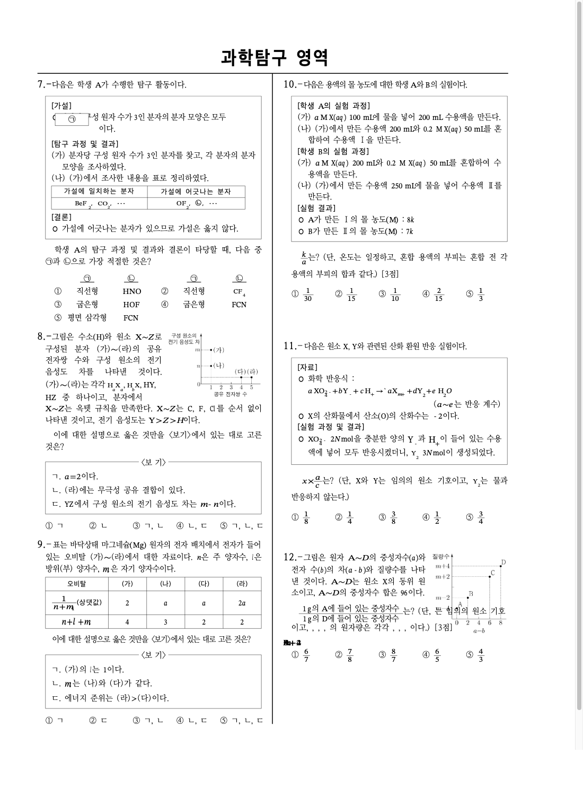
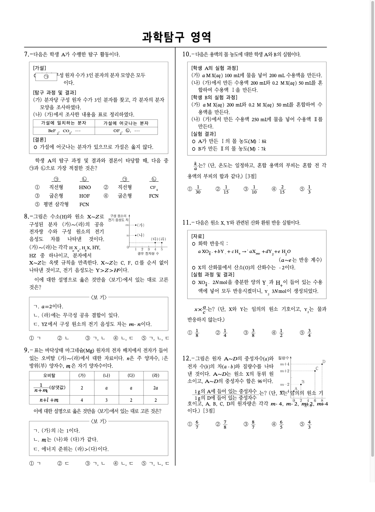
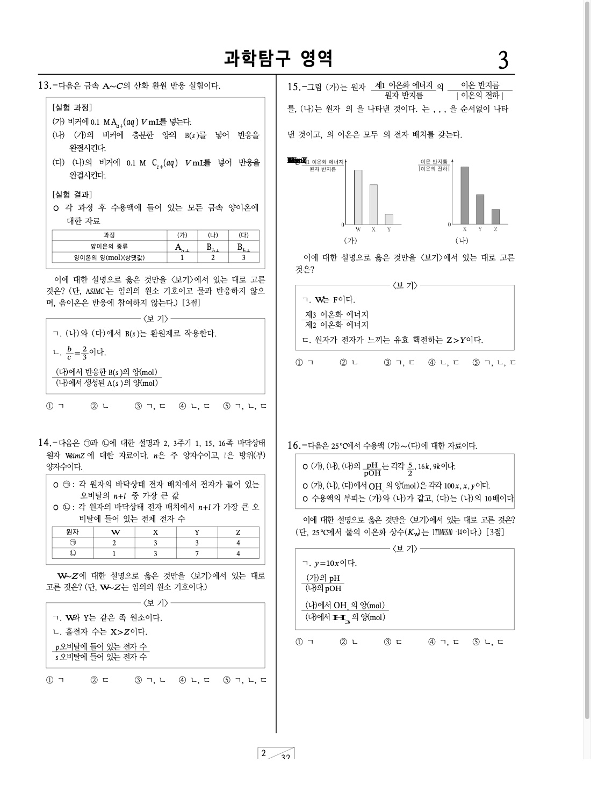
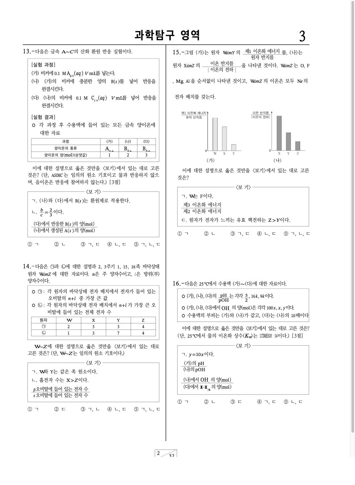
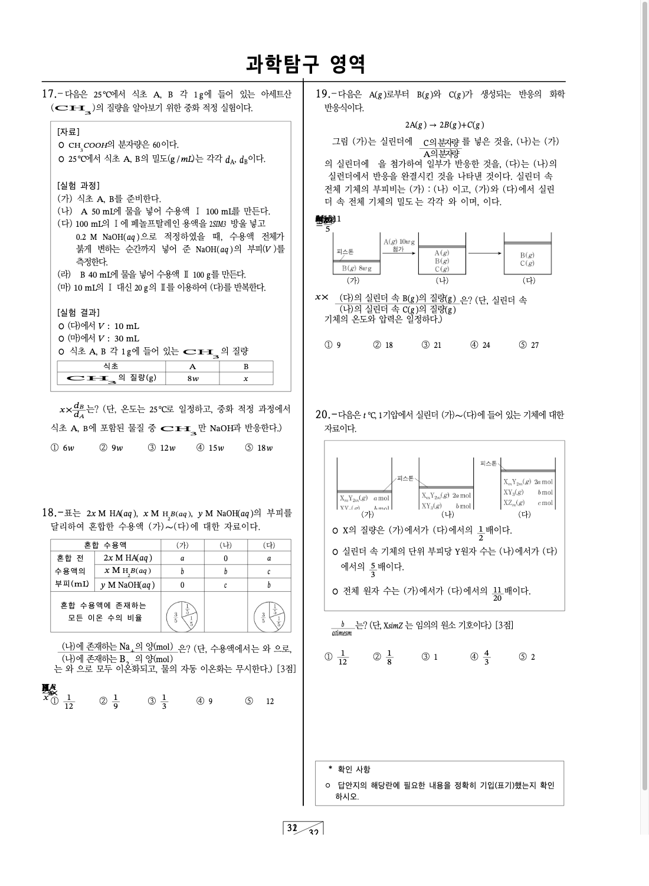
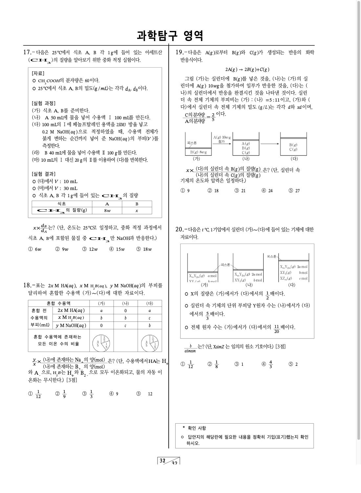

# Task #565 최종 결과 보고서

## 1. 타스크

- 이슈: [#565](https://github.com/edwardkim/rhwp/issues/565)
- 대상 문서: `samples/exam_science.hwp`
- 대상 증상: 12/15/18/19번 문항의 `Equation` + `treat_as_char` 인라인 수식이 텍스트 줄 안에 렌더되지 않고 fallback 위치에 겹치거나 빈 자리처럼 보임

## 2. 원인

`layout_inline_table_paragraph` 는 TAC 표가 섞인 문단을 별도 경로로 처리하면서 `para.controls` 중 표만 순차 배치했다.
그 결과 같은 문단 안의 TAC 수식은 실제 text position 에 삽입되지 못했고, fallback 개체 배치 경로로 밀려나거나 중복/겹침 문제가 발생했다.

추가 리뷰에서 19번 답문항처럼 같은 text position 에 TAC 수식과 TAC 표가 함께 있는 문단도 확인했다.
이 경우 한 gap 에 여러 TAC 개체를 연속 배치해야 다음 본문 텍스트가 세로로 밀리거나 순서가 깨지지 않는다.

## 3. 수정 내용

- `composed.tac_controls` 기반으로 TAC 표와 TAC 수식을 text position 순서대로 수집한다.
- TAC 표는 기존 표 레이아웃 경로를 유지한다.
- TAC 수식은 `EquationNode` 로 인라인 렌더링하고 `inline_shape_position` 을 등록한다.
- 같은 text position 의 TAC 개체를 모두 같은 gap 에서 렌더링한 뒤 다음 텍스트 조각을 배치한다.
- 회귀 테스트는 12/15/18/19번 문항과 19번 답문항의 `수식 → 분수 표 → 본문 텍스트` 순서를 함께 검증한다.

## 4. 검증

```bash
cargo test --lib test_565_exam_science_inline_tac_equations_are_not_collapsed -- --nocapture
cargo test --lib renderer::layout::integration_tests -- --nocapture
cargo test --lib
git diff --check
```

- #565 단일 회귀 테스트 통과
- layout integration tests 22개 통과
- 전체 lib 테스트 1119개 통과, 실패 0개, ignored 1개
- `git diff --check` 통과

## 5. 시각 검증 증거

`exam_science.hwp` 2/3/4쪽을 SVG로 내보낸 뒤 PNG로 캡처해 확인했다.
캡처는 `origin/devel` 로 rebase 한 뒤 다시 생성했다.
초기 캡처에서 보였던 2쪽 8번 본문 겹침은 `main` 기반 캡처 문제였고, rebase 후 캡처에서는 해소되었다.

| 페이지 | AS-IS | TO-BE |
|--------|-------|-------|
| 2쪽 12번 | 본문에 들어가야 할 `X`, `A`, `B`, `C`, `D`, `m-4`, `m-2`, `m+2`, `m+4` 가 비거나 fallback 좌표에 겹침 | 해당 수식들이 문제 본문과 그래프 라벨의 원래 인라인 위치에 표시됨 |
| 3쪽 15번 | TAC 수식이 그래프 왼쪽에 뭉쳐 겹침 | 수식들이 문장/그래프 라벨 위치에 표시됨 |
| 4쪽 18/19번 | TAC 수식이 선택지/그림 주변에 뭉쳐 겹침 | 수식들이 표 아래 문장과 19번 그림 설명 줄에 인라인 표시됨 |

### 2쪽 12번

AS-IS:



TO-BE:



### 3쪽 15번

AS-IS:



TO-BE:



### 4쪽 18/19번

AS-IS:



TO-BE:



## 6. 남은 사항

- GitHub fork 브랜치에 push 후 `edwardkim/rhwp:devel` 대상으로 draft PR 생성.
