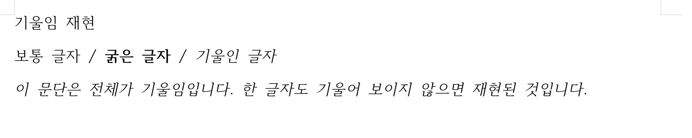

# #5874 기본 PDF 기울임 소실 보정 결과

Issue: [#5874](https://github.com/edwardkim/rhwp/issues/5874)

## 판정

`upstream/devel@2c144b180`에서 최소 HWPX의 기울임 소실을 재현했다. 기울임 유무를 바꿔도
기본 PDF가 byte-identical이었다. 구현 commit `ce67652fe`는 SVG/usvg/svg2pdf 경계에서
정규 face로 fallback된 수평 기울임 text에 baseline 고정 shear를 적용한다.
실제 italic/oblique face는 그대로 두고, 혼합 style/face 등 안전하지 않은 경우에는 경고한다.

보정 후 144 DPI 비교에서 기울임 대조본과 7,162 pixels 차이를 확인했다. 일반 글자 대조본은
보정 전과 byte-identical이며, 1페이지와 추출 텍스트를 유지했다. 격리 fontdb 계약 7건,
전체 기본 nextest 9,051건(46 skip), fmt, 세 Clippy와 workspace build가 통과했다.
PR 생성 승인 뒤 Native Skia lib 4,112건(13 ignore), placeholder 2건, direct PDF 4건과
host WASM `--no-opt` 진단 빌드도 통과했다.
상세 결과는 [Stage 3](../working/task_m100_5874_stage3.md)에 기록했다.

## 코멘트에 사용할 증적

아래 두 PNG를 실제 코멘트 본문에 표시하고, 최소 입력과 전후 PDF를 다운로드 링크로 제공한다.
게시 시 승인된 원격 commit에 고정된 raw image URL을 사용한다. 아직 코멘트는 게시하지 않았다.

- [최소 HWPX](../../samples/issue5874/italic-repro.hwpx), [입력 출처와 SHA-256](../../samples/issue5874/README.md)
- [수정 전 PDF](../../pdf/issue_5874/before.pdf), [수정 후 PDF](../../pdf/issue_5874/after.pdf)

작성자 한컴 화면은 다른 플랫폼/글꼴의 screenshot으로, 기울임 존재 여부의 독립 근거다.
위 픽셀 차이를 한컴 fidelity 점수로 해석하지 않는다. 임시 PNG/SVG/JSON과 검증 로그는
커밋하지 않으며, 이후 PR에도 검증 통과 사실만 기재한다.

## 범위와 대기 사항

이번 수정과 시각 검증은 기본 SVG 기반 PDF에 한정한다. Native-Skia direct PDF의 기존 회귀는
통과했으나 해당 backend의 합성 기울임과 Text IR v2 synthetic-style authority를 수정하지 않았다.
Docker가 없어 WASM은 host 대체 진단 빌드를 사용했다. Docker 최적화 배포 빌드, 브라우저 WASM
시각 검증과 GitHub CI 통과를 주장하지 않는다.

사용자가 원격 push와 PR 생성을 승인했다. 오늘할일을 제외한 후보로 PR 번호를 받은 뒤,
self-review와 오늘할일을 같은 PR의 trailing commit으로 추가한다. GitHub CI와 merge,
이슈/PR 코멘트 게시 및 issue close는 이후 확인과 별도 승인 대상이다.
