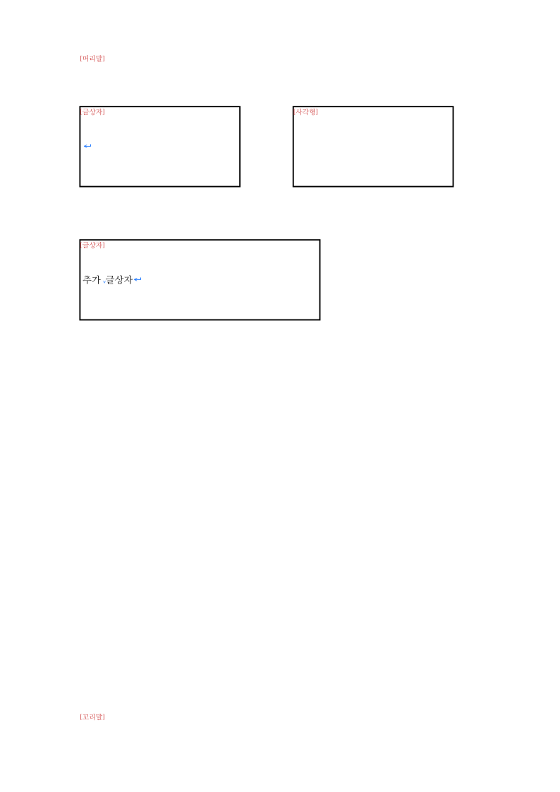

# #6856 결과보고서 — 소유 구조 기반 사각형·글상자 식별

- Issue: #6856. 날짜: 2026-09-08.
- 상태: 전체 로컬 검증·PR 준비 완료, 메인테이너의 원격 push·PR 생성 승인 접수. 이슈 close 미수행.
- [승인 계획](../plans/task_m100_6856_restart_impl.md) · [전체 검증 기록](../working/task_m100_6856_restart_stage6.md) · [PR 제출 초안](../plans/task_m100_6856_pr.md).
- 제품 source 후보 `492bdb3f7`, 시험 정정 포함 검증 후보 `bc0bc00e4`.

## 해결한 내용

기하가 사각형인 컨트롤에서 **자신이 소유하는 내부 문단 영역**으로 일반 사각형과 글상자를
구분한다. 글자가 있는지, 이미지가 있는지, 배경·테두리가 어떤지는 종류 판정의 입력이 아니다.

| 구조 | IR/문서 열기 | 조판부호 |
| --- | --- | --- |
| 내부 문단 영역 없음 | 일반 사각형 | `[사각형]` |
| 정상 내부 영역 있음: 빈 문단·글자·그림·혼합 | 글상자 구조 유지 | `[글상자]` |
| HWP 사각형 소유 목록이 문단 수 0 선언 | 구조 오류로 문서 열기 거부 | 정상 컨트롤로 조판하지 않음 |
| 확인된 소유 목록 잘림·문단 누락 / HWPX 내부 영역 XML 손상 | 타입 있는 구조 오류를 상위 호출자에 전달 | 부분 문서로 위장하지 않음 |

기존 `Option<TextBox>`를 단일 구조 근거로 사용했다. 별도 boolean을 저장해 의미가 불일치할 가능성을
늘리지 않았고, `ShapeObject::Rectangle`이라는 기하 종류도 유지했다. 렌더 노드는 원본의 식별을
소비하며 내부 장식용 TextBox 노드 때문에 조판부호가 중복되지 않게 했다.

HWPX 자기닫힘 `
`는 문단 속성과 빈 문단을 보존하면서 reader를 뒤 형제까지 진행시키지 않는다.
HWP 오류는 일반/lenient 문서 열기, HWPX 오류는 section·master page를 거쳐 호출자에게 전달한다.
다른 오류의 기존 복구 정책을 일괄 변경하지 않았다.

## 판정 근거

- 메인테이너가 A4 문서의 조판부호 식별을 통과 판정했다.
- 최신 제품 코드의 A4 legacy SVG가 그 선행 판정 SVG와 바이트 단위로 동일했다.
- canonical layer SVG는 A4 HWP/HWPX가 서로 동일하고 사각형 1개·글상자 2개를 표시한다.
- 메인테이너가 `a4-zero-paragraph.hwp`를 한컴에서 열어 파일 손상을 확인했다. 해당 원본을
  다시 저장하거나 변경하지 않고 rhwp 파서·DocumentCore·CLI에서 구조 오류 거부를 확인했다.
- 편람 HWP/HWPX의 본문 내부 영역 136개와 바탕쪽 43개를 보존했다. 모델 18조합 시험과 실제
  문서 조사를 구분하며, 18개의 한컴 정상 fixture가 확보되었다고 주장하지 않는다.

위 PNG는 현지 설치 폰트와 librsvg로 변환한 현재 출력이다. PDF raster 대조 지표가 아니며,
새로운 한컴 전체 fidelity 판정을 의미하지 않는다. 파일·바이너리 hash는 Stage 6에 기록했다.

## 전체 검증

대상은 `bc0bc00e4`, worktree는 `rhwp-review-6856`, 고정 target은
`/home/edward/mygithub/rhwp-6812-review-target`이다. Cargo를 순차 실행했다.

| 항목 | 결과 |
| --- | --- |
| fmt, native Clippy, WASM32 Clippy, workspace build/all-target Clippy | 통과 |
| manifest check, 배정 규칙 시험 | 통과, 규칙 시험 21개 |
| release-test 전체 nextest | 9,248 통과·0 실패·46 skip, 시험 309.428초 |
| Native Skia lib·missing picture·direct PDF | 4,112 통과·13 ignored / 2 통과 / 4 통과 |
| Docker WASM | 최적화 포함 빌드 통과, 6분 22초. 실제 새 WASM 스모크 통과 |
| PR 범위 공백·문서 링크·최신 base simulation | 통과, `devel=91147aec33`, 충돌 없음 |

새 WASM에서 A4 HWP/HWPX의 사각형 1개·글상자 2개, 조판부호 OFF, 실제 손상 파일 거부를
직접 확인했다. 실행 중인 Studio 서버가 제공하는 WASM의 hash도 새 파일과 같았다.
브라우저 마우스 상호작용을 재검증했다는 뜻은 아니다. WASM hash·명령은 Stage 6을 따른다.

1차 전체 회귀는 9,247개 통과·1개 실패·46 skip이었다. 기존 #5797 시험이 빈 `
`를 버린
결과를 기대해 실패했다. 원본 XML에는 빈 문단이 있으며 이번 승인 계약은 이를 보존하는 것이다.
문단을 개행으로 잇는 helper의 기대값을 `"검토/승인"`에서 `"\n검토/승인"`으로 정정했다.
뒤 문단과 형제 도형 보존 검사는 유지했다. 제품 코드·golden·baseline 원장은 바꾸지 않았다.

처음 전체 Clippy에서 발견한 새 시험의 `Box::default()` 표기와 포맷도 정정했다.
집중 시험만으로 전체 검증이 충분했다고 주장하지 않으며 각 실패와 재검증 결과를 Stage 6에 남겼다.

## 범위와 잔여 한계

게시 승인 뒤 최신 `devel=a7de17ff8`의 PR #6889 변경을 기존 review worktree에서 합쳐 재검증했다.
통합 tree `e68d40647229f6a57a3471a984be20a0461afcdd`에서 fmt·세 Clippy·workspace build·manifest,
전체 nextest **9,266 통과·0 실패·46 skip**, Native Skia **4,112 / 2 / 4개 통과**, Docker WASM
최적화 빌드(6분 48초)와 실제 WASM 스모크가 모두 통과했다. A4 SVG 유지·0문단 HWP 거부도 확인했다.
원격 변경을 기본 작업 branch에 merge/rebase하지 않았으며 추가 제품·시험 보정은 없다.
명령·입력·해시는 Stage 6의 게시 승인 뒤 통합 재검증 절에 기록했다. 기존 Studio WASM은 유지했다.

1. 초기 이슈 본문의 A 선 억제 정책 정정은 이번 승인된 재착수 범위에 포함하지 않았다. 해당 조건을
   바꾸거나 옳다고 확정하지 않았다. PR에는 `Refs #6856`을 사용하고 close 전 이슈 범위를 현행화한다.
2. 0문단 거부는 확인된 HWP 사각형 소유 목록에 한정한다. HWPX·표·캡션의 모든 0 개수나 손상
   파일 전체를 새 규칙으로 판정하지 않는다. 메모리 모델의 영역 유무 질의와 파일 유효성은 별개다.
3. 정상 쌍의 구조 수 일치는 모든 IR 필드·저장 왕복·모든 페이지의 한컴 동일성을 증명하지 않는다.
4. HWP 검사에 레코드 순회 비용이 추가된다. 이미 읽은 레코드와 깊이 스택을 쓰며 선언 수만큼
   할당하지 않는다. 동일 환경 전후 성능은 별도 계측하지 않았고 검증 실행 시간을 대신 쓰지 않는다.
5. Studio TypeScript·npm/editor·workflow·Cargo 입력·원본 sample·PDF·baseline은 변경하지 않았다.
   generated suite·manifest·실행 로그·중간 SVG/JSON은 PR에 포함하지 않는다.

## 남은 절차

전체 로컬 게이트와 최신 base 통합 검증을 통과했으므로 승인된 원격 push·Open PR 생성을 진행한다.
PR 번호를 받은 뒤 번호 기반 self-review 기록과 최신 GitHub CI 확인을 진행한다. 이 보고서만으로
원격 이슈 현행화·close, GitHub comment·review·merge를 실행하지 않는다.
