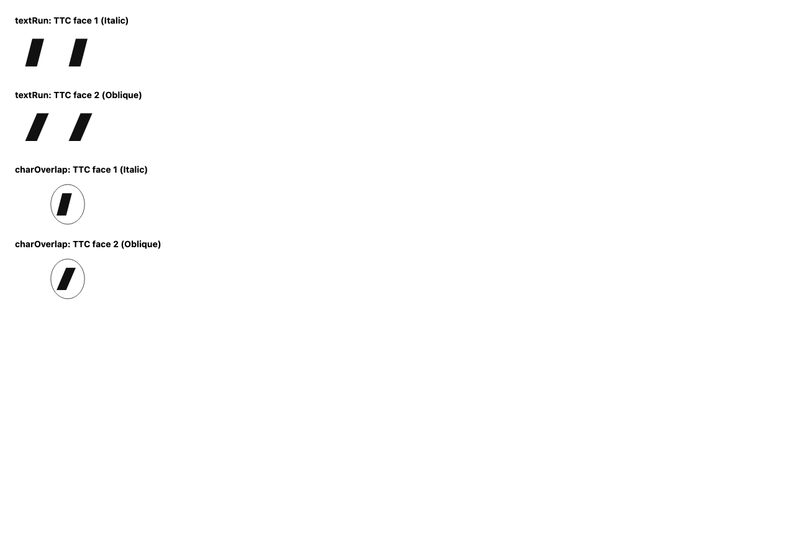
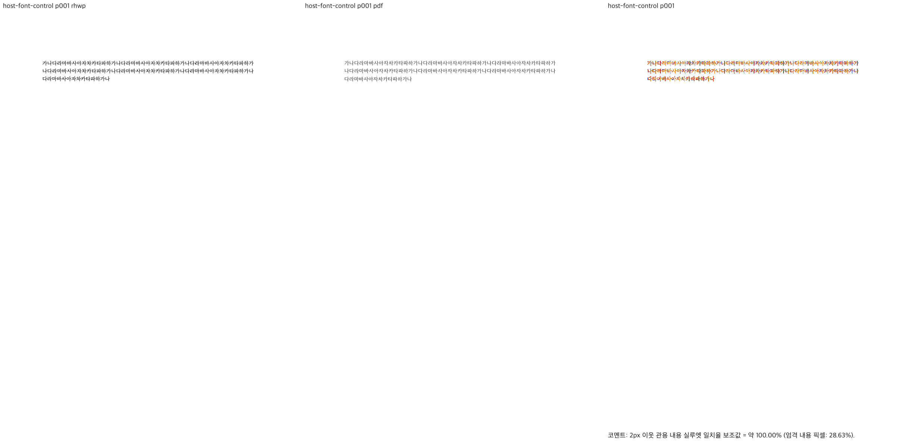
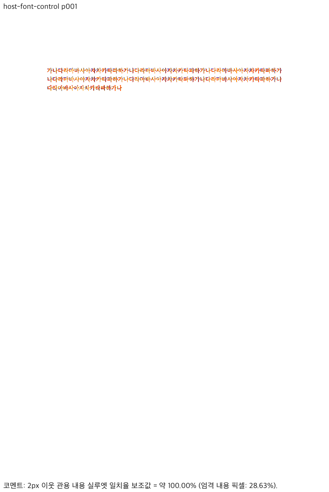
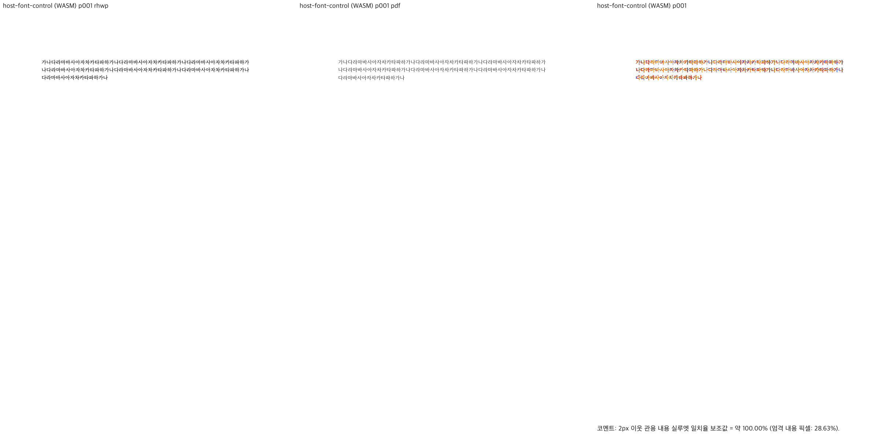
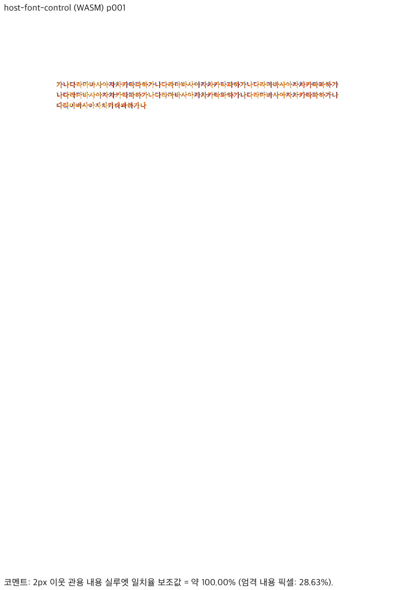
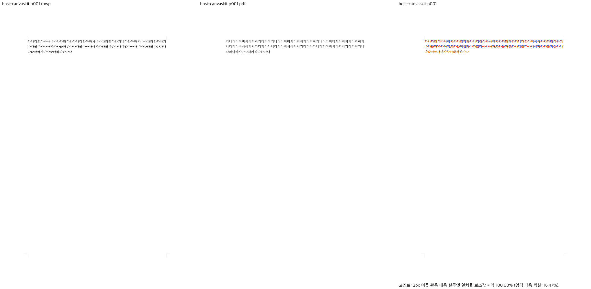
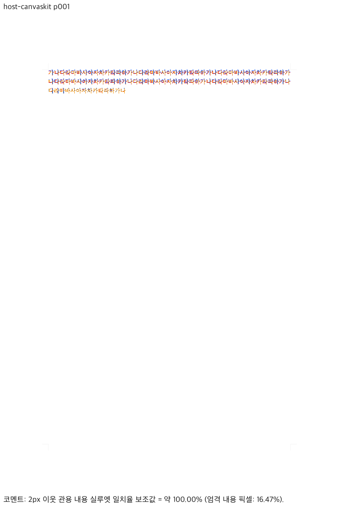

# #7403 호스트 글꼴 공급 — 구현·최종 로컬 검증

- Issue: [#7403](https://github.com/edwardkim/rhwp/issues/7403)
- 설계 공유: [이슈 코멘트](https://github.com/edwardkim/rhwp/issues/7403#issuecomment-5809158954)
- 담당자: `postmelee`
- 기준 base: `505661360e9a2d596f55300d0cb0c5222f0e14b4`
- 최종 검증 source: `6005ec32f87706d180a78ca9172314b5a0df5332`
- 브랜치: `codex/issue-7403-host-font-provider`
- 검증일: 2026-09-24
- 상태: 아래 CanvasKit 1차 범위의 로컬 검증 통과. GitHub CI·push·PR은 미수행.
  이후 커밋은 보고서와 증거 보존이며 제품 코드·테스트 변경이 아니다.

## 구현과 발견한 결함

Studio와 같은 realm의 `rhwpStudio.fonts.setProvider()`에 선택적인 공급자를 연결한다.
메타데이터 목록, 필요한 face 바이트, revision 변경 구독을 분리한다. 호스트가 OS 권한·보관함·
동명 파일 선택을 소유한다. 연결 세대·revision·ID로 캐시를 구분하며 변경·해제 시 요청과 이름
색인을 무효화한다. 목록과 바이트를 browser storage나 CSS 사용 가능 판정에 넣지 않는다.

소비 경로는 `HostFontSource` → `local-fonts.resolveCanvasKitLocalFont` → 실제 PageLayerTree의
`collectHostFontRequests` → `prepareHostFonts` → `findPreparedTypeface` → textRun/charOverlap paint다.
변경 통지는 `main` → `CanvasView.refreshFontResources` → RendererSession 자원 reset/선택 세대
갱신 → 필요한 face 준비 → 페이지 갱신으로 연결된다. 문서 모델과 dirty/undo는 변경하지 않는다.
사용 계약·비범위는 [HOST_FONTS.md](../../rhwp-studio/HOST_FONTS.md)에 있다.

추가 검증에서 **Italic 요청이 Oblique-only family를 놓치는 결함**을 검출했다. 문서는 italic flag만
제공하는데 목록의 slant를 정확히 `italic`으로만 비교한 것이 원인이다. 같은 weight의 정확한 slant를
우선하고, 없으면 유일한 Italic/Oblique 대체 후보를 선택하도록 수정했다. Normal 요청은 기울임
face를 선택하지 않고, 정확 후보가 있으면 대체하지 않으며, 중복 후보는 계속 거절한다.

- 정식 회귀: `rhwp-studio/tests/host-font-provider.test.ts`의
  `italic runs can select an unambiguous oblique face when no italic face exists`.
- 수정 전: 10 PASS / 1 FAIL, 실제 선택 `undefined`, 기대 `oblique`.
- 수정 후: 11 PASS / 0 FAIL, 정확 Italic 우선·Normal 대조군·중복 Oblique 거절 포함.
- [RED 로그](assets/issue7403/slant-red.txt), [GREEN 로그](assets/issue7403/slant-green.txt).
- 기존 E2E manifest 누락 3건은 `7cedcb3da`에서 분리 정리했다. 신규 기능 결함이나 실패 테스트
  3건으로 세지 않는다. 테스트 surface 설정도 유효한 `software`로 명시했다.

## 최종 실행 결과

작업 경로는 `/private/tmp/rhwp-7403`, Cargo cache는
`/Users/melee/Documents/projects/forks/rhwp/target/pr-review`다. 아래는 모두 최종 source의 결과다.

| 명령/검사 | 결과 |
| --- | --- |
| `CARGO_TARGET_DIR=…/target/pr-review scripts/wasm-pack-locked.sh --target web --out-dir pkg --dev` | PASS, fresh web WASM 및 Studio 동기화 |
| `npx --prefix rhwp-studio tsc --noEmit -p rhwp-studio/tsconfig.json` | PASS |
| `npm --prefix rhwp-studio test` | 최초 1,782 PASS / 2 SKIP / 0 FAIL |
| `CARGO_TARGET_DIR=…/target/pr-review scripts/wasm-pack-locked.sh --target nodejs --out-dir pkg-node --dev` 후 같은 `npm test` | **1,784 PASS / 0 SKIP / 0 FAIL** |
| `npm --prefix rhwp-studio run build` | PASS, production Studio bundle |
| `CHROME_PATH=… npm --prefix rhwp-studio run e2e:issue-7403` | PASS, 실제 Chrome·software CanvasKit |
| `npm --prefix rhwp-studio run e2e:canvaskit-font-coverage` | PASS, 기존 번들·옛한글·exact TTC GlyphRun 회귀 |
| `python3 scripts/check_e2e_manifest.py` | PASS, tracked 140 / 등록 140 |
| `cargo build --locked --bin rhwp --profile release-test --target-dir …/target/pr-review` | PASS, 시각 대조용 CLI |
| `git diff --check 505661360e9a2d596f55300d0cb0c5222f0e14b4...6005ec32f87706d180a78ca9172314b5a0df5332` | PASS |
| 합성 글꼴 생성 스크립트 재실행 | TTC와 3 TTF의 SHA-256 동일 |

처음 건너뛴 2건은 pkg-node를 필요로 하는 실제 서식/Undo/Redo 검사였다. Node WASM을 준비해
모두 실행했으며 최초 SKIP 결과를 최종 PASS의 근거로 대신하지 않았다.

web WASM SHA-256: `fcb45acbe3491a981e02c5f752595fd039ca9a3e6826fe3bd730ae7b9801a35f`.
glue SHA-256: `8f01a5bcc227a41d72b4aca57792445e9f413c4400154b74bdf8992f35301df3`.
검증 당시 `pkg/`와 `rhwp-studio/public/` 각각의 hash가 일치했다. 생성 glue는 커밋에서 제외한다.
Studio production bundle에 사용한 WASM은 dev 빌드다. optimized release WASM 검증으로 보고하지 않는다.
Rust 소스·Cargo·toolchain은 base 대비 변경이 없어 Rust 전체 lint/integration 게이트는 비해당이다.

## 계약별 직접 검사

정식 브라우저 회귀는 [host-font-provider-issue7403.test.mjs](../../rhwp-studio/e2e/host-font-provider-issue7403.test.mjs)다.
[기계 판독 결과](assets/issue7403/validation.json)에 실제 측정값을 보존했다.

| 구현 주장 | 실제 검사와 관측값 | 판정 |
| --- | --- | --- |
| 목록과 바이트 읽기 분리 | metadata 완료 후 read 0; 필요한 스타일 face만 읽고 동시 요청 공유 | 충족 |
| 같은 이름·개수여도 revision에 따라 갱신 | Serif→Sans에서 픽셀 변경, 읽기 실패 후 Serif 복구 시 초기 픽셀과 동일 | 충족 |
| TTC의 선택 index 반영 | face 1 Italic / face 2 Oblique가 별도 TTF 기준과 픽셀 동일; index 99는 등록 0/실패 1, 다음 유효 요청은 등록 1 | 충족 |
| textRun/charOverlap의 실제 기울임 face | 두 경로 × Italic/Oblique 네 조합 모두 등록 1, upright와 픽셀 다름, 실제 face에 합성 기울임 중복 없음 | 충족 |
| Bold 실제 face 선택 | family+bold와 명시적 Bold face 출력이 동일, 합성 굵기 중복 없음 | 충족 |
| 문서 상태와 이력 유지 | dirty=false, HWP bytes, undo/redo entry 객체 동일; 실제 redo 시 길이 15→16, undo 시 16→15 | 충족 |
| 편집 중 문서 보존 | dirty=true와 문서 세대 유지, HWP bytes 동일; HWP/HWPX 재열기에서 원래 글꼴명·Bold 유지 | 충족 |
| 문서 교체 중 늦은 읽기 폐기 | 이전 공급자가 abort를 무시해도 새 문서의 픽셀·HWP bytes·등록 face 수 1 유지 | 충족 |
| 같은 ID/revision 공급자 교체 | 이전 신호 aborted=true, 늦은 응답 뒤 새 화면 동일, 등록 face 수 1 유지 | 충족 |
| CSS/저장 판정과 분리 | CSS font chain·localStorage 불변, 해제 후 native typeface 수 0 | 충족 |
| 공급자 해제 후 기존 출력 복원 | 실제 HCRBatang 원문에서 withoutHost와 detached PNG가 바이트 동일 | 충족 |

TTC의 독립 기준은 [합성 픽스처 생성기](../../scripts/generate_host_font_fixture.py)가 작성한 standalone
TTF다. 예상 출력은 운영 코드의 TTC 추출 결과를 재인용하지 않는다. A/가의 윤곽은 독창적인
직사각형·기울어진 평행사변형이며, 한컴 출력의 대용이 아닌 face 선택 계약 입력이다.



## 한컴 기준 PDF와 시각 검증

[Visual Sweep 정본](../manual/verification/visual_sweep_guide.md)에 따라 동일 원문 1쪽을 96 DPI로
비교했다. 원문 `samples/re-01-hangul-only-hancom.hwp`, 기준
`pdf/re-01-hangul-only-hancom-2022.pdf`를 변경 없이 재사용했다. 해당 원문은 함초롬바탕 한글 3줄이다.
기준 PDF Creator는 `Hwp 2022 12.0.0.4426`, Producer는 `Hancom PDF 1.3.0.550`이다.

설치된 한컴 뷰어의 `Contents/Resources/Hnc/Shared/TTF/Install/HANBatang.ttf`를 명시적으로 공급했다.
PostScript 이름 `HCRBatang`뿐 아니라 PDF에 내장된 subset과 로컬 face의 unitsPerEm=1000,
실제 가~하 14자의 분해된 glyph outline이 모두 일치함을 확인했다.
[폰트 provenance](assets/issue7403/font-provenance.json)에 입력·폰트 hash와 문자별 결과가 있다.
라이선스 글꼴, 폰트를 내장한 SVG는 저장소에 추가하지 않았고 PNG·메타데이터만 보존했다.

사전 `fidelity_compare --text-only --export-all-svg --layout-ledger`에서 1/1쪽 완료,
PDF/SVG 문자 차이 0/0, layout·text clip·cell boundary 후보 0이었다. 표·그림이 없는 입력이므로
표·그림 OVR은 비해당이며, 이 결과로 표나 그림의 전체 호환성을 주장하지 않는다.

| 출력 경로 | pixel match | 엄격 내용 픽셀 일치 | 2px 실루엣 일치 | gate |
| --- | ---: | ---: | ---: | --- |
| Native SVG→Chrome | 99.42164% | 28.63272% | 100% | passed |
| fresh WASM SVG→Chrome | 99.42164% | 28.63272% | 100% | passed |
| 호스트 HCRBatang→CanvasKit | 99.38160% | 16.46720% | 100% | passed |

Native/fresh WASM은 각자 생성한 SVG와 render tree로 정식 sweep을 실행했다.
호스트 공급자는 JS CanvasKit 전용이므로, 별도로
[실제 호스트 시각 probe](../../rhwp-studio/e2e/probe-host-font-visual-issue7403.mjs)의 PNG를 동일한
PDF raster와 `visual_sweep.make_overlay_compares`/`make_compares`/`make_review_panels`로 비교하고
동일 `pr_review_gate(expected_pages=[1])`를 적용했다. Native SVG의 통과를 호스트 연결 증거로 대신하지 않았다.

세 경로의 최종 review·standalone overlay를 모두 직접 열어 확인했다. 세 줄의 시작·끝과 줄바꿈이
같고, 누락·두부·줄간 겹침·대폭 위치 이동은 보이지 않았다. 글자 윤곽 주변 색 프린지와 농도 차이,
CanvasKit screen profile의 희미한 편집 영역 가이드는 남아 있다. **실루엣 100%는 픽셀 완전 일치나
한컴 전체 호환성 100%를 뜻하지 않는다.** 엄격 내용 픽셀 일치율도 함께 공개한다.

| 경로 | 직접 판독 review | standalone overlay |
| --- | --- | --- |
| Native |  |  |
| fresh WASM |  |  |
| 호스트 CanvasKit |  |  |

Native/WASM provenance는 각각 [Native manifest](assets/issue7403/native-manifest.json),
[WASM manifest](assets/issue7403/wasm-manifest.json)에 source SHA·도구·입력·글꼴·WASM hash를 담았다.
호스트의 실제 등록 결과는 [CanvasKit 진단](assets/issue7403/host-diagnostics.json)에 있다.

### 재현 명령

작업 root에서 실행한다. `rhwp_font_dir`는 사용 권한이 있는 HCRBatang을 제공하는 디렉터리,
`rhwp_bin`은 위 source로 빌드한 CLI의 절대 경로로 설정한다.

```bash
RHWP_FONT_PATH="$rhwp_font_dir" venv/bin/python scripts/visual_sweep.py \
  --file-target host-font-control samples/re-01-hangul-only-hancom.hwp \
  pdf/re-01-hangul-only-hancom-2022.pdf --rhwp-bin "$rhwp_bin" \
  --pages 1 --dpi 96 --embed-fonts=full --font-path "$rhwp_font_dir" \
  --out output/issue7403-native
# 같은 명령에 --wasm-pkg "$PWD/pkg"를 추가하고 --out을 별도 WASM 폴더로 지정한다.

cd rhwp-studio
RHWP_HOST_FONT_PATH="$rhwp_font_dir/HANBatang.ttf" \
RHWP_HOST_FONT_EVIDENCE=../output/issue7403-host CHROME_PATH="$rhwp_chrome" \
  node e2e/run-with-vite.mjs -- node e2e/probe-host-font-visual-issue7403.mjs --mode=headless
```

전체 로컬 로그·중간 산출물은 `/private/tmp/rhwp-7403-validation/`에 있다. 마지막 실행 로그는
`final-*.log`, 최종 이미지 폴더는 `final-visual-native`, `final-visual-wasm`, `final-host-visual`이다.

## 검증 범위와 후속 단계

이번 검증은 동일 realm의 공급 계약과 명시적 software CanvasKit textRun/charOverlap 화면 범위를
충족한다. 실제 네이티브 앱 IPC 연결, Canvas2D FontFace 등록, 독립 SVG·PDF·인쇄, Rust layout,
호스트 글꼴을 근거로 한 자동 renderer 적합성 확대, 기존 glyph resource 교체는 범위 밖이다.
WebGL/WebGPU backend의 호스트 글꼴 동작 및 대규모 다쪽 문서 성능은 미검증이다.

이번 실행에서 baseline·golden·실루엣 임계값은 변경하지 않았다. 남은 단계는 이 범위와 제한을
명시한 PR 준비·승인된 push/PR 생성 및 최신 head GitHub required checks다. 이 기록은 maintainer의
merge 승인이나 이슈 전체 완료 판정을 대신하지 않는다.
